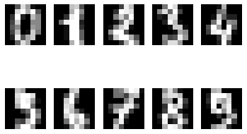

# Segmentation map으로 도로 이미지 만들기

* 데이터에 한 가지 이상의 augmentation 방법을 적용하여 학습해 주세요.

* 이전에 구현했던 두 개의 Generator 중 Encoder와 Decoder간에 skip connection이 있는 U-Net Generator를 사용해 주세요.

* 모델 학습 후, 학습된 Generator를 이용해 테스트합니다. 테스트 데이터는 다운로드했던 "val" 폴더 내 이미지를 사용해 주세요.

* 1개 이상의 이미지에 대해 테스트 과정을 거친 후 그 결과를 스케치, 생성된 사진, 실제 사진 순서로 나란히 시각화해 주세요.

* 모델을 충분히 학습하기에 시간이 부족할 수 있습니다. 적어도 10 epoch 이상 학습하며 중간 손실 값에 대한 로그를 남겨주세요. 좋은 결과를 얻기 위해선 긴 학습 시간이 필요하므로 테스트 결과는 만족스럽지 않아도 괜찮습니다.

## 1. 데이터 불러오기 및 전처리


```python
import os

# 이미지 개수 확인.
data_path = os.getenv('HOME')+'/aiffel/conditional_generation/cityscapes/train/'
data_path_val = os.getenv('HOME')+'/aiffel/conditional_generation/cityscapes/val/'
print("number of train examples :", len(os.listdir(data_path)))
print("number of val examples :", len(os.listdir(data_path_val)))
```

    number of train examples : 1000
    number of val examples : 5


```python
import cv2
import numpy as np
import matplotlib.pyplot as plt

# 학습용 데이터 임의로 시각화하기.
plt.figure(figsize=(20,15))
for i in range(1, 7):
    f = data_path + os.listdir(data_path)[np.random.randint(800)]
    img = cv2.imread(f, cv2.IMREAD_COLOR)
    plt.subplot(3,2,i)
    plt.imshow(img)
```


    

    


```python
# 이미지 크기 확인하기.
f = data_path + os.listdir(data_path)[0]
img = cv2.imread(f, cv2.IMREAD_COLOR)
print(img.shape)
```

    (256, 512, 3)


```python
import tensorflow as tf

# 이미지 나누기.
def normalize(x):
    x = tf.cast(x, tf.float32)
    return (x/127.5) - 1

def denormalize(x):
    x = (x+1)*127.5
    x = x.numpy()
    return x.astype(np.uint8)

def load_img(img_path):
    img = tf.io.read_file(img_path)
    img = tf.image.decode_image(img, 3)
    
    w = tf.shape(img)[1] // 2
    sketch = img[:, :w, :] 
    sketch = tf.cast(sketch, tf.float32)
    colored = img[:, w:, :] 
    colored = tf.cast(colored, tf.float32)
    return normalize(sketch), normalize(colored)

f = data_path + os.listdir(data_path)[1]
sketch, colored = load_img(f)

plt.figure(figsize=(10,7))
plt.subplot(1,2,1); plt.imshow(denormalize(sketch))
plt.subplot(1,2,2); plt.imshow(denormalize(colored))
```


    <matplotlib.image.AxesImage at 0x7ff7c8036c50>


    

    


```python
from tensorflow import image
from tensorflow.keras.preprocessing.image import random_rotation

# augmentation 방법.
@tf.function() # 빠른 텐서플로 연산을 위해 @tf.function()을 사용. 

# 2개의 이미지를 입력으로 받아 여러 연간을 두 이미지에 동시에 적용.
def apply_augmentation(sketch, colored): 
    # 두 이미지가 채널 축으로 연결됨.
    stacked = tf.concat([sketch, colored], axis=-1)
    
    _pad = tf.constant([[30,30],[30,30],[0,0]])
    # 위 결과에 50%의 확률로 패딩 적용.
    if tf.random.uniform(()) < .5:
        padded = tf.pad(stacked, _pad, "REFLECT")
    else:
        padded = tf.pad(stacked, _pad, "CONSTANT", constant_values=1.)
    # 직전 결과의 일부를 임의로 잘라냄. 
    out = image.random_crop(padded, size=[256, 256, 6])
    # 직전 결과를 50%의 확률로 가로로 뒤집음.
    out = image.random_flip_left_right(out)
    # 직전의 결과를 50%의 확률로 세로로 뒤집음.
    out = image.random_flip_up_down(out)
    # 직전의 결과를  50%의 확률로 회전시킴. 
    if tf.random.uniform(()) < .5:
        degree = tf.random.uniform([], minval=1, maxval=4, dtype=tf.int32)
        out = image.rot90(out, k=degree)
    
    return out[...,:3], out[...,3:]   

print("done")
```

    done


- **이미지의 일부 잘라내기, 가로로 뒤집기, 세로로 뒤집기, 회전 등의 augmentation을 사용.**


```python
# augmentation 시각화.
plt.figure(figsize=(15,13))
img_n = 1
for i in range(1, 13, 2):
    augmented_sketch, augmented_colored = apply_augmentation(sketch, colored)
    
    plt.subplot(3,4,i)
    plt.imshow(denormalize(augmented_sketch)); plt.title(f"Image {img_n}")
    plt.subplot(3,4,i+1); 
    plt.imshow(denormalize(augmented_colored)); plt.title(f"Image {img_n}")
    img_n += 1
```


    

    


```python
# augmentation 하나만 시각화.
from tensorflow import data

def get_train(img_path):
    sketch, colored = load_img(img_path)
    sketch, colored = apply_augmentation(sketch, colored)
    return sketch, colored

train_images = data.Dataset.list_files(data_path + "*.jpg")
train_images = train_images.map(get_train).shuffle(100).batch(4)

sample = train_images.take(1)
sample = list(sample.as_numpy_iterator())
sketch, colored = (sample[0][0]+1)*127.5, (sample[0][1]+1)*127.5

plt.figure(figsize=(10,5))
plt.subplot(1,2,1); plt.imshow(sketch[0].astype(np.uint8))
plt.subplot(1,2,2); plt.imshow(colored[0].astype(np.uint8))
```


    <matplotlib.image.AxesImage at 0x7ff7706ffb90>


    

    


## Generator 구성하기


```python
from tensorflow.keras import layers, Input, Model

class EncodeBlock(layers.Layer):
    def __init__(self, n_filters, use_bn=True): # 사용할 필터 수와 BatchNorm 사용 여부 결정 가능.
        super(EncodeBlock, self).__init__()
        self.use_bn = use_bn       
        self.conv = layers.Conv2D(n_filters, 4, 2, "same", use_bias=False)
        self.batchnorm = layers.BatchNormalization()
        self.lrelu= layers.LeakyReLU(0.2)

    def call(self, x):
        x = self.conv(x)
        if self.use_bn:
            x = self.batchnorm(x)
        return self.lrelu(x)

print("done")
```

    done


```python
class Encoder(layers.Layer):
    def __init__(self):
        super(Encoder, self).__init__()
        filters = [64,128,256,512,512,512,512,512] # 각 블록을 거치며 사용할 필터의 개수
        
        self.blocks = [] # 사용할 블록들을 정의해서 넣어둠.
        for i, f in enumerate(filters):
            if i == 0: # 논문에서처럼 첫번때 블록에서는 배치 정규화를 사용하지 않음.
                self.blocks.append(EncodeBlock(f, use_bn=False))
            else:
                self.blocks.append(EncodeBlock(f))
    
    # 차례대로 블록들을 통과함.
    def call(self, x):
        for block in self.blocks:
            x = block(x)
        return x
    
    # 레이어가 잘 구성되었는지 확인하는 용도.
    def get_summary(self, input_shape=(256,256,3)):
        inputs = Input(input_shape)
        return Model(inputs, self.call(inputs)).summary()

print("done")
```

    done


```python
Encoder().get_summary()
```

    Model: "model"
    _________________________________________________________________
    Layer (type)                 Output Shape              Param #   
    =================================================================
    input_1 (InputLayer)         [(None, 256, 256, 3)]     0         
    _________________________________________________________________
    encode_block (EncodeBlock)   (None, 128, 128, 64)      3072      
    _________________________________________________________________
    encode_block_1 (EncodeBlock) (None, 64, 64, 128)       131584    
    _________________________________________________________________
    encode_block_2 (EncodeBlock) (None, 32, 32, 256)       525312    
    _________________________________________________________________
    encode_block_3 (EncodeBlock) (None, 16, 16, 512)       2099200   
    _________________________________________________________________
    encode_block_4 (EncodeBlock) (None, 8, 8, 512)         4196352   
    _________________________________________________________________
    encode_block_5 (EncodeBlock) (None, 4, 4, 512)         4196352   
    _________________________________________________________________
    encode_block_6 (EncodeBlock) (None, 2, 2, 512)         4196352   
    _________________________________________________________________
    encode_block_7 (EncodeBlock) (None, 1, 1, 512)         4196352   
    =================================================================
    Total params: 19,544,576
    Trainable params: 19,538,688
    Non-trainable params: 5,888
    _________________________________________________________________


```python
class DecodeBlock(layers.Layer):
    def __init__(self, f, dropout=True):
        super(DecodeBlock, self).__init__()
        self.dropout = dropout
        self.Transconv = layers.Conv2DTranspose(f, 4, 2, "same", use_bias=False)
        self.batchnorm = layers.BatchNormalization()
        self.relu = layers.ReLU()
        
    def call(self, x):
        x = self.Transconv(x)
        x = self.batchnorm(x)
        if self.dropout:
            x = layers.Dropout(.5)(x)
        return self.relu(x)

    
class Decoder(layers.Layer):
    def __init__(self):
        super(Decoder, self).__init__()
        filters = [512,512,512,512,256,128,64]
        
        self.blocks = []
        for i, f in enumerate(filters):
            if i < 3: # 처음 3개의 블록에만 드롭아웃 사용. 
                self.blocks.append(DecodeBlock(f))
            else:
                self.blocks.append(DecodeBlock(f, dropout=False))
        # 3개의 필터를 사용해 출력함.        
        self.blocks.append(layers.Conv2DTranspose(3, 4, 2, "same", use_bias=False))
        
    def call(self, x):
        for block in self.blocks:
            x = block(x)
        return x
            
    def get_summary(self, input_shape=(1,1,256)):
        inputs = Input(input_shape)
        return Model(inputs, self.call(inputs)).summary()
        
print("done")
```

    done


```python
Decoder().get_summary()
```

    Model: "model_1"
    _________________________________________________________________
    Layer (type)                 Output Shape              Param #   
    =================================================================
    input_2 (InputLayer)         [(None, 1, 1, 256)]       0         
    _________________________________________________________________
    decode_block (DecodeBlock)   (None, 2, 2, 512)         2099200   
    _________________________________________________________________
    decode_block_1 (DecodeBlock) (None, 4, 4, 512)         4196352   
    _________________________________________________________________
    decode_block_2 (DecodeBlock) (None, 8, 8, 512)         4196352   
    _________________________________________________________________
    decode_block_3 (DecodeBlock) (None, 16, 16, 512)       4196352   
    _________________________________________________________________
    decode_block_4 (DecodeBlock) (None, 32, 32, 256)       2098176   
    _________________________________________________________________
    decode_block_5 (DecodeBlock) (None, 64, 64, 128)       524800    
    _________________________________________________________________
    decode_block_6 (DecodeBlock) (None, 128, 128, 64)      131328    
    _________________________________________________________________
    conv2d_transpose_7 (Conv2DTr (None, 256, 256, 3)       3072      
    =================================================================
    Total params: 17,445,632
    Trainable params: 17,440,640
    Non-trainable params: 4,992
    _________________________________________________________________


```python
# 인코더와 디코더를 연결하여 Generator 만들기. --> 4천 만개의 파라미터를 학습시켜야 함. 
class EncoderDecoderGenerator(Model):
    def __init__(self):
        super(EncoderDecoderGenerator, self).__init__()
        self.encoder = Encoder()
        self.decoder = Decoder()
    
    def call(self, x):
        x = self.encoder(x)
        x = self.decoder(x)
        return x
   
    def get_summary(self, input_shape=(256,256,3)):
        inputs = Input(input_shape)
        return Model(inputs, self.call(inputs)).summary()
        

EncoderDecoderGenerator().get_summary()
```

    Model: "model_2"
    _________________________________________________________________
    Layer (type)                 Output Shape              Param #   
    =================================================================
    input_3 (InputLayer)         [(None, 256, 256, 3)]     0         
    _________________________________________________________________
    encoder_1 (Encoder)          (None, 1, 1, 512)         19544576  
    _________________________________________________________________
    decoder_1 (Decoder)          (None, 256, 256, 3)       19542784  
    =================================================================
    Total params: 39,087,360
    Trainable params: 39,076,480
    Non-trainable params: 10,880
    _________________________________________________________________


```python
class EncodeBlock(layers.Layer):
    def __init__(self, n_filters, use_bn=True):
        super(EncodeBlock, self).__init__()
        self.use_bn = use_bn       
        self.conv = layers.Conv2D(n_filters, 4, 2, "same", use_bias=False)
        self.batchnorm = layers.BatchNormalization()
        self.lrelu = layers.LeakyReLU(0.2)

    def call(self, x):
        x = self.conv(x)
        if self.use_bn:
            x = self.batchnorm(x)
        return self.lrelu(x)

    
class DecodeBlock(layers.Layer):
    def __init__(self, f, dropout=True):
        super(DecodeBlock, self).__init__()
        self.dropout = dropout
        self.Transconv = layers.Conv2DTranspose(f, 4, 2, "same", use_bias=False)
        self.batchnorm = layers.BatchNormalization()
        self.relu = layers.ReLU()
        
    def call(self, x):
        x = self.Transconv(x)
        x = self.batchnorm(x)
        if self.dropout:
            x = layers.Dropout(.5)(x)
        return self.relu(x)
    
print("done")
```

    done


```python
class UNetGenerator(Model):
    # 인코더와 디코더에서 사용할 모든 블록을 정의.
    def __init__(self):
        super(UNetGenerator, self).__init__()
        encode_filters = [64,128,256,512,512,512,512,512]
        decode_filters = [512,512,512,512,256,128,64]
        
        self.encode_blocks = []
        for i, f in enumerate(encode_filters):
            if i == 0:
                self.encode_blocks.append(EncodeBlock(f, use_bn=False))
            else:
                self.encode_blocks.append(EncodeBlock(f))
        
        self.decode_blocks = []
        for i, f in enumerate(decode_filters):
            if i < 3:
                self.decode_blocks.append(DecodeBlock(f))
            else:
                self.decode_blocks.append(DecodeBlock(f, dropout=False))
        
        self.last_conv = layers.Conv2DTranspose(3, 4, 2, "same", use_bias=False)
    
    # 순전파.
    def call(self, x):
        # skip-connection을 위해 리스트를 만들어 인코더 내에서 사용된 블록들의 출력을 차례대로 담음.
        features = []
        for block in self.encode_blocks:
            x = block(x)
            features.append(x)
        # 인코더의 마지막 출력은 디코더로 직접 입력됨으로 skip-connection의 대상이 아님.
        features = features[:-1]
        
        # 리스트에는 인코더 블록들의 출력들이 순서대로 쌓여있고,
        # 이를 디코더에서 차례대로 사용하기 위해서 리스트의 역순으로 연결함.63
        for block, feat in zip(self.decode_blocks, features[::-1]):
            # 최종 출력이 디코더의 입력이 되면서 다시 디코더의 블록들을 통과함.
            x = block(x)
            # 리스트에 있는 출력들이 디코더 블록 연산 후 함께 연결되어 다음 블록의 입력으로 사용됨.
            x = layers.Concatenate()([x, feat])
        
        x = self.last_conv(x)
        return x
                
    def get_summary(self, input_shape=(256,256,3)):
        inputs = Input(input_shape)
        return Model(inputs, self.call(inputs)).summary()

print("done")
```

    done


```python
UNetGenerator().get_summary()
```

    Model: "model_3"
    __________________________________________________________________________________________________
    Layer (type)                    Output Shape         Param #     Connected to                     
    ==================================================================================================
    input_4 (InputLayer)            [(None, 256, 256, 3) 0                                            
    __________________________________________________________________________________________________
    encode_block_16 (EncodeBlock)   (None, 128, 128, 64) 3072        input_4[0][0]                    
    __________________________________________________________________________________________________
    encode_block_17 (EncodeBlock)   (None, 64, 64, 128)  131584      encode_block_16[0][0]            
    __________________________________________________________________________________________________
    encode_block_18 (EncodeBlock)   (None, 32, 32, 256)  525312      encode_block_17[0][0]            
    __________________________________________________________________________________________________
    encode_block_19 (EncodeBlock)   (None, 16, 16, 512)  2099200     encode_block_18[0][0]            
    __________________________________________________________________________________________________
    encode_block_20 (EncodeBlock)   (None, 8, 8, 512)    4196352     encode_block_19[0][0]            
    __________________________________________________________________________________________________
    encode_block_21 (EncodeBlock)   (None, 4, 4, 512)    4196352     encode_block_20[0][0]            
    __________________________________________________________________________________________________
    encode_block_22 (EncodeBlock)   (None, 2, 2, 512)    4196352     encode_block_21[0][0]            
    __________________________________________________________________________________________________
    encode_block_23 (EncodeBlock)   (None, 1, 1, 512)    4196352     encode_block_22[0][0]            
    __________________________________________________________________________________________________
    decode_block_14 (DecodeBlock)   (None, 2, 2, 512)    4196352     encode_block_23[0][0]            
    __________________________________________________________________________________________________
    concatenate (Concatenate)       (None, 2, 2, 1024)   0           decode_block_14[0][0]            
                                                                     encode_block_22[0][0]            
    __________________________________________________________________________________________________
    decode_block_15 (DecodeBlock)   (None, 4, 4, 512)    8390656     concatenate[0][0]                
    __________________________________________________________________________________________________
    concatenate_1 (Concatenate)     (None, 4, 4, 1024)   0           decode_block_15[0][0]            
                                                                     encode_block_21[0][0]            
    __________________________________________________________________________________________________
    decode_block_16 (DecodeBlock)   (None, 8, 8, 512)    8390656     concatenate_1[0][0]              
    __________________________________________________________________________________________________
    concatenate_2 (Concatenate)     (None, 8, 8, 1024)   0           decode_block_16[0][0]            
                                                                     encode_block_20[0][0]            
    __________________________________________________________________________________________________
    decode_block_17 (DecodeBlock)   (None, 16, 16, 512)  8390656     concatenate_2[0][0]              
    __________________________________________________________________________________________________
    concatenate_3 (Concatenate)     (None, 16, 16, 1024) 0           decode_block_17[0][0]            
                                                                     encode_block_19[0][0]            
    __________________________________________________________________________________________________
    decode_block_18 (DecodeBlock)   (None, 32, 32, 256)  4195328     concatenate_3[0][0]              
    __________________________________________________________________________________________________
    concatenate_4 (Concatenate)     (None, 32, 32, 512)  0           decode_block_18[0][0]            
                                                                     encode_block_18[0][0]            
    __________________________________________________________________________________________________
    decode_block_19 (DecodeBlock)   (None, 64, 64, 128)  1049088     concatenate_4[0][0]              
    __________________________________________________________________________________________________
    concatenate_5 (Concatenate)     (None, 64, 64, 256)  0           decode_block_19[0][0]            
                                                                     encode_block_17[0][0]            
    __________________________________________________________________________________________________
    decode_block_20 (DecodeBlock)   (None, 128, 128, 64) 262400      concatenate_5[0][0]              
    __________________________________________________________________________________________________
    concatenate_6 (Concatenate)     (None, 128, 128, 128 0           decode_block_20[0][0]            
                                                                     encode_block_16[0][0]            
    __________________________________________________________________________________________________
    conv2d_transpose_23 (Conv2DTran (None, 256, 256, 3)  6144        concatenate_6[0][0]              
    ==================================================================================================
    Total params: 54,425,856
    Trainable params: 54,414,976
    Non-trainable params: 10,880
    __________________________________________________________________________________________________


## 3. Discriminator 구성


```python
class DiscBlock(layers.Layer): 
    # 필터의 개수, 필터가 순회하는 간격, 출력 feature map 크기 조절을 위한 패딩, 배치 정규화 여부, 활성화 함수 사용 여부.
    def __init__(self, n_filters, stride=2, custom_pad=False, use_bn=True, act=True):
        super(DiscBlock, self).__init__()
        self.custom_pad = custom_pad
        self.use_bn = use_bn
        self.act = act
        
        if custom_pad:
            self.padding = layers.ZeroPadding2D()
            self.conv = layers.Conv2D(n_filters, 4, stride, "valid", use_bias=False)
        else:
            self.conv = layers.Conv2D(n_filters, 4, stride, "same", use_bias=False)
        
        self.batchnorm = layers.BatchNormalization() if use_bn else None
        self.lrelu = layers.LeakyReLU(0.2) if act else None
        
    def call(self, x):
        if self.custom_pad:
            x = self.padding(x)
            x = self.conv(x)
        else:
            x = self.conv(x)
                
        if self.use_bn:
            x = self.batchnorm(x)
            
        if self.act:
            x = self.lrelu(x)
        return x 

print("done")
```

    done


```python
# 출력 크기 확인.
inputs = Input((128,128,32))
out = layers.ZeroPadding2D()(inputs)
out = layers.Conv2D(64, 4, 1, "valid", use_bias=False)(out)
out = layers.BatchNormalization()(out)
out = layers.LeakyReLU(0.2)(out)

Model(inputs, out).summary()
```

    Model: "model_4"
    _________________________________________________________________
    Layer (type)                 Output Shape              Param #   
    =================================================================
    input_5 (InputLayer)         [(None, 128, 128, 32)]    0         
    _________________________________________________________________
    zero_padding2d (ZeroPadding2 (None, 130, 130, 32)      0         
    _________________________________________________________________
    conv2d_24 (Conv2D)           (None, 127, 127, 64)      32768     
    _________________________________________________________________
    batch_normalization_45 (Batc (None, 127, 127, 64)      256       
    _________________________________________________________________
    leaky_re_lu_24 (LeakyReLU)   (None, 127, 127, 64)      0         
    =================================================================
    Total params: 33,024
    Trainable params: 32,896
    Non-trainable params: 128
    _________________________________________________________________


```python
class Discriminator(Model):
    def __init__(self):
        super(Discriminator, self).__init__()
        
        # 단순한 연결을 시작으로 최종 출력은 시그모이드 활성화를 사용. --> 0~1 사이 값을 가지며 진짜, 가짜 판별에 사용.
        self.block1 = layers.Concatenate()
        self.block2 = DiscBlock(n_filters=64, stride=2, custom_pad=False, use_bn=False, act=True)
        self.block3 = DiscBlock(n_filters=128, stride=2, custom_pad=False, use_bn=True, act=True)
        self.block4 = DiscBlock(n_filters=256, stride=2, custom_pad=False, use_bn=True, act=True)
        self.block5 = DiscBlock(n_filters=512, stride=1, custom_pad=True, use_bn=True, act=True)
        self.block6 = DiscBlock(n_filters=1, stride=1, custom_pad=True, use_bn=False, act=False)
        self.sigmoid = layers.Activation("sigmoid")
        
        # filters = [64,128,256,512,1]
        # self.blocks = [layers.Concatenate()]
        # for i, f in enumerate(filters):
        #     self.blocks.append(DiscBlock(
        #         n_filters=f,
        #         strides=2 if i<3 else 1,
        #         custom_pad=False if i<3 else True,
        #         use_bn=False if i==0 and i==4 else True,
        #         act=True if i<4 else False
        #     ))
    
    def call(self, x, y):
        out = self.block1([x, y])
        out = self.block2(out)
        out = self.block3(out)
        out = self.block4(out)
        out = self.block5(out)
        out = self.block6(out)
        return self.sigmoid(out)
    
    def get_summary(self, x_shape=(256,256,3), y_shape=(256,256,3)):
        x, y = Input(x_shape), Input(y_shape) 
        return Model((x, y), self.call(x, y)).summary()
    
print("done")
```

    done


```python
Discriminator().get_summary()
```

    Model: "model_5"
    __________________________________________________________________________________________________
    Layer (type)                    Output Shape         Param #     Connected to                     
    ==================================================================================================
    input_6 (InputLayer)            [(None, 256, 256, 3) 0                                            
    __________________________________________________________________________________________________
    input_7 (InputLayer)            [(None, 256, 256, 3) 0                                            
    __________________________________________________________________________________________________
    concatenate_7 (Concatenate)     (None, 256, 256, 6)  0           input_6[0][0]                    
                                                                     input_7[0][0]                    
    __________________________________________________________________________________________________
    disc_block (DiscBlock)          (None, 128, 128, 64) 6144        concatenate_7[0][0]              
    __________________________________________________________________________________________________
    disc_block_1 (DiscBlock)        (None, 64, 64, 128)  131584      disc_block[0][0]                 
    __________________________________________________________________________________________________
    disc_block_2 (DiscBlock)        (None, 32, 32, 256)  525312      disc_block_1[0][0]               
    __________________________________________________________________________________________________
    disc_block_3 (DiscBlock)        (None, 31, 31, 512)  2099200     disc_block_2[0][0]               
    __________________________________________________________________________________________________
    disc_block_4 (DiscBlock)        (None, 30, 30, 1)    8192        disc_block_3[0][0]               
    __________________________________________________________________________________________________
    activation (Activation)         (None, 30, 30, 1)    0           disc_block_4[0][0]               
    ==================================================================================================
    Total params: 2,770,432
    Trainable params: 2,768,640
    Non-trainable params: 1,792
    __________________________________________________________________________________________________


```python
# 임의의 (256,256,3) 크기의 입력을 넣어 (30,30) 출력을 시각화.
x = tf.random.normal([1,256,256,3])
y = tf.random.uniform([1,256,256,3])

disc_out = Discriminator()(x, y)
plt.imshow(disc_out[0, ... ,0])
plt.colorbar()
```


    <matplotlib.colorbar.Colorbar at 0x7ff7701b4f90>


    

    


## 4. 학습 및 테스트 


```python
from tensorflow.keras import losses

bce = losses.BinaryCrossentropy(from_logits=False)
mae = losses.MeanAbsoluteError()

# fake_disc는 생성자가 만든 가짜 이미지를 판별자에 입력하여 얻어진 값.
# L1 손실 계산을 위해 만든 가짜 이미지(fake_output)와 진짜 이미지(real_output) 사이의 MAE를 계산함.
def get_gene_loss(fake_output, real_output, fake_disc):
    l1_loss = mae(real_output, fake_output)
    gene_loss = bce(tf.ones_like(fake_disc), fake_disc)
    return gene_loss, l1_loss

# 가짜, 진짜 이니미가 판별자에 입력되어 얻어진 값.
# 실제 이미지를 질 구별하기 위해 real_disc는 '1'로 채워진 벡터와 비교, fake_disc는 '0'으로 채워진 벡터와 비교.  
def get_disc_loss(fake_disc, real_disc):
    # 실제 이미지인 '1'과의 비교를 위해 tf.zeros_like()를 사용.
    return bce(tf.zeros_like(fake_disc), fake_disc) + bce(tf.ones_like(real_disc), real_disc)

print("done")
```

    done


```python
from tensorflow.keras import optimizers

# optimizer 설정.
gene_opt = optimizers.Adam(2e-4, beta_1=.5, beta_2=.999)
disc_opt = optimizers.Adam(2e-4, beta_1=.5, beta_2=.999)

print("done")
```

    done


```python
# 하나의 배치만큼 데이터를 입력했을 깨 가중치를 1회 업데이트하는 과정.
@tf.function
def train_step(sketch, real_colored):
    with tf.GradientTape() as gene_tape, tf.GradientTape() as disc_tape:
        # Generator 예측
        fake_colored = generator(sketch, training=True)
        # Discriminator 예측
        fake_disc = discriminator(sketch, fake_colored, training=True)
        real_disc = discriminator(sketch, real_colored, training=True)
        # Generator 손실 계산
        gene_loss, l1_loss = get_gene_loss(fake_colored, real_colored, fake_disc)
        gene_total_loss = gene_loss + (100 * l1_loss) ## <===== L1 손실 반영 λ=100
        # Discrminator 손실 계산
        disc_loss = get_disc_loss(fake_disc, real_disc)
                
    gene_gradient = gene_tape.gradient(gene_total_loss, generator.trainable_variables)
    disc_gradient = disc_tape.gradient(disc_loss, discriminator.trainable_variables)
    
    gene_opt.apply_gradients(zip(gene_gradient, generator.trainable_variables))
    disc_opt.apply_gradients(zip(disc_gradient, discriminator.trainable_variables))
    return gene_loss, l1_loss, disc_loss

print("done")
```

    done


```python
EPOCHS = 10

generator = UNetGenerator()
discriminator = Discriminator()

for epoch in range(1, EPOCHS+1):
    for i, (sketch, colored) in enumerate(train_images):
        g_loss, l1_loss, d_loss = train_step(sketch, colored)
                
        # 10회 반복마다 손실을 출력.
        if (i+1) % 10 == 0:
            print(f"EPOCH[{epoch}] - STEP[{i+1}] \
                    \nGenerator_loss:{g_loss.numpy():.4f} \
                    \nL1_loss:{l1_loss.numpy():.4f} \
                    \nDiscriminator_loss:{d_loss.numpy():.4f}", end="\n\n")
```

    EPOCH[1] - STEP[10]                     
    Generator_loss:0.9040                     
    L1_loss:0.3716                     
    Discriminator_loss:1.1209
    
    EPOCH[1] - STEP[20]                     
    Generator_loss:1.2671                     
    L1_loss:0.3092                     
    Discriminator_loss:1.0779
    
    EPOCH[1] - STEP[30]                     
    Generator_loss:1.0807                     
    L1_loss:0.2320                     
    Discriminator_loss:1.0540
    
    EPOCH[1] - STEP[40]                     
    Generator_loss:1.2646                     
    L1_loss:0.3218                     
    Discriminator_loss:0.8466
    
    EPOCH[1] - STEP[50]                     
    Generator_loss:1.2702                     
    L1_loss:0.2129                     
    Discriminator_loss:0.8338
    
    EPOCH[1] - STEP[60]                     
    Generator_loss:1.8302                     
    L1_loss:0.2187                     
    Discriminator_loss:1.0056
    
    EPOCH[1] - STEP[70]                     
    Generator_loss:1.1750                     
    L1_loss:0.2839                     
    Discriminator_loss:0.7380
    
    EPOCH[1] - STEP[80]                     
    Generator_loss:1.4287                     
    L1_loss:0.2687                     
    Discriminator_loss:0.6665
    
    EPOCH[1] - STEP[90]                     
    Generator_loss:1.4810                     
    L1_loss:0.2460                     
    Discriminator_loss:0.9972
    
    EPOCH[1] - STEP[100]                     
    Generator_loss:2.2274                     
    L1_loss:0.2219                     
    Discriminator_loss:0.4700
    
    EPOCH[1] - STEP[110]                     
    Generator_loss:2.0770                     
    L1_loss:0.1945                     
    Discriminator_loss:0.6464
    
    EPOCH[1] - STEP[120]                     
    Generator_loss:1.6228                     
    L1_loss:0.2875                     
    Discriminator_loss:0.4798
    
    EPOCH[1] - STEP[130]                     
    Generator_loss:2.4618                     
    L1_loss:0.2222                     
    Discriminator_loss:1.2313
    
    EPOCH[1] - STEP[140]                     
    Generator_loss:2.1828                     
    L1_loss:0.2423                     
    Discriminator_loss:0.6756
    
    EPOCH[1] - STEP[150]                     
    Generator_loss:1.8465                     
    L1_loss:0.2471                     
    Discriminator_loss:0.3350
    
    EPOCH[1] - STEP[160]                     
    Generator_loss:2.3200                     
    L1_loss:0.2436                     
    Discriminator_loss:0.4506
    
    EPOCH[1] - STEP[170]                     
    Generator_loss:1.8505                     
    L1_loss:0.2558                     
    Discriminator_loss:0.5394
    
    EPOCH[1] - STEP[180]                     
    Generator_loss:3.0526                     
    L1_loss:0.2267                     
    Discriminator_loss:0.5186
    
    EPOCH[1] - STEP[190]                     
    Generator_loss:1.2202                     
    L1_loss:0.2350                     
    Discriminator_loss:0.9054
    
    EPOCH[1] - STEP[200]                     
    Generator_loss:1.3326                     
    L1_loss:0.2285                     
    Discriminator_loss:0.9518
    
    EPOCH[1] - STEP[210]                     
    Generator_loss:1.8783                     
    L1_loss:0.2283                     
    Discriminator_loss:0.6665
    
    EPOCH[1] - STEP[220]                     
    Generator_loss:1.8026                     
    L1_loss:0.2300                     
    Discriminator_loss:0.6216
    
    EPOCH[1] - STEP[230]                     
    Generator_loss:1.9877                     
    L1_loss:0.2507                     
    Discriminator_loss:0.4279
    
    EPOCH[1] - STEP[240]                     
    Generator_loss:2.5427                     
    L1_loss:0.2238                     
    Discriminator_loss:0.6825
    
    EPOCH[1] - STEP[250]                     
    Generator_loss:1.1791                     
    L1_loss:0.2403                     
    Discriminator_loss:0.6722
    
    EPOCH[2] - STEP[10]                     
    Generator_loss:2.5163                     
    L1_loss:0.2402                     
    Discriminator_loss:0.8043
    
    EPOCH[2] - STEP[20]                     
    Generator_loss:2.2774                     
    L1_loss:0.1962                     
    Discriminator_loss:0.4822
    
    EPOCH[2] - STEP[30]                     
    Generator_loss:1.5538                     
    L1_loss:0.2566                     
    Discriminator_loss:0.4594
    
    EPOCH[2] - STEP[40]                     
    Generator_loss:1.5998                     
    L1_loss:0.2707                     
    Discriminator_loss:0.5213
    
    EPOCH[2] - STEP[50]                     
    Generator_loss:0.3553                     
    L1_loss:0.1988                     
    Discriminator_loss:1.8797
    
    EPOCH[2] - STEP[60]                     
    Generator_loss:2.2046                     
    L1_loss:0.2207                     
    Discriminator_loss:0.3107
    
    EPOCH[2] - STEP[70]                     
    Generator_loss:1.4957                     
    L1_loss:0.1935                     
    Discriminator_loss:0.7857
    
    EPOCH[2] - STEP[80]                     
    Generator_loss:1.0343                     
    L1_loss:0.1938                     
    Discriminator_loss:0.8680
    
    EPOCH[2] - STEP[90]                     
    Generator_loss:1.1039                     
    L1_loss:0.2040                     
    Discriminator_loss:0.6192
    
    EPOCH[2] - STEP[100]                     
    Generator_loss:3.1293                     
    L1_loss:0.1783                     
    Discriminator_loss:1.1556
    
    EPOCH[2] - STEP[110]                     
    Generator_loss:1.7768                     
    L1_loss:0.2317                     
    Discriminator_loss:0.5589
    
    EPOCH[2] - STEP[120]                     
    Generator_loss:2.4808                     
    L1_loss:0.2415                     
    Discriminator_loss:1.0578
    
    EPOCH[2] - STEP[130]                     
    Generator_loss:2.4657                     
    L1_loss:0.2211                     
    Discriminator_loss:1.7707
    
    EPOCH[2] - STEP[140]                     
    Generator_loss:1.2460                     
    L1_loss:0.2015                     
    Discriminator_loss:0.7076
    
    EPOCH[2] - STEP[150]                     
    Generator_loss:1.5845                     
    L1_loss:0.1943                     
    Discriminator_loss:0.8197
    
    EPOCH[2] - STEP[160]                     
    Generator_loss:1.3967                     
    L1_loss:0.2156                     
    Discriminator_loss:0.6269
    
    EPOCH[2] - STEP[170]                     
    Generator_loss:2.8048                     
    L1_loss:0.2247                     
    Discriminator_loss:0.3331
    
    EPOCH[2] - STEP[180]                     
    Generator_loss:2.7536                     
    L1_loss:0.1866                     
    Discriminator_loss:1.0607
    
    EPOCH[2] - STEP[190]                     
    Generator_loss:1.8311                     
    L1_loss:0.2154                     
    Discriminator_loss:0.5912
    
    EPOCH[2] - STEP[200]                     
    Generator_loss:1.6409                     
    L1_loss:0.2083                     
    Discriminator_loss:1.2243
    
    EPOCH[2] - STEP[210]                     
    Generator_loss:0.6589                     
    L1_loss:0.2508                     
    Discriminator_loss:0.9597
    
    EPOCH[2] - STEP[220]                     
    Generator_loss:2.3585                     
    L1_loss:0.1639                     
    Discriminator_loss:0.6782
    
    EPOCH[2] - STEP[230]                     
    Generator_loss:1.2416                     
    L1_loss:0.2393                     
    Discriminator_loss:0.5589
    
    EPOCH[2] - STEP[240]                     
    Generator_loss:1.5005                     
    L1_loss:0.1852                     
    Discriminator_loss:0.6465
    
    EPOCH[2] - STEP[250]                     
    Generator_loss:2.2527                     
    L1_loss:0.2020                     
    Discriminator_loss:0.8921
    
    EPOCH[3] - STEP[10]                     
    Generator_loss:3.0987                     
    L1_loss:0.2040                     
    Discriminator_loss:0.5245
    
    EPOCH[3] - STEP[20]                     
    Generator_loss:1.4984                     
    L1_loss:0.2020                     
    Discriminator_loss:0.6112
    
    EPOCH[3] - STEP[30]                     
    Generator_loss:1.7802                     
    L1_loss:0.2027                     
    Discriminator_loss:0.3900
    
    EPOCH[3] - STEP[40]                     
    Generator_loss:0.8795                     
    L1_loss:0.1662                     
    Discriminator_loss:1.3258
    
    EPOCH[3] - STEP[50]                     
    Generator_loss:1.7572                     
    L1_loss:0.1995                     
    Discriminator_loss:0.8607
    
    EPOCH[3] - STEP[60]                     
    Generator_loss:2.3008                     
    L1_loss:0.1859                     
    Discriminator_loss:1.0263
    
    EPOCH[3] - STEP[70]                     
    Generator_loss:1.0912                     
    L1_loss:0.2295                     
    Discriminator_loss:0.6655
    
    EPOCH[3] - STEP[80]                     
    Generator_loss:2.6097                     
    L1_loss:0.2372                     
    Discriminator_loss:0.4122
    
    EPOCH[3] - STEP[90]                     
    Generator_loss:1.4120                     
    L1_loss:0.2428                     
    Discriminator_loss:0.6376
    
    EPOCH[3] - STEP[100]                     
    Generator_loss:2.2691                     
    L1_loss:0.2015                     
    Discriminator_loss:0.9830
    
    EPOCH[3] - STEP[110]                     
    Generator_loss:2.7949                     
    L1_loss:0.2109                     
    Discriminator_loss:0.7666
    
    EPOCH[3] - STEP[120]                     
    Generator_loss:2.6163                     
    L1_loss:0.2425                     
    Discriminator_loss:0.2790
    
    EPOCH[3] - STEP[130]                     
    Generator_loss:3.0141                     
    L1_loss:0.1685                     
    Discriminator_loss:1.1171
    
    EPOCH[3] - STEP[140]                     
    Generator_loss:2.5374                     
    L1_loss:0.1962                     
    Discriminator_loss:0.2653
    
    EPOCH[3] - STEP[150]                     
    Generator_loss:1.6508                     
    L1_loss:0.2188                     
    Discriminator_loss:0.6331
    
    EPOCH[3] - STEP[160]                     
    Generator_loss:1.1544                     
    L1_loss:0.2150                     
    Discriminator_loss:0.6348
    
    EPOCH[3] - STEP[170]                     
    Generator_loss:2.2453                     
    L1_loss:0.1888                     
    Discriminator_loss:1.2143
    
    EPOCH[3] - STEP[180]                     
    Generator_loss:1.9297                     
    L1_loss:0.2004                     
    Discriminator_loss:0.5313
    
    EPOCH[3] - STEP[190]                     
    Generator_loss:3.2968                     
    L1_loss:0.2029                     
    Discriminator_loss:0.5185
    
    EPOCH[3] - STEP[200]                     
    Generator_loss:1.5363                     
    L1_loss:0.1992                     
    Discriminator_loss:0.4693
    
    EPOCH[3] - STEP[210]                     
    Generator_loss:3.4032                     
    L1_loss:0.1699                     
    Discriminator_loss:0.8061
    
    EPOCH[3] - STEP[220]                     
    Generator_loss:1.6639                     
    L1_loss:0.1806                     
    Discriminator_loss:0.8868
    
    EPOCH[3] - STEP[230]                     
    Generator_loss:0.9463                     
    L1_loss:0.1890                     
    Discriminator_loss:0.7933
    
    EPOCH[3] - STEP[240]                     
    Generator_loss:1.7712                     
    L1_loss:0.2082                     
    Discriminator_loss:0.5913
    
    EPOCH[3] - STEP[250]                     
    Generator_loss:1.2648                     
    L1_loss:0.2015                     
    Discriminator_loss:0.5419
    
    EPOCH[4] - STEP[10]                     
    Generator_loss:2.0777                     
    L1_loss:0.2012                     
    Discriminator_loss:0.7229
    
    EPOCH[4] - STEP[20]                     
    Generator_loss:0.7792                     
    L1_loss:0.1896                     
    Discriminator_loss:0.7942
    
    EPOCH[4] - STEP[30]                     
    Generator_loss:2.6445                     
    L1_loss:0.1871                     
    Discriminator_loss:0.5148
    
    EPOCH[4] - STEP[40]                     
    Generator_loss:2.6371                     
    L1_loss:0.1856                     
    Discriminator_loss:1.1479
    
    EPOCH[4] - STEP[50]                     
    Generator_loss:2.4514                     
    L1_loss:0.2181                     
    Discriminator_loss:0.5962
    
    EPOCH[4] - STEP[60]                     
    Generator_loss:1.3712                     
    L1_loss:0.2074                     
    Discriminator_loss:0.6220
    
    EPOCH[4] - STEP[70]                     
    Generator_loss:0.7439                     
    L1_loss:0.2160                     
    Discriminator_loss:1.3541
    
    EPOCH[4] - STEP[80]                     
    Generator_loss:1.0600                     
    L1_loss:0.2138                     
    Discriminator_loss:0.7517
    
    EPOCH[4] - STEP[90]                     
    Generator_loss:0.6562                     
    L1_loss:0.1827                     
    Discriminator_loss:0.9729
    
    EPOCH[4] - STEP[100]                     
    Generator_loss:3.1245                     
    L1_loss:0.2093                     
    Discriminator_loss:0.9499
    
    EPOCH[4] - STEP[110]                     
    Generator_loss:1.4807                     
    L1_loss:0.1930                     
    Discriminator_loss:0.5564
    
    EPOCH[4] - STEP[120]                     
    Generator_loss:2.3459                     
    L1_loss:0.1994                     
    Discriminator_loss:0.6726
    
    EPOCH[4] - STEP[130]                     
    Generator_loss:1.6627                     
    L1_loss:0.2400                     
    Discriminator_loss:0.5527
    
    EPOCH[4] - STEP[140]                     
    Generator_loss:2.3808                     
    L1_loss:0.1580                     
    Discriminator_loss:1.3909
    
    EPOCH[4] - STEP[150]                     
    Generator_loss:0.8189                     
    L1_loss:0.2573                     
    Discriminator_loss:0.7779
    
    EPOCH[4] - STEP[160]                     
    Generator_loss:1.8918                     
    L1_loss:0.2380                     
    Discriminator_loss:0.4115
    
    EPOCH[4] - STEP[170]                     
    Generator_loss:1.9943                     
    L1_loss:0.1780                     
    Discriminator_loss:0.4247
    
    EPOCH[4] - STEP[180]                     
    Generator_loss:2.4843                     
    L1_loss:0.1691                     
    Discriminator_loss:1.0994
    
    EPOCH[4] - STEP[190]                     
    Generator_loss:1.1934                     
    L1_loss:0.1690                     
    Discriminator_loss:1.9909
    
    EPOCH[4] - STEP[200]                     
    Generator_loss:1.2209                     
    L1_loss:0.1859                     
    Discriminator_loss:0.6533
    
    EPOCH[4] - STEP[210]                     
    Generator_loss:2.3420                     
    L1_loss:0.2046                     
    Discriminator_loss:0.2507
    
    EPOCH[4] - STEP[220]                     
    Generator_loss:1.1353                     
    L1_loss:0.1936                     
    Discriminator_loss:0.7793
    
    EPOCH[4] - STEP[230]                     
    Generator_loss:1.2242                     
    L1_loss:0.1993                     
    Discriminator_loss:0.8041
    
    EPOCH[4] - STEP[240]                     
    Generator_loss:2.3473                     
    L1_loss:0.1914                     
    Discriminator_loss:0.5462
    
    EPOCH[4] - STEP[250]                     
    Generator_loss:3.4011                     
    L1_loss:0.1843                     
    Discriminator_loss:0.9454
    
    EPOCH[5] - STEP[10]                     
    Generator_loss:3.5725                     
    L1_loss:0.1896                     
    Discriminator_loss:1.9239
    
    EPOCH[5] - STEP[20]                     
    Generator_loss:1.0858                     
    L1_loss:0.1841                     
    Discriminator_loss:0.5716
    
    EPOCH[5] - STEP[30]                     
    Generator_loss:2.3946                     
    L1_loss:0.1846                     
    Discriminator_loss:2.0021
    
    EPOCH[5] - STEP[40]                     
    Generator_loss:1.5605                     
    L1_loss:0.1906                     
    Discriminator_loss:0.5373
    
    EPOCH[5] - STEP[50]                     
    Generator_loss:1.9661                     
    L1_loss:0.2196                     
    Discriminator_loss:0.3669
    
    EPOCH[5] - STEP[60]                     
    Generator_loss:2.1242                     
    L1_loss:0.1905                     
    Discriminator_loss:0.5649
    
    EPOCH[5] - STEP[70]                     
    Generator_loss:1.1504                     
    L1_loss:0.1983                     
    Discriminator_loss:0.6101
    
    EPOCH[5] - STEP[80]                     
    Generator_loss:1.3141                     
    L1_loss:0.2274                     
    Discriminator_loss:0.6092
    
    EPOCH[5] - STEP[90]                     
    Generator_loss:1.9359                     
    L1_loss:0.1934                     
    Discriminator_loss:0.4418
    
    EPOCH[5] - STEP[100]                     
    Generator_loss:1.0181                     
    L1_loss:0.2096                     
    Discriminator_loss:0.6394
    
    EPOCH[5] - STEP[110]                     
    Generator_loss:2.6656                     
    L1_loss:0.1556                     
    Discriminator_loss:0.9379
    
    EPOCH[5] - STEP[120]                     
    Generator_loss:1.9951                     
    L1_loss:0.1908                     
    Discriminator_loss:0.3991
    
    EPOCH[5] - STEP[130]                     
    Generator_loss:1.2798                     
    L1_loss:0.2223                     
    Discriminator_loss:0.9890
    
    EPOCH[5] - STEP[140]                     
    Generator_loss:1.2369                     
    L1_loss:0.1779                     
    Discriminator_loss:0.5980
    
    EPOCH[5] - STEP[150]                     
    Generator_loss:2.9092                     
    L1_loss:0.1920                     
    Discriminator_loss:1.2359
    
    EPOCH[5] - STEP[160]                     
    Generator_loss:1.4698                     
    L1_loss:0.1826                     
    Discriminator_loss:0.5613
    
    EPOCH[5] - STEP[170]                     
    Generator_loss:1.9653                     
    L1_loss:0.2353                     
    Discriminator_loss:0.6330
    
    EPOCH[5] - STEP[180]                     
    Generator_loss:1.0715                     
    L1_loss:0.1887                     
    Discriminator_loss:0.7722
    
    EPOCH[5] - STEP[190]                     
    Generator_loss:1.0167                     
    L1_loss:0.1556                     
    Discriminator_loss:0.8885
    
    EPOCH[5] - STEP[200]                     
    Generator_loss:2.0922                     
    L1_loss:0.1982                     
    Discriminator_loss:0.4671
    
    EPOCH[5] - STEP[210]                     
    Generator_loss:2.2328                     
    L1_loss:0.1800                     
    Discriminator_loss:0.6043
    
    EPOCH[5] - STEP[220]                     
    Generator_loss:1.1787                     
    L1_loss:0.1929                     
    Discriminator_loss:0.7266
    
    EPOCH[5] - STEP[230]                     
    Generator_loss:0.8058                     
    L1_loss:0.1747                     
    Discriminator_loss:0.8225
    
    EPOCH[5] - STEP[240]                     
    Generator_loss:3.6141                     
    L1_loss:0.2574                     
    Discriminator_loss:0.3109
    
    EPOCH[5] - STEP[250]                     
    Generator_loss:3.3475                     
    L1_loss:0.2008                     
    Discriminator_loss:0.7364
    
    EPOCH[6] - STEP[10]                     
    Generator_loss:3.0340                     
    L1_loss:0.1800                     
    Discriminator_loss:1.2738
    
    EPOCH[6] - STEP[20]                     
    Generator_loss:1.7292                     
    L1_loss:0.1899                     
    Discriminator_loss:0.4410
    
    EPOCH[6] - STEP[30]                     
    Generator_loss:1.1605                     
    L1_loss:0.1928                     
    Discriminator_loss:0.5931
    
    EPOCH[6] - STEP[40]                     
    Generator_loss:2.9961                     
    L1_loss:0.1869                     
    Discriminator_loss:0.6353
    
    EPOCH[6] - STEP[50]                     
    Generator_loss:1.2054                     
    L1_loss:0.1783                     
    Discriminator_loss:0.5191
    
    EPOCH[6] - STEP[60]                     
    Generator_loss:0.8900                     
    L1_loss:0.2164                     
    Discriminator_loss:0.7142
    
    EPOCH[6] - STEP[70]                     
    Generator_loss:1.9846                     
    L1_loss:0.2425                     
    Discriminator_loss:0.3101
    
    EPOCH[6] - STEP[80]                     
    Generator_loss:2.6063                     
    L1_loss:0.1959                     
    Discriminator_loss:0.2400
    
    EPOCH[6] - STEP[90]                     
    Generator_loss:2.2327                     
    L1_loss:0.1847                     
    Discriminator_loss:0.5283
    
    EPOCH[6] - STEP[100]                     
    Generator_loss:1.3782                     
    L1_loss:0.1583                     
    Discriminator_loss:0.7656
    
    EPOCH[6] - STEP[110]                     
    Generator_loss:1.9566                     
    L1_loss:0.1805                     
    Discriminator_loss:0.4093
    
    EPOCH[6] - STEP[120]                     
    Generator_loss:1.6874                     
    L1_loss:0.1848                     
    Discriminator_loss:0.7988
    
    EPOCH[6] - STEP[130]                     
    Generator_loss:1.7218                     
    L1_loss:0.1660                     
    Discriminator_loss:0.5215
    
    EPOCH[6] - STEP[140]                     
    Generator_loss:1.4481                     
    L1_loss:0.2127                     
    Discriminator_loss:0.6032
    
    EPOCH[6] - STEP[150]                     
    Generator_loss:1.3052                     
    L1_loss:0.1781                     
    Discriminator_loss:0.8465
    
    EPOCH[6] - STEP[160]                     
    Generator_loss:2.3064                     
    L1_loss:0.1982                     
    Discriminator_loss:0.2782
    
    EPOCH[6] - STEP[170]                     
    Generator_loss:1.8576                     
    L1_loss:0.2008                     
    Discriminator_loss:0.5866
    
    EPOCH[6] - STEP[180]                     
    Generator_loss:0.4284                     
    L1_loss:0.2096                     
    Discriminator_loss:1.2413
    
    EPOCH[6] - STEP[190]                     
    Generator_loss:1.0656                     
    L1_loss:0.1887                     
    Discriminator_loss:0.7565
    
    EPOCH[6] - STEP[200]                     
    Generator_loss:1.9304                     
    L1_loss:0.1953                     
    Discriminator_loss:0.3572
    
    EPOCH[6] - STEP[210]                     
    Generator_loss:0.9854                     
    L1_loss:0.1929                     
    Discriminator_loss:0.6748
    
    EPOCH[6] - STEP[220]                     
    Generator_loss:1.6141                     
    L1_loss:0.2458                     
    Discriminator_loss:0.6195
    
    EPOCH[6] - STEP[230]                     
    Generator_loss:3.3046                     
    L1_loss:0.1607                     
    Discriminator_loss:0.9715
    
    EPOCH[6] - STEP[240]                     
    Generator_loss:1.8554                     
    L1_loss:0.1961                     
    Discriminator_loss:0.5735
    
    EPOCH[6] - STEP[250]                     
    Generator_loss:2.6597                     
    L1_loss:0.1675                     
    Discriminator_loss:0.6998
    
    EPOCH[7] - STEP[10]                     
    Generator_loss:1.8052                     
    L1_loss:0.2084                     
    Discriminator_loss:0.4726
    
    EPOCH[7] - STEP[20]                     
    Generator_loss:1.4739                     
    L1_loss:0.2113                     
    Discriminator_loss:0.6091
    
    EPOCH[7] - STEP[30]                     
    Generator_loss:1.1336                     
    L1_loss:0.1573                     
    Discriminator_loss:0.7225
    
    EPOCH[7] - STEP[40]                     
    Generator_loss:2.8816                     
    L1_loss:0.2049                     
    Discriminator_loss:0.4903
    
    EPOCH[7] - STEP[50]                     
    Generator_loss:1.8756                     
    L1_loss:0.2454                     
    Discriminator_loss:0.6579
    
    EPOCH[7] - STEP[60]                     
    Generator_loss:1.1596                     
    L1_loss:0.1805                     
    Discriminator_loss:0.6550
    
    EPOCH[7] - STEP[70]                     
    Generator_loss:0.6912                     
    L1_loss:0.1975                     
    Discriminator_loss:0.9353
    
    EPOCH[7] - STEP[80]                     
    Generator_loss:2.7357                     
    L1_loss:0.2160                     
    Discriminator_loss:0.6510
    
    EPOCH[7] - STEP[90]                     
    Generator_loss:1.6931                     
    L1_loss:0.2118                     
    Discriminator_loss:0.4186
    
    EPOCH[7] - STEP[100]                     
    Generator_loss:1.4321                     
    L1_loss:0.1733                     
    Discriminator_loss:0.5984
    
    EPOCH[7] - STEP[110]                     
    Generator_loss:0.5372                     
    L1_loss:0.1895                     
    Discriminator_loss:1.2780
    
    EPOCH[7] - STEP[120]                     
    Generator_loss:2.4145                     
    L1_loss:0.1954                     
    Discriminator_loss:0.4655
    
    EPOCH[7] - STEP[130]                     
    Generator_loss:3.2867                     
    L1_loss:0.2034                     
    Discriminator_loss:0.8032
    
    EPOCH[7] - STEP[140]                     
    Generator_loss:3.0127                     
    L1_loss:0.2011                     
    Discriminator_loss:0.3171
    
    EPOCH[7] - STEP[150]                     
    Generator_loss:1.1418                     
    L1_loss:0.2241                     
    Discriminator_loss:0.6626
    
    EPOCH[7] - STEP[160]                     
    Generator_loss:2.3100                     
    L1_loss:0.2204                     
    Discriminator_loss:0.3171
    
    EPOCH[7] - STEP[170]                     
    Generator_loss:1.4161                     
    L1_loss:0.1914                     
    Discriminator_loss:0.4690
    
    EPOCH[7] - STEP[180]                     
    Generator_loss:2.1959                     
    L1_loss:0.2209                     
    Discriminator_loss:0.3882
    
    EPOCH[7] - STEP[190]                     
    Generator_loss:1.2037                     
    L1_loss:0.1867                     
    Discriminator_loss:0.5105
    
    EPOCH[7] - STEP[200]                     
    Generator_loss:2.1749                     
    L1_loss:0.2405                     
    Discriminator_loss:0.3202
    
    EPOCH[7] - STEP[210]                     
    Generator_loss:1.9166                     
    L1_loss:0.2273                     
    Discriminator_loss:0.2707
    
    EPOCH[7] - STEP[220]                     
    Generator_loss:0.9441                     
    L1_loss:0.1897                     
    Discriminator_loss:0.7069
    
    EPOCH[7] - STEP[230]                     
    Generator_loss:1.6561                     
    L1_loss:0.1852                     
    Discriminator_loss:0.5378
    
    EPOCH[7] - STEP[240]                     
    Generator_loss:0.4449                     
    L1_loss:0.1863                     
    Discriminator_loss:1.1907
    
    EPOCH[7] - STEP[250]                     
    Generator_loss:2.6842                     
    L1_loss:0.1860                     
    Discriminator_loss:0.9546
    
    EPOCH[8] - STEP[10]                     
    Generator_loss:1.2163                     
    L1_loss:0.1758                     
    Discriminator_loss:1.2053
    
    EPOCH[8] - STEP[20]                     
    Generator_loss:1.5283                     
    L1_loss:0.1766                     
    Discriminator_loss:0.6670
    
    EPOCH[8] - STEP[30]                     
    Generator_loss:2.5940                     
    L1_loss:0.1954                     
    Discriminator_loss:0.5068
    
    EPOCH[8] - STEP[40]                     
    Generator_loss:1.8672                     
    L1_loss:0.2005                     
    Discriminator_loss:0.5020
    
    EPOCH[8] - STEP[50]                     
    Generator_loss:0.8364                     
    L1_loss:0.1794                     
    Discriminator_loss:1.0309
    
    EPOCH[8] - STEP[60]                     
    Generator_loss:1.8647                     
    L1_loss:0.1941                     
    Discriminator_loss:0.7282
    
    EPOCH[8] - STEP[70]                     
    Generator_loss:1.5517                     
    L1_loss:0.1880                     
    Discriminator_loss:0.3980
    
    EPOCH[8] - STEP[80]                     
    Generator_loss:2.8109                     
    L1_loss:0.1895                     
    Discriminator_loss:0.9136
    
    EPOCH[8] - STEP[90]                     
    Generator_loss:0.7539                     
    L1_loss:0.1917                     
    Discriminator_loss:0.9014
    
    EPOCH[8] - STEP[100]                     
    Generator_loss:1.9496                     
    L1_loss:0.1750                     
    Discriminator_loss:0.8658
    
    EPOCH[8] - STEP[110]                     
    Generator_loss:2.5965                     
    L1_loss:0.1929                     
    Discriminator_loss:0.3645
    
    EPOCH[8] - STEP[120]                     
    Generator_loss:1.3247                     
    L1_loss:0.1876                     
    Discriminator_loss:0.6254
    
    EPOCH[8] - STEP[130]                     
    Generator_loss:3.3206                     
    L1_loss:0.1823                     
    Discriminator_loss:1.0288
    
    EPOCH[8] - STEP[140]                     
    Generator_loss:2.0414                     
    L1_loss:0.1782                     
    Discriminator_loss:0.7568
    
    EPOCH[8] - STEP[150]                     
    Generator_loss:1.8318                     
    L1_loss:0.1946                     
    Discriminator_loss:0.5634
    
    EPOCH[8] - STEP[160]                     
    Generator_loss:0.6413                     
    L1_loss:0.1787                     
    Discriminator_loss:0.9262
    
    EPOCH[8] - STEP[170]                     
    Generator_loss:2.5489                     
    L1_loss:0.1823                     
    Discriminator_loss:0.3129
    
    EPOCH[8] - STEP[180]                     
    Generator_loss:1.2240                     
    L1_loss:0.2082                     
    Discriminator_loss:0.6220
    
    EPOCH[8] - STEP[190]                     
    Generator_loss:2.4637                     
    L1_loss:0.1764                     
    Discriminator_loss:1.2303
    
    EPOCH[8] - STEP[200]                     
    Generator_loss:2.8629                     
    L1_loss:0.1815                     
    Discriminator_loss:0.4483
    
    EPOCH[8] - STEP[210]                     
    Generator_loss:1.7286                     
    L1_loss:0.1999                     
    Discriminator_loss:0.3139
    
    EPOCH[8] - STEP[220]                     
    Generator_loss:1.7798                     
    L1_loss:0.1464                     
    Discriminator_loss:1.3463
    
    EPOCH[8] - STEP[230]                     
    Generator_loss:0.9478                     
    L1_loss:0.1611                     
    Discriminator_loss:0.7015
    
    EPOCH[8] - STEP[240]                     
    Generator_loss:1.8663                     
    L1_loss:0.2212                     
    Discriminator_loss:0.2720
    
    EPOCH[8] - STEP[250]                     
    Generator_loss:0.9740                     
    L1_loss:0.1528                     
    Discriminator_loss:0.7840
    
    EPOCH[9] - STEP[10]                     
    Generator_loss:2.1307                     
    L1_loss:0.1640                     
    Discriminator_loss:0.4503
    
    EPOCH[9] - STEP[20]                     
    Generator_loss:1.0040                     
    L1_loss:0.1751                     
    Discriminator_loss:1.3079
    
    EPOCH[9] - STEP[30]                     
    Generator_loss:1.0148                     
    L1_loss:0.1730                     
    Discriminator_loss:0.6756
    
    EPOCH[9] - STEP[40]                     
    Generator_loss:1.6687                     
    L1_loss:0.1675                     
    Discriminator_loss:0.4489
    
    EPOCH[9] - STEP[50]                     
    Generator_loss:1.4076                     
    L1_loss:0.1731                     
    Discriminator_loss:1.0032
    
    EPOCH[9] - STEP[60]                     
    Generator_loss:0.7505                     
    L1_loss:0.1583                     
    Discriminator_loss:0.9297
    
    EPOCH[9] - STEP[70]                     
    Generator_loss:1.8347                     
    L1_loss:0.2446                     
    Discriminator_loss:0.3561
    
    EPOCH[9] - STEP[80]                     
    Generator_loss:2.7551                     
    L1_loss:0.1925                     
    Discriminator_loss:0.3150
    
    EPOCH[9] - STEP[90]                     
    Generator_loss:2.8310                     
    L1_loss:0.1794                     
    Discriminator_loss:1.0494
    
    EPOCH[9] - STEP[100]                     
    Generator_loss:2.1781                     
    L1_loss:0.1516                     
    Discriminator_loss:0.6093
    
    EPOCH[9] - STEP[110]                     
    Generator_loss:1.9936                     
    L1_loss:0.1821                     
    Discriminator_loss:0.9407
    
    EPOCH[9] - STEP[120]                     
    Generator_loss:2.0534                     
    L1_loss:0.2093                     
    Discriminator_loss:0.2784
    
    EPOCH[9] - STEP[130]                     
    Generator_loss:0.6676                     
    L1_loss:0.1562                     
    Discriminator_loss:1.0015
    
    EPOCH[9] - STEP[140]                     
    Generator_loss:2.5397                     
    L1_loss:0.1535                     
    Discriminator_loss:1.0591
    
    EPOCH[9] - STEP[150]                     
    Generator_loss:1.1460                     
    L1_loss:0.1612                     
    Discriminator_loss:0.5939
    
    EPOCH[9] - STEP[160]                     
    Generator_loss:0.9155                     
    L1_loss:0.1846                     
    Discriminator_loss:1.1090
    
    EPOCH[9] - STEP[170]                     
    Generator_loss:1.3735                     
    L1_loss:0.1610                     
    Discriminator_loss:0.6627
    
    EPOCH[9] - STEP[180]                     
    Generator_loss:1.6312                     
    L1_loss:0.1868                     
    Discriminator_loss:0.4078
    
    EPOCH[9] - STEP[190]                     
    Generator_loss:1.3183                     
    L1_loss:0.1976                     
    Discriminator_loss:0.5079
    
    EPOCH[9] - STEP[200]                     
    Generator_loss:2.7000                     
    L1_loss:0.2205                     
    Discriminator_loss:0.1773
    
    EPOCH[9] - STEP[210]                     
    Generator_loss:3.6521                     
    L1_loss:0.2102                     
    Discriminator_loss:0.2568
    
    EPOCH[9] - STEP[220]                     
    Generator_loss:2.4303                     
    L1_loss:0.2387                     
    Discriminator_loss:0.1916
    
    EPOCH[9] - STEP[230]                     
    Generator_loss:1.7989                     
    L1_loss:0.1833                     
    Discriminator_loss:0.3221
    
    EPOCH[9] - STEP[240]                     
    Generator_loss:1.5104                     
    L1_loss:0.1811                     
    Discriminator_loss:0.3741
    
    EPOCH[9] - STEP[250]                     
    Generator_loss:2.4282                     
    L1_loss:0.2314                     
    Discriminator_loss:0.3614
    
    EPOCH[10] - STEP[10]                     
    Generator_loss:1.2964                     
    L1_loss:0.1837                     
    Discriminator_loss:0.6587
    
    EPOCH[10] - STEP[20]                     
    Generator_loss:1.3608                     
    L1_loss:0.1885                     
    Discriminator_loss:0.4550
    
    EPOCH[10] - STEP[30]                     
    Generator_loss:0.6816                     
    L1_loss:0.1925                     
    Discriminator_loss:1.1320
    
    EPOCH[10] - STEP[40]                     
    Generator_loss:1.8546                     
    L1_loss:0.1621                     
    Discriminator_loss:0.3160
    
    EPOCH[10] - STEP[50]                     
    Generator_loss:1.8032                     
    L1_loss:0.2190                     
    Discriminator_loss:0.4368
    
    EPOCH[10] - STEP[60]                     
    Generator_loss:3.5902                     
    L1_loss:0.1576                     
    Discriminator_loss:1.7483
    
    EPOCH[10] - STEP[70]                     
    Generator_loss:3.4827                     
    L1_loss:0.1703                     
    Discriminator_loss:1.0176
    
    EPOCH[10] - STEP[80]                     
    Generator_loss:1.7928                     
    L1_loss:0.1788                     
    Discriminator_loss:0.3842
    
    EPOCH[10] - STEP[90]                     
    Generator_loss:1.4478                     
    L1_loss:0.1966                     
    Discriminator_loss:0.3847
    
    EPOCH[10] - STEP[100]                     
    Generator_loss:1.1112                     
    L1_loss:0.1635                     
    Discriminator_loss:1.3498
    
    EPOCH[10] - STEP[110]                     
    Generator_loss:1.3233                     
    L1_loss:0.1400                     
    Discriminator_loss:1.2388
    
    EPOCH[10] - STEP[120]                     
    Generator_loss:1.1257                     
    L1_loss:0.1695                     
    Discriminator_loss:0.9946
    
    EPOCH[10] - STEP[130]                     
    Generator_loss:1.6398                     
    L1_loss:0.1835                     
    Discriminator_loss:0.7348
    
    EPOCH[10] - STEP[140]                     
    Generator_loss:2.8501                     
    L1_loss:0.1670                     
    Discriminator_loss:1.2240
    
    EPOCH[10] - STEP[150]                     
    Generator_loss:3.0778                     
    L1_loss:0.1603                     
    Discriminator_loss:1.1976
    
    EPOCH[10] - STEP[160]                     
    Generator_loss:1.9813                     
    L1_loss:0.1695                     
    Discriminator_loss:0.5650
    
    EPOCH[10] - STEP[170]                     
    Generator_loss:3.2616                     
    L1_loss:0.1985                     
    Discriminator_loss:0.5119
    
    EPOCH[10] - STEP[180]                     
    Generator_loss:2.1053                     
    L1_loss:0.1865                     
    Discriminator_loss:0.4625
    
    EPOCH[10] - STEP[190]                     
    Generator_loss:1.7872                     
    L1_loss:0.1730                     
    Discriminator_loss:0.5951
    
    EPOCH[10] - STEP[200]                     
    Generator_loss:2.3820                     
    L1_loss:0.1800                     
    Discriminator_loss:0.3117
    
    EPOCH[10] - STEP[210]                     
    Generator_loss:1.7570                     
    L1_loss:0.1836                     
    Discriminator_loss:0.5351
    
    EPOCH[10] - STEP[220]                     
    Generator_loss:0.6089                     
    L1_loss:0.1987                     
    Discriminator_loss:1.2128
    
    EPOCH[10] - STEP[230]                     
    Generator_loss:2.6928                     
    L1_loss:0.1765                     
    Discriminator_loss:1.7379
    
    EPOCH[10] - STEP[240]                     
    Generator_loss:3.6485                     
    L1_loss:0.1934                     
    Discriminator_loss:0.4659
    
    EPOCH[10] - STEP[250]                     
    Generator_loss:2.8320                     
    L1_loss:0.2008                     
    Discriminator_loss:0.4941
    


```python
# 모델에 채색하기.
test_ind = 1

f = data_path + os.listdir(data_path)[test_ind]
sketch, colored = load_img(f)

pred = generator(tf.expand_dims(sketch, 0))
pred = denormalize(pred)

plt.figure(figsize=(20,10))
plt.subplot(1,3,1); plt.imshow(denormalize(sketch))
plt.subplot(1,3,2); plt.imshow(pred[0])
plt.subplot(1,3,3); plt.imshow(denormalize(colored))
```


    <matplotlib.image.AxesImage at 0x7ff7542b4110>


    

    

