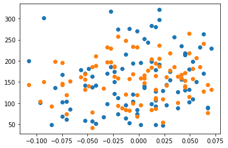
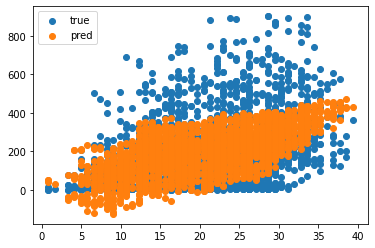
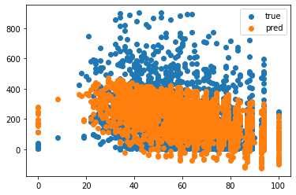

선형 회귀와 손실 함수를 이용하여 2가지 프로젝트를 진행하려고 한다.

목차 

[1. 당뇨병 수치 예측](#당뇨병-수치-예측)

[2. 자전거 대여 수요 예측](#자전거-대여-수요-예측)


# 당뇨병 수치 예측

sklearn에 있는 데이터 중 하나인 당뇨병 데이터를 가지고 회귀분석을 해본다.

목차

[1. 데이터 가져오기](#데이터-가져오기)

[2. train 데이터와 test 데이터로 분리](#train-데이터와-test-데이터로-분리)

[3. 모델 준비](#모델-준비)

[4. 손실함수 loss 정의](#손실함수-loss-정의)

[5. gradient 함수](#gradient-함수)

[6. 모델 학습](#모델-학습)

[7. test 데이터 성능 확인](#test-데이터-성능-확인)


## 데이터 가져오기


```python
import pandas as pd
import numpy as np
from sklearn.datasets import load_diabetes

diabetes=load_diabetes()
```


```python
diabetes.keys()
```


    dict_keys(['data', 'target', 'frame', 'DESCR', 'feature_names', 'data_filename', 'target_filename', 'data_module'])


data와 target을 받아온다.


```python
df_X=diabetes.data
df_y=diabetes.target

print(df_X.shape)
print(df_y.shape)
```

    (442, 10)
    (442,)


```python
diabetes_df = pd.DataFrame(df_X, columns=diabetes.feature_names)
diabetes_df
```


<table border="1" class="dataframe">
  <thead>
    <tr style="text-align: right;">
      <th></th>
      <th>age</th>
      <th>sex</th>
      <th>bmi</th>
      <th>bp</th>
      <th>s1</th>
      <th>s2</th>
      <th>s3</th>
      <th>s4</th>
      <th>s5</th>
      <th>s6</th>
    </tr>
  </thead>
  <tbody>
    <tr>
      <th>0</th>
      <td>0.038076</td>
      <td>0.050680</td>
      <td>0.061696</td>
      <td>0.021872</td>
      <td>-0.044223</td>
      <td>-0.034821</td>
      <td>-0.043401</td>
      <td>-0.002592</td>
      <td>0.019908</td>
      <td>-0.017646</td>
    </tr>
    <tr>
      <th>1</th>
      <td>-0.001882</td>
      <td>-0.044642</td>
      <td>-0.051474</td>
      <td>-0.026328</td>
      <td>-0.008449</td>
      <td>-0.019163</td>
      <td>0.074412</td>
      <td>-0.039493</td>
      <td>-0.068330</td>
      <td>-0.092204</td>
    </tr>
    <tr>
      <th>2</th>
      <td>0.085299</td>
      <td>0.050680</td>
      <td>0.044451</td>
      <td>-0.005671</td>
      <td>-0.045599</td>
      <td>-0.034194</td>
      <td>-0.032356</td>
      <td>-0.002592</td>
      <td>0.002864</td>
      <td>-0.025930</td>
    </tr>
    <tr>
      <th>3</th>
      <td>-0.089063</td>
      <td>-0.044642</td>
      <td>-0.011595</td>
      <td>-0.036656</td>
      <td>0.012191</td>
      <td>0.024991</td>
      <td>-0.036038</td>
      <td>0.034309</td>
      <td>0.022692</td>
      <td>-0.009362</td>
    </tr>
    <tr>
      <th>4</th>
      <td>0.005383</td>
      <td>-0.044642</td>
      <td>-0.036385</td>
      <td>0.021872</td>
      <td>0.003935</td>
      <td>0.015596</td>
      <td>0.008142</td>
      <td>-0.002592</td>
      <td>-0.031991</td>
      <td>-0.046641</td>
    </tr>
    <tr>
      <th>...</th>
      <td>...</td>
      <td>...</td>
      <td>...</td>
      <td>...</td>
      <td>...</td>
      <td>...</td>
      <td>...</td>
      <td>...</td>
      <td>...</td>
      <td>...</td>
    </tr>
    <tr>
      <th>437</th>
      <td>0.041708</td>
      <td>0.050680</td>
      <td>0.019662</td>
      <td>0.059744</td>
      <td>-0.005697</td>
      <td>-0.002566</td>
      <td>-0.028674</td>
      <td>-0.002592</td>
      <td>0.031193</td>
      <td>0.007207</td>
    </tr>
    <tr>
      <th>438</th>
      <td>-0.005515</td>
      <td>0.050680</td>
      <td>-0.015906</td>
      <td>-0.067642</td>
      <td>0.049341</td>
      <td>0.079165</td>
      <td>-0.028674</td>
      <td>0.034309</td>
      <td>-0.018118</td>
      <td>0.044485</td>
    </tr>
    <tr>
      <th>439</th>
      <td>0.041708</td>
      <td>0.050680</td>
      <td>-0.015906</td>
      <td>0.017282</td>
      <td>-0.037344</td>
      <td>-0.013840</td>
      <td>-0.024993</td>
      <td>-0.011080</td>
      <td>-0.046879</td>
      <td>0.015491</td>
    </tr>
    <tr>
      <th>440</th>
      <td>-0.045472</td>
      <td>-0.044642</td>
      <td>0.039062</td>
      <td>0.001215</td>
      <td>0.016318</td>
      <td>0.015283</td>
      <td>-0.028674</td>
      <td>0.026560</td>
      <td>0.044528</td>
      <td>-0.025930</td>
    </tr>
    <tr>
      <th>441</th>
      <td>-0.045472</td>
      <td>-0.044642</td>
      <td>-0.073030</td>
      <td>-0.081414</td>
      <td>0.083740</td>
      <td>0.027809</td>
      <td>0.173816</td>
      <td>-0.039493</td>
      <td>-0.004220</td>
      <td>0.003064</td>
    </tr>
  </tbody>
</table>
<p>442 rows × 10 columns</p>
</div>


나이가 소수점으로 표현되어 있는데 모든 특성이 -0.2에서 0.2사이에 분포하도록 조정

## train 데이터와 test 데이터로 분리


```python
df_X=diabetes.data

df_X
```


    array([[ 0.03807591,  0.05068012,  0.06169621, ..., -0.00259226,
             0.01990842, -0.01764613],
           [-0.00188202, -0.04464164, -0.05147406, ..., -0.03949338,
            -0.06832974, -0.09220405],
           [ 0.08529891,  0.05068012,  0.04445121, ..., -0.00259226,
             0.00286377, -0.02593034],
           ...,
           [ 0.04170844,  0.05068012, -0.01590626, ..., -0.01107952,
            -0.04687948,  0.01549073],
           [-0.04547248, -0.04464164,  0.03906215, ...,  0.02655962,
             0.04452837, -0.02593034],
           [-0.04547248, -0.04464164, -0.0730303 , ..., -0.03949338,
            -0.00421986,  0.00306441]])


```python
from sklearn.model_selection import train_test_split

X_train, X_test, y_train, y_test = train_test_split(df_X, df_y, test_size=0.2, random_state=0)

print(X_train.shape, y_train.shape)
print(X_test.shape, y_test.shape)
```

    (353, 10) (353,)
    (89, 10) (89,)


## 모델 준비


```python
W = np.random.rand(10)
b = np.random.rand()

print(W)
print(b)
```

    [0.28729098 0.01730835 0.18514486 0.987159   0.53912636 0.19438237
     0.2416875  0.38141055 0.63327959 0.93867489]
    0.5778334460934594


## 손실함수 loss 정의

손실함수는 MSE함수로 사용해본다.


```python
def model(df_X, W, b):
    predictions = 0
    for i in range(10):
        predictions += df_X[:, i] * W[i]
    predictions += b
    return predictions
```


```python
def MSE(a, b):
    mse = ((a - b) ** 2).mean()  # 두 값의 차이의 제곱의 평균
    return mse
```


```python
def loss(df_X, W, b, df_y):
    predictions = model(df_X, W, b)
    L = MSE(predictions, df_y)
    return L
```

## gradient 함수


```python
def gradient(df_X, W, b, df_y):
    # N은 데이터 포인트의 개수
    N = len(df_y)
    
    # y_pred 준비
    y_pred = model(df_X, W, b)
    
    # 공식에 맞게 gradient 계산
    dW = 1/N * 2 * df_X.T.dot(y_pred - df_y)
        
    # b의 gradient 계산
    db = 2 * (y_pred - df_y).mean()
    return dW, db


dW, db = gradient(df_X, W, b, df_y)

print("dW:", dW)
print("db:", db)
```

    dW: [-1.37027278 -0.31231578 -4.28915424 -3.22508241 -1.54447354 -1.2675622
      2.88829422 -3.14516451 -4.13592183 -2.79238527]
    db: -303.1113014336049


## 모델 학습

학습률을 0.1로 설정하고

10000번 학습시켜본다.


```python
LEARNING_RATE = 0.01

losses = []

for i in range(1, 100001):
    dW, db = gradient(X_train, W, b, y_train)
    W -= LEARNING_RATE * dW
    b -= LEARNING_RATE * db
    L = loss(X_train, W, b, y_train)
    losses.append(L)
    if i % 5000 == 0:
        print('Iteration %d : Loss %0.4f' % (i, L))
```

    Iteration 5000 : Loss 3915.8930
    Iteration 10000 : Loss 3345.0486
    Iteration 15000 : Loss 3108.1053
    Iteration 20000 : Loss 2977.2691
    Iteration 25000 : Loss 2897.2055
    Iteration 30000 : Loss 2846.5355
    Iteration 35000 : Loss 2813.9848
    Iteration 40000 : Loss 2792.8540
    Iteration 45000 : Loss 2779.0046
    Iteration 50000 : Loss 2769.8388
    Iteration 55000 : Loss 2763.7104
    Iteration 60000 : Loss 2759.5675
    Iteration 65000 : Loss 2756.7331
    Iteration 70000 : Loss 2754.7681
    Iteration 75000 : Loss 2753.3857
    Iteration 80000 : Loss 2752.3972
    Iteration 85000 : Loss 2751.6776
    Iteration 90000 : Loss 2751.1430
    Iteration 95000 : Loss 2750.7374
    Iteration 100000 : Loss 2750.4223


```python
import matplotlib.pyplot as plt
plt.plot(losses)
plt.show()
```


    

    


4000번 학습부터 LOSS값이 2700에 수렴하는 것을 볼 수 있다.

loss값이 큰 이유는 상대적으로 x값들에 비해 y값이 매우 크기 때문.

## test 데이터 성능 확인


```python
prediction = model(X_test, W, b)
mse = loss(X_test, W, b, y_test)
mse
```


    3451.081763173368


```python
plt.scatter(X_test[:, 0], y_test)
plt.scatter(X_test[:, 0], prediction)
plt.show()
```


    



# 자전거 대여 수요 예측

캐글데이터를 기반으로 한 데이터 분석을 해보자.

시간, 온도, 습도, 계절 등의 정보가 담긴 데이터를 통해 자전거의 대여량을 예측

목차

[1. 데이터 가져오기](#데이터-가져오기)

[2. 문자형을 datetime으로 변환](#문자형을-datetime으로-변환)

[3. datetime 데이터 시각화](#datetime-데이터-시각화)

[4. X, y 컬럼 선택 및 데이터 분리](#x-y-컬럼-선택-및-데이터-분리)

[5. LinearRegression 모델 학습](#linearregression-모델-학습)

[6. 손실함수 값 계산](#손실함수-값-계산)

[7. 데이터 시각화](#데이터-시각화)


칼럼 설명

    * datetime: 날짜
    * season: 1 = 봄, 2 = 여름, 3 = 가을, 4 = 겨울
    * holiday: 1 = 주말을 제외한 국경일 등의 휴일, 0 = 휴일이 아닌 날
    * workingday: 1 = 주중, 0 = 주말 및 휴일
    * weather: 1 = 맑음 2 = 안개 + 흐림 3 = 가벼운 눈, 비 4 = 심한 눈, 비
    * temp: 온도(섭씨)
    * atemp: 체감온도(섭씨)
    * humidity: 상대습도
    * windspeed: 풍속
    * casual: 사전에 등록되지 않는 사용자가 대여한 횟수
    * registered: 사전에 등록된 사용자가 대여한 횟수
    * count: 총 대여 횟수

출처: https://www.kaggle.com/c/bike-sharing-demand/data

## 데이터 가져오기


```python
import pandas as pd
import matplotlib.pyplot as plt
import seaborn as sns
```


```python
train = pd.read_csv('~/data/data/bike-sharing-demand/train.csv')
test = pd.read_csv('~/data/data/bike-sharing-demand/test.csv')
train.tail()
```


<table border="1" class="dataframe">
  <thead>
    <tr style="text-align: right;">
      <th></th>
      <th>datetime</th>
      <th>season</th>
      <th>holiday</th>
      <th>workingday</th>
      <th>weather</th>
      <th>temp</th>
      <th>atemp</th>
      <th>humidity</th>
      <th>windspeed</th>
      <th>casual</th>
      <th>registered</th>
      <th>count</th>
    </tr>
  </thead>
  <tbody>
    <tr>
      <th>10881</th>
      <td>2012-12-19 19:00:00</td>
      <td>4</td>
      <td>0</td>
      <td>1</td>
      <td>1</td>
      <td>15.58</td>
      <td>19.695</td>
      <td>50</td>
      <td>26.0027</td>
      <td>7</td>
      <td>329</td>
      <td>336</td>
    </tr>
    <tr>
      <th>10882</th>
      <td>2012-12-19 20:00:00</td>
      <td>4</td>
      <td>0</td>
      <td>1</td>
      <td>1</td>
      <td>14.76</td>
      <td>17.425</td>
      <td>57</td>
      <td>15.0013</td>
      <td>10</td>
      <td>231</td>
      <td>241</td>
    </tr>
    <tr>
      <th>10883</th>
      <td>2012-12-19 21:00:00</td>
      <td>4</td>
      <td>0</td>
      <td>1</td>
      <td>1</td>
      <td>13.94</td>
      <td>15.910</td>
      <td>61</td>
      <td>15.0013</td>
      <td>4</td>
      <td>164</td>
      <td>168</td>
    </tr>
    <tr>
      <th>10884</th>
      <td>2012-12-19 22:00:00</td>
      <td>4</td>
      <td>0</td>
      <td>1</td>
      <td>1</td>
      <td>13.94</td>
      <td>17.425</td>
      <td>61</td>
      <td>6.0032</td>
      <td>12</td>
      <td>117</td>
      <td>129</td>
    </tr>
    <tr>
      <th>10885</th>
      <td>2012-12-19 23:00:00</td>
      <td>4</td>
      <td>0</td>
      <td>1</td>
      <td>1</td>
      <td>13.12</td>
      <td>16.665</td>
      <td>66</td>
      <td>8.9981</td>
      <td>4</td>
      <td>84</td>
      <td>88</td>
    </tr>
  </tbody>
</table>
</div>


## 문자형을 datetime으로 변환


```python
train.info()
```

    <class 'pandas.core.frame.DataFrame'>
    RangeIndex: 10886 entries, 0 to 10885
    Data columns (total 12 columns):
     #   Column      Non-Null Count  Dtype  
    ---  ------      --------------  -----  
     0   datetime    10886 non-null  object 
     1   season      10886 non-null  int64  
     2   holiday     10886 non-null  int64  
     3   workingday  10886 non-null  int64  
     4   weather     10886 non-null  int64  
     5   temp        10886 non-null  float64
     6   atemp       10886 non-null  float64
     7   humidity    10886 non-null  int64  
     8   windspeed   10886 non-null  float64
     9   casual      10886 non-null  int64  
     10  registered  10886 non-null  int64  
     11  count       10886 non-null  int64  
    dtypes: float64(3), int64(8), object(1)
    memory usage: 1020.7+ KB


datetime 칼럼이 문자형으로 되어있다.

datetime형으로 변경 후 연, 월, 일, 시, 분, 초까지 6가지 컬럼 생성


```python
train['datetime'] = pd.to_datetime(train['datetime'])
test['datetime'] = pd.to_datetime(test['datetime'])

train.info()
```

    <class 'pandas.core.frame.DataFrame'>
    RangeIndex: 10886 entries, 0 to 10885
    Data columns (total 12 columns):
     #   Column      Non-Null Count  Dtype         
    ---  ------      --------------  -----         
     0   datetime    10886 non-null  datetime64[ns]
     1   season      10886 non-null  int64         
     2   holiday     10886 non-null  int64         
     3   workingday  10886 non-null  int64         
     4   weather     10886 non-null  int64         
     5   temp        10886 non-null  float64       
     6   atemp       10886 non-null  float64       
     7   humidity    10886 non-null  int64         
     8   windspeed   10886 non-null  float64       
     9   casual      10886 non-null  int64         
     10  registered  10886 non-null  int64         
     11  count       10886 non-null  int64         
    dtypes: datetime64[ns](1), float64(3), int64(8)
    memory usage: 1020.7 KB


```python
print(train.shape)
print(test.shape)
```

    (10886, 12)
    (6493, 9)


## datetime 데이터 시각화


```python
train['year'] = train['datetime'].dt.year
train['month'] = train['datetime'].dt.month
train['day'] = train['datetime'].dt.day
train['hour'] = train['datetime'].dt.hour
train['minute'] = train['datetime'].dt.minute
train['second'] = train['datetime'].dt.second

train['dayofweek'] = train['datetime'].dt.dayofweek
```


```python
fig, axs = plt.subplots(figsize=(24, 16), ncols=3, nrows=2)
cat_features = ['year', 'month','day', 'hour', 'minute','second']

for i, feature in enumerate(cat_features):
    row = int(i/3)
    col = i%3
    sns.barplot(x=feature, y='count', data=train, ax=axs[row][col])
```


    

    


1. 년도가 증가함에 따라 수요량이 증가했다.


2. 겨울에 수요가 적은 반면, 여름이 많다.


3. 날짜 별로 큰 차이가 없음을 볼 수 있다.


4. 출퇴근시간에 수요가 급증한다.

## X, y 컬럼 선택 및 데이터 분리


```python
train.drop(['datetime', 'workingday', 'atemp', 'registered', 'casual'], axis = 1, inplace = True)
y = train['count']
X= train.drop(['count'],axis=1,inplace=False)
```

workingday는 holiday와 비슷한 데이터를 가지고 있어서 workiingday를 삭제

atemp 또한 temp와 비슷하기 때문에 삭제


count는 y변수에 넣기 위해 삭제


```python
from sklearn.model_selection import train_test_split

X_train, X_test, y_train, y_test = train_test_split(X, y, test_size=0.2, random_state=0)
```

## LinearRegression 모델 학습


```python
from sklearn.linear_model import LinearRegression

lr_reg = LinearRegression()
lr_reg.fit(X_train, y_train)
pred = lr_reg.predict(X_test)

pred
```


    array([319.9937222 , 254.65967957, 238.01977103, ..., 439.19265494,
           240.33277668,   7.38231097])


## 손실함수 값 계산


```python
from sklearn.metrics import mean_squared_error

mse = mean_squared_error(y_test, pred)
mse
rmse = mse**0.5
print("MSE :", mse)
print("RMSE :", rmse)
```

    MSE : 20232.54422077252
    RMSE : 142.2411481280031


## 데이터 시각화


```python
plt.scatter(X_test['temp'], y_test, label="true")
plt.scatter(X_test['temp'], pred, label="pred")
plt.legend()
plt.show()

plt.scatter(X_test['humidity'], y_test, label="true")
plt.scatter(X_test['humidity'], pred, label="pred")
plt.legend()
plt.show()
```


    

    


    

    


    

