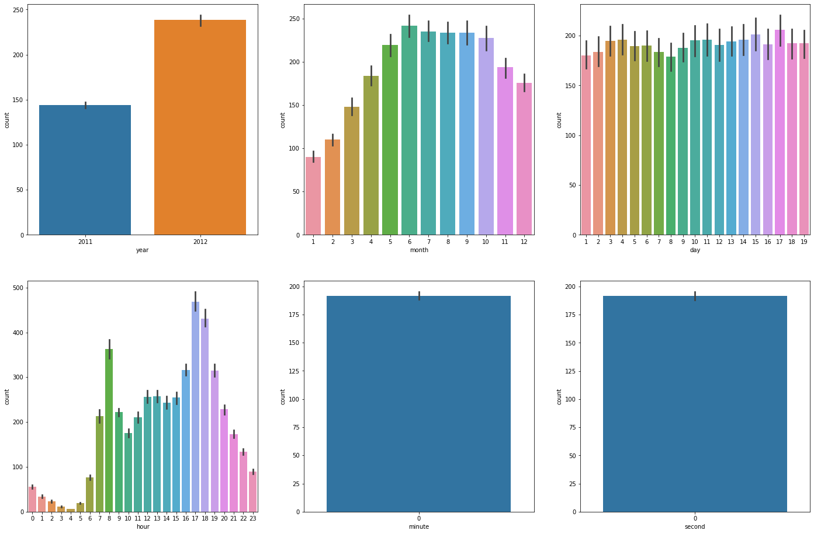
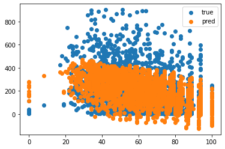

# 자전거 대여 수요 예측

캐글데이터를 기반으로 한 데이터 분석을 해보자.

시간, 온도, 습도, 계절 등의 정보가 담긴 데이터를 통해 자전거의 대여량을 예측

목차

[1. 데이터 가져오기](#데이터-가져오기)

[2. 문자형을 datetime으로 변환](#문자형을-datetime으로-변환)

[3. datetime 데이터 시각화](#datetime-데이터-시각화)

[4. X, y 컬럼 선택 및 데이터 분리](#x-y-컬럼-선택-및-데이터-분리)

[5. LinearRegression 모델 학습](#linearregression-모델-학습)

[6. 손실함수 값 계산](#손실함수-값-계산)

[7. 데이터 시각화](#데이터-시각화)


칼럼 설명

    * datetime: 날짜
    * season: 1 = 봄, 2 = 여름, 3 = 가을, 4 = 겨울
    * holiday: 1 = 주말을 제외한 국경일 등의 휴일, 0 = 휴일이 아닌 날
    * workingday: 1 = 주중, 0 = 주말 및 휴일
    * weather: 1 = 맑음 2 = 안개 + 흐림 3 = 가벼운 눈, 비 4 = 심한 눈, 비
    * temp: 온도(섭씨)
    * atemp: 체감온도(섭씨)
    * humidity: 상대습도
    * windspeed: 풍속
    * casual: 사전에 등록되지 않는 사용자가 대여한 횟수
    * registered: 사전에 등록된 사용자가 대여한 횟수
    * count: 총 대여 횟수

출처: https://www.kaggle.com/c/bike-sharing-demand/data

## 데이터 가져오기


```python
import pandas as pd
import matplotlib.pyplot as plt
import seaborn as sns
```


```python
train = pd.read_csv('~/data/data/bike-sharing-demand/train.csv')
test = pd.read_csv('~/data/data/bike-sharing-demand/test.csv')
train.tail()
```


<table border="1" class="dataframe">
  <thead>
    <tr style="text-align: right;">
      <th></th>
      <th>datetime</th>
      <th>season</th>
      <th>holiday</th>
      <th>workingday</th>
      <th>weather</th>
      <th>temp</th>
      <th>atemp</th>
      <th>humidity</th>
      <th>windspeed</th>
      <th>casual</th>
      <th>registered</th>
      <th>count</th>
    </tr>
  </thead>
  <tbody>
    <tr>
      <th>10881</th>
      <td>2012-12-19 19:00:00</td>
      <td>4</td>
      <td>0</td>
      <td>1</td>
      <td>1</td>
      <td>15.58</td>
      <td>19.695</td>
      <td>50</td>
      <td>26.0027</td>
      <td>7</td>
      <td>329</td>
      <td>336</td>
    </tr>
    <tr>
      <th>10882</th>
      <td>2012-12-19 20:00:00</td>
      <td>4</td>
      <td>0</td>
      <td>1</td>
      <td>1</td>
      <td>14.76</td>
      <td>17.425</td>
      <td>57</td>
      <td>15.0013</td>
      <td>10</td>
      <td>231</td>
      <td>241</td>
    </tr>
    <tr>
      <th>10883</th>
      <td>2012-12-19 21:00:00</td>
      <td>4</td>
      <td>0</td>
      <td>1</td>
      <td>1</td>
      <td>13.94</td>
      <td>15.910</td>
      <td>61</td>
      <td>15.0013</td>
      <td>4</td>
      <td>164</td>
      <td>168</td>
    </tr>
    <tr>
      <th>10884</th>
      <td>2012-12-19 22:00:00</td>
      <td>4</td>
      <td>0</td>
      <td>1</td>
      <td>1</td>
      <td>13.94</td>
      <td>17.425</td>
      <td>61</td>
      <td>6.0032</td>
      <td>12</td>
      <td>117</td>
      <td>129</td>
    </tr>
    <tr>
      <th>10885</th>
      <td>2012-12-19 23:00:00</td>
      <td>4</td>
      <td>0</td>
      <td>1</td>
      <td>1</td>
      <td>13.12</td>
      <td>16.665</td>
      <td>66</td>
      <td>8.9981</td>
      <td>4</td>
      <td>84</td>
      <td>88</td>
    </tr>
  </tbody>
</table>
</div>


## 문자형을 datetime으로 변환


```python
train.info()
```

    <class 'pandas.core.frame.DataFrame'>
    RangeIndex: 10886 entries, 0 to 10885
    Data columns (total 12 columns):
     #   Column      Non-Null Count  Dtype  
    ---  ------      --------------  -----  
     0   datetime    10886 non-null  object 
     1   season      10886 non-null  int64  
     2   holiday     10886 non-null  int64  
     3   workingday  10886 non-null  int64  
     4   weather     10886 non-null  int64  
     5   temp        10886 non-null  float64
     6   atemp       10886 non-null  float64
     7   humidity    10886 non-null  int64  
     8   windspeed   10886 non-null  float64
     9   casual      10886 non-null  int64  
     10  registered  10886 non-null  int64  
     11  count       10886 non-null  int64  
    dtypes: float64(3), int64(8), object(1)
    memory usage: 1020.7+ KB


datetime 칼럼이 문자형으로 되어있다.

datetime형으로 변경 후 연, 월, 일, 시, 분, 초까지 6가지 컬럼 생성


```python
train['datetime'] = pd.to_datetime(train['datetime'])
test['datetime'] = pd.to_datetime(test['datetime'])

train.info()
```

    <class 'pandas.core.frame.DataFrame'>
    RangeIndex: 10886 entries, 0 to 10885
    Data columns (total 12 columns):
     #   Column      Non-Null Count  Dtype         
    ---  ------      --------------  -----         
     0   datetime    10886 non-null  datetime64[ns]
     1   season      10886 non-null  int64         
     2   holiday     10886 non-null  int64         
     3   workingday  10886 non-null  int64         
     4   weather     10886 non-null  int64         
     5   temp        10886 non-null  float64       
     6   atemp       10886 non-null  float64       
     7   humidity    10886 non-null  int64         
     8   windspeed   10886 non-null  float64       
     9   casual      10886 non-null  int64         
     10  registered  10886 non-null  int64         
     11  count       10886 non-null  int64         
    dtypes: datetime64[ns](1), float64(3), int64(8)
    memory usage: 1020.7 KB


```python
print(train.shape)
print(test.shape)
```

    (10886, 12)
    (6493, 9)


## datetime 데이터 시각화


```python
train['year'] = train['datetime'].dt.year
train['month'] = train['datetime'].dt.month
train['day'] = train['datetime'].dt.day
train['hour'] = train['datetime'].dt.hour
train['minute'] = train['datetime'].dt.minute
train['second'] = train['datetime'].dt.second

train['dayofweek'] = train['datetime'].dt.dayofweek
```


```python
fig, axs = plt.subplots(figsize=(24, 16), ncols=3, nrows=2)
cat_features = ['year', 'month','day', 'hour', 'minute','second']

for i, feature in enumerate(cat_features):
    row = int(i/3)
    col = i%3
    sns.barplot(x=feature, y='count', data=train, ax=axs[row][col])
```


    

    


1. 년도가 증가함에 따라 수요량이 증가했다.


2. 겨울에 수요가 적은 반면, 여름이 많다.


3. 날짜 별로 큰 차이가 없음을 볼 수 있다.


4. 출퇴근시간에 수요가 급증한다.

## X, y 컬럼 선택 및 데이터 분리


```python
train.drop(['datetime', 'workingday', 'atemp', 'registered', 'casual'], axis = 1, inplace = True)
y = train['count']
X= train.drop(['count'],axis=1,inplace=False)
```

workingday는 holiday와 비슷한 데이터를 가지고 있어서 workiingday를 삭제

atemp 또한 temp와 비슷하기 때문에 삭제


count는 y변수에 넣기 위해 삭제


```python
from sklearn.model_selection import train_test_split

X_train, X_test, y_train, y_test = train_test_split(X, y, test_size=0.2, random_state=0)
```

## LinearRegression 모델 학습


```python
from sklearn.linear_model import LinearRegression

lr_reg = LinearRegression()
lr_reg.fit(X_train, y_train)
pred = lr_reg.predict(X_test)

pred
```


    array([319.9937222 , 254.65967957, 238.01977103, ..., 439.19265494,
           240.33277668,   7.38231097])


## 손실함수 값 계산


```python
from sklearn.metrics import mean_squared_error

mse = mean_squared_error(y_test, pred)
mse
rmse = mse**0.5
print("MSE :", mse)
print("RMSE :", rmse)
```

    MSE : 20232.54422077252
    RMSE : 142.2411481280031


## 데이터 시각화


```python
plt.scatter(X_test['temp'], y_test, label="true")
plt.scatter(X_test['temp'], pred, label="pred")
plt.legend()
plt.show()

plt.scatter(X_test['humidity'], y_test, label="true")
plt.scatter(X_test['humidity'], pred, label="pred")
plt.legend()
plt.show()
```


    

    


    

    

