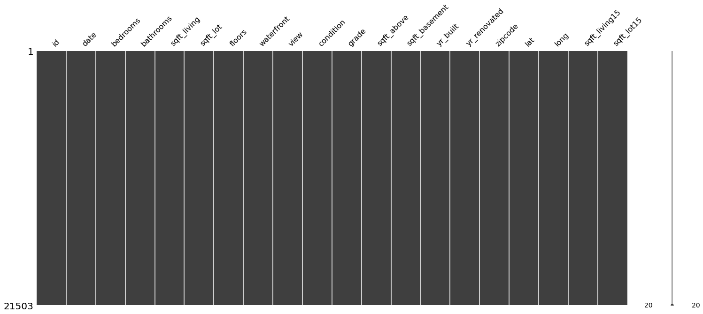
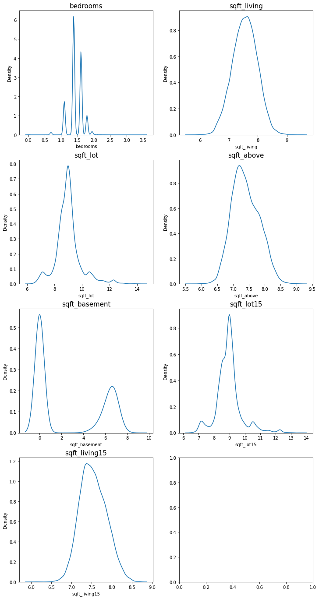
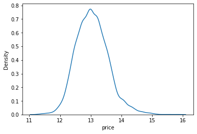

# 집 값 예측

2019년에 주최했던 캐글 경진대회인 2019 2nd ML month with KaKR를 경험해본다.

머신러닝을 활용해서 모델을 학습시킨 뒤 제출해보자.

출처: https://www.kaggle.com/competitions/2019-2nd-ml-month-with-kakr/overview

목차

[1. 데이터 살펴보기](#데이터-살펴보기)
    
[2. 데이터 전처리](#데이터-전처리)
    
[3. 모델링](#모델링)

[4. 모델 개선](#모델-개선)

[5. 결론](#결론)

    * Public Score :  102934.50699


```python
import warnings
warnings.filterwarnings("ignore")

import os
from os.path import join

import pandas as pd

import numpy as np

import missingno as msno

from sklearn.ensemble import GradientBoostingRegressor
from sklearn.model_selection import KFold, cross_val_score
import xgboost as xgb
import lightgbm as lgb

import matplotlib.pyplot as plt
import seaborn as sns
```


```python
data_dir = os.getenv('HOME')+'/aiffel/kaggle_kakr_housing/data'

train_data_path = join(data_dir, 'train.csv')
sub_data_path = join(data_dir, 'test.csv')      # 테스트, 즉 submission 시 사용할 데이터 경로

print(train_data_path)
print(sub_data_path)
```

    /aiffel/aiffel/kaggle_kakr_housing/data/train.csv
    /aiffel/aiffel/kaggle_kakr_housing/data/test.csv


##  데이터 살펴보기


1. ID : 집을 구분하는 번호
2. date : 집을 구매한 날짜
3. price : 타겟 변수인 집의 가격
4. bedrooms : 침실의 수
5. bathrooms : 침실당 화장실 개수
6. sqft_living : 주거 공간의 평방 피트
7. sqft_lot : 부지의 평방 피트
8. floors : 집의 층 수
9. waterfront : 집의 전방에 강이 흐르는지 유무 (a.k.a. 리버뷰)
10. view : 집이 얼마나 좋아 보이는지의 정도
11. condition : 집의 전반적인 상태
12. grade : King County grading 시스템 기준으로 매긴 집의 등급
13. sqft_above : 지하실을 제외한 평방 피트
14. sqft_basement : 지하실의 평방 피트
15. yr_built : 집을 지은 년도
16. yr_renovated : 집을 재건축한 년도
17. zipcode : 우편번호
18. lat : 위도
19. long : 경도
20. sqft_living15 : 2015년 기준 주거 공간의 평방 피트(집을 재건축했다면, 변화가 있을 수 있음)
21. sqft_lot15 : 2015년 기준 부지의 평방 피트(집을 재건축했다면, 변화가 있을 수 있음)


```python
data = pd.read_csv(train_data_path)
sub = pd.read_csv(sub_data_path)
print('train data dim : {}'.format(data.shape))
print('sub data dim : {}'.format(sub.shape))
```

    train data dim : (15035, 21)
    sub data dim : (6468, 20)


```python
y = data['price']

del data['price']
```


```python
train_len = len(data)
data = pd.concat((data, sub), axis=0)
```


```python
data.head()
```


<div>
<style scoped>
    .dataframe tbody tr th:only-of-type {
        vertical-align: middle;
    }

    .dataframe tbody tr th {
        vertical-align: top;
    }

    .dataframe thead th {
        text-align: right;
    }
</style>
<table border="1" class="dataframe">
  <thead>
    <tr style="text-align: right;">
      <th></th>
      <th>id</th>
      <th>date</th>
      <th>bedrooms</th>
      <th>bathrooms</th>
      <th>sqft_living</th>
      <th>sqft_lot</th>
      <th>floors</th>
      <th>waterfront</th>
      <th>view</th>
      <th>condition</th>
      <th>grade</th>
      <th>sqft_above</th>
      <th>sqft_basement</th>
      <th>yr_built</th>
      <th>yr_renovated</th>
      <th>zipcode</th>
      <th>lat</th>
      <th>long</th>
      <th>sqft_living15</th>
      <th>sqft_lot15</th>
    </tr>
  </thead>
  <tbody>
    <tr>
      <th>0</th>
      <td>0</td>
      <td>20141013T000000</td>
      <td>3</td>
      <td>1.00</td>
      <td>1180</td>
      <td>5650</td>
      <td>1.0</td>
      <td>0</td>
      <td>0</td>
      <td>3</td>
      <td>7</td>
      <td>1180</td>
      <td>0</td>
      <td>1955</td>
      <td>0</td>
      <td>98178</td>
      <td>47.5112</td>
      <td>-122.257</td>
      <td>1340</td>
      <td>5650</td>
    </tr>
    <tr>
      <th>1</th>
      <td>1</td>
      <td>20150225T000000</td>
      <td>2</td>
      <td>1.00</td>
      <td>770</td>
      <td>10000</td>
      <td>1.0</td>
      <td>0</td>
      <td>0</td>
      <td>3</td>
      <td>6</td>
      <td>770</td>
      <td>0</td>
      <td>1933</td>
      <td>0</td>
      <td>98028</td>
      <td>47.7379</td>
      <td>-122.233</td>
      <td>2720</td>
      <td>8062</td>
    </tr>
    <tr>
      <th>2</th>
      <td>2</td>
      <td>20150218T000000</td>
      <td>3</td>
      <td>2.00</td>
      <td>1680</td>
      <td>8080</td>
      <td>1.0</td>
      <td>0</td>
      <td>0</td>
      <td>3</td>
      <td>8</td>
      <td>1680</td>
      <td>0</td>
      <td>1987</td>
      <td>0</td>
      <td>98074</td>
      <td>47.6168</td>
      <td>-122.045</td>
      <td>1800</td>
      <td>7503</td>
    </tr>
    <tr>
      <th>3</th>
      <td>3</td>
      <td>20140627T000000</td>
      <td>3</td>
      <td>2.25</td>
      <td>1715</td>
      <td>6819</td>
      <td>2.0</td>
      <td>0</td>
      <td>0</td>
      <td>3</td>
      <td>7</td>
      <td>1715</td>
      <td>0</td>
      <td>1995</td>
      <td>0</td>
      <td>98003</td>
      <td>47.3097</td>
      <td>-122.327</td>
      <td>2238</td>
      <td>6819</td>
    </tr>
    <tr>
      <th>4</th>
      <td>4</td>
      <td>20150115T000000</td>
      <td>3</td>
      <td>1.50</td>
      <td>1060</td>
      <td>9711</td>
      <td>1.0</td>
      <td>0</td>
      <td>0</td>
      <td>3</td>
      <td>7</td>
      <td>1060</td>
      <td>0</td>
      <td>1963</td>
      <td>0</td>
      <td>98198</td>
      <td>47.4095</td>
      <td>-122.315</td>
      <td>1650</td>
      <td>9711</td>
    </tr>
  </tbody>
</table>
</div>


## 데이터 전처리 

### 결측치 확인


```python
msno.matrix(data)
```


    <AxesSubplot:>


    

    


모든 변수에 결측치가 없는 것으로 보이지만, 혹시 모르니 확실하게 살펴본다.


```python
# id 컬럼이 결측치인지 확인

null_check = pd.isnull(data['id'])
print(null_check)
```

    0       False
    1       False
    2       False
    3       False
    4       False
            ...  
    6463    False
    6464    False
    6465    False
    6466    False
    6467    False
    Name: id, Length: 21503, dtype: bool


```python
# 결측치인 데이터만 뽑아낸다.

null_data = data.loc[null_check, 'id']
null_data.head()
```


    Series([], Name: id, dtype: int64)


결측치가 없기 때문에 빈 데이터프레임이 나왔다.


```python
# 결측치인 데이터의 개수
print(f'id: {len(null_data.values)}')
```

    id: 0


모든 컬럼에 적용해보자.


```python
for c in data.columns:
    print('{} : {}'.format(c, len(data.loc[pd.isnull(data[c]), c].values)))
```

    id : 0
    date : 0
    bedrooms : 0
    bathrooms : 0
    sqft_living : 0
    sqft_lot : 0
    floors : 0
    waterfront : 0
    view : 0
    condition : 0
    grade : 0
    sqft_above : 0
    sqft_basement : 0
    yr_built : 0
    yr_renovated : 0
    zipcode : 0
    lat : 0
    long : 0
    sqft_living15 : 0
    sqft_lot15 : 0


### id, date 변수 정리

id 변수는 모델이 집값을 예측하는데 도움을 주지 않으므로 제거

date 변수는 연월일시간으로 값을 가지고 있는데, 연월만 고려하는 범주형 변수로 변환


```python
sub_id = data['id'][train_len:]
del data['id']
data['date'] = data['date'].apply(lambda x : str(x[:6])).astype(str)
```

### 각 변수들의 분포 확인
한쪽으로 치우친 분포는 모델이 결과를 예측하기에 좋지 않은 영향을 미치므로 다듬어줄 필요가 있습니다.


```python
fig, ax = plt.subplots(9, 2, figsize=(12, 50))

# id 변수(count==0인 경우)는 제외하고 분포를 확인
count = 1
columns = data.columns
for row in range(9):
    for col in range(2):
        sns.kdeplot(data=data[columns[count]], ax=ax[row][col])
        ax[row][col].set_title(columns[count], fontsize=15)
        count += 1
        if count == 19 :
            break
```


    

    


price, bedrooms, sqft_living, sqft_lot, sqft_above, sqft_basement 변수가 한쪽으로 치우친 경향

log-scaling을 통해 데이터 분포를 정규분포에 가깝게 만들어 보자.


```python
skew_columns = ['bedrooms', 'sqft_living', 'sqft_lot', 'sqft_above', 'sqft_basement', 'sqft_lot15', 'sqft_living15']

for c in skew_columns:
    data[c] = np.log1p(data[c].values)
```


```python
fig, ax = plt.subplots(4, 2, figsize=(12, 24))

count = 0
for row in range(4):
    for col in range(2):
        if count == 7:
            break
        sns.kdeplot(data=data[skew_columns[count]], ax=ax[row][col])
        ax[row][col].set_title(skew_columns[count], fontsize=15)
        count += 1
```


    

    


어느정도 치우침이 줄어든 분포를 확인할 수 있다.


```python
sub = data.iloc[train_len:, :]
x = data.iloc[:train_len, :]
```

## 모델링

### Average Blending
여러가지 모델의 결과를 산술 평균을 통해 Blending 모델을 만들기

모델은 부스팅 계열인 gboost, xgboost, lightgbm 세 가지를 사용


```python
gboost = GradientBoostingRegressor(random_state=2019)
xgboost = xgb.XGBRegressor(random_state=2019)
lightgbm = lgb.LGBMRegressor(random_state=2019)

models = [{'model':gboost, 'name':'GradientBoosting'}, {'model':xgboost, 'name':'XGBoost'},
          {'model':lightgbm, 'name':'LightGBM'}]
```

### Cross Validation
교차 검증을 통해 모델의 성능을 평가


```python
def get_cv_score(models):
    kfold = KFold(n_splits=5).get_n_splits(x.values)
    for m in models:
        CV_score = np.mean(cross_val_score(m['model'], X=x.values, y=y, cv=kfold))
        print(f"Model: {m['name']}, CV score:{CV_score:.4f}")
```


```python
get_cv_score(models)
```

    Model: GradientBoosting, CV score:0.8598
    Model: XGBoost, CV score:0.8860
    Model: LightGBM, CV score:0.8819


### Make Submission

회귀 모델의 경우에는 cross_val_score 함수가 R<sup>2</sup>를 반환한다.<br>
R<sup>2</sup> 값이 1에 가까울수록 모델이 데이터를 잘 표현함을 나타낸다. 3개 트리 모델이 상당히 훈련 데이터에 대해 괜찮은 성능을 보여주고 있다.<br> 훈련 데이터셋으로 3개 모델을 학습시키고, Average Blending을 통해 제출 결과를 만들어보자.


```python
def AveragingBlending(models, x, y, sub_x):
    for m in models : 
        m['model'].fit(x.values, y)
    
    predictions = np.column_stack([
        m['model'].predict(sub_x.values) for m in models
    ])
    return np.mean(predictions, axis=1)
```


```python
y_pred = AveragingBlending(models, x, y, sub)
```


```python
print(len(y_pred))
y_pred
```

    6468


    array([ 529966.66304912,  430726.21272617, 1361676.91242777, ...,
            452081.69137012,  341572.97685942,  421725.1231835 ])


```python
data_dir = os.getenv('HOME')+'/aiffel/kaggle_kakr_housing/data'

submission_path = join(data_dir, 'sample_submission.csv')
submission = pd.read_csv(submission_path)
submission.head()
```


<div>
<style scoped>
    .dataframe tbody tr th:only-of-type {
        vertical-align: middle;
    }

    .dataframe tbody tr th {
        vertical-align: top;
    }

    .dataframe thead th {
        text-align: right;
    }
</style>
<table border="1" class="dataframe">
  <thead>
    <tr style="text-align: right;">
      <th></th>
      <th>id</th>
      <th>price</th>
    </tr>
  </thead>
  <tbody>
    <tr>
      <th>0</th>
      <td>15035</td>
      <td>100000</td>
    </tr>
    <tr>
      <th>1</th>
      <td>15036</td>
      <td>100000</td>
    </tr>
    <tr>
      <th>2</th>
      <td>15037</td>
      <td>100000</td>
    </tr>
    <tr>
      <th>3</th>
      <td>15038</td>
      <td>100000</td>
    </tr>
    <tr>
      <th>4</th>
      <td>15039</td>
      <td>100000</td>
    </tr>
  </tbody>
</table>
</div>


```python
result = pd.DataFrame({
    'id' : sub_id, 
    'price' : y_pred
})

result.head()
```


<div>
<style scoped>
    .dataframe tbody tr th:only-of-type {
        vertical-align: middle;
    }

    .dataframe tbody tr th {
        vertical-align: top;
    }

    .dataframe thead th {
        text-align: right;
    }
</style>
<table border="1" class="dataframe">
  <thead>
    <tr style="text-align: right;">
      <th></th>
      <th>id</th>
      <th>price</th>
    </tr>
  </thead>
  <tbody>
    <tr>
      <th>0</th>
      <td>15035</td>
      <td>5.299667e+05</td>
    </tr>
    <tr>
      <th>1</th>
      <td>15036</td>
      <td>4.307262e+05</td>
    </tr>
    <tr>
      <th>2</th>
      <td>15037</td>
      <td>1.361677e+06</td>
    </tr>
    <tr>
      <th>3</th>
      <td>15038</td>
      <td>3.338036e+05</td>
    </tr>
    <tr>
      <th>4</th>
      <td>15039</td>
      <td>3.089006e+05</td>
    </tr>
  </tbody>
</table>
</div>


```python
my_submission_path = join(data_dir, 'submission.csv')
result.to_csv(my_submission_path, index=False)

print(my_submission_path)
```

    /aiffel/aiffel/kaggle_kakr_housing/data/submission.csv


## 모델 개선

하이퍼 파라미터를 튜닝해보면서 모델의 성능을 끌어올려 볼 것


```python
data_dir = os.getenv('HOME')+'/aiffel/kaggle_kakr_housing/data'

train_data_path = join(data_dir, 'train.csv')
test_data_path = join(data_dir, 'test.csv') 

train = pd.read_csv(train_data_path)
test = pd.read_csv(test_data_path)
```


```python
train.head()
```


<div>
<style scoped>
    .dataframe tbody tr th:only-of-type {
        vertical-align: middle;
    }

    .dataframe tbody tr th {
        vertical-align: top;
    }

    .dataframe thead th {
        text-align: right;
    }
</style>
<table border="1" class="dataframe">
  <thead>
    <tr style="text-align: right;">
      <th></th>
      <th>id</th>
      <th>date</th>
      <th>price</th>
      <th>bedrooms</th>
      <th>bathrooms</th>
      <th>sqft_living</th>
      <th>sqft_lot</th>
      <th>floors</th>
      <th>waterfront</th>
      <th>view</th>
      <th>...</th>
      <th>grade</th>
      <th>sqft_above</th>
      <th>sqft_basement</th>
      <th>yr_built</th>
      <th>yr_renovated</th>
      <th>zipcode</th>
      <th>lat</th>
      <th>long</th>
      <th>sqft_living15</th>
      <th>sqft_lot15</th>
    </tr>
  </thead>
  <tbody>
    <tr>
      <th>0</th>
      <td>0</td>
      <td>20141013T000000</td>
      <td>221900.0</td>
      <td>3</td>
      <td>1.00</td>
      <td>1180</td>
      <td>5650</td>
      <td>1.0</td>
      <td>0</td>
      <td>0</td>
      <td>...</td>
      <td>7</td>
      <td>1180</td>
      <td>0</td>
      <td>1955</td>
      <td>0</td>
      <td>98178</td>
      <td>47.5112</td>
      <td>-122.257</td>
      <td>1340</td>
      <td>5650</td>
    </tr>
    <tr>
      <th>1</th>
      <td>1</td>
      <td>20150225T000000</td>
      <td>180000.0</td>
      <td>2</td>
      <td>1.00</td>
      <td>770</td>
      <td>10000</td>
      <td>1.0</td>
      <td>0</td>
      <td>0</td>
      <td>...</td>
      <td>6</td>
      <td>770</td>
      <td>0</td>
      <td>1933</td>
      <td>0</td>
      <td>98028</td>
      <td>47.7379</td>
      <td>-122.233</td>
      <td>2720</td>
      <td>8062</td>
    </tr>
    <tr>
      <th>2</th>
      <td>2</td>
      <td>20150218T000000</td>
      <td>510000.0</td>
      <td>3</td>
      <td>2.00</td>
      <td>1680</td>
      <td>8080</td>
      <td>1.0</td>
      <td>0</td>
      <td>0</td>
      <td>...</td>
      <td>8</td>
      <td>1680</td>
      <td>0</td>
      <td>1987</td>
      <td>0</td>
      <td>98074</td>
      <td>47.6168</td>
      <td>-122.045</td>
      <td>1800</td>
      <td>7503</td>
    </tr>
    <tr>
      <th>3</th>
      <td>3</td>
      <td>20140627T000000</td>
      <td>257500.0</td>
      <td>3</td>
      <td>2.25</td>
      <td>1715</td>
      <td>6819</td>
      <td>2.0</td>
      <td>0</td>
      <td>0</td>
      <td>...</td>
      <td>7</td>
      <td>1715</td>
      <td>0</td>
      <td>1995</td>
      <td>0</td>
      <td>98003</td>
      <td>47.3097</td>
      <td>-122.327</td>
      <td>2238</td>
      <td>6819</td>
    </tr>
    <tr>
      <th>4</th>
      <td>4</td>
      <td>20150115T000000</td>
      <td>291850.0</td>
      <td>3</td>
      <td>1.50</td>
      <td>1060</td>
      <td>9711</td>
      <td>1.0</td>
      <td>0</td>
      <td>0</td>
      <td>...</td>
      <td>7</td>
      <td>1060</td>
      <td>0</td>
      <td>1963</td>
      <td>0</td>
      <td>98198</td>
      <td>47.4095</td>
      <td>-122.315</td>
      <td>1650</td>
      <td>9711</td>
    </tr>
  </tbody>
</table>
<p>5 rows × 21 columns</p>
</div>


```python
train.info()
```

    <class 'pandas.core.frame.DataFrame'>
    RangeIndex: 15035 entries, 0 to 15034
    Data columns (total 21 columns):
     #   Column         Non-Null Count  Dtype  
    ---  ------         --------------  -----  
     0   id             15035 non-null  int64  
     1   date           15035 non-null  object 
     2   price          15035 non-null  float64
     3   bedrooms       15035 non-null  int64  
     4   bathrooms      15035 non-null  float64
     5   sqft_living    15035 non-null  int64  
     6   sqft_lot       15035 non-null  int64  
     7   floors         15035 non-null  float64
     8   waterfront     15035 non-null  int64  
     9   view           15035 non-null  int64  
     10  condition      15035 non-null  int64  
     11  grade          15035 non-null  int64  
     12  sqft_above     15035 non-null  int64  
     13  sqft_basement  15035 non-null  int64  
     14  yr_built       15035 non-null  int64  
     15  yr_renovated   15035 non-null  int64  
     16  zipcode        15035 non-null  int64  
     17  lat            15035 non-null  float64
     18  long           15035 non-null  float64
     19  sqft_living15  15035 non-null  int64  
     20  sqft_lot15     15035 non-null  int64  
    dtypes: float64(5), int64(15), object(1)
    memory usage: 2.4+ MB


date컬럼을 정수형을 변환.


```python
train['date'] = train['date'].apply(lambda i: i[:6]).astype(int)
train.head()
```


<div>
<style scoped>
    .dataframe tbody tr th:only-of-type {
        vertical-align: middle;
    }

    .dataframe tbody tr th {
        vertical-align: top;
    }

    .dataframe thead th {
        text-align: right;
    }
</style>
<table border="1" class="dataframe">
  <thead>
    <tr style="text-align: right;">
      <th></th>
      <th>id</th>
      <th>date</th>
      <th>price</th>
      <th>bedrooms</th>
      <th>bathrooms</th>
      <th>sqft_living</th>
      <th>sqft_lot</th>
      <th>floors</th>
      <th>waterfront</th>
      <th>view</th>
      <th>...</th>
      <th>grade</th>
      <th>sqft_above</th>
      <th>sqft_basement</th>
      <th>yr_built</th>
      <th>yr_renovated</th>
      <th>zipcode</th>
      <th>lat</th>
      <th>long</th>
      <th>sqft_living15</th>
      <th>sqft_lot15</th>
    </tr>
  </thead>
  <tbody>
    <tr>
      <th>0</th>
      <td>0</td>
      <td>201410</td>
      <td>221900.0</td>
      <td>3</td>
      <td>1.00</td>
      <td>1180</td>
      <td>5650</td>
      <td>1.0</td>
      <td>0</td>
      <td>0</td>
      <td>...</td>
      <td>7</td>
      <td>1180</td>
      <td>0</td>
      <td>1955</td>
      <td>0</td>
      <td>98178</td>
      <td>47.5112</td>
      <td>-122.257</td>
      <td>1340</td>
      <td>5650</td>
    </tr>
    <tr>
      <th>1</th>
      <td>1</td>
      <td>201502</td>
      <td>180000.0</td>
      <td>2</td>
      <td>1.00</td>
      <td>770</td>
      <td>10000</td>
      <td>1.0</td>
      <td>0</td>
      <td>0</td>
      <td>...</td>
      <td>6</td>
      <td>770</td>
      <td>0</td>
      <td>1933</td>
      <td>0</td>
      <td>98028</td>
      <td>47.7379</td>
      <td>-122.233</td>
      <td>2720</td>
      <td>8062</td>
    </tr>
    <tr>
      <th>2</th>
      <td>2</td>
      <td>201502</td>
      <td>510000.0</td>
      <td>3</td>
      <td>2.00</td>
      <td>1680</td>
      <td>8080</td>
      <td>1.0</td>
      <td>0</td>
      <td>0</td>
      <td>...</td>
      <td>8</td>
      <td>1680</td>
      <td>0</td>
      <td>1987</td>
      <td>0</td>
      <td>98074</td>
      <td>47.6168</td>
      <td>-122.045</td>
      <td>1800</td>
      <td>7503</td>
    </tr>
    <tr>
      <th>3</th>
      <td>3</td>
      <td>201406</td>
      <td>257500.0</td>
      <td>3</td>
      <td>2.25</td>
      <td>1715</td>
      <td>6819</td>
      <td>2.0</td>
      <td>0</td>
      <td>0</td>
      <td>...</td>
      <td>7</td>
      <td>1715</td>
      <td>0</td>
      <td>1995</td>
      <td>0</td>
      <td>98003</td>
      <td>47.3097</td>
      <td>-122.327</td>
      <td>2238</td>
      <td>6819</td>
    </tr>
    <tr>
      <th>4</th>
      <td>4</td>
      <td>201501</td>
      <td>291850.0</td>
      <td>3</td>
      <td>1.50</td>
      <td>1060</td>
      <td>9711</td>
      <td>1.0</td>
      <td>0</td>
      <td>0</td>
      <td>...</td>
      <td>7</td>
      <td>1060</td>
      <td>0</td>
      <td>1963</td>
      <td>0</td>
      <td>98198</td>
      <td>47.4095</td>
      <td>-122.315</td>
      <td>1650</td>
      <td>9711</td>
    </tr>
  </tbody>
</table>
<p>5 rows × 21 columns</p>
</div>


```python
y = train['price']
del train['price']
del train['id']

print(train.columns)
```

    Index(['date', 'bedrooms', 'bathrooms', 'sqft_living', 'sqft_lot', 'floors',
           'waterfront', 'view', 'condition', 'grade', 'sqft_above',
           'sqft_basement', 'yr_built', 'yr_renovated', 'zipcode', 'lat', 'long',
           'sqft_living15', 'sqft_lot15'],
          dtype='object')


```python
test['date'] = test['date'].apply(lambda i: i[:6]).astype(int)

del test['id']

print(test.columns)
```

    Index(['date', 'bedrooms', 'bathrooms', 'sqft_living', 'sqft_lot', 'floors',
           'waterfront', 'view', 'condition', 'grade', 'sqft_above',
           'sqft_basement', 'yr_built', 'yr_renovated', 'zipcode', 'lat', 'long',
           'sqft_living15', 'sqft_lot15'],
          dtype='object')


```python
# 가격 데이터 분포

sns.kdeplot(y)
plt.show()
```


    

    


왼쪽으로 치우쳐 있는 형태이므로 로그 변환을 통해 정규분포와 유사하게 만들어본다.


```python
y = np.log1p(y)
sns.kdeplot(y)
plt.show()
```


    

    


### RMSE 계산


```python
from sklearn.model_selection import train_test_split
from sklearn.metrics import mean_squared_error
```

y_test나 y_pred는 위에서 np.log1p()로 변환이 된 값이기 때문에

원래 데이터의 단위에 맞게 되돌리기 위해 np.expm1()을 추가해야 한다.


```python
def rmse(y_test, y_pred):
    return np.sqrt(mean_squared_error(np.expm1(y_test), np.expm1(y_pred)))
```


```python
from xgboost import XGBRegressor
from lightgbm import LGBMRegressor
from sklearn.ensemble import GradientBoostingRegressor, RandomForestRegressor
```


```python
random_state=2020

gboost = GradientBoostingRegressor(n_estimators=3000,
                                   learning_rate=0.05,
                                   max_depth=4,
                                   max_features='sqrt',
                                   min_samples_leaf=15,
                                   min_samples_split=10,
                                   loss='huber',
                                   random_state =2020)
xgboost = XGBRegressor(learning_rate=0.01,n_estimators=3460,
                                     max_depth=3, min_child_weight=0,
                                     gamma=0, subsample=0.7,
                                     colsample_bytree=0.7,
                                     objective='reg:linear', nthread=-1,
                                     scale_pos_weight=1, seed=27,
                                     reg_alpha=0.00006,
                                     tree_method = "hist")
lightgbm = LGBMRegressor(objective='regression', 
                                       num_leaves=4,
                                       learning_rate=0.01, 
                                       n_estimators=5000,
                                       max_bin=200, 
                                       bagging_fraction=0.75,
                                       bagging_freq=5, 
                                       bagging_seed=7,
                                       feature_fraction=0.2,
                                       feature_fraction_seed=7,
                                       verbose=-1,
                                       )
rdforest = RandomForestRegressor(random_state=random_state)

models = [gboost, xgboost, lightgbm, rdforest]
```


```python
df = {}

for model in models:
    model_name = model.__class__.__name__

    X_train, X_test, y_train, y_test = train_test_split(train, y, random_state=random_state, test_size=0.2)

    # 모델 학습
    model.fit(X_train, y_train)
    
    # 예측
    y_pred = model.predict(X_test)

    # 예측 결과의 rmse값 저장
    df[model_name] = rmse(y_test, y_pred)
    
    # data frame에 저장
    score_df = pd.DataFrame(df, index=['RMSE']).T.sort_values('RMSE', ascending=False)
    
df
```

    [06:52:07] WARNING: ../src/objective/regression_obj.cu:171: reg:linear is now deprecated in favor of reg:squarederror.
    [LightGBM] [Warning] feature_fraction is set=0.2, colsample_bytree=1.0 will be ignored. Current value: feature_fraction=0.2
    [LightGBM] [Warning] bagging_freq is set=5, subsample_freq=0 will be ignored. Current value: bagging_freq=5
    [LightGBM] [Warning] bagging_fraction is set=0.75, subsample=1.0 will be ignored. Current value: bagging_fraction=0.75


    {'GradientBoostingRegressor': 104063.39170395849,
     'XGBRegressor': 110295.38953778401,
     'LGBMRegressor': 115391.88641076432,
     'RandomForestRegressor': 125487.07102453562}


```python
def get_scores(models, train, y):
    df = {}
    
    for model in models:
        model_name = model.__class__.__name__
        
        X_train, X_test, y_train, y_test = train_test_split(train, y, random_state=random_state, test_size=0.2)
        model.fit(X_train, y_train)
        y_pred = model.predict(X_test)
        
        df[model_name] = rmse(y_test, y_pred)
        score_df = pd.DataFrame(df, index=['RMSE']).T.sort_values('RMSE', ascending=False)
            
    return score_df

get_scores(models, train, y)
```

    [06:53:30] WARNING: ../src/objective/regression_obj.cu:171: reg:linear is now deprecated in favor of reg:squarederror.
    [LightGBM] [Warning] feature_fraction is set=0.2, colsample_bytree=1.0 will be ignored. Current value: feature_fraction=0.2
    [LightGBM] [Warning] bagging_freq is set=5, subsample_freq=0 will be ignored. Current value: bagging_freq=5
    [LightGBM] [Warning] bagging_fraction is set=0.75, subsample=1.0 will be ignored. Current value: bagging_fraction=0.75


<div>
<style scoped>
    .dataframe tbody tr th:only-of-type {
        vertical-align: middle;
    }

    .dataframe tbody tr th {
        vertical-align: top;
    }

    .dataframe thead th {
        text-align: right;
    }
</style>
<table border="1" class="dataframe">
  <thead>
    <tr style="text-align: right;">
      <th></th>
      <th>RMSE</th>
    </tr>
  </thead>
  <tbody>
    <tr>
      <th>RandomForestRegressor</th>
      <td>125487.071025</td>
    </tr>
    <tr>
      <th>LGBMRegressor</th>
      <td>115391.886411</td>
    </tr>
    <tr>
      <th>XGBRegressor</th>
      <td>110295.389538</td>
    </tr>
    <tr>
      <th>GradientBoostingRegressor</th>
      <td>104063.391704</td>
    </tr>
  </tbody>
</table>
</div>


### 그리드 탐색


```python
from sklearn.model_selection import GridSearchCV
```


```python
param_grid = {
    'n_estimators': [50, 100],
    'max_depth': [1, 10],
}
```


```python
model = GradientBoostingRegressor(n_estimators=3000,
                                   learning_rate=0.05,
                                   max_depth=4,
                                   max_features='sqrt',
                                   min_samples_leaf=15,
                                   min_samples_split=10,
                                   loss='huber',
                                   random_state =2020)
```


```python
grid_model = GridSearchCV(model, param_grid=param_grid, \
                        scoring='neg_mean_squared_error', \
                        cv=5, verbose=1, n_jobs=5)

grid_model.fit(train, y)
```

    Fitting 5 folds for each of 4 candidates, totalling 20 fits


    GridSearchCV(cv=5,
                 estimator=GradientBoostingRegressor(learning_rate=0.05,
                                                     loss='huber', max_depth=4,
                                                     max_features='sqrt',
                                                     min_samples_leaf=15,
                                                     min_samples_split=10,
                                                     n_estimators=3000,
                                                     random_state=2020),
                 n_jobs=5,
                 param_grid={'max_depth': [1, 10], 'n_estimators': [50, 100]},
                 scoring='neg_mean_squared_error', verbose=1)


```python
params = grid_model.cv_results_['params']
params
```


    [{'max_depth': 1, 'n_estimators': 50},
     {'max_depth': 1, 'n_estimators': 100},
     {'max_depth': 10, 'n_estimators': 50},
     {'max_depth': 10, 'n_estimators': 100}]


```python
score = grid_model.cv_results_['mean_test_score']
score
```


    array([-0.12006682, -0.08178692, -0.0350034 , -0.02832022])


```python
results = pd.DataFrame(params)
results['score'] = score

results
```


<div>
<style scoped>
    .dataframe tbody tr th:only-of-type {
        vertical-align: middle;
    }

    .dataframe tbody tr th {
        vertical-align: top;
    }

    .dataframe thead th {
        text-align: right;
    }
</style>
<table border="1" class="dataframe">
  <thead>
    <tr style="text-align: right;">
      <th></th>
      <th>max_depth</th>
      <th>n_estimators</th>
      <th>score</th>
    </tr>
  </thead>
  <tbody>
    <tr>
      <th>0</th>
      <td>1</td>
      <td>50</td>
      <td>-0.120067</td>
    </tr>
    <tr>
      <th>1</th>
      <td>1</td>
      <td>100</td>
      <td>-0.081787</td>
    </tr>
    <tr>
      <th>2</th>
      <td>10</td>
      <td>50</td>
      <td>-0.035003</td>
    </tr>
    <tr>
      <th>3</th>
      <td>10</td>
      <td>100</td>
      <td>-0.028320</td>
    </tr>
  </tbody>
</table>
</div>


```python
results['RMSLE'] = np.sqrt(-1 * results['score'])
results = results.sort_values('RMSLE')
results
```


<div>
<style scoped>
    .dataframe tbody tr th:only-of-type {
        vertical-align: middle;
    }

    .dataframe tbody tr th {
        vertical-align: top;
    }

    .dataframe thead th {
        text-align: right;
    }
</style>
<table border="1" class="dataframe">
  <thead>
    <tr style="text-align: right;">
      <th></th>
      <th>max_depth</th>
      <th>n_estimators</th>
      <th>score</th>
      <th>RMSLE</th>
    </tr>
  </thead>
  <tbody>
    <tr>
      <th>3</th>
      <td>10</td>
      <td>100</td>
      <td>-0.028320</td>
      <td>0.168286</td>
    </tr>
    <tr>
      <th>2</th>
      <td>10</td>
      <td>50</td>
      <td>-0.035003</td>
      <td>0.187092</td>
    </tr>
    <tr>
      <th>1</th>
      <td>1</td>
      <td>100</td>
      <td>-0.081787</td>
      <td>0.285984</td>
    </tr>
    <tr>
      <th>0</th>
      <td>1</td>
      <td>50</td>
      <td>-0.120067</td>
      <td>0.346507</td>
    </tr>
  </tbody>
</table>
</div>


price를 log변환을 했기 때문에 RMSE값이 10만 단위가 아닌 소수점 단위의 결과가 나왔다.

RMSLE가 0.168로 가장 낮은 값이 나왔다.

np.expm1()을 씌워서 다시 원래 스케일로 되돌려야 한다.


```python
def save_submission(model, train, y, test, model_name, rmsle=None):
    model.fit(train, y)
    prediction = model.predict(test)
    prediction = np.expm1(prediction)
    data_dir = os.getenv('HOME')+'/aiffel/kaggle_kakr_housing/data'
    submission_path = join(data_dir, 'sample_submission.csv')
    submission = pd.read_csv(submission_path)
    submission['price'] = prediction
    submission_csv_path = '{}/submission_{}_RMSLE_{}.csv'.format(data_dir, model_name, rmsle)
    submission.to_csv(submission_csv_path, index=False)
    print('{} saved!'.format(submission_csv_path))
    
    
save_submission(model, train, y, test, 'lgbm', rmsle='0.168286')
```

    /aiffel/aiffel/kaggle_kakr_housing/data/submission_lgbm_RMSLE_0.168286.csv saved!


## 결론

캐글에 csv를 제출했더니 Public Score가 102934.50699점이 도출했다.

수많은 시도를 했지만 점수 변화가 크게 없거나 오히려 상승하는 일도 있어서 굉장히 머리가 아팠다.

그래도 11만점 이하로 떨어뜨리는 것을 성공함에 의의를 둬야겠다.
