# 삼성전자 주식 예측

ARIMA 기법을 이용하여 삼성전자 주식을 예측해보록 한다.

같은 방법으로 KOSPI, APPLE, TESLA 주식도 예측해보자.

출처 : https://finance.yahoo.com

목차

[1. 데이터 불러오기](#데이터-불러오기)


[2. 데이터 전처리](#데이터-전처리)


[3. 시계열 안정성 분석](#시계열-안정성-분석)


[4. 학습, 테스트 데이터셋 생성](#학습-테스트-데이터셋-생성)


[5. 적정 ARIMA 모수 찾기](#적정-arima-모수-찾기)


[6. ARIMA 모델 훈련과 테스트](#arima-모델-훈련과-테스트)


[7. 다른 주식 종목 예측해 보기](#다른-주식-종목-예측해-보기)

* [KOSPI](#kospi)
* [APPLE](#apple)
* [TESLA](#tesla)

## 데이터 불러오기


```python
import numpy as np
import pandas as pd
import matplotlib.pyplot as plt
import os
from matplotlib.pylab import rcParams
import warnings
warnings.filterwarnings('ignore')

dataset_filepath = os.getenv('HOME') + '/aiffel/stock_prediction/data/005930.KS.csv'
df = pd.read_csv(dataset_filepath, index_col='Date', parse_dates=True)
ts = df['Close']

ts.head()
```


    Date
    2020-05-18    48800.0
    2020-05-19    50300.0
    2020-05-20    50000.0
    2020-05-21    49950.0
    2020-05-22    48750.0
    Name: Close, dtype: float64


## 데이터 전처리

결측치가 확인 후 로그로 변환한다.


```python
ts = ts.interpolate(method='time')
ts[ts.isna()] 
```


    Series([], Name: Close, dtype: float64)


결측치가 없는 것을 확인할 수 있다.


```python
ts_log = np.log(ts)
```


```python
plt.plot(ts_log)
```


    [<matplotlib.lines.Line2D at 0x7fe5d9cc2eb0>]


    
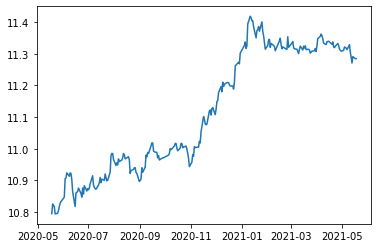
    


## 시계열 안정성 분석

이동평균 시계열


```python
def plot_rolling_statistics(timeseries, window=12):
    
    rolmean = timeseries.rolling(window=window).mean()

     # 원본시계열, 이동평균을 plot으로 시각화해 본다.
    orig = plt.plot(timeseries, color='blue',label='Original')    
    mean = plt.plot(rolmean, color='red', label='Rolling Mean')
    plt.legend(loc='best')
    plt.title('Rolling Mean & Standard Deviation')
    plt.show(block=False)
```


```python
plot_rolling_statistics(ts_log, window=12)
```


    

    


이동표준편차 시계열


```python
def plot_rolling_statistics(timeseries, window=12):
    
    rolstd = timeseries.rolling(window=window).std() 
    std = plt.plot(rolstd, color='black', label='Rolling Std')
    plt.legend(loc='best')
    plt.title('Rolling Mean & Standard Deviation')
    plt.show(block=False)
    
```


```python
plot_rolling_statistics(ts_log, window=12)
```


    
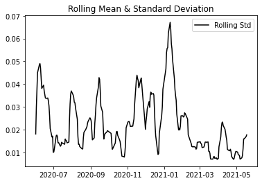
    


```python
from statsmodels.tsa.stattools import adfuller

def augmented_dickey_fuller_test(timeseries):
    dftest = adfuller(timeseries, autolag='AIC')  
    
    print('Results of Dickey-Fuller Test:')
    dfoutput = pd.Series(dftest[0:4], index=['Test Statistic','p-value','#Lags Used','Number of Observations Used'])
    for key,value in dftest[4].items():
        dfoutput['Critical Value (%s)' % key] = value
    print(dfoutput)
```


```python
#정량적 Augmented Dicky-Fuller Test
augmented_dickey_fuller_test(ts_log)

#시계열 분해 (Time Series Decomposition)
from statsmodels.tsa.seasonal import seasonal_decompose
decomposition = seasonal_decompose(ts_log, model='multiplicative', period = 30) 

trend = decomposition.trend
seasonal = decomposition.seasonal
residual = decomposition.resid

plt.subplot(411)
plt.plot(ts_log, label='Original')
plt.legend(loc='best')
plt.subplot(412)
plt.plot(trend, label='Trend')
plt.legend(loc='best')
plt.subplot(413)
plt.plot(seasonal,label='Seasonality')
plt.legend(loc='best')
plt.subplot(414)
plt.plot(residual, label='Residuals')
plt.legend(loc='best')
plt.tight_layout()
```

    Results of Dickey-Fuller Test:
    Test Statistic                  -1.383525
    p-value                          0.590149
    #Lags Used                       0.000000
    Number of Observations Used    249.000000
    Critical Value (1%)             -3.456888
    Critical Value (5%)             -2.873219
    Critical Value (10%)            -2.572994
    dtype: float64


    
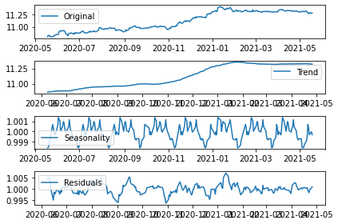
    


```python
residual.dropna(inplace=True)
augmented_dickey_fuller_test(residual)
```

    Results of Dickey-Fuller Test:
    Test Statistic                -6.187586e+00
    p-value                        6.234854e-08
    #Lags Used                     9.000000e+00
    Number of Observations Used    2.100000e+02
    Critical Value (1%)           -3.461879e+00
    Critical Value (5%)           -2.875404e+00
    Critical Value (10%)          -2.574159e+00
    dtype: float64


p값이 0.05보다 작으므로 유의한 수준이다.

## 학습, 테스트 데이터셋 생성


```python
train_data, test_data = ts_log[:int(len(ts_log)*0.9)], ts_log[int(len(ts_log)*0.9):]
plt.figure(figsize=(10,6))
plt.grid(True)
plt.plot(ts_log, c='r', label='training dataset')
plt.plot(test_data, c='b', label='test dataset')
plt.legend()
```


    <matplotlib.legend.Legend at 0x7fe5c0335700>


    
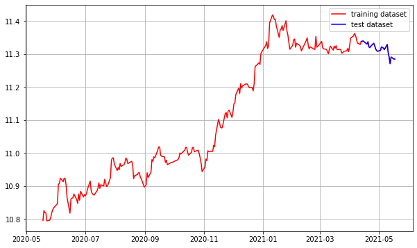
    


## 적정 ARIMA 모수 찾기


```python
from statsmodels.graphics.tsaplots import plot_acf, plot_pacf

plot_acf(ts_log)   # ACF : Autocorrelation 그래프 그리기
plot_pacf(ts_log)  # PACF : Partial Autocorrelation 그래프 그리기
plt.show()
```


    

    


    

    


p가 2 이상인 구간에서 PACF는 거의 0에 가까워지고 있기 때문에

p=1이 매우 적합하다.

차분 안정성을 확인하기 위해 d를 구한다.

1차로 부족하면 2차까지 실행한다.


```python
diff_1 = ts_log.diff(periods=1).iloc[1:]
diff_1.plot(title='Difference 1st')

augmented_dickey_fuller_test(diff_1)
```

    Results of Dickey-Fuller Test:
    Test Statistic                -1.553699e+01
    p-value                        2.183738e-28
    #Lags Used                     0.000000e+00
    Number of Observations Used    2.480000e+02
    Critical Value (1%)           -3.456996e+00
    Critical Value (5%)           -2.873266e+00
    Critical Value (10%)          -2.573019e+00
    dtype: float64


    
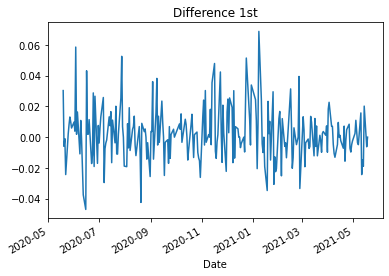
    


```python
diff_2 = diff_1.diff(periods=1).iloc[1:]
diff_2.plot(title='Difference 2nd')

augmented_dickey_fuller_test(diff_2)
```

    Results of Dickey-Fuller Test:
    Test Statistic                -1.029320e+01
    p-value                        3.525823e-18
    #Lags Used                     7.000000e+00
    Number of Observations Used    2.400000e+02
    Critical Value (1%)           -3.457894e+00
    Critical Value (5%)           -2.873659e+00
    Critical Value (10%)          -2.573229e+00
    dtype: float64


    
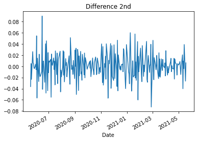
    


## ARIMA 모델 훈련과 테스트


```python
from statsmodels.tsa.arima.model import ARIMA
# Build Model
model = ARIMA(train_data, order=(2, 0, 1))  
fitted_m = model.fit() 

print(fitted_m.summary())
```

    /opt/conda/lib/python3.9/site-packages/statsmodels/tsa/base/tsa_model.py:593: ValueWarning: A date index has been provided, but it has no associated frequency information and so will be ignored when e.g. forecasting.
      warnings.warn('A date index has been provided, but it has no'
    /opt/conda/lib/python3.9/site-packages/statsmodels/tsa/base/tsa_model.py:593: ValueWarning: A date index has been provided, but it has no associated frequency information and so will be ignored when e.g. forecasting.
      warnings.warn('A date index has been provided, but it has no'
    /opt/conda/lib/python3.9/site-packages/statsmodels/tsa/base/tsa_model.py:593: ValueWarning: A date index has been provided, but it has no associated frequency information and so will be ignored when e.g. forecasting.
      warnings.warn('A date index has been provided, but it has no'


                                   SARIMAX Results                                
    ==============================================================================
    Dep. Variable:                  Close   No. Observations:                  225
    Model:                 ARIMA(2, 0, 1)   Log Likelihood                 583.361
    Date:                Fri, 24 Mar 2023   AIC                          -1156.722
    Time:                        06:04:14   BIC                          -1139.642
    Sample:                             0   HQIC                         -1149.828
                                    - 225                                         
    Covariance Type:                  opg                                         
    ==============================================================================
                     coef    std err          z      P>|z|      [0.025      0.975]
    ------------------------------------------------------------------------------
    const         11.0896      0.129     86.277      0.000      10.838      11.342
    ar.L1          0.7739      1.821      0.425      0.671      -2.796       4.344
    ar.L2          0.2191      1.811      0.121      0.904      -3.331       3.769
    ma.L1          0.2595      1.813      0.143      0.886      -3.294       3.813
    sigma2         0.0003   2.56e-05     12.526      0.000       0.000       0.000
    ===================================================================================
    Ljung-Box (L1) (Q):                   0.23   Jarque-Bera (JB):                20.44
    Prob(Q):                              0.63   Prob(JB):                         0.00
    Heteroskedasticity (H):               0.95   Skew:                             0.50
    Prob(H) (two-sided):                  0.81   Kurtosis:                         4.08
    ===================================================================================
    
    Warnings:
    [1] Covariance matrix calculated using the outer product of gradients (complex-step).


forecast 메소드를 이용해 테스트 데이터 구간의 데이터를 예측해 본다.


```python
fc = fitted_m.forecast(len(test_data), alpha=0.05)
fc = np.array(fc)
fc_series = pd.Series(fc, index=test_data.index)

plt.figure(figsize=(10,5), dpi=100)
plt.plot(train_data, label='training')
plt.plot(test_data, c='b', label='actual price')
plt.plot(fc_series, c='r',label='predicted price')
plt.legend()
plt.show()
```

    /opt/conda/lib/python3.9/site-packages/statsmodels/tsa/base/tsa_model.py:390: ValueWarning: No supported index is available. Prediction results will be given with an integer index beginning at `start`.
      warnings.warn('No supported index is available.'


    
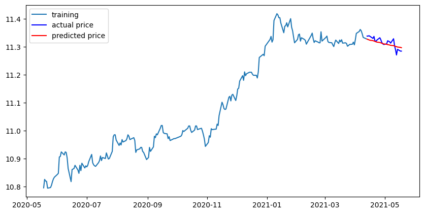
    


시계열 데이터를 로그 변환하여 사용했으므로

다시 지수 변환해야 정확한 오차를 계산할 수 있다.

np.exp()를 통해 전부 원본 스케일로 돌린 후 MSE, MAE, RMSE, MAPE를 계산


```python
from sklearn.metrics import mean_squared_error, mean_absolute_error
import math

mse = mean_squared_error(np.exp(test_data), np.exp(fc))
print('MSE: ', mse)

mae = mean_absolute_error(np.exp(test_data), np.exp(fc))
print('MAE: ', mae)

rmse = math.sqrt(mean_squared_error(np.exp(test_data), np.exp(fc)))
print('RMSE: ', rmse)

mape = np.mean(np.abs(np.exp(fc) - np.exp(test_data))/np.abs(np.exp(test_data)))
print('MAPE: {:.2f}%'.format(mape*100))

```

    MSE:  1048973.6014239907
    MAE:  843.7579531508708
    RMSE:  1024.19412292006
    MAPE: 1.03%


예측 모델의 메트릭으로 활용하기에 적당한 MAPE 기준으로 1% 정도의 오차율을 보여주고 있다.

## 다른 주식 종목 예측해 보기

위에서 한 분석을 바탕으로 다른 주신 종목을 예측해보려고 한다.

KOSPI, APPLE, TESLA를 예측해보자.

### KOSPI


```python
import warnings
warnings.filterwarnings('ignore')

dataset_filepath = os.getenv('HOME') + '/aiffel/stock_prediction/data/KS11.csv'
df = pd.read_csv(dataset_filepath, index_col='Date', parse_dates=True)
ts = df['Close']

ts.head()
```


    Date
    2022-03-24    2729.659912
    2022-03-25    2729.979980
    2022-03-28    2729.560059
    2022-03-29    2741.070068
    2022-03-30    2746.739990
    Name: Close, dtype: float64


```python
ts = ts.interpolate(method='time')
ts[ts.isna()] 
```


    Series([], Name: Close, dtype: float64)


```python
ts_log = np.log(ts)
```


```python
def plot_rolling_statistics(timeseries, window=12):
    
    rolmean = timeseries.rolling(window=window).mean()

     # 원본시계열, 이동평균을 plot으로 시각화해 본다.
    orig = plt.plot(timeseries, color='blue',label='Original')    
    mean = plt.plot(rolmean, color='red', label='Rolling Mean')
    plt.legend(loc='best')
    plt.title('Rolling Mean & Standard Deviation')
    plt.show(block=False)
```


```python
plot_rolling_statistics(ts_log, window=12)
```


    
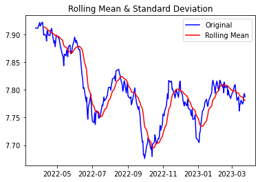
    


```python
def plot_rolling_statistics(timeseries, window=12):
    
    rolstd = timeseries.rolling(window=window).std() 
    std = plt.plot(rolstd, color='black', label='Rolling Std')
    plt.legend(loc='best')
    plt.title('Rolling Mean & Standard Deviation')
    plt.show(block=False)
    
```


```python
plot_rolling_statistics(ts_log, window=12)
```


    
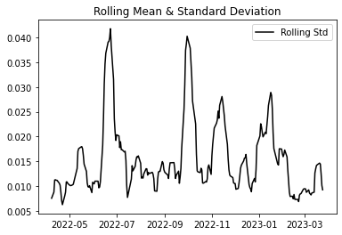
    


```python
from statsmodels.tsa.stattools import adfuller

def augmented_dickey_fuller_test(timeseries):
    dftest = adfuller(timeseries, autolag='AIC')  
    
    print('Results of Dickey-Fuller Test:')
    dfoutput = pd.Series(dftest[0:4], index=['Test Statistic','p-value','#Lags Used','Number of Observations Used'])
    for key,value in dftest[4].items():
        dfoutput['Critical Value (%s)' % key] = value
    print(dfoutput)
    
#정량적 Augmented Dicky-Fuller Test
augmented_dickey_fuller_test(ts_log)

#시계열 분해 (Time Series Decomposition)
from statsmodels.tsa.seasonal import seasonal_decompose
decomposition = seasonal_decompose(ts_log, model='multiplicative', period = 30) 

trend = decomposition.trend
seasonal = decomposition.seasonal
residual = decomposition.resid

plt.subplot(411)
plt.plot(ts_log, label='Original')
plt.legend(loc='best')
plt.subplot(412)
plt.plot(trend, label='Trend')
plt.legend(loc='best')
plt.subplot(413)
plt.plot(seasonal,label='Seasonality')
plt.legend(loc='best')
plt.subplot(414)
plt.plot(residual, label='Residuals')
plt.legend(loc='best')
plt.tight_layout()
```

    Results of Dickey-Fuller Test:
    Test Statistic                  -2.158068
    p-value                          0.221815
    #Lags Used                       0.000000
    Number of Observations Used    248.000000
    Critical Value (1%)             -3.456996
    Critical Value (5%)             -2.873266
    Critical Value (10%)            -2.573019
    dtype: float64


    
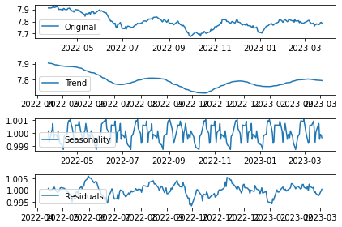
    


```python
residual.dropna(inplace=True)
augmented_dickey_fuller_test(residual)
```

    Results of Dickey-Fuller Test:
    Test Statistic                  -4.441050
    p-value                          0.000251
    #Lags Used                       0.000000
    Number of Observations Used    218.000000
    Critical Value (1%)             -3.460708
    Critical Value (5%)             -2.874891
    Critical Value (10%)            -2.573886
    dtype: float64


```python
train_data, test_data = ts_log[:int(len(ts_log)*0.9)], ts_log[int(len(ts_log)*0.9):]
plt.figure(figsize=(10,6))
plt.grid(True)
plt.plot(ts_log, c='r', label='training dataset')
plt.plot(test_data, c='b', label='test dataset')
plt.legend()
```


    <matplotlib.legend.Legend at 0x7fe5bbe007f0>


    
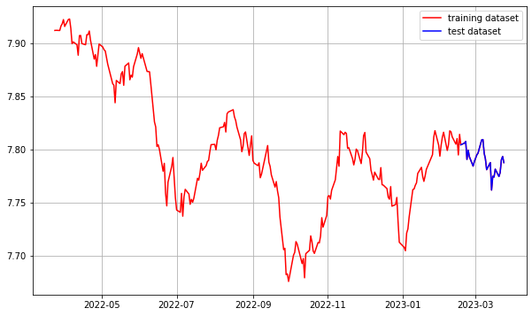
    


```python
from statsmodels.graphics.tsaplots import plot_acf, plot_pacf

plot_acf(ts_log)   # ACF : Autocorrelation 그래프 그리기
plot_pacf(ts_log)  # PACF : Partial Autocorrelation 그래프 그리기
plt.show()
```


    
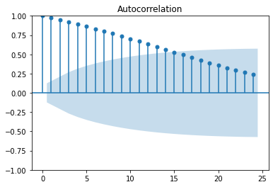
    


    
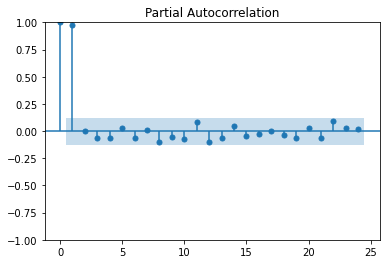
    


```python
diff_1 = ts_log.diff(periods=1).iloc[1:]
diff_1.plot(title='Difference 1st')

augmented_dickey_fuller_test(diff_1)

diff_2 = diff_1.diff(periods=1).iloc[1:]
diff_2.plot(title='Difference 2nd')

augmented_dickey_fuller_test(diff_2)
```

    Results of Dickey-Fuller Test:
    Test Statistic                -1.601670e+01
    p-value                        6.269203e-29
    #Lags Used                     0.000000e+00
    Number of Observations Used    2.470000e+02
    Critical Value (1%)           -3.457105e+00
    Critical Value (5%)           -2.873314e+00
    Critical Value (10%)          -2.573044e+00
    dtype: float64
    Results of Dickey-Fuller Test:
    Test Statistic                -8.334695e+00
    p-value                        3.296412e-13
    #Lags Used                     1.000000e+01
    Number of Observations Used    2.360000e+02
    Critical Value (1%)           -3.458366e+00
    Critical Value (5%)           -2.873866e+00
    Critical Value (10%)          -2.573339e+00
    dtype: float64


    
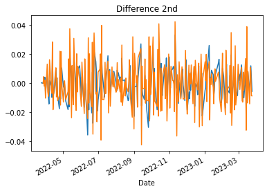
    


```python
from statsmodels.tsa.arima.model import ARIMA
# Build Model
model = ARIMA(train_data, order=(2, 0, 1))  
fitted_m = model.fit() 

print(fitted_m.summary())
```

    /opt/conda/lib/python3.9/site-packages/statsmodels/tsa/base/tsa_model.py:593: ValueWarning: A date index has been provided, but it has no associated frequency information and so will be ignored when e.g. forecasting.
      warnings.warn('A date index has been provided, but it has no'
    /opt/conda/lib/python3.9/site-packages/statsmodels/tsa/base/tsa_model.py:593: ValueWarning: A date index has been provided, but it has no associated frequency information and so will be ignored when e.g. forecasting.
      warnings.warn('A date index has been provided, but it has no'
    /opt/conda/lib/python3.9/site-packages/statsmodels/tsa/base/tsa_model.py:593: ValueWarning: A date index has been provided, but it has no associated frequency information and so will be ignored when e.g. forecasting.
      warnings.warn('A date index has been provided, but it has no'


                                   SARIMAX Results                                
    ==============================================================================
    Dep. Variable:                  Close   No. Observations:                  224
    Model:                 ARIMA(2, 0, 1)   Log Likelihood                 684.136
    Date:                Fri, 24 Mar 2023   AIC                          -1358.272
    Time:                        06:22:49   BIC                          -1341.214
    Sample:                             0   HQIC                         -1351.386
                                    - 224                                         
    Covariance Type:                  opg                                         
    ==============================================================================
                     coef    std err          z      P>|z|      [0.025      0.975]
    ------------------------------------------------------------------------------
    const          7.8239      0.035    224.221      0.000       7.756       7.892
    ar.L1          0.0601      0.077      0.785      0.433      -0.090       0.210
    ar.L2          0.9093      0.078     11.588      0.000       0.755       1.063
    ma.L1          0.9641      0.052     18.637      0.000       0.863       1.066
    sigma2         0.0001   1.17e-05     10.948      0.000       0.000       0.000
    ===================================================================================
    Ljung-Box (L1) (Q):                   0.12   Jarque-Bera (JB):                 1.35
    Prob(Q):                              0.73   Prob(JB):                         0.51
    Heteroskedasticity (H):               0.81   Skew:                            -0.17
    Prob(H) (two-sided):                  0.36   Kurtosis:                         3.16
    ===================================================================================
    
    Warnings:
    [1] Covariance matrix calculated using the outer product of gradients (complex-step).


    /opt/conda/lib/python3.9/site-packages/statsmodels/base/model.py:604: ConvergenceWarning: Maximum Likelihood optimization failed to converge. Check mle_retvals
      warnings.warn("Maximum Likelihood optimization failed to "


```python
fc = fitted_m.forecast(len(test_data), alpha=0.05)
fc = np.array(fc)
fc_series = pd.Series(fc, index=test_data.index)

plt.figure(figsize=(10,5), dpi=100)
plt.plot(train_data, label='training')
plt.plot(test_data, c='b', label='actual price')
plt.plot(fc_series, c='r',label='predicted price')
plt.legend()
plt.show()
```

    /opt/conda/lib/python3.9/site-packages/statsmodels/tsa/base/tsa_model.py:390: ValueWarning: No supported index is available. Prediction results will be given with an integer index beginning at `start`.
      warnings.warn('No supported index is available.'


    
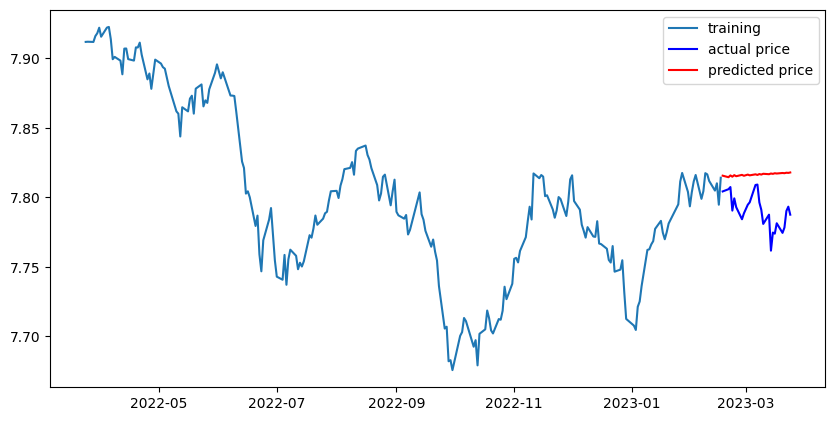
    


```python
from sklearn.metrics import mean_squared_error, mean_absolute_error
import math

mse = mean_squared_error(np.exp(test_data), np.exp(fc))
print('MSE: ', mse)

mae = mean_absolute_error(np.exp(test_data), np.exp(fc))
print('MAE: ', mae)

rmse = math.sqrt(mean_squared_error(np.exp(test_data), np.exp(fc)))
print('RMSE: ', rmse)

mape = np.mean(np.abs(np.exp(fc) - np.exp(test_data))/np.abs(np.exp(test_data)))
print('MAPE: {:.2f}%'.format(mape*100))

```

    MSE:  5049.399449064334
    MAE:  64.34870840601744
    RMSE:  71.0591264304898
    MAPE: 2.68%


### APPLE


```python
import warnings
warnings.filterwarnings('ignore')


dataset_filepath = os.getenv('HOME') + '/aiffel/stock_prediction/data/AAPL.csv'
df = pd.read_csv(dataset_filepath, index_col='Date', parse_dates=True)
ts = df['Close']

ts.head()
```


    Date
    2022-03-23    170.210007
    2022-03-24    174.070007
    2022-03-25    174.720001
    2022-03-28    175.600006
    2022-03-29    178.960007
    Name: Close, dtype: float64


```python
ts = ts.interpolate(method='time')
ts[ts.isna()] 
```


    Series([], Name: Close, dtype: float64)


```python
ts_log = np.log(ts)

def plot_rolling_statistics(timeseries, window=12):
    
    rolmean = timeseries.rolling(window=window).mean()

     # 원본시계열, 이동평균을 plot으로 시각화해 본다.
    orig = plt.plot(timeseries, color='blue',label='Original')    
    mean = plt.plot(rolmean, color='red', label='Rolling Mean')
    plt.legend(loc='best')
    plt.title('Rolling Mean & Standard Deviation')
    plt.show(block=False)
    
plot_rolling_statistics(ts_log, window=12)
```


    
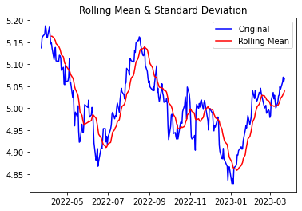
    


```python
def plot_rolling_statistics(timeseries, window=12):
    
    rolstd = timeseries.rolling(window=window).std() 
    std = plt.plot(rolstd, color='black', label='Rolling Std')
    plt.legend(loc='best')
    plt.title('Rolling Mean & Standard Deviation')
    plt.show(block=False)

plot_rolling_statistics(ts_log, window=12)
```


    
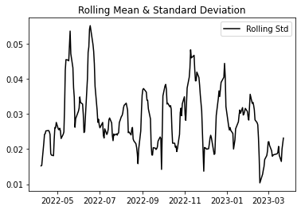
    


```python
from statsmodels.tsa.stattools import adfuller

def augmented_dickey_fuller_test(timeseries):
    dftest = adfuller(timeseries, autolag='AIC')  
    
    print('Results of Dickey-Fuller Test:')
    dfoutput = pd.Series(dftest[0:4], index=['Test Statistic','p-value','#Lags Used','Number of Observations Used'])
    for key,value in dftest[4].items():
        dfoutput['Critical Value (%s)' % key] = value
    print(dfoutput)
    
#정량적 Augmented Dicky-Fuller Test
augmented_dickey_fuller_test(ts_log)

#시계열 분해 (Time Series Decomposition)
from statsmodels.tsa.seasonal import seasonal_decompose
decomposition = seasonal_decompose(ts_log, model='multiplicative', period = 30) 

trend = decomposition.trend
seasonal = decomposition.seasonal
residual = decomposition.resid

plt.subplot(411)
plt.plot(ts_log, label='Original')
plt.legend(loc='best')
plt.subplot(412)
plt.plot(trend, label='Trend')
plt.legend(loc='best')
plt.subplot(413)
plt.plot(seasonal,label='Seasonality')
plt.legend(loc='best')
plt.subplot(414)
plt.plot(residual, label='Residuals')
plt.legend(loc='best')
plt.tight_layout()
```

    Results of Dickey-Fuller Test:
    Test Statistic                  -2.476381
    p-value                          0.121327
    #Lags Used                       0.000000
    Number of Observations Used    251.000000
    Critical Value (1%)             -3.456674
    Critical Value (5%)             -2.873125
    Critical Value (10%)            -2.572944
    dtype: float64


    
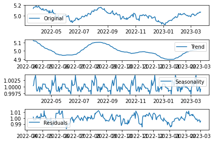
    


```python
residual.dropna(inplace=True)
augmented_dickey_fuller_test(residual)

train_data, test_data = ts_log[:int(len(ts_log)*0.9)], ts_log[int(len(ts_log)*0.9):]
plt.figure(figsize=(10,6))
plt.grid(True)
plt.plot(ts_log, c='r', label='training dataset')
plt.plot(test_data, c='b', label='test dataset')
plt.legend()
```

    Results of Dickey-Fuller Test:
    Test Statistic                  -5.363659
    p-value                          0.000004
    #Lags Used                       0.000000
    Number of Observations Used    221.000000
    Critical Value (1%)             -3.460291
    Critical Value (5%)             -2.874709
    Critical Value (10%)            -2.573789
    dtype: float64


    <matplotlib.legend.Legend at 0x7fe5bbf856d0>


    
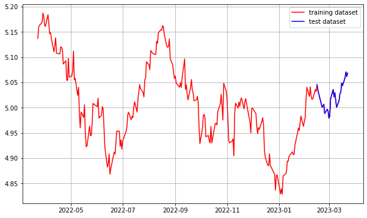
    


```python
from statsmodels.graphics.tsaplots import plot_acf, plot_pacf

plot_acf(ts_log)   # ACF : Autocorrelation 그래프 그리기
plot_pacf(ts_log)  # PACF : Partial Autocorrelation 그래프 그리기
plt.show()

diff_1 = ts_log.diff(periods=1).iloc[1:]
diff_1.plot(title='Difference 1st')

augmented_dickey_fuller_test(diff_1)

diff_2 = diff_1.diff(periods=1).iloc[1:]
diff_2.plot(title='Difference 2nd')

augmented_dickey_fuller_test(diff_2)
```


    

    


    
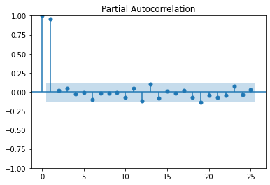
    


    Results of Dickey-Fuller Test:
    Test Statistic                -1.682139e+01
    p-value                        1.177506e-29
    #Lags Used                     0.000000e+00
    Number of Observations Used    2.500000e+02
    Critical Value (1%)           -3.456781e+00
    Critical Value (5%)           -2.873172e+00
    Critical Value (10%)          -2.572969e+00
    dtype: float64
    Results of Dickey-Fuller Test:
    Test Statistic                -7.769412e+00
    p-value                        9.004557e-12
    #Lags Used                     1.100000e+01
    Number of Observations Used    2.380000e+02
    Critical Value (1%)           -3.458128e+00
    Critical Value (5%)           -2.873762e+00
    Critical Value (10%)          -2.573283e+00
    dtype: float64


    
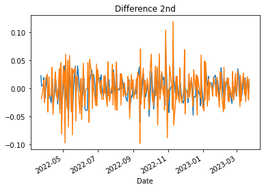
    


```python
from statsmodels.tsa.arima.model import ARIMA
# Build Model
model = ARIMA(train_data, order=(2, 0, 1))  
fitted_m = model.fit() 

print(fitted_m.summary())

fc = fitted_m.forecast(len(test_data), alpha=0.05)
fc = np.array(fc)
fc_series = pd.Series(fc, index=test_data.index)

plt.figure(figsize=(10,5), dpi=100)
plt.plot(train_data, label='training')
plt.plot(test_data, c='b', label='actual price')
plt.plot(fc_series, c='r',label='predicted price')
plt.legend()
plt.show()
```

                                   SARIMAX Results                                
    ==============================================================================
    Dep. Variable:                  Close   No. Observations:                  226
    Model:                 ARIMA(2, 0, 1)   Log Likelihood                 541.199
    Date:                Fri, 24 Mar 2023   AIC                          -1072.399
    Time:                        06:29:02   BIC                          -1055.296
    Sample:                             0   HQIC                         -1065.497
                                    - 226                                         
    Covariance Type:                  opg                                         
    ==============================================================================
                     coef    std err          z      P>|z|      [0.025      0.975]
    ------------------------------------------------------------------------------
    const          5.0199      0.033    151.668      0.000       4.955       5.085
    ar.L1          0.0532      0.038      1.393      0.164      -0.022       0.128
    ar.L2          0.8720      0.041     21.372      0.000       0.792       0.952
    ma.L1          0.9971      0.054     18.493      0.000       0.891       1.103
    sigma2         0.0005   4.54e-05     10.512      0.000       0.000       0.001
    ===================================================================================
    Ljung-Box (L1) (Q):                   1.68   Jarque-Bera (JB):                 6.97
    Prob(Q):                              0.20   Prob(JB):                         0.03
    Heteroskedasticity (H):               0.88   Skew:                            -0.12
    Prob(H) (two-sided):                  0.58   Kurtosis:                         3.82
    ===================================================================================
    
    Warnings:
    [1] Covariance matrix calculated using the outer product of gradients (complex-step).


    

    


```python
from sklearn.metrics import mean_squared_error, mean_absolute_error
import math

mse = mean_squared_error(np.exp(test_data), np.exp(fc))
print('MSE: ', mse)

mae = mean_absolute_error(np.exp(test_data), np.exp(fc))
print('MAE: ', mae)

rmse = math.sqrt(mean_squared_error(np.exp(test_data), np.exp(fc)))
print('RMSE: ', rmse)

mape = np.mean(np.abs(np.exp(fc) - np.exp(test_data))/np.abs(np.exp(test_data)))
print('MAPE: {:.2f}%'.format(mape*100))
```

    MSE:  16.78148709540543
    MAE:  3.418200576014855
    RMSE:  4.096521340772611
    MAPE: 2.25%


### TESLA


```python
dataset_filepath = os.getenv('HOME') + '/aiffel/stock_prediction/data/TSLA.csv'
df = pd.read_csv(dataset_filepath, index_col='Date', parse_dates=True)
ts = df['Close']

ts.head()

ts = ts.interpolate(method='time')
ts[ts.isna()] 

ts_log = np.log(ts)
```


```python
def plot_rolling_statistics(timeseries, window=12):
    
    rolmean = timeseries.rolling(window=window).mean()

     # 원본시계열, 이동평균을 plot으로 시각화해 본다.
    orig = plt.plot(timeseries, color='blue',label='Original')    
    mean = plt.plot(rolmean, color='red', label='Rolling Mean')
    plt.legend(loc='best')
    plt.title('Rolling Mean & Standard Deviation')
    plt.show(block=False)
    
plot_rolling_statistics(ts_log, window=12)
```


    
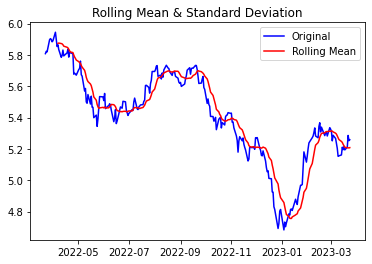
    


```python
def plot_rolling_statistics(timeseries, window=12):
    
    rolstd = timeseries.rolling(window=window).std() 
    std = plt.plot(rolstd, color='black', label='Rolling Std')
    plt.legend(loc='best')
    plt.title('Rolling Mean & Standard Deviation')
    plt.show(block=False)

plot_rolling_statistics(ts_log, window=12)
```


    
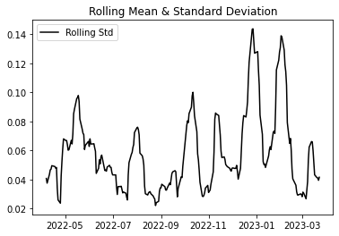
    


```python
from statsmodels.tsa.stattools import adfuller

def augmented_dickey_fuller_test(timeseries):
    dftest = adfuller(timeseries, autolag='AIC')  
    
    print('Results of Dickey-Fuller Test:')
    dfoutput = pd.Series(dftest[0:4], index=['Test Statistic','p-value','#Lags Used','Number of Observations Used'])
    for key,value in dftest[4].items():
        dfoutput['Critical Value (%s)' % key] = value
    print(dfoutput)
    
#정량적 Augmented Dicky-Fuller Test
augmented_dickey_fuller_test(ts_log)

#시계열 분해 (Time Series Decomposition)
from statsmodels.tsa.seasonal import seasonal_decompose
decomposition = seasonal_decompose(ts_log, model='multiplicative', period = 30) 

trend = decomposition.trend
seasonal = decomposition.seasonal
residual = decomposition.resid

plt.subplot(411)
plt.plot(ts_log, label='Original')
plt.legend(loc='best')
plt.subplot(412)
plt.plot(trend, label='Trend')
plt.legend(loc='best')
plt.subplot(413)
plt.plot(seasonal,label='Seasonality')
plt.legend(loc='best')
plt.subplot(414)
plt.plot(residual, label='Residuals')
plt.legend(loc='best')
plt.tight_layout()
```

    Results of Dickey-Fuller Test:
    Test Statistic                  -2.345130
    p-value                          0.157825
    #Lags Used                       9.000000
    Number of Observations Used    242.000000
    Critical Value (1%)             -3.457664
    Critical Value (5%)             -2.873559
    Critical Value (10%)            -2.573175
    dtype: float64


    
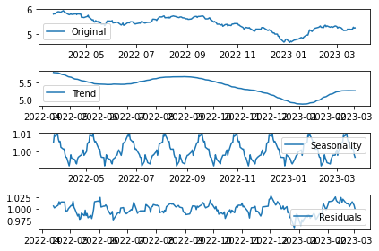
    


```python
residual.dropna(inplace=True)
augmented_dickey_fuller_test(residual)

train_data, test_data = ts_log[:int(len(ts_log)*0.9)], ts_log[int(len(ts_log)*0.9):]
plt.figure(figsize=(10,6))
plt.grid(True)
plt.plot(ts_log, c='r', label='training dataset')
plt.plot(test_data, c='b', label='test dataset')
plt.legend()
```

    Results of Dickey-Fuller Test:
    Test Statistic                  -4.263585
    p-value                          0.000513
    #Lags Used                       9.000000
    Number of Observations Used    212.000000
    Critical Value (1%)             -3.461578
    Critical Value (5%)             -2.875272
    Critical Value (10%)            -2.574089
    dtype: float64


    <matplotlib.legend.Legend at 0x7fe5bbe00790>


    
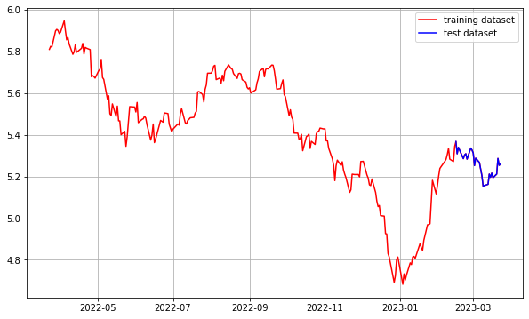
    


```python
from statsmodels.graphics.tsaplots import plot_acf, plot_pacf

plot_acf(ts_log)   # ACF : Autocorrelation 그래프 그리기
plot_pacf(ts_log)  # PACF : Partial Autocorrelation 그래프 그리기
plt.show()

diff_1 = ts_log.diff(periods=1).iloc[1:]
diff_1.plot(title='Difference 1st')

augmented_dickey_fuller_test(diff_1)

diff_2 = diff_1.diff(periods=1).iloc[1:]
diff_2.plot(title='Difference 2nd')

augmented_dickey_fuller_test(diff_2)
```


    
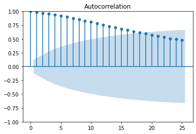
    


    
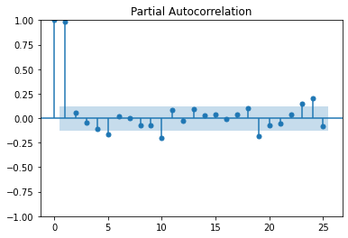
    


    Results of Dickey-Fuller Test:
    Test Statistic                  -3.614850
    p-value                          0.005483
    #Lags Used                       8.000000
    Number of Observations Used    242.000000
    Critical Value (1%)             -3.457664
    Critical Value (5%)             -2.873559
    Critical Value (10%)            -2.573175
    dtype: float64
    Results of Dickey-Fuller Test:
    Test Statistic                -1.103272e+01
    p-value                        5.615618e-20
    #Lags Used                     7.000000e+00
    Number of Observations Used    2.420000e+02
    Critical Value (1%)           -3.457664e+00
    Critical Value (5%)           -2.873559e+00
    Critical Value (10%)          -2.573175e+00
    dtype: float64


    
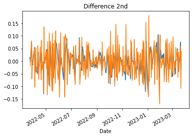
    


```python
from statsmodels.tsa.arima.model import ARIMA
# Build Model
model = ARIMA(train_data, order=(2, 0, 1))  
fitted_m = model.fit() 

print(fitted_m.summary())

fc = fitted_m.forecast(len(test_data), alpha=0.05)
fc = np.array(fc)
fc_series = pd.Series(fc, index=test_data.index)

plt.figure(figsize=(10,5), dpi=100)
plt.plot(train_data, label='training')
plt.plot(test_data, c='b', label='actual price')
plt.plot(fc_series, c='r',label='predicted price')
plt.legend()
plt.show()
```

                                   SARIMAX Results                                
    ==============================================================================
    Dep. Variable:                  Close   No. Observations:                  226
    Model:                 ARIMA(2, 0, 1)   Log Likelihood                 388.640
    Date:                Fri, 24 Mar 2023   AIC                           -767.279
    Time:                        06:31:08   BIC                           -750.176
    Sample:                             0   HQIC                          -760.377
                                    - 226                                         
    Covariance Type:                  opg                                         
    ==============================================================================
                     coef    std err          z      P>|z|      [0.025      0.975]
    ------------------------------------------------------------------------------
    const          5.4952      0.191     28.737      0.000       5.120       5.870
    ar.L1          0.0153      0.222      0.069      0.945      -0.420       0.451
    ar.L2          0.9623      0.227      4.243      0.000       0.518       1.407
    ma.L1          0.9668      0.243      3.981      0.000       0.491       1.443
    sigma2         0.0018      0.000     10.994      0.000       0.002       0.002
    ===================================================================================
    Ljung-Box (L1) (Q):                   0.80   Jarque-Bera (JB):                 6.56
    Prob(Q):                              0.37   Prob(JB):                         0.04
    Heteroskedasticity (H):               1.09   Skew:                            -0.38
    Prob(H) (two-sided):                  0.72   Kurtosis:                         3.36
    ===================================================================================
    
    Warnings:
    [1] Covariance matrix calculated using the outer product of gradients (complex-step).


    
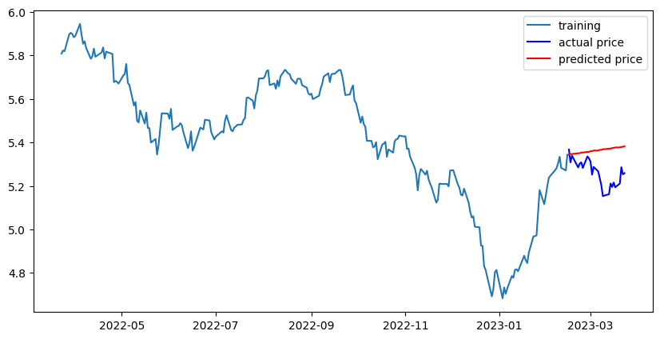
    


```python
from sklearn.metrics import mean_squared_error, mean_absolute_error
import math

mse = mean_squared_error(np.exp(test_data), np.exp(fc))
print('MSE: ', mse)

mae = mean_absolute_error(np.exp(test_data), np.exp(fc))
print('MAE: ', mae)

rmse = math.sqrt(mean_squared_error(np.exp(test_data), np.exp(fc)))
print('RMSE: ', rmse)

mape = np.mean(np.abs(np.exp(fc) - np.exp(test_data))/np.abs(np.exp(test_data)))
print('MAPE: {:.2f}%'.format(mape*100))
```

    MSE:  618.0827985488512
    MAE:  21.510467573817664
    RMSE:  24.861271056582186
    MAPE: 11.60%


## 결론

MAPE가

KOSPI: 2.68%
    
APPLE: 2.25%
    
TESLA: 11.60%

15%미만의 오차들이 나온 것을 알 수 있다.

그러나 외부적인 변수들이 많이 나오기 때문에 정확한 주식 예측값이 나오지 않은 것은 아쉬웠다.
