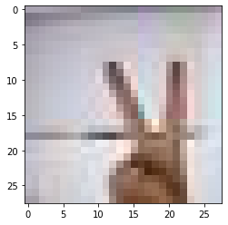
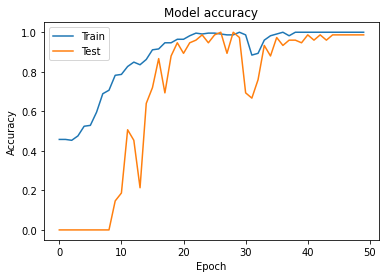
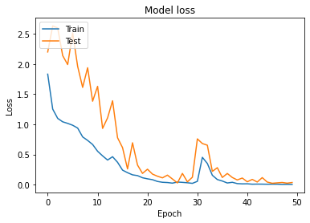
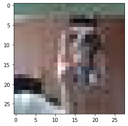

# 가위바위보 분류기

텐서플로우(TensorFlow)의 Sequential API를 이용하여 숫자 손글씨 인식기를 만들었다.

이것을 바탕으로 실제 내가 만든 가위바위보 이미지를 이용하여 가위바위보 분류기를 만들어본다.

가위, 바위, 보 실제 이미지 각 100장을 만들어보았다.

목차

[1. 데이터 불러오기](#데이터-불러오기)

[2. 딥러닝 네트워크 설계](#딥러닝-네트워크-설계)

[3. 딥러닝 네트워크 학습](#딥러닝-네트워크-학습)

[4. 테스트하기](#테스트하기)

## 데이터 불러오기


```python
import tensorflow as tf
import numpy as np
import matplotlib.pyplot as plt
from tensorflow import keras
from tensorflow.keras.layers import Dropout, Dense

from PIL import Image
import glob
import os
```

숫자 손글씨의 경우 이미지 크기가 28x28 이었기 때문에,

가위, 바위, 보 이미지도 28x28로 만들어야 한다.


```python
# 가위

def resize_images(img_path):
	images=glob.glob(img_path + "/*.jpg")  
    
	print(len(images), " images to be resized.")

    # 파일마다 모두 28x28 사이즈로 바꾸어 저장.
	target_size=(28,28)
	for img in images:
		old_img=Image.open(img)
		new_img=old_img.resize(target_size,Image.ANTIALIAS)
		new_img.save(img, "JPEG")
    
	print(len(images), " images resized.")
	
# 가위 이미지가 저장된 디렉토리 아래의 모든 jpg 파일을 읽어들여서
image_dir_path = os.getenv("HOME") + "/aiffel/rock_scissor_paper/scissor"
resize_images(image_dir_path)
```

    100  images to be resized.
    100  images resized.


```python
# 바위

def resize_images(img_path):
	images=glob.glob(img_path + "/*.jpg")  
    
	print(len(images), " images to be resized.")

    # 파일마다 모두 28x28 사이즈로 바꾸어 저장.
	target_size=(28,28)
	for img in images:
		old_img=Image.open(img)
		new_img=old_img.resize(target_size,Image.ANTIALIAS)
		new_img.save(img, "JPEG")
    
	print(len(images), " images resized.")
	
# 바위 이미지가 저장된 디렉토리 아래의 모든 jpg 파일을 읽어들여서
image_dir_path = os.getenv("HOME") + "/aiffel/rock_scissor_paper/rock"
resize_images(image_dir_path)
```

    100  images to be resized.
    100  images resized.


```python
# 보

def resize_images(img_path):
	images=glob.glob(img_path + "/*.jpg")  
    
	print(len(images), " images to be resized.")

    # 파일마다 모두 28x28 사이즈로 바꾸어 저장.
	target_size=(28,28)
	for img in images:
		old_img=Image.open(img)
		new_img=old_img.resize(target_size,Image.ANTIALIAS)
		new_img.save(img, "JPEG")
    
	print(len(images), " images resized.")
	
# 보 이미지가 저장된 디렉토리 아래의 모든 jpg 파일을 읽어들여서
image_dir_path = os.getenv("HOME") + "/aiffel/rock_scissor_paper/paper"
resize_images(image_dir_path)
```

    100  images to be resized.
    100  images resized.


```python
import numpy as np

def load_data(img_path, number_of_data=300):
    # 가위 : 0, 바위 : 1, 보 : 2
    img_size=28
    color=3
    #이미지 데이터와 라벨(가위 : 0, 바위 : 1, 보 : 2) 데이터를 담을 행렬(matrix) 영역을 생성
    imgs=np.zeros(number_of_data*img_size*img_size*color,dtype=np.int32).reshape(number_of_data,img_size,img_size,color)
    labels=np.zeros(number_of_data,dtype=np.int32)

    idx=0
    for file in glob.iglob(img_path+'/scissor/*.jpg'):
        img = np.array(Image.open(file),dtype=np.int32)
        imgs[idx,:,:,:]=img    # 데이터 영역에 이미지 행렬을 복사
        labels[idx]=0   # 가위 : 0
        idx=idx+1

    for file in glob.iglob(img_path+'/rock/*.jpg'):
        img = np.array(Image.open(file),dtype=np.int32)
        imgs[idx,:,:,:]=img    # 데이터 영역에 이미지 행렬을 복사
        labels[idx]=1   # 바위 : 1
        idx=idx+1  
    
    for file in glob.iglob(img_path+'/paper/*.jpg'):
        img = np.array(Image.open(file),dtype=np.int32)
        imgs[idx,:,:,:]=img    # 데이터 영역에 이미지 행렬을 복사
        labels[idx]=2   # 보 : 2
        idx=idx+1
        
    print("학습데이터(x_train)의 이미지 개수는", idx,"입니다.")
    return imgs, labels

image_dir_path = os.getenv("HOME") + "/aiffel/rock_scissor_paper"
(x_train, y_train)=load_data(image_dir_path)
x_train_norm = x_train/255.0   # 입력은 0~1 사이의 값으로 정규화

print("x_train shape: {}".format(x_train.shape))
print("y_train shape: {}".format(y_train.shape))
```

    학습데이터(x_train)의 이미지 개수는 300 입니다.
    x_train shape: (300, 28, 28, 3)
    y_train shape: (300,)


이미지를 불러와본다.


```python
plt.imshow(x_train[0])
print('라벨: ', y_train[0])
```

    라벨:  0


    

    


## 딥러닝 네트워크 설계


```python
model=keras.models.Sequential()
model.add(keras.layers.Conv2D(128, (3,3), activation='relu', input_shape=(28,28,3)))
model.add(keras.layers.MaxPool2D(2,2))
model.add(keras.layers.Conv2D(256, (3,3), activation='relu'))
model.add(keras.layers.MaxPooling2D((2,2)))
model.add(keras.layers.Flatten())
model.add(Dropout(0.5))
model.add(keras.layers.Dense(256, activation='relu'))
model.add(Dropout(0.5)) 
model.add(keras.layers.Dense(40, activation='softmax'))

print('Model에 추가된 Layer 개수: ', len(model.layers))
```

    Model에 추가된 Layer 개수:  9


```python
model.summary()
```

    Model: "sequential"
    _________________________________________________________________
    Layer (type)                 Output Shape              Param #   
    =================================================================
    conv2d (Conv2D)              (None, 26, 26, 128)       3584      
    _________________________________________________________________
    max_pooling2d (MaxPooling2D) (None, 13, 13, 128)       0         
    _________________________________________________________________
    conv2d_1 (Conv2D)            (None, 11, 11, 256)       295168    
    _________________________________________________________________
    max_pooling2d_1 (MaxPooling2 (None, 5, 5, 256)         0         
    _________________________________________________________________
    flatten (Flatten)            (None, 6400)              0         
    _________________________________________________________________
    dropout (Dropout)            (None, 6400)              0         
    _________________________________________________________________
    dense (Dense)                (None, 256)               1638656   
    _________________________________________________________________
    dropout_1 (Dropout)          (None, 256)               0         
    _________________________________________________________________
    dense_1 (Dense)              (None, 40)                10280     
    =================================================================
    Total params: 1,947,688
    Trainable params: 1,947,688
    Non-trainable params: 0
    _________________________________________________________________


## 딥러닝 네트워크 학습


```python
model.compile(optimizer='adam',
             loss='sparse_categorical_crossentropy',
             metrics=['accuracy'])

history = model.fit(x_train_norm, y_train, validation_split=0.25, epochs=50)
```

    Epoch 1/50
    8/8 [==============================] - 3s 47ms/step - loss: 1.8309 - accuracy: 0.4578 - val_loss: 2.1984 - val_accuracy: 0.0000e+00
    Epoch 2/50
    8/8 [==============================] - 0s 8ms/step - loss: 1.2519 - accuracy: 0.4578 - val_loss: 2.6315 - val_accuracy: 0.0000e+00
    Epoch 3/50
    8/8 [==============================] - 0s 8ms/step - loss: 1.0978 - accuracy: 0.4533 - val_loss: 2.5960 - val_accuracy: 0.0000e+00
    Epoch 4/50
    8/8 [==============================] - 0s 8ms/step - loss: 1.0413 - accuracy: 0.4756 - val_loss: 2.1388 - val_accuracy: 0.0000e+00
    Epoch 5/50
    8/8 [==============================] - 0s 8ms/step - loss: 1.0151 - accuracy: 0.5244 - val_loss: 1.9899 - val_accuracy: 0.0000e+00
    Epoch 6/50
    8/8 [==============================] - 0s 8ms/step - loss: 0.9842 - accuracy: 0.5289 - val_loss: 2.5150 - val_accuracy: 0.0000e+00
    Epoch 7/50
    8/8 [==============================] - 0s 8ms/step - loss: 0.9376 - accuracy: 0.5956 - val_loss: 1.9602 - val_accuracy: 0.0000e+00
    Epoch 8/50
    8/8 [==============================] - 0s 8ms/step - loss: 0.7911 - accuracy: 0.6889 - val_loss: 1.6118 - val_accuracy: 0.0000e+00
    Epoch 9/50
    8/8 [==============================] - 0s 8ms/step - loss: 0.7328 - accuracy: 0.7067 - val_loss: 1.9375 - val_accuracy: 0.0000e+00
    Epoch 10/50
    8/8 [==============================] - 0s 7ms/step - loss: 0.6654 - accuracy: 0.7822 - val_loss: 1.3825 - val_accuracy: 0.1467
    Epoch 11/50
    8/8 [==============================] - 0s 7ms/step - loss: 0.5529 - accuracy: 0.7867 - val_loss: 1.6292 - val_accuracy: 0.1867
    Epoch 12/50
    8/8 [==============================] - 0s 8ms/step - loss: 0.4765 - accuracy: 0.8267 - val_loss: 0.9319 - val_accuracy: 0.5067
    Epoch 13/50
    8/8 [==============================] - 0s 7ms/step - loss: 0.4074 - accuracy: 0.8489 - val_loss: 1.1065 - val_accuracy: 0.4533
    Epoch 14/50
    8/8 [==============================] - 0s 7ms/step - loss: 0.4627 - accuracy: 0.8356 - val_loss: 1.3899 - val_accuracy: 0.2133
    Epoch 15/50
    8/8 [==============================] - 0s 7ms/step - loss: 0.3703 - accuracy: 0.8622 - val_loss: 0.7769 - val_accuracy: 0.6400
    Epoch 16/50
    8/8 [==============================] - 0s 7ms/step - loss: 0.2402 - accuracy: 0.9111 - val_loss: 0.6128 - val_accuracy: 0.7200
    Epoch 17/50
    8/8 [==============================] - 0s 7ms/step - loss: 0.1977 - accuracy: 0.9156 - val_loss: 0.2599 - val_accuracy: 0.8667
    Epoch 18/50
    8/8 [==============================] - 0s 7ms/step - loss: 0.1623 - accuracy: 0.9467 - val_loss: 0.6936 - val_accuracy: 0.6933
    Epoch 19/50
    8/8 [==============================] - 0s 7ms/step - loss: 0.1492 - accuracy: 0.9467 - val_loss: 0.3247 - val_accuracy: 0.8800
    Epoch 20/50
    8/8 [==============================] - 0s 7ms/step - loss: 0.1139 - accuracy: 0.9644 - val_loss: 0.1860 - val_accuracy: 0.9467
    Epoch 21/50
    8/8 [==============================] - 0s 7ms/step - loss: 0.0961 - accuracy: 0.9644 - val_loss: 0.2555 - val_accuracy: 0.8933
    Epoch 22/50
    8/8 [==============================] - 0s 7ms/step - loss: 0.0818 - accuracy: 0.9822 - val_loss: 0.1745 - val_accuracy: 0.9467
    Epoch 23/50
    8/8 [==============================] - 0s 7ms/step - loss: 0.0525 - accuracy: 0.9956 - val_loss: 0.1390 - val_accuracy: 0.9600
    Epoch 24/50
    8/8 [==============================] - 0s 7ms/step - loss: 0.0388 - accuracy: 0.9911 - val_loss: 0.1124 - val_accuracy: 0.9867
    Epoch 25/50
    8/8 [==============================] - 0s 7ms/step - loss: 0.0345 - accuracy: 0.9956 - val_loss: 0.1572 - val_accuracy: 0.9467
    Epoch 26/50
    8/8 [==============================] - 0s 7ms/step - loss: 0.0245 - accuracy: 0.9956 - val_loss: 0.0932 - val_accuracy: 0.9867
    Epoch 27/50
    8/8 [==============================] - 0s 7ms/step - loss: 0.0431 - accuracy: 0.9911 - val_loss: 0.0280 - val_accuracy: 1.0000
    Epoch 28/50
    8/8 [==============================] - 0s 7ms/step - loss: 0.0375 - accuracy: 0.9867 - val_loss: 0.1859 - val_accuracy: 0.8933
    Epoch 29/50
    8/8 [==============================] - 0s 7ms/step - loss: 0.0309 - accuracy: 0.9867 - val_loss: 0.0464 - val_accuracy: 1.0000
    Epoch 30/50
    8/8 [==============================] - 0s 7ms/step - loss: 0.0212 - accuracy: 1.0000 - val_loss: 0.1226 - val_accuracy: 0.9733
    Epoch 31/50
    8/8 [==============================] - 0s 7ms/step - loss: 0.0543 - accuracy: 0.9867 - val_loss: 0.7581 - val_accuracy: 0.6933
    Epoch 32/50
    8/8 [==============================] - 0s 7ms/step - loss: 0.4526 - accuracy: 0.8844 - val_loss: 0.6811 - val_accuracy: 0.6667
    Epoch 33/50
    8/8 [==============================] - 0s 7ms/step - loss: 0.3506 - accuracy: 0.8933 - val_loss: 0.6535 - val_accuracy: 0.7600
    Epoch 34/50
    8/8 [==============================] - 0s 7ms/step - loss: 0.1552 - accuracy: 0.9600 - val_loss: 0.2194 - val_accuracy: 0.9333
    Epoch 35/50
    8/8 [==============================] - 0s 7ms/step - loss: 0.0845 - accuracy: 0.9822 - val_loss: 0.2807 - val_accuracy: 0.8800
    Epoch 36/50
    8/8 [==============================] - 0s 7ms/step - loss: 0.0595 - accuracy: 0.9911 - val_loss: 0.1187 - val_accuracy: 0.9733
    Epoch 37/50
    8/8 [==============================] - 0s 7ms/step - loss: 0.0270 - accuracy: 1.0000 - val_loss: 0.1846 - val_accuracy: 0.9333
    Epoch 38/50
    8/8 [==============================] - 0s 7ms/step - loss: 0.0386 - accuracy: 0.9822 - val_loss: 0.1185 - val_accuracy: 0.9600
    Epoch 39/50
    8/8 [==============================] - 0s 7ms/step - loss: 0.0172 - accuracy: 1.0000 - val_loss: 0.0773 - val_accuracy: 0.9600
    Epoch 40/50
    8/8 [==============================] - 0s 7ms/step - loss: 0.0125 - accuracy: 1.0000 - val_loss: 0.1092 - val_accuracy: 0.9467
    Epoch 41/50
    8/8 [==============================] - 0s 7ms/step - loss: 0.0137 - accuracy: 1.0000 - val_loss: 0.0468 - val_accuracy: 0.9867
    Epoch 42/50
    8/8 [==============================] - 0s 7ms/step - loss: 0.0072 - accuracy: 1.0000 - val_loss: 0.0865 - val_accuracy: 0.9600
    Epoch 43/50
    8/8 [==============================] - 0s 7ms/step - loss: 0.0088 - accuracy: 1.0000 - val_loss: 0.0431 - val_accuracy: 0.9867
    Epoch 44/50
    8/8 [==============================] - 0s 7ms/step - loss: 0.0080 - accuracy: 1.0000 - val_loss: 0.1162 - val_accuracy: 0.9600
    Epoch 45/50
    8/8 [==============================] - 0s 7ms/step - loss: 0.0064 - accuracy: 1.0000 - val_loss: 0.0426 - val_accuracy: 0.9867
    Epoch 46/50
    8/8 [==============================] - 0s 7ms/step - loss: 0.0073 - accuracy: 1.0000 - val_loss: 0.0226 - val_accuracy: 0.9867
    Epoch 47/50
    8/8 [==============================] - 0s 7ms/step - loss: 0.0070 - accuracy: 1.0000 - val_loss: 0.0292 - val_accuracy: 0.9867
    Epoch 48/50
    8/8 [==============================] - 0s 7ms/step - loss: 0.0035 - accuracy: 1.0000 - val_loss: 0.0355 - val_accuracy: 0.9867
    Epoch 49/50
    8/8 [==============================] - 0s 7ms/step - loss: 0.0046 - accuracy: 1.0000 - val_loss: 0.0242 - val_accuracy: 0.9867
    Epoch 50/50
    8/8 [==============================] - 0s 8ms/step - loss: 0.0032 - accuracy: 1.0000 - val_loss: 0.0350 - val_accuracy: 0.9867


```python
plt.plot(history.history['accuracy'])
plt.plot(history.history['val_accuracy'])
plt.title('Model accuracy')
plt.xlabel('Epoch')
plt.ylabel('Accuracy')
plt.legend(['Train', 'Test'], loc='upper left')
plt.show()
```


    

    


```python
plt.plot(history.history['loss'])
plt.plot(history.history['val_loss'])
plt.title('Model loss')
plt.xlabel('Epoch')
plt.ylabel('Loss')
plt.legend(['Train', 'Test'], loc='upper left')
plt.show()
```


    

    


## 테스트하기

다른 리서치님의 이미지 300장을 받아와서 테스트 데이터로 이용하였다.


```python
# 가위

def resize_images(img_path):
	images=glob.glob(img_path + "/*.jpg")  
    
	print(len(images), " images to be resized.")

    # 파일마다 모두 28x28 사이즈로 바꾸어 저장.
	target_size=(28,28)
	for img in images:
		old_img=Image.open(img)
		new_img=old_img.resize(target_size,Image.ANTIALIAS)
		new_img.save(img, "JPEG")
    
	print(len(images), " images resized.")
	
# 가위 이미지가 저장된 디렉토리 아래의 모든 jpg 파일을 읽어들여서
image_dir_path = os.getenv("HOME") + "/aiffel/rock_scissor_paper/test/scissor"
resize_images(image_dir_path)

# 바위

def resize_images(img_path):
	images=glob.glob(img_path + "/*.jpg")  
    
	print(len(images), " images to be resized.")

    # 파일마다 모두 28x28 사이즈로 바꾸어 저장.
	target_size=(28,28)
	for img in images:
		old_img=Image.open(img)
		new_img=old_img.resize(target_size,Image.ANTIALIAS)
		new_img.save(img, "JPEG")
    
	print(len(images), " images resized.")
	
# 바위 이미지가 저장된 디렉토리 아래의 모든 jpg 파일을 읽어들여서
image_dir_path = os.getenv("HOME") + "/aiffel/rock_scissor_paper/test/rock"
resize_images(image_dir_path)

# 보

def resize_images(img_path):
	images=glob.glob(img_path + "/*.jpg")  
    
	print(len(images), " images to be resized.")

    # 파일마다 모두 28x28 사이즈로 바꾸어 저장.
	target_size=(28,28)
	for img in images:
		old_img=Image.open(img)
		new_img=old_img.resize(target_size,Image.ANTIALIAS)
		new_img.save(img, "JPEG")
    
	print(len(images), " images resized.")
	
# 보 이미지가 저장된 디렉토리 아래의 모든 jpg 파일을 읽어들여서
image_dir_path = os.getenv("HOME") + "/aiffel/rock_scissor_paper/test/paper"
resize_images(image_dir_path)
```

    100  images to be resized.
    100  images resized.
    100  images to be resized.
    100  images resized.
    100  images to be resized.
    100  images resized.


```python
import numpy as np

def load_data(img_path, number_of_data=300):
    # 가위 : 0, 바위 : 1, 보 : 2
    img_size=28
    color=3
    #이미지 데이터와 라벨(가위 : 0, 바위 : 1, 보 : 2) 데이터를 담을 행렬(matrix) 영역을 생성
    imgs=np.zeros(number_of_data*img_size*img_size*color,dtype=np.int32).reshape(number_of_data,img_size,img_size,color)
    labels=np.zeros(number_of_data,dtype=np.int32)

    idx=0
    for file in glob.iglob(img_path+'/scissor/*.jpg'):
        img = np.array(Image.open(file),dtype=np.int32)
        imgs[idx,:,:,:]=img    # 데이터 영역에 이미지 행렬을 복사
        labels[idx]=0   # 가위 : 0
        idx=idx+1

    for file in glob.iglob(img_path+'/rock/*.jpg'):
        img = np.array(Image.open(file),dtype=np.int32)
        imgs[idx,:,:,:]=img    # 데이터 영역에 이미지 행렬을 복사
        labels[idx]=1   # 바위 : 1
        idx=idx+1  
    
    for file in glob.iglob(img_path+'/paper/*.jpg'):
        img = np.array(Image.open(file),dtype=np.int32)
        imgs[idx,:,:,:]=img    # 데이터 영역에 이미지 행렬을 복사
        labels[idx]=2   # 보 : 2
        idx=idx+1
        
    print("테스트데이터(x_test)의 이미지 개수는", idx,"입니다.")
    return imgs, labels

image_dir_path = os.getenv("HOME") + "/aiffel/rock_scissor_paper/test"
(x_test, y_test)=load_data(image_dir_path)
x_test_norm = x_test/255.0   # 입력은 0~1 사이의 값으로 정규화

print("x_test shape: {}".format(x_train.shape))
print("y_test shape: {}".format(y_train.shape))
```

    테스트데이터(x_test)의 이미지 개수는 300 입니다.
    x_test shape: (300, 28, 28, 3)
    y_test shape: (300,)


```python
test_loss, test_accuracy = model.evaluate(x_test_norm,y_test, verbose=2)
print(f"test_loss: {test_loss}")
print(f"test_accuracy: {test_accuracy}")
```

    10/10 - 0s - loss: 1.1023 - accuracy: 0.6467
    test_loss: 1.1023327112197876
    test_accuracy: 0.6466666460037231


정확도가 0.65가 나온 것을 볼 수 있다.


```python
predicted_result = model.predict(x_test_norm)  # model이 추론한 확률값. 
predicted_labels = np.argmax(predicted_result, axis=1)

idx=0  #1번째 x_test를 살펴보자. 
print('model.predict() 결과 : ', predicted_result[idx])
print('model이 추론한 가장 가능성이 높은 결과 : ', predicted_labels[idx])
print('실제 데이터의 라벨 : ', y_test[idx])
```

    model.predict() 결과 :  [8.19778800e-01 3.82177718e-03 1.76396176e-01 2.73875518e-08
     2.70889799e-08 3.36880319e-08 6.93003432e-09 9.72082503e-09
     8.34659986e-09 4.07280368e-07 1.64563062e-07 3.06029291e-09
     9.71711316e-08 2.77594125e-07 2.04205506e-08 1.21398065e-08
     1.57938125e-08 1.54075195e-07 1.89648688e-08 4.95696533e-08
     2.88929431e-08 1.73410072e-07 2.62222215e-07 2.42400773e-07
     7.87197223e-08 3.08857686e-08 1.38968389e-07 9.33890831e-09
     5.45855201e-08 1.04050358e-07 2.59329909e-07 7.71796280e-08
     3.18379954e-08 6.84759938e-09 6.39985629e-08 3.68396407e-08
     2.79996613e-07 3.91109403e-08 5.01005211e-08 1.09381766e-08]
    model이 추론한 가장 가능성이 높은 결과 :  0
    실제 데이터의 라벨 :  0


실제로 가위인가?


```python
plt.imshow(x_test[idx],cmap=plt.cm.binary)
plt.show()
```


    

    


```python

```
