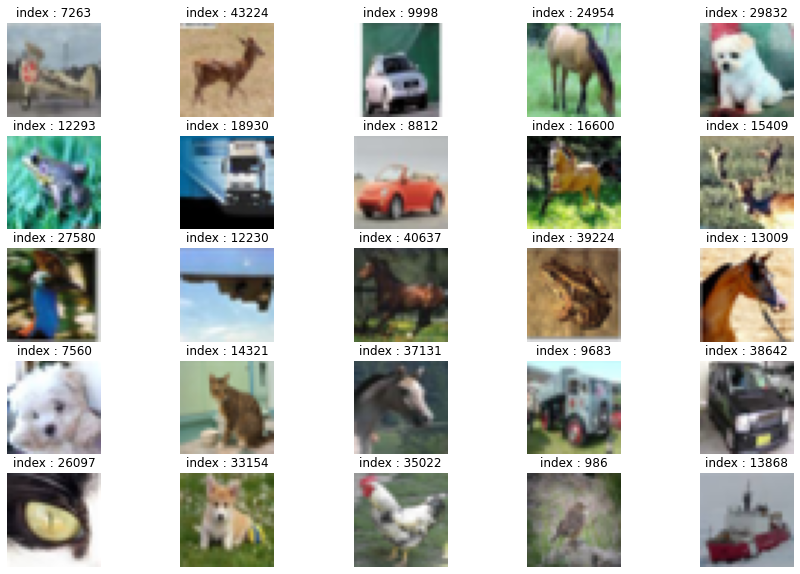
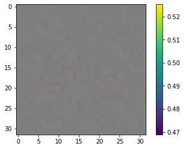
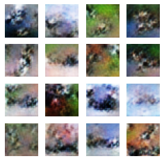
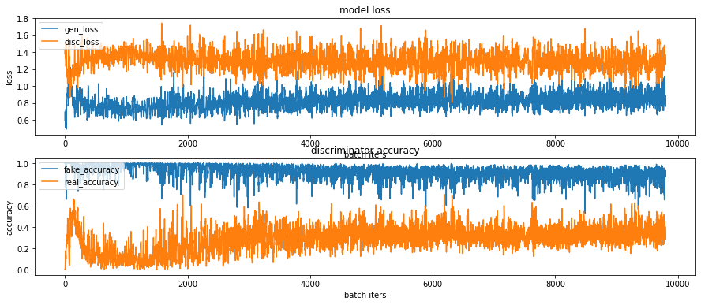
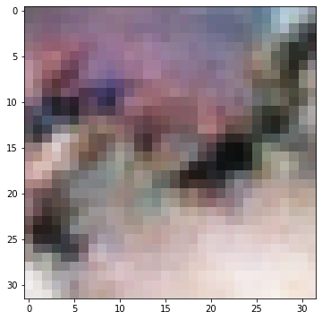
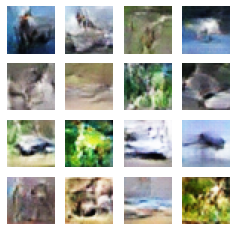
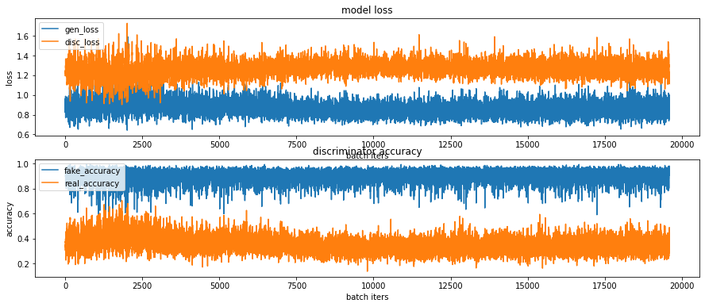
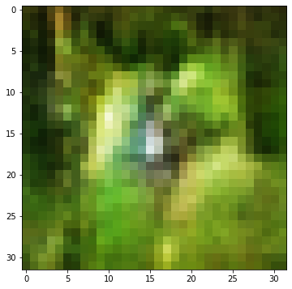

#  CIFAR-10 이미지 생성


```python
import os
import glob
import time

import PIL
import imageio
import numpy as np
import tensorflow as tf
from tensorflow.keras import layers
from IPython import display
from matplotlib.pylab import rcParams
import matplotlib.pyplot as plt
%matplotlib inline
```

## 데이터셋 구성


```python
cifar10 = tf.keras.datasets.cifar10

(train_x, _), (test_x, _) = cifar10.load_data()

train_x.shape
```


    (50000, 32, 32, 3)


```python
train_x = train_x.astype('float32')
train_x = (train_x - 127.5) / 127.5

print(train_x.max())
print(train_x.min())
```

    1.0
    -1.0


```python
plt.figure(figsize = (15, 10))

for i in range(25):
    plt.subplot(5, 5, i+1)
    random_index = np.random.randint(1, 50000)
    plt.imshow((train_x[random_index] + 1)/2.0)
    plt.title("index : {}".format(random_index))
    plt.axis('off')

plt.show()
```


    

    


```python
BUFFER_SIZE = 60000
BATCH_SIZE = 256
```


```python

train_dataset = tf.data.Dataset.from_tensor_slices(train_x).shuffle(BUFFER_SIZE).batch(BATCH_SIZE)
```

## 모델 구현


```python
def make_generator_model():
    # Start
    model = tf.keras.Sequential()
    
    # First : Dense layer
    model.add(layers.Dense(8*8*256, use_bias = False, input_shape=(100,)))
    model.add(layers.BatchNormalization())
    model.add(layers.LeakyReLU())
    
    # Second : Reshape Layer
    model.add(layers.Reshape((8, 8, 256)))
    
    # Third : Conv2DTranspose Layer
    model.add(layers.Conv2DTranspose(128, kernel_size = (5, 5), strides=(1, 1), padding='same', use_bias = False))
    model.add(layers.BatchNormalization())
    model.add(layers.LeakyReLU())
    
    # Fourth : Conv2DTranspose Layer
    model.add(layers.Conv2DTranspose(64, kernel_size=(5, 5), strides=(2, 2), padding='same', use_bias = False))
    model.add(layers.BatchNormalization())
    model.add(layers.LeakyReLU())
    
    # Fifth : Conv2DTranspose layer
    model.add(layers.Conv2DTranspose(3, kernel_size=(5, 5), strides=(2, 2), padding='same', use_bias=False, activation='tanh'))
    
    return model
```


```python
generator = make_generator_model()
generator.summary()
```

    Model: "sequential"
    _________________________________________________________________
    Layer (type)                 Output Shape              Param #   
    =================================================================
    dense (Dense)                (None, 16384)             1638400   
    _________________________________________________________________
    batch_normalization (BatchNo (None, 16384)             65536     
    _________________________________________________________________
    leaky_re_lu (LeakyReLU)      (None, 16384)             0         
    _________________________________________________________________
    reshape (Reshape)            (None, 8, 8, 256)         0         
    _________________________________________________________________
    conv2d_transpose (Conv2DTran (None, 8, 8, 128)         819200    
    _________________________________________________________________
    batch_normalization_1 (Batch (None, 8, 8, 128)         512       
    _________________________________________________________________
    leaky_re_lu_1 (LeakyReLU)    (None, 8, 8, 128)         0         
    _________________________________________________________________
    conv2d_transpose_1 (Conv2DTr (None, 16, 16, 64)        204800    
    _________________________________________________________________
    batch_normalization_2 (Batch (None, 16, 16, 64)        256       
    _________________________________________________________________
    leaky_re_lu_2 (LeakyReLU)    (None, 16, 16, 64)        0         
    _________________________________________________________________
    conv2d_transpose_2 (Conv2DTr (None, 32, 32, 3)         4800      
    =================================================================
    Total params: 2,733,504
    Trainable params: 2,700,352
    Non-trainable params: 33,152
    _________________________________________________________________


```python

noise = tf.random.normal([1, 100])
```


```python

generated_image = generator(noise, training=False)
generated_image.shape
```


    TensorShape([1, 32, 32, 3])


```python
plt.imshow((generated_image[0] + 1)/2.0)
plt.colorbar()
plt.show()
```


    

    


```python
def make_discriminator_model():
    
    # Start
    model = tf.keras.Sequential()
    
    # First : Conv2D layer
    model.add(layers.Conv2D(64, (5, 5), strides=(2, 2), padding='same', input_shape=[32, 32, 3]))
    model.add(layers.LeakyReLU())
    model.add(layers.Dropout(0.3))
    
    # Second Conv2D Layer
    model.add(layers.Conv2D(128, (5, 5), strides=(2, 2), padding='same'))
    model.add(layers.LeakyReLU())
    model.add(layers.Dropout(0.3))
    
    # Third : flatten layer
    model.add(layers.Flatten())
    
    # Fourth : Dense Layer
    model.add(layers.Dense(1))
    
    return model
```


```python
discriminator = make_discriminator_model()

discriminator.summary()
```

    Model: "sequential_1"
    _________________________________________________________________
    Layer (type)                 Output Shape              Param #   
    =================================================================
    conv2d (Conv2D)              (None, 16, 16, 64)        4864      
    _________________________________________________________________
    leaky_re_lu_3 (LeakyReLU)    (None, 16, 16, 64)        0         
    _________________________________________________________________
    dropout (Dropout)            (None, 16, 16, 64)        0         
    _________________________________________________________________
    conv2d_1 (Conv2D)            (None, 8, 8, 128)         204928    
    _________________________________________________________________
    leaky_re_lu_4 (LeakyReLU)    (None, 8, 8, 128)         0         
    _________________________________________________________________
    dropout_1 (Dropout)          (None, 8, 8, 128)         0         
    _________________________________________________________________
    flatten (Flatten)            (None, 8192)              0         
    _________________________________________________________________
    dense_1 (Dense)              (None, 1)                 8193      
    =================================================================
    Total params: 217,985
    Trainable params: 217,985
    Non-trainable params: 0
    _________________________________________________________________


```python
decision = discriminator(generated_image, training=False)
decision
```


    <tf.Tensor: shape=(1, 1), dtype=float32, numpy=array([[-0.00209985]], dtype=float32)>


## 손실함수 구현


```python
cross_entropy = tf.keras.losses.BinaryCrossentropy(from_logits=True)
```


```python
def generator_loss(fake_output):
    return cross_entropy(tf.ones_like(fake_output), fake_output)
```


```python
def discriminator_loss(real_output, fake_output):
    real_loss = cross_entropy(tf.ones_like(real_output), real_output)
    fake_loss = cross_entropy(tf.zeros_like(fake_output), fake_output)
    total_loss = real_loss + fake_loss
    return total_loss
```


```python
def discriminator_accuracy(real_output, fake_output):
    real_accuracy = tf.reduce_mean(tf.cast(tf.math.greater_equal(real_output, tf.constant([0.5])), tf.float32))
    fake_accuracy = tf.reduce_mean(tf.cast(tf.math.less(fake_output, tf.constant([0.5])), tf.float32))
    return real_accuracy, fake_accuracy
```


```python
generator_optimizer = tf.keras.optimizers.Adam(2e-4,0.5)
discriminator_optimizer = tf.keras.optimizers.Adam(2e-4,0.5)
```

## 훈련


```python

noise_dim = 100
num_examples_to_generate = 16

seed = tf.random.normal([num_examples_to_generate, noise_dim])
seed.shape
```


    TensorShape([16, 100])


```python
@tf.function
def train_step(images):  #(1) 입력데이터
    noise = tf.random.normal([BATCH_SIZE, noise_dim])  #(2) 생성자 입력 노이즈

    with tf.GradientTape() as gen_tape, tf.GradientTape() as disc_tape:  #(3) tf.GradientTape() 오픈
        generated_images = generator(noise, training=True)  #(4) generated_images 생성

        #(5) discriminator 판별
        real_output = discriminator(images, training=True)
        fake_output = discriminator(generated_images, training=True)

        #(6) loss 계산
        gen_loss = generator_loss(fake_output)
        disc_loss = discriminator_loss(real_output, fake_output)

        #(7) accuracy 계산
        real_accuracy, fake_accuracy = discriminator_accuracy(real_output, fake_output) 
    
    #(8) gradient 계산
    gradients_of_generator = gen_tape.gradient(gen_loss, generator.trainable_variables)
    gradients_of_discriminator = disc_tape.gradient(disc_loss, discriminator.trainable_variables)

    #(9) 모델 학습
    generator_optimizer.apply_gradients(zip(gradients_of_generator, generator.trainable_variables))
    discriminator_optimizer.apply_gradients(zip(gradients_of_discriminator, discriminator.trainable_variables))

    return gen_loss, disc_loss, real_accuracy, fake_accuracy
```


```python
def generate_and_save_images(model, epoch, it, sample_seeds):

    predictions = model(sample_seeds, training=False)

    fig = plt.figure(figsize=(4, 4))
    for i in range(predictions.shape[0]):
        plt.subplot(4, 4, i+1)
        plt.imshow((predictions[i]+1)/2.0)
        plt.axis('off')

    plt.savefig('{}/aiffel/dcgan_newimage/cifar10/generated_samples/sample_epoch_{:04d}_iter_{:03d}.png'
                    .format(os.getenv('HOME'), epoch, it))

    plt.show()
```


```python
rcParams['figure.figsize'] = 15, 6    # matlab 차트의 기본 크기를 15,6으로 지정해 줍니다.

def draw_train_history(history, epoch):
    # summarize history for loss  
    plt.subplot(211)  
    plt.plot(history['gen_loss'])  
    plt.plot(history['disc_loss'])  
    plt.title('model loss')  
    plt.ylabel('loss')  
    plt.xlabel('batch iters')  
    plt.legend(['gen_loss', 'disc_loss'], loc='upper left')  

    # summarize history for accuracy  
    plt.subplot(212)  
    plt.plot(history['fake_accuracy'])  
    plt.plot(history['real_accuracy'])  
    plt.title('discriminator accuracy')  
    plt.ylabel('accuracy')  
    plt.xlabel('batch iters')  
    plt.legend(['fake_accuracy', 'real_accuracy'], loc='upper left')  
    
    # training_history 디렉토리에 epoch별로 그래프를 이미지 파일로 저장합니다.
    plt.savefig('{}/aiffel/dcgan_newimage/cifar10/training_history/train_history_{:04d}.png'
                    .format(os.getenv('HOME'), epoch))
    plt.show()
```


```python
checkpoint_dir = os.getenv('HOME')+'/aiffel/dcgan_newimage/cifar10/training_checkpoints'

checkpoint_prefix = os.path.join(checkpoint_dir, "ckpt")
checkpoint = tf.train.Checkpoint(generator_optimizer=generator_optimizer,
                                 discriminator_optimizer=discriminator_optimizer,
                                 generator=generator,
                                 discriminator=discriminator)
```


```python
def train(dataset, epochs, save_every):
    start = time.time()
    history = {'gen_loss':[], 'disc_loss':[], 'real_accuracy':[], 'fake_accuracy':[]}

    for epoch in range(epochs):
        epoch_start = time.time()
        for it, image_batch in enumerate(dataset):
            gen_loss, disc_loss, real_accuracy, fake_accuracy = train_step(image_batch)
            history['gen_loss'].append(gen_loss)
            history['disc_loss'].append(disc_loss)
            history['real_accuracy'].append(real_accuracy)
            history['fake_accuracy'].append(fake_accuracy)

            if it % 50 == 0:
                display.clear_output(wait=True)
                generate_and_save_images(generator, epoch+1, it+1, seed)
                print('Epoch {} | iter {}'.format(epoch+1, it+1))
                print('Time for epoch {} : {} sec'.format(epoch+1, int(time.time()-epoch_start)))

        if (epoch + 1) % save_every == 0:
            checkpoint.save(file_prefix=checkpoint_prefix)

        display.clear_output(wait=True)
        generate_and_save_images(generator, epochs, it, seed)
        print('Time for training : {} sec'.format(int(time.time()-start)))

        draw_train_history(history, epoch)
```


```python
save_every = 5
EPOCHS = 50
```


```python
%%time
train(train_dataset, EPOCHS, save_every)
```


    

    


    Time for training : 740 sec


    

    


    CPU times: user 13min 31s, sys: 1min 12s, total: 14min 43s
    Wall time: 12min 21s


```python
anim_file = os.getenv('HOME')+'/aiffel/dcgan_newimage/cifar10/cifar10_dcgan.gif'

with imageio.get_writer(anim_file, mode='I') as writer:
    filenames = glob.glob('{}/aiffel/dcgan_newimage/cifar10/generated_samples/sample*.png'.format(os.getenv('HOME')))
    filenames = sorted(filenames)
    last = -1
    for i, filename in enumerate(filenames):
        frame = 2*(i**0.5)
        if round(frame) > round(last):
            last = frame
        else:
            continue
        image = imageio.imread(filename)
        writer.append_data(image)
    image = imageio.imread(filename)
    writer.append_data(image)

!ls -l ~/aiffel/dcgan_newimage/fashion/fashion_mnist_dcgan.gif
```

    -rw-r--r-- 1 root root 1144922 Apr 25 13:50 /aiffel/aiffel/dcgan_newimage/fashion/fashion_mnist_dcgan.gif


```python
checkpoint_dir = os.getenv('HOME')+'/aiffel/dcgan_newi mage/cifar10/training_checkpoints'

latest = tf.train.latest_checkpoint(checkpoint_dir)
checkpoint.restore(latest)

generator = checkpoint.generator
discriminator = checkpoint.discriminator

# 로드한 모델이 정상적으로 이미지를 생성하는지 확인해 봅니다. 
noise = tf.random.normal([1, 100])
generated_image = generator(noise, training=False)
# np_generated = generated_image.numpy()
# np_generated = (np_generated * 127.5) + 127.5   # reverse of normalization
# np_generated = np_generated.astype(int)
plt.imshow((generated_image[0]+1)/2.0)
plt.show()
```


    

    


## 훈련과정 개선

### Epochs = 100


```python
save_every = 5
EPOCHS = 100
```


```python
%%time
train(train_dataset, EPOCHS, save_every)
```


    

    


    Time for training : 1501 sec


    

    


    CPU times: user 27min 24s, sys: 2min 23s, total: 29min 48s
    Wall time: 25min 3s


```python
nim_file = os.getenv('HOME')+'/aiffel/dcgan_newimage/cifar10/cifar10_dcgan_2.gif'

with imageio.get_writer(anim_file, mode='I') as writer:
    filenames = glob.glob('{}/aiffel/dcgan_newimage/fashion/generated_samples/sample*.png'.format(os.getenv('HOME')))
    filenames = sorted(filenames)
    last = -1
    for i, filename in enumerate(filenames):
        frame = 2*(i**0.5)
        if round(frame) > round(last):
            last = frame
        else:
            continue
        image = imageio.imread(filename)
        writer.append_data(image)
    image = imageio.imread(filename)
    writer.append_data(image)

!ls -l ~/aiffel/dcgan_newimage/fashion/fashion_mnist_dcgan.gif
```

    -rw-r--r-- 1 root root 1144922 Apr 25 13:50 /aiffel/aiffel/dcgan_newimage/fashion/fashion_mnist_dcgan.gif


```python
checkpoint_dir = os.getenv('HOME')+'/aiffel/dcgan_newimage/cifar10/training_checkpoints'

latest = tf.train.latest_checkpoint(checkpoint_dir)
checkpoint.restore(latest)

generator = checkpoint.generator
discriminator = checkpoint.discriminator

# 로드한 모델이 정상적으로 이미지를 생성하는지 확인해 봅니다. 
noise = tf.random.normal([1, 100])
generated_image = generator(noise, training=False)

np_generated = generated_image.numpy()
np_generated = (np_generated * 127.5) + 127.5   # reverse of normalization
np_generated = np_generated.astype(int)
plt.imshow(np_generated[0])
plt.show()
```


    

    


## 회고

이미지를 생성해서 이미지를 확인하는 것이 목적인데,

교육시간이 너무 오래 걸릴 뿐만 아니라, 그래프의 수치가 그림의 정확도와 비례하지 않다.

Epoch를 많이 늘리면 교육이 잘되긴 하지만,

시간이 그만큼 더욱 걸리고 결과도 불확실하다.
