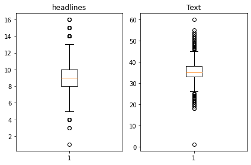
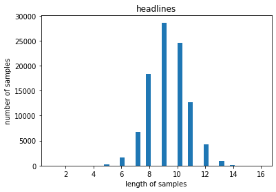
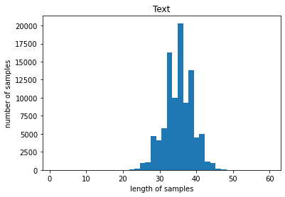
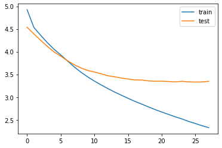

# 뉴스 요약봇 만들기

## 데이터 가져오기


```python
import nltk
nltk.download('stopwords')

import numpy as np
import pandas as pd
import os
import re
import matplotlib.pyplot as plt
from nltk.corpus import stopwords
from bs4 import BeautifulSoup 
from tensorflow.keras.preprocessing.text import Tokenizer 
from tensorflow.keras.preprocessing.sequence import pad_sequences
import urllib.request
import warnings
warnings.filterwarnings("ignore", category=UserWarning, module='bs4')
from summa.summarizer import summarize
from importlib.metadata import version
import nltk
import tensorflow
import summa
```

    [nltk_data] Downloading package stopwords to /aiffel/nltk_data...
    [nltk_data]   Package stopwords is already up-to-date!


```python
import urllib.request
urllib.request.urlretrieve("https://raw.githubusercontent.com/sunnysai12345/News_Summary/master/news_summary_more.csv", filename="news_summary_more.csv")
data = pd.read_csv('news_summary_more.csv', encoding='iso-8859-1')
```


```python
data.sample(10)
```


<table border="1" class="dataframe">
  <thead>
    <tr style="text-align: right;">
      <th></th>
      <th>headlines</th>
      <th>text</th>
    </tr>
  </thead>
  <tbody>
    <tr>
      <th>72122</th>
      <td>33-yr-old building in Thane begins to tilt, te...</td>
      <td>The Thane Municipal Corporation evacuated a 33...</td>
    </tr>
    <tr>
      <th>47671</th>
      <td>Sun Pharma profit falls 75% to ₹365 cr in...</td>
      <td>India's largest drugmaker Sun Pharma on Wednes...</td>
    </tr>
    <tr>
      <th>10917</th>
      <td>Air purification devices installed at ITO in D...</td>
      <td>With air quality dipping to 'very poor' in Del...</td>
    </tr>
    <tr>
      <th>38682</th>
      <td>Kejriwal's claim of officers on strike is base...</td>
      <td>The IAS Association has said Delhi CM Arvind K...</td>
    </tr>
    <tr>
      <th>63585</th>
      <td>Guj Congress offers economically backward quot...</td>
      <td>Congress' Gujarat unit chief Bharatsinh Solank...</td>
    </tr>
    <tr>
      <th>7593</th>
      <td>Joined Instagram due to prodding of well-wishe...</td>
      <td>Aishwarya Rai Bachchan revealed that her decis...</td>
    </tr>
    <tr>
      <th>84143</th>
      <td>47-year-old CEO of Vice Media becomes a billio...</td>
      <td>Shane Smith, the Co-founder and CEO of Vice Me...</td>
    </tr>
    <tr>
      <th>86577</th>
      <td>US-led airstrikes against ISIS killed 484 civi...</td>
      <td>US-led coalition airstrikes against Islamic St...</td>
    </tr>
    <tr>
      <th>73156</th>
      <td>Public banks took action against 5,954 wilful ...</td>
      <td>Twenty-one public sector banks have taken loan...</td>
    </tr>
    <tr>
      <th>85000</th>
      <td>UK Police issues warning over alcoholic ice cr...</td>
      <td>Police officers in the UK on Wednesday warned ...</td>
    </tr>
  </tbody>
</table>
</div>


## 데이터 전처리


```python
#중복 샘플 유무 확인
print('Text 열에서 중복을 배제한 유일한 샘플의 수 :', data['text'].nunique())
print('Summary 열에서 중복을 배제한 유일한 샘플의 수 :', data['headlines'].nunique())
```

    Text 열에서 중복을 배제한 유일한 샘플의 수 : 98360
    Summary 열에서 중복을 배제한 유일한 샘플의 수 : 98280


```python
data.drop_duplicates(subset = ['text'], inplace=True)
print('전체 샘플수 :', (len(data)))
```

    전체 샘플수 : 98360


```python
#데이터프레임에 Null 값이 있는지 확인
print(data.isnull().sum())
```

    headlines    0
    text         0
    dtype: int64


```python
contractions = {"ain't": "is not", "aren't": "are not","can't": "cannot", "'cause": "because", "could've": "could have", "couldn't": "could not",
                           "didn't": "did not",  "doesn't": "does not", "don't": "do not", "hadn't": "had not", "hasn't": "has not", "haven't": "have not",
                           "he'd": "he would","he'll": "he will", "he's": "he is", "how'd": "how did", "how'd'y": "how do you", "how'll": "how will", "how's": "how is",
                           "I'd": "I would", "I'd've": "I would have", "I'll": "I will", "I'll've": "I will have","I'm": "I am", "I've": "I have", "i'd": "i would",
                           "i'd've": "i would have", "i'll": "i will",  "i'll've": "i will have","i'm": "i am", "i've": "i have", "isn't": "is not", "it'd": "it would",
                           "it'd've": "it would have", "it'll": "it will", "it'll've": "it will have","it's": "it is", "let's": "let us", "ma'am": "madam",
                           "mayn't": "may not", "might've": "might have","mightn't": "might not","mightn't've": "might not have", "must've": "must have",
                           "mustn't": "must not", "mustn't've": "must not have", "needn't": "need not", "needn't've": "need not have","o'clock": "of the clock",
                           "oughtn't": "ought not", "oughtn't've": "ought not have", "shan't": "shall not", "sha'n't": "shall not", "shan't've": "shall not have",
                           "she'd": "she would", "she'd've": "she would have", "she'll": "she will", "she'll've": "she will have", "she's": "she is",
                           "should've": "should have", "shouldn't": "should not", "shouldn't've": "should not have", "so've": "so have","so's": "so as",
                           "this's": "this is","that'd": "that would", "that'd've": "that would have", "that's": "that is", "there'd": "there would",
                           "there'd've": "there would have", "there's": "there is", "here's": "here is","they'd": "they would", "they'd've": "they would have",
                           "they'll": "they will", "they'll've": "they will have", "they're": "they are", "they've": "they have", "to've": "to have",
                           "wasn't": "was not", "we'd": "we would", "we'd've": "we would have", "we'll": "we will", "we'll've": "we will have", "we're": "we are",
                           "we've": "we have", "weren't": "were not", "what'll": "what will", "what'll've": "what will have", "what're": "what are",
                           "what's": "what is", "what've": "what have", "when's": "when is", "when've": "when have", "where'd": "where did", "where's": "where is",
                           "where've": "where have", "who'll": "who will", "who'll've": "who will have", "who's": "who is", "who've": "who have",
                           "why's": "why is", "why've": "why have", "will've": "will have", "won't": "will not", "won't've": "will not have",
                           "would've": "would have", "wouldn't": "would not", "wouldn't've": "would not have", "y'all": "you all",
                           "y'all'd": "you all would","y'all'd've": "you all would have","y'all're": "you all are","y'all've": "you all have",
                           "you'd": "you would", "you'd've": "you would have", "you'll": "you will", "you'll've": "you will have",
                           "you're": "you are", "you've": "you have"}

print("정규화 사전의 수: ", len(contractions))
```

    정규화 사전의 수:  120


```python
print('불용어 개수 :', len(stopwords.words('english') ))
print(stopwords.words('english'))
```

    불용어 개수 : 179
    ['i', 'me', 'my', 'myself', 'we', 'our', 'ours', 'ourselves', 'you', "you're", "you've", "you'll", "you'd", 'your', 'yours', 'yourself', 'yourselves', 'he', 'him', 'his', 'himself', 'she', "she's", 'her', 'hers', 'herself', 'it', "it's", 'its', 'itself', 'they', 'them', 'their', 'theirs', 'themselves', 'what', 'which', 'who', 'whom', 'this', 'that', "that'll", 'these', 'those', 'am', 'is', 'are', 'was', 'were', 'be', 'been', 'being', 'have', 'has', 'had', 'having', 'do', 'does', 'did', 'doing', 'a', 'an', 'the', 'and', 'but', 'if', 'or', 'because', 'as', 'until', 'while', 'of', 'at', 'by', 'for', 'with', 'about', 'against', 'between', 'into', 'through', 'during', 'before', 'after', 'above', 'below', 'to', 'from', 'up', 'down', 'in', 'out', 'on', 'off', 'over', 'under', 'again', 'further', 'then', 'once', 'here', 'there', 'when', 'where', 'why', 'how', 'all', 'any', 'both', 'each', 'few', 'more', 'most', 'other', 'some', 'such', 'no', 'nor', 'not', 'only', 'own', 'same', 'so', 'than', 'too', 'very', 's', 't', 'can', 'will', 'just', 'don', "don't", 'should', "should've", 'now', 'd', 'll', 'm', 'o', 're', 've', 'y', 'ain', 'aren', "aren't", 'couldn', "couldn't", 'didn', "didn't", 'doesn', "doesn't", 'hadn', "hadn't", 'hasn', "hasn't", 'haven', "haven't", 'isn', "isn't", 'ma', 'mightn', "mightn't", 'mustn', "mustn't", 'needn', "needn't", 'shan', "shan't", 'shouldn', "shouldn't", 'wasn', "wasn't", 'weren', "weren't", 'won', "won't", 'wouldn', "wouldn't"]


```python
# 데이터 전처리 함수
def preprocess_sentence(sentence, remove_stopwords=True):
    sentence = sentence.lower() # 텍스트 소문자화
    sentence = BeautifulSoup(sentence, "lxml").text # <br />, <a href = ...> 등의 html 태그 제거
    sentence = re.sub(r'\([^)]*\)', '', sentence) # 괄호로 닫힌 문자열 (...) 제거 Ex) my husband (and myself!) for => my husband for
    sentence = re.sub('"','', sentence) # 쌍따옴표 " 제거
    sentence = ' '.join([contractions[t] if t in contractions else t for t in sentence.split(" ")]) # 약어 정규화
    sentence = re.sub(r"'s\b","", sentence) # 소유격 제거. Ex) roland's -> roland
    sentence = re.sub("[^a-zA-Z]", " ", sentence) # 영어 외 문자(숫자, 특수문자 등) 공백으로 변환
    sentence = re.sub('[m]{2,}', 'mm', sentence) # m이 3개 이상이면 2개로 변경. Ex) ummmmmmm yeah -> umm yeah
    
    # 불용어 제거 (Text)
    if remove_stopwords:
        tokens = ' '.join(word for word in sentence.split() if not word in stopwords.words('english') if len(word) > 1)
    # 불용어 미제거 (Headlines)
    else:
        tokens = ' '.join(word for word in sentence.split() if len(word) > 1)
    return tokens
```


```python
#훈련 데이터 전체에 대해 전처리
clean_text = []

for s in data['text']:
    clean_text.append(preprocess_sentence(s))

print("Text 전처리 후 결과: ", clean_text[:5])
```

    Text 전처리 후 결과:  ['saurav kant alumnus upgrad iiit pg program machine learning artificial intelligence sr systems engineer infosys almost years work experience program upgrad degree career support helped transition data scientist tech mahindra salary hike upgrad online power learning powered lakh careers', 'kunal shah credit card bill payment platform cred gave users chance win free food swiggy one year pranav kaushik delhi techie bagged reward spending cred coins users get one cred coin per rupee bill paid used avail rewards brands like ixigo bookmyshow ubereats cult fit', 'new zealand defeated india wickets fourth odi hamilton thursday win first match five match odi series india lost international match rohit sharma captaincy consecutive victories dating back march match witnessed india getting seventh lowest total odi cricket history', 'aegon life iterm insurance plan customers enjoy tax benefits premiums paid save taxes plan provides life cover age years also customers options insure critical illnesses disability accidental death benefit rider life cover age years', 'speaking sexual harassment allegations rajkumar hirani sonam kapoor said known hirani many years true metoo movement get derailed metoo movement always believe woman case need reserve judgment added hirani accused assistant worked sanju']


```python
clean_headlines = []

for s in data['headlines']:
    clean_headlines.append(preprocess_sentence(s, False))

clean_headlines[:5]
```


    ['upgrad learner switches to career in ml al with salary hike',
     'delhi techie wins free food from swiggy for one year on cred',
     'new zealand end rohit sharma led india match winning streak',
     'aegon life iterm insurance plan helps customers save tax',
     'have known hirani for yrs what if metoo claims are not true sonam']


```python
data['text'] = clean_text
data['headlines'] = clean_headlines

# 빈 값을 Null 값으로 변환
data.replace('', np.nan, inplace=True)

data.isnull().sum()
```


    headlines    0
    text         0
    dtype: int64


```python
data.dropna(axis=0, inplace=True)
print('전체 샘플수 :',(len(data)))
```

    전체 샘플수 : 98360


```python
text_len = [len(s.split()) for s in data['text']]
headlines_len = [len(s.split()) for s in data['headlines']]

print('텍스트의 최소 길이 : {}'.format(np.min(text_len)))
print('텍스트의 최대 길이 : {}'.format(np.max(text_len)))
print('텍스트의 평균 길이 : {}'.format(np.mean(text_len)))
print('요약의 최소 길이 : {}'.format(np.min(headlines_len)))
print('요약의 최대 길이 : {}'.format(np.max(headlines_len)))
print('요약의 평균 길이 : {}'.format(np.mean(headlines_len)))

plt.subplot(1,2,1)
plt.boxplot(headlines_len)
plt.title('headlines')
plt.subplot(1,2,2)
plt.boxplot(text_len)
plt.title('Text')
plt.tight_layout()
plt.show()

plt.title('headlines')
plt.hist(headlines_len, bins = 40)
plt.xlabel('length of samples')
plt.ylabel('number of samples')
plt.show()

plt.title('Text')
plt.hist(text_len, bins = 40)
plt.xlabel('length of samples')
plt.ylabel('number of samples')
plt.show()
```

    텍스트의 최소 길이 : 1
    텍스트의 최대 길이 : 60
    텍스트의 평균 길이 : 35.09968483123221
    요약의 최소 길이 : 1
    요약의 최대 길이 : 16
    요약의 평균 길이 : 9.299532330215534


    

    


    

    


    

    


```python
text_max_len = 50
headlines_max_len = 8
```


```python
def below_threshold_len(max_len, nested_list):
  cnt = 0
  for s in nested_list:
    if(len(s.split()) <= max_len):
        cnt = cnt + 1
  print('전체 샘플 중 길이가 %s 이하인 샘플의 비율: %s'%(max_len, (cnt / len(nested_list))))
```


```python
below_threshold_len(text_max_len, data['text'])
below_threshold_len(headlines_max_len,  data['headlines'])
```

    전체 샘플 중 길이가 50 이하인 샘플의 비율: 0.9998576657177715
    전체 샘플 중 길이가 8 이하인 샘플의 비율: 0.2755693371289142


```python
data = data[data['text'].apply(lambda x: len(x.split()) <= text_max_len)]
data = data[data['headlines'].apply(lambda x: len(x.split()) <= headlines_max_len)]
print('전체 샘플수 :',(len(data)))
```

    전체 샘플수 : 27105


```python
data['decoder_input'] = data['headlines'].apply(lambda x : 'sostoken '+ x)
data['decoder_target'] = data['headlines'].apply(lambda x : x + ' eostoken')
data.head()
```


<div>
<style scoped>
    .dataframe tbody tr th:only-of-type {
        vertical-align: middle;
    }

    .dataframe tbody tr th {
        vertical-align: top;
    }

    .dataframe thead th {
        text-align: right;
    }
</style>
<table border="1" class="dataframe">
  <thead>
    <tr style="text-align: right;">
      <th></th>
      <th>headlines</th>
      <th>text</th>
      <th>decoder_input</th>
      <th>decoder_target</th>
    </tr>
  </thead>
  <tbody>
    <tr>
      <th>19</th>
      <td>odisha cm patnaik controls mining mafia union ...</td>
      <td>union minister dharmendra pradhan wednesday cl...</td>
      <td>sostoken odisha cm patnaik controls mining maf...</td>
      <td>odisha cm patnaik controls mining mafia union ...</td>
    </tr>
    <tr>
      <th>21</th>
      <td>isro unveils bengaluru centre for manned space...</td>
      <td>indian space research organisation wednesday u...</td>
      <td>sostoken isro unveils bengaluru centre for man...</td>
      <td>isro unveils bengaluru centre for manned space...</td>
    </tr>
    <tr>
      <th>22</th>
      <td>killed injured in saudi arabia floods</td>
      <td>least people killed others injured saudi arabi...</td>
      <td>sostoken killed injured in saudi arabia floods</td>
      <td>killed injured in saudi arabia floods eostoken</td>
    </tr>
    <tr>
      <th>29</th>
      <td>seat cushions from missing plane carrying foot...</td>
      <td>investigators searching lost plane carrying ar...</td>
      <td>sostoken seat cushions from missing plane carr...</td>
      <td>seat cushions from missing plane carrying foot...</td>
    </tr>
    <tr>
      <th>36</th>
      <td>agustawestland scam accused rajiv saxena extra...</td>
      <td>agustawestland chopper scam co accused rajiv s...</td>
      <td>sostoken agustawestland scam accused rajiv sax...</td>
      <td>agustawestland scam accused rajiv saxena extra...</td>
    </tr>
  </tbody>
</table>
</div>


```python
encoder_input = np.array(data['text']) 
decoder_input = np.array(data['decoder_input'])
decoder_target = np.array(data['decoder_target'])
```


```python
indices = np.arange(encoder_input.shape[0])
np.random.shuffle(indices)
print(indices)
```

    [13050 17412 23555 ...  1962  9672 12310]


```python

encoder_input = encoder_input[indices]
decoder_input = decoder_input[indices]
decoder_target = decoder_target[indices]
```


```python
n_of_val = int(len(encoder_input)*0.2)
print('테스트 데이터의 수 :',n_of_val)
```

    테스트 데이터의 수 : 5421


```python
encoder_input_train = encoder_input[:-n_of_val]
decoder_input_train = decoder_input[:-n_of_val]
decoder_target_train = decoder_target[:-n_of_val]

encoder_input_test = encoder_input[-n_of_val:]
decoder_input_test = decoder_input[-n_of_val:]
decoder_target_test = decoder_target[-n_of_val:]

print('훈련 데이터의 개수 :', len(encoder_input_train))
print('훈련 레이블의 개수 :',len(decoder_input_train))
print('테스트 데이터의 개수 :',len(encoder_input_test))
print('테스트 레이블의 개수 :',len(decoder_input_test))
```

    훈련 데이터의 개수 : 21684
    훈련 레이블의 개수 : 21684
    테스트 데이터의 개수 : 5421
    테스트 레이블의 개수 : 5421


```python
src_tokenizer = Tokenizer()
src_tokenizer.fit_on_texts(encoder_input_train)

```


```python
threshold = 7
total_cnt = len(src_tokenizer.word_index) # 단어의 수
rare_cnt = 0 # 등장 빈도수가 threshold보다 작은 단어의 개수를 카운트
total_freq = 0 # 훈련 데이터의 전체 단어 빈도수 총 합
rare_freq = 0 # 등장 빈도수가 threshold보다 작은 단어의 등장 빈도수의 총 합

# 단어와 빈도수의 쌍(pair)을 key와 value로 받는다.
for key, value in src_tokenizer.word_counts.items():
    total_freq = total_freq + value

    # 단어의 등장 빈도수가 threshold보다 작으면
    if(value < threshold):
        rare_cnt = rare_cnt + 1
        rare_freq = rare_freq + value

print('단어 집합(vocabulary)의 크기 :',total_cnt)
print('등장 빈도가 %s번 이하인 희귀 단어의 수: %s'%(threshold - 1, rare_cnt))
print('단어 집합에서 희귀 단어를 제외시킬 경우의 단어 집합의 크기 %s'%(total_cnt - rare_cnt))
print("단어 집합에서 희귀 단어의 비율:", (rare_cnt / total_cnt)*100)
print("전체 등장 빈도에서 희귀 단어 등장 빈도 비율:", (rare_freq / total_freq)*100)
```

    단어 집합(vocabulary)의 크기 : 42380
    등장 빈도가 6번 이하인 희귀 단어의 수: 30667
    단어 집합에서 희귀 단어를 제외시킬 경우의 단어 집합의 크기 11713
    단어 집합에서 희귀 단어의 비율: 72.36196319018406
    전체 등장 빈도에서 희귀 단어 등장 빈도 비율: 8.29978272613635


```python
src_vocab = 8000
src_tokenizer = Tokenizer(num_words = src_vocab) 
src_tokenizer.fit_on_texts(encoder_input_train)
```


```python
# 텍스트 시퀀스를 정수 시퀀스로 변환
encoder_input_train = src_tokenizer.texts_to_sequences(encoder_input_train) 
encoder_input_test = src_tokenizer.texts_to_sequences(encoder_input_test)

#잘 진행되었는지 샘플 출력
print(encoder_input_train[:3])
```

    [[3615, 7387, 2, 26, 89, 4292, 1336, 79, 1414, 1139, 7779, 523, 8, 377, 752, 3049, 224, 195, 358, 3313, 891, 4292, 290, 79, 7387, 644, 308, 1244, 1115, 814, 1508, 195], [277, 180, 250, 389, 382, 46, 547, 1404, 45, 89, 387, 308, 155, 248, 589, 122, 1262, 6218, 354, 89, 7043, 389, 382, 18, 238, 1522, 45, 731, 7780, 1308, 122], [13, 826, 56, 1212, 1415, 439, 990, 466, 50, 7388, 3707, 145, 5192, 4770, 2524, 6740, 2443, 5193, 1490, 5750, 154, 15, 2267, 3444, 372, 905, 439, 12, 13, 826, 439, 3889, 5194, 2607, 1197, 439, 760, 3525, 1475]]


```python
tar_tokenizer = Tokenizer()
tar_tokenizer.fit_on_texts(decoder_input_train)
```


```python
threshold = 6
total_cnt = len(tar_tokenizer.word_index) # 단어의 수
rare_cnt = 0 # 등장 빈도수가 threshold보다 작은 단어의 개수를 카운트
total_freq = 0 # 훈련 데이터의 전체 단어 빈도수 총 합
rare_freq = 0 # 등장 빈도수가 threshold보다 작은 단어의 등장 빈도수의 총 합

# 단어와 빈도수의 쌍(pair)을 key와 value로 받는다.
for key, value in tar_tokenizer.word_counts.items():
    total_freq = total_freq + value

    # 단어의 등장 빈도수가 threshold보다 작으면
    if(value < threshold):
        rare_cnt = rare_cnt + 1
        rare_freq = rare_freq + value

print('단어 집합(vocabulary)의 크기 :',total_cnt)
print('등장 빈도가 %s번 이하인 희귀 단어의 수: %s'%(threshold - 1, rare_cnt))
print('단어 집합에서 희귀 단어를 제외시킬 경우의 단어 집합의 크기 %s'%(total_cnt - rare_cnt))
print("단어 집합에서 희귀 단어의 비율:", (rare_cnt / total_cnt)*100)
print("전체 등장 빈도에서 희귀 단어 등장 빈도 비율:", (rare_freq / total_freq)*100)
```

    단어 집합(vocabulary)의 크기 : 18898
    등장 빈도가 5번 이하인 희귀 단어의 수: 14242
    단어 집합에서 희귀 단어를 제외시킬 경우의 단어 집합의 크기 4656
    단어 집합에서 희귀 단어의 비율: 75.36247221928247
    전체 등장 빈도에서 희귀 단어 등장 빈도 비율: 14.129040912139503


```python
tar_vocab = 2000
tar_tokenizer = Tokenizer(num_words = tar_vocab) 
tar_tokenizer.fit_on_texts(decoder_input_train)
tar_tokenizer.fit_on_texts(decoder_target_train)

# 텍스트 시퀀스를 정수 시퀀스로 변환
decoder_input_train = tar_tokenizer.texts_to_sequences(decoder_input_train) 
decoder_target_train = tar_tokenizer.texts_to_sequences(decoder_target_train)
decoder_input_test = tar_tokenizer.texts_to_sequences(decoder_input_test)
decoder_target_test = tar_tokenizer.texts_to_sequences(decoder_target_test)

#잘 변환되었는지 확인
print('input')
print('input ',decoder_input_train[:5])
print('target')
print('decoder ',decoder_target_train[:5])
```

    input
    input  [[1, 41, 854, 93, 1261, 1107, 5, 39], [1, 205, 577, 43, 5, 303, 63], [1, 25, 644, 1393, 198, 910, 179], [1, 239, 23, 1715, 388, 18, 563], [1, 8, 4, 984, 3, 336, 42]]
    target
    decoder  [[41, 854, 93, 1261, 1107, 5, 39, 2], [205, 577, 43, 5, 303, 63, 2], [25, 644, 1393, 198, 910, 179, 2], [239, 23, 1715, 388, 18, 563, 2], [8, 4, 984, 3, 336, 42, 2]]


```python

drop_train = [index for index, sentence in enumerate(decoder_input_train) if len(sentence) == 1]
drop_test = [index for index, sentence in enumerate(decoder_input_test) if len(sentence) == 1]

print('삭제할 훈련 데이터의 개수 :',len(drop_train))
print('삭제할 테스트 데이터의 개수 :',len(drop_test))

encoder_input_train = np.delete(encoder_input_train, drop_train, axis=0)
decoder_input_train = np.delete(decoder_input_train, drop_train, axis=0)
decoder_target_train = np.delete(decoder_target_train, drop_train, axis=0)

encoder_input_test = np.delete(encoder_input_test, drop_test, axis=0)
decoder_input_test = np.delete(decoder_input_test, drop_test, axis=0)
decoder_target_test = np.delete(decoder_target_test, drop_test, axis=0)

print('훈련 데이터의 개수 :', len(encoder_input_train))
print('훈련 레이블의 개수 :',len(decoder_input_train))
print('테스트 데이터의 개수 :',len(encoder_input_test))
print('테스트 레이블의 개수 :',len(decoder_input_test))
```

    삭제할 훈련 데이터의 개수 : 7
    삭제할 테스트 데이터의 개수 : 5
    훈련 데이터의 개수 : 21677
    훈련 레이블의 개수 : 21677
    테스트 데이터의 개수 : 5416
    테스트 레이블의 개수 : 5416


```python
encoder_input_train = pad_sequences(encoder_input_train, maxlen = text_max_len, padding='post')
encoder_input_test = pad_sequences(encoder_input_test, maxlen = text_max_len, padding='post')
decoder_input_train = pad_sequences(decoder_input_train, maxlen = headlines_max_len, padding='post')
decoder_target_train = pad_sequences(decoder_target_train, maxlen = headlines_max_len, padding='post')
decoder_input_test = pad_sequences(decoder_input_test, maxlen = headlines_max_len, padding='post')
decoder_target_test = pad_sequences(decoder_target_test, maxlen = headlines_max_len, padding='post')
```

## 모델 설계


```python
from tensorflow.keras.layers import Input, LSTM, Embedding, Dense, Concatenate, TimeDistributed
from tensorflow.keras.models import Model
from tensorflow.keras.callbacks import EarlyStopping, ModelCheckpoint


# 인코더 설계 시작
embedding_dim = 128
hidden_size = 256

# 인코더
encoder_inputs = Input(shape=(text_max_len,))

# 인코더의 임베딩 층
enc_emb = Embedding(src_vocab, embedding_dim)(encoder_inputs)

# 인코더의 LSTM 1
encoder_lstm1 = LSTM(hidden_size, return_sequences=True, return_state=True ,dropout = 0.4, recurrent_dropout = 0.4)
encoder_output1, state_h1, state_c1 = encoder_lstm1(enc_emb)

# 인코더의 LSTM 2
encoder_lstm2 = LSTM(hidden_size, return_sequences=True, return_state=True, dropout=0.4, recurrent_dropout=0.4)
encoder_output2, state_h2, state_c2 = encoder_lstm2(encoder_output1)

# 인코더의 LSTM 3
encoder_lstm3 = LSTM(hidden_size, return_state=True, return_sequences=True, dropout=0.4, recurrent_dropout=0.4)
encoder_outputs, state_h, state_c= encoder_lstm3(encoder_output2)
```

    WARNING:tensorflow:Layer lstm will not use cuDNN kernels since it doesn't meet the criteria. It will use a generic GPU kernel as fallback when running on GPU.
    WARNING:tensorflow:Layer lstm_1 will not use cuDNN kernels since it doesn't meet the criteria. It will use a generic GPU kernel as fallback when running on GPU.
    WARNING:tensorflow:Layer lstm_2 will not use cuDNN kernels since it doesn't meet the criteria. It will use a generic GPU kernel as fallback when running on GPU.


```python
# 디코더 설계
decoder_inputs = Input(shape=(None,))

# 디코더의 임베딩 층
dec_emb_layer = Embedding(tar_vocab, embedding_dim)
dec_emb = dec_emb_layer(decoder_inputs)

# 디코더의 LSTM
decoder_lstm = LSTM(hidden_size, return_sequences=True, return_state=True, dropout=0.4, recurrent_dropout=0.2)
decoder_outputs, _, _ = decoder_lstm(dec_emb, initial_state=[state_h, state_c])
```

    WARNING:tensorflow:Layer lstm_3 will not use cuDNN kernels since it doesn't meet the criteria. It will use a generic GPU kernel as fallback when running on GPU.


```python
# 디코더의 출력층
decoder_softmax_layer = Dense(tar_vocab, activation='softmax')
decoder_softmax_outputs = decoder_softmax_layer(decoder_outputs) 

# 모델 정의
model = Model([encoder_inputs, decoder_inputs], decoder_softmax_outputs)
model.summary()
```

    Model: "model"
    __________________________________________________________________________________________________
    Layer (type)                    Output Shape         Param #     Connected to                     
    ==================================================================================================
    input_1 (InputLayer)            [(None, 50)]         0                                            
    __________________________________________________________________________________________________
    embedding (Embedding)           (None, 50, 128)      1024000     input_1[0][0]                    
    __________________________________________________________________________________________________
    lstm (LSTM)                     [(None, 50, 256), (N 394240      embedding[0][0]                  
    __________________________________________________________________________________________________
    input_2 (InputLayer)            [(None, None)]       0                                            
    __________________________________________________________________________________________________
    lstm_1 (LSTM)                   [(None, 50, 256), (N 525312      lstm[0][0]                       
    __________________________________________________________________________________________________
    embedding_1 (Embedding)         (None, None, 128)    256000      input_2[0][0]                    
    __________________________________________________________________________________________________
    lstm_2 (LSTM)                   [(None, 50, 256), (N 525312      lstm_1[0][0]                     
    __________________________________________________________________________________________________
    lstm_3 (LSTM)                   [(None, None, 256),  394240      embedding_1[0][0]                
                                                                     lstm_2[0][1]                     
                                                                     lstm_2[0][2]                     
    __________________________________________________________________________________________________
    dense (Dense)                   (None, None, 2000)   514000      lstm_3[0][0]                     
    ==================================================================================================
    Total params: 3,633,104
    Trainable params: 3,633,104
    Non-trainable params: 0
    __________________________________________________________________________________________________


```python
from tensorflow.keras.layers import AdditiveAttention

# 어텐션 층(어텐션 함수)
attn_layer = AdditiveAttention(name='attention_layer')

# 인코더와 디코더의 모든 time step의 hidden state를 어텐션 층에 전달하고 결과를 리턴
attn_out = attn_layer([decoder_outputs, encoder_outputs])


# 어텐션의 결과와 디코더의 hidden state들을 연결
decoder_concat_input = Concatenate(axis=-1, name='concat_layer')([decoder_outputs, attn_out])

# 디코더의 출력층
decoder_softmax_layer = Dense(tar_vocab, activation='softmax')
decoder_softmax_outputs = decoder_softmax_layer(decoder_concat_input)

# 모델 정의
model = Model([encoder_inputs, decoder_inputs], decoder_softmax_outputs)
model.summary()
```

    Model: "model_1"
    __________________________________________________________________________________________________
    Layer (type)                    Output Shape         Param #     Connected to                     
    ==================================================================================================
    input_1 (InputLayer)            [(None, 50)]         0                                            
    __________________________________________________________________________________________________
    embedding (Embedding)           (None, 50, 128)      1024000     input_1[0][0]                    
    __________________________________________________________________________________________________
    lstm (LSTM)                     [(None, 50, 256), (N 394240      embedding[0][0]                  
    __________________________________________________________________________________________________
    input_2 (InputLayer)            [(None, None)]       0                                            
    __________________________________________________________________________________________________
    lstm_1 (LSTM)                   [(None, 50, 256), (N 525312      lstm[0][0]                       
    __________________________________________________________________________________________________
    embedding_1 (Embedding)         (None, None, 128)    256000      input_2[0][0]                    
    __________________________________________________________________________________________________
    lstm_2 (LSTM)                   [(None, 50, 256), (N 525312      lstm_1[0][0]                     
    __________________________________________________________________________________________________
    lstm_3 (LSTM)                   [(None, None, 256),  394240      embedding_1[0][0]                
                                                                     lstm_2[0][1]                     
                                                                     lstm_2[0][2]                     
    __________________________________________________________________________________________________
    attention_layer (AdditiveAttent (None, None, 256)    256         lstm_3[0][0]                     
                                                                     lstm_2[0][0]                     
    __________________________________________________________________________________________________
    concat_layer (Concatenate)      (None, None, 512)    0           lstm_3[0][0]                     
                                                                     attention_layer[0][0]            
    __________________________________________________________________________________________________
    dense_1 (Dense)                 (None, None, 2000)   1026000     concat_layer[0][0]               
    ==================================================================================================
    Total params: 4,145,360
    Trainable params: 4,145,360
    Non-trainable params: 0
    __________________________________________________________________________________________________


## 모델 훈련


```python
model.compile(optimizer='rmsprop', loss='sparse_categorical_crossentropy')
es = EarlyStopping(monitor='val_loss', patience=2, verbose=1)
history = model.fit(x=[encoder_input_train, decoder_input_train], y=decoder_target_train, \
          validation_data=([encoder_input_test, decoder_input_test], decoder_target_test), \
          batch_size=256, callbacks=[es], epochs=50)
```

    Epoch 1/50
    85/85 [==============================] - 72s 735ms/step - loss: 4.9252 - val_loss: 4.5384
    Epoch 2/50
    85/85 [==============================] - 62s 725ms/step - loss: 4.5357 - val_loss: 4.3921
    Epoch 3/50
    85/85 [==============================] - 61s 723ms/step - loss: 4.3636 - val_loss: 4.2530
    Epoch 4/50
    85/85 [==============================] - 61s 716ms/step - loss: 4.2008 - val_loss: 4.1187
    Epoch 5/50
    85/85 [==============================] - 60s 710ms/step - loss: 4.0548 - val_loss: 3.9943
    Epoch 6/50
    85/85 [==============================] - 60s 705ms/step - loss: 3.9292 - val_loss: 3.9029
    Epoch 7/50
    85/85 [==============================] - 60s 710ms/step - loss: 3.7971 - val_loss: 3.8014
    Epoch 8/50
    85/85 [==============================] - 61s 715ms/step - loss: 3.6652 - val_loss: 3.7122
    Epoch 9/50
    85/85 [==============================] - 60s 704ms/step - loss: 3.5491 - val_loss: 3.6430
    Epoch 10/50
    85/85 [==============================] - 60s 703ms/step - loss: 3.4455 - val_loss: 3.5863
    Epoch 11/50
    85/85 [==============================] - 59s 700ms/step - loss: 3.3529 - val_loss: 3.5527
    Epoch 12/50
    85/85 [==============================] - 60s 702ms/step - loss: 3.2690 - val_loss: 3.5130
    Epoch 13/50
    85/85 [==============================] - 59s 698ms/step - loss: 3.1883 - val_loss: 3.4699
    Epoch 14/50
    85/85 [==============================] - 60s 702ms/step - loss: 3.1118 - val_loss: 3.4472
    Epoch 15/50
    85/85 [==============================] - 59s 697ms/step - loss: 3.0415 - val_loss: 3.4195
    Epoch 16/50
    85/85 [==============================] - 59s 697ms/step - loss: 2.9737 - val_loss: 3.3995
    Epoch 17/50
    85/85 [==============================] - 59s 697ms/step - loss: 2.9070 - val_loss: 3.3786
    Epoch 18/50
    85/85 [==============================] - 59s 696ms/step - loss: 2.8476 - val_loss: 3.3768
    Epoch 19/50
    85/85 [==============================] - 60s 701ms/step - loss: 2.7866 - val_loss: 3.3573
    Epoch 20/50
    85/85 [==============================] - 59s 696ms/step - loss: 2.7265 - val_loss: 3.3490
    Epoch 21/50
    85/85 [==============================] - 59s 695ms/step - loss: 2.6719 - val_loss: 3.3501
    Epoch 22/50
    85/85 [==============================] - 59s 695ms/step - loss: 2.6194 - val_loss: 3.3429
    Epoch 23/50
    85/85 [==============================] - 59s 694ms/step - loss: 2.5666 - val_loss: 3.3353
    Epoch 24/50
    85/85 [==============================] - 59s 697ms/step - loss: 2.5191 - val_loss: 3.3479
    Epoch 25/50
    85/85 [==============================] - 59s 693ms/step - loss: 2.4652 - val_loss: 3.3350
    Epoch 26/50
    85/85 [==============================] - 59s 694ms/step - loss: 2.4184 - val_loss: 3.3316
    Epoch 27/50
    85/85 [==============================] - 59s 692ms/step - loss: 2.3688 - val_loss: 3.3334
    Epoch 28/50
    85/85 [==============================] - 59s 692ms/step - loss: 2.3266 - val_loss: 3.3479
    Epoch 00028: early stopping


```python
plt.plot(history.history['loss'], label='train')
plt.plot(history.history['val_loss'], label='test')
plt.legend()
plt.show()
```


    

    


## 모델 구현


```python
#텍스트 데이터 복원을 위해 3개 사전 정의
src_index_to_word = src_tokenizer.index_word # 원문 단어 집합에서 정수 -> 단어를 얻음
tar_word_to_index = tar_tokenizer.word_index # 요약 단어 집합에서 단어 -> 정수를 얻음
tar_index_to_word = tar_tokenizer.index_word # 요약 단어 집합에서 정수 -> 단어를 얻음
```


```python
# 인코더 설계
encoder_model = Model(inputs=encoder_inputs, outputs=[encoder_outputs, state_h, state_c])

# 이전 시점의 상태들을 저장하는 텐서
decoder_state_input_h = Input(shape=(hidden_size,))
decoder_state_input_c = Input(shape=(hidden_size,))

dec_emb2 = dec_emb_layer(decoder_inputs)


decoder_outputs2, state_h2, state_c2 = decoder_lstm(dec_emb2, initial_state=[decoder_state_input_h, decoder_state_input_c])
```


```python
#어텐션 메커니즘을 사용하는 출력층 설계
# 어텐션 함수
decoder_hidden_state_input = Input(shape=(text_max_len, hidden_size))
attn_out_inf = attn_layer([decoder_outputs2, decoder_hidden_state_input])
decoder_inf_concat = Concatenate(axis=-1, name='concat')([decoder_outputs2, attn_out_inf])

# 디코더의 출력층
decoder_outputs2 = decoder_softmax_layer(decoder_inf_concat) 

# 최종 디코더 모델
decoder_model = Model(
    [decoder_inputs] + [decoder_hidden_state_input,decoder_state_input_h, decoder_state_input_c],
    [decoder_outputs2] + [state_h2, state_c2])
```


```python
def decode_sequence(input_seq):
    # 입력으로부터 인코더의 상태를 얻음
    e_out, e_h, e_c = encoder_model.predict(input_seq)

     # <SOS>에 해당하는 토큰 생성
    target_seq = np.zeros((1,1))
    target_seq[0, 0] = tar_word_to_index['sostoken']

    stop_condition = False
    decoded_sentence = ''
    while not stop_condition: # stop_condition이 True가 될 때까지 루프 반복

        output_tokens, h, c = decoder_model.predict([target_seq] + [e_out, e_h, e_c])
        sampled_token_index = np.argmax(output_tokens[0, -1, :])
        sampled_token = tar_index_to_word[sampled_token_index]

        if(sampled_token!='eostoken'):
            decoded_sentence += ' '+sampled_token

        #  <eos>에 도달하거나 최대 길이를 넘으면 중단.
        if (sampled_token == 'eostoken'  or len(decoded_sentence.split()) >= (headlines_max_len-1)):
            stop_condition = True

        # 길이가 1인 타겟 시퀀스를 업데이트
        target_seq = np.zeros((1,1))
        target_seq[0, 0] = sampled_token_index

        # 상태를 업데이트 합니다.
        e_h, e_c = h, c

    return decoded_sentence
```

## 테스트


```python
# 원문의 정수 시퀀스를 텍스트 시퀀스로 변환
def seq2text(input_seq):
    temp=''
    for i in input_seq:
        if(i!=0):
            temp = temp + src_index_to_word[i]+' '
    return temp

# 요약문의 정수 시퀀스를 텍스트 시퀀스로 변환
def seq2summary(input_seq):
    temp=''
    for i in input_seq:
        if((i!=0 and i!=tar_word_to_index['sostoken']) and i!=tar_word_to_index['eostoken']):
            temp = temp + tar_index_to_word[i] + ' '
    return temp
```


```python
for i in range(50, 100):
    print("원문 :", seq2text(encoder_input_test[i]))
    print("실제 요약 :", seq2summary(decoder_input_test[i]))
    print("예측 요약 :", decode_sequence(encoder_input_test[i].reshape(1, text_max_len)))
    print("\n")
```

    원문 : philippines president rodrigo duterte signed executive order banning smoking public across country ban carries maximum penalty four months jail fine covers smoking notably duterte heavy quit diagnosed disease 
    실제 요약 : philippines president duterte imposes public ban 
    예측 요약 :  prez approves of philippine prez
    
    
    원문 : nick jonas mother jonas gifted daughter law priyanka chopra pair earrings worth lakh wedding gift per reports earrings van made gold diamonds quality giving unique reports said earrings reportedly stones 
    실제 요약 : priyanka worth lakh reports 
    예측 요약 :  priyanka chopra wedding in
    
    
    원문 : team india rounder hardik pandya took social media share picture receiving jersey premier league side manchester united jersey players english football club frame going straight wall captioned picture 
    실제 요약 : hardik pandya receives manchester united 
    예측 요약 :  hardik pandya meets pandya
    
    
    원문 : former england captain kevin pietersen gifted james th birthday following two engaged friendly twitter hope day someone kind tweeted pietersen someone throw well replied 
    실제 요약 : on his th birthday 
    예측 요약 :  yuvraj singh apologises for
    
    
    원문 : year old student thursday defeated six male candidates become first female president university campus students council students society candidate said students feel afraid raise real issues university established university punjab lahore located pakistan 
    실제 요약 : university students first ever female president 
    예측 요약 :  mumbai university to transgender
    
    
    원문 : activist detained thursday allegedly red rome years pulling stunt authorities forced pool prevent damage meanwhile accused said protesting corruption added protest rome dead 
    실제 요약 : activist turns red during protest 
    예측 요약 :  police officer after years
    
    
    원문 : many muslims district uttar pradesh joined bjp sunday presence state party president mahendra nath pandey speaking occasion pandey said entire country strong faith policies pm narendra modi bjp giving space people want serve society added 
    실제 요약 : muslims from up district join bjp 
    예측 요약 :  mamata calls bjp leaders over
    
    
    원문 : leaked cctv footage shows aiadmk chief vk sasikala walking without jail uniform corridor bengaluru central prison senior prison official said foot corridor uses five different prison cells eat sleep yoga store sasikala also personal tv one inmates added 
    실제 요약 : video sasikala in personal without jail 
    예측 요약 :  video shows delhi police stolen
    
    
    원문 : defence minister nirmala sitharaman monday commissioned third built anti submarine ins indian navy visakhapatnam tonnes length ship become part eastern fleet would enhance navy reach indian ocean region 
    실제 요약 : anti submarine into navy 
    예측 요약 :  india to build space station
    
    
    원문 : secondary school uk offering worn muslims part uniform becoming first school country however muslim parents complained uniform enough could pose risk pulled back 
    실제 요약 : uk school offers for muslim 
    예측 요약 :  uk woman suspended for
    
    
    원문 : launched new price range lakh car uses litre engine kmph seconds top speed kmph features include virtual cockpit smartphone interface wireless charging zone ac 
    실제 요약 : second launched at lakh 
    예측 요약 :  unveils self driving car
    
    
    원문 : bengaluru metro launched south india first metro service completed six years operation friday bangalore metro rail corporation registered almost seven times increase figures since launched first metro train road metro india second largest operational network runs trains 
    실제 요약 : bengaluru metro completes six years of operation 
    예측 요약 :  mumbai metro stations to get
    
    
    원문 : upcoming north america tour rock band park scheduled begin next week cancelled lead demise earlier week reportedly committed suicide california residence formed park sold million worldwide two awards 
    실제 요약 : park upcoming cancelled after 
    예측 요약 :  chinese woman commits suicide after years
    
    
    원문 : two aiadmk factions led tamil nadu cm palaniswami panneerselvam announced merger party headquarters monday panneerselvam given role party palaniswami co cm palaniswami said first priority party two leaves symbol 
    실제 요약 : aiadmk rival merger 
    예측 요약 :  aiadmk minister calls aiadmk minister
    
    
    원문 : indian spinner ravichandran ashwin trolled twitter posting tweet chinese smartphone brand using twitter iphone ashwin used ball reference phone user tweeted ball one day fail ho australia series se another tweet read quality bowler supporting chinese brand 
    실제 요약 : trolled over failed on twitter 
    예측 요약 :  instagram to let users
    
    
    원문 : bangladesh former world champions sri lanka failed get direct world super due low rankings teams fight place group stage competition sri lanka bangladesh six group stage 
    실제 요약 : former champions miss wc direct entry 
    예측 요약 :  india beat india to reach series
    
    
    원문 : munich brazilian defender apologised dressing arab holding appeared box mock explosives team halloween party munich shared picture party deleted later intention anyone respect countries religions wrote apology instagram 
    실제 요약 : brazilian footballer apologises for dress 
    예측 요약 :  politician slammed for
    
    
    원문 : men pakistan reportedly claimed chinese authorities separated wives belonging china minority community china women education camps xinjiang province alleged extremism comes amid increased surveillance china xinjiang province control spread islamic thought 
    실제 요약 : china pak from report 
    예측 요약 :  saudi arabia to china
    
    
    원문 : beverages giant coca cola said president india southwest asia business unit quit leading operations three years decided go back us look opportunities outside stated company said take effective may 
    실제 요약 : india president quits 
    예측 요약 :  to get its first
    
    
    원문 : talking trolls actress swara said important call silence times like termed nobody ten people reading tweets get important expose low level humanity trolls added actress 
    실제 요약 : against trolls is as 
    예측 요약 :  was my
    
    
    원문 : twitter users reacted man tweet predicted nomination ram nath kovind india president current governor bihar dalit highly educated person rss background wrote backing user tweeted amit shah phone another tweet read hello sir 
    실제 요약 : twitter reacts to kovind made in 
    예측 요약 :  twitter reacts to trump tweet
    
    
    원문 : pilots accidentally sent air traffic code aircraft hijacked plane landing germany following german army air force began preparing fighter jets plane pilots realised mistake minutes informed air traffic following flight landed safely 
    실제 요약 : accidentally out alert during landing 
    예측 요약 :  video plane explodes in
    
    
    원문 : debris missing myanmar military plane carrying people including crew members found sea reports suggested people aircraft survived everyone plane believed family members military men three military planes six navy ships searching survivors crash 
    실제 요약 : over dead in myanmar military plane crash 
    예측 요약 :  air strikes in nepal
    
    
    원문 : american canadian governments agreed contribute million experiment search dark matter particles constructed kilometres deep inside mine operated experiment would least times sensitive predecessor protected high energy cosmic radiation background noise 
    실제 요약 : most gets million 
    예측 요약 :  us earthquake hits
    
    
    원문 : veteran filmmaker commenting ongoing protests release padmavati said done rajput vote added padmavati non issue karni sena hopes unite crisis said people wait padmavati release pass verdict 
    실제 요약 : padmavati protests to votes 
    예측 요약 :  padmavati to be bhansali
    
    
    원문 : computer technology company always focussed delivering technology solutions enable people grow best selling available hdfc credit card additional bring home india pc brand today 
    실제 요약 : becomes india most brand again 
    예측 요약 :  launches of
    
    
    원문 : research iit kharagpur developed flexible battery powered bacteria sewage water part innovation contest institute said statement battery cash award lakh produce power range multiple devices boost power 
    실제 요약 : iit research develops battery using water 
    예측 요약 :  new collection creates for
    
    
    원문 : social media platform reddit revealed one million reddit users painted million digital hours place experiment place allowed users draw one pixel time every five minutes images drawn across include india flag portrait david 
    실제 요약 : shares digital by million users 
    예측 요약 :  facebook million in million
    
    
    원문 : us state secretary rex tillerson said believe threat north korea americans sleep well night comes north korea said examining plans attack us territory guam us president donald trump warned north korea never seen fire nn 
    실제 요약 : north korea no threat us 
    예측 요약 :  us to north korea
    
    
    원문 : health ministry tuesday extended duration existing rules health warnings tobacco products require display area covered warnings till august rule introduced april due changed march month period 
    실제 요약 : warning on extended till 
    예측 요약 :  govt proposes to get
    
    
    원문 : researchers developed self remove disease causing bacteria water two faced side water produce hydrogen face gold bacteria killed silver efficiency easily removed water using 
    실제 요약 : can remove bacteria from water 
    예측 요약 :  researchers develop to
    
    
    원문 : union minister prakash javadekar sunday inaugurated network test practice centres students pattern competitive exams conducted national testing agency launching students computers smart phones said student due lack resources javadekar added 
    실제 요약 : minister inaugurates for tests 
    예측 요약 :  karnataka to make gender
    
    
    원문 : homegrown ride hailing startup ola chief people officer resigned company months joined company earlier april replacing lead hr function startup appointed senior advisor ola interim chief ola spokesperson said 
    실제 요약 : ola quits after months 
    예측 요약 :  ceo resigns after acquisition
    
    
    원문 : rape victim consumed poison outside madhya pradesh chief minister shivraj singh chouhan residence thursday reports said victim reportedly upset alleged inaction police accused currently bail receiving treatment hospital critical condition 
    실제 요약 : rape victim outside mp cm house 
    예측 요약 :  accused of victim
    
    
    원문 : china real estate firm country garden vice chairman wealth increased billion first four trading days year controlling shareholder country garden saw fortune billion friday making fifth richest person china according bloomberg china richest woman country youngest billionaire 
    실제 요약 : chinese wealth increases by bn in days 
    예측 요약 :  china becomes world richest person
    
    
    원문 : saudi arabia ministry trade industry tuesday officially declared yoga sport saudi citizen practice teach yoga avail licence government campaign recognise yoga sporting activity led also became first certified yoga instructor country 
    실제 요약 : saudi arabia yoga as sports 
    예측 요약 :  saudi arabia to qatar qatar
    
    
    원문 : claiming direct shah prince claim masjid site reportedly asked central board name site claiming take decisions regarding property said given board day notice 
    실제 요약 : claim to site 
    예측 요약 :  obama to be
    
    
    원문 : environmental experts estimated rising sea levels might us president donald trump properties florida end century data national atmospheric administration shows trump properties would partially submerged sea levels rose three feet notably trump said climate change invented chinese 
    실제 요약 : sea may trump properties 
    예측 요약 :  trump charity in mexico
    
    
    원문 : around special police officers assam threatened commit mass suicide monday demanding government service officers planned jump river started removing uniforms security personnel temporary posts dismissed centre without notice 
    실제 요약 : special police officers in assam threaten mass suicide 
    예측 요약 :  maha police arrests for
    
    
    원문 : man named allegedly stabbed street hyderabad returning sum attacker one year ago police said asked return money following heated discussion stabbed knife undergoing treatment reported danger 
    실제 요약 : man on hyderabad for not 
    예측 요약 :  man man to
    
    
    원문 : russian man metre without safety mexico people inside seen attempting take selfies climbing climb arrested police later released actions considered punishable mexico 
    실제 요약 : man without arrested 
    예측 요약 :  man explodes in us
    
    
    원문 : delhi high court attributed burning punjab haryana main leading rise pollution levels delhi ncr adding bringing burning complete halt take time court suggested delhi government neighbouring states regulations construction dust generation damage control 
    실제 요약 : behind delhi pollution hc 
    예측 요약 :  delhi police to get
    
    
    원문 : police tuesday rescued three minor girls allegedly held captive domestic helps delhi model town girls managed contact ngo girls aged years hailed jharkhand assam hired agency girls claimed abused paid salaries 
    실제 요약 : three minor domestic helps rescued from delhi 
    예측 요약 :  delhi police arrested for
    
    
    원문 : jammu kashmir governor nn friday made biometric attendance compulsory state government offices immediate effect move aimed ensuring offices employees including consolidated employees directed salary would enrolled 
    실제 요약 : made in govt 
    예측 요약 :  cabinet approves of electric in
    
    
    원문 : video woman holding air recent moscow flight gone viral online passengers reportedly shocked even though continued dry minutes people criticised behaviour others defended saying could child 
    실제 요약 : woman under on flight 
    예측 요약 :  man passengers off passengers
    
    
    원문 : dr range advanced water come patented technology complex water molecules fine micro clusters making water bio leading better faster health benefits consumers latest video brand shows ho 
    실제 요약 : technology from water 
    예측 요약 :  uk to get new
    
    
    원문 : two time olympic medalist indian wrestler sushil kumar set make comeback taking part upcoming national wrestling championship kumar represent railways last seen action commonwealth games gold medal sushil stopped taking part rio olympics 
    실제 요약 : kumar to make at national championship 
    예측 요약 :  kumar to perform
    
    
    원문 : shares giant infosys rose much intraday trade monday following nandan nilekani return company non executive chairman nilekani friday said stay firm long takes get back track notably company appointed executive search firm find new ceo 
    실제 요약 : infosys shares rise over on return 
    예측 요약 :  tesla stock stock in deal
    
    
    원문 : bahrain discovered biggest oil field since started producing crude nearly years ago state media announced field discovered al bahrain new resource believed much bigger bahrain current reserves bahrain currently around oil day bahrain field 
    실제 요약 : its biggest oil in years 
    예측 요약 :  world largest recorded in years
    
    
    원문 : family year old victim returned compensation offered saying want justice money five days none accused arrested former cbse mother said one person taken police custody connection case 
    실제 요약 : want justice rape victim family returns compensation 
    예측 요약 :  woman accused of sexually minor in
    
    


## Summa을 이용해서 추출적 요약


```python
urllib.request.urlretrieve("https://raw.githubusercontent.com/sunnysai12345/News_Summary/master/news_summary_more.csv", filename="news_summary_more.csv")
data = pd.read_csv('news_summary_more.csv', encoding='iso-8859-1')
```


```python
for idx, (head, text) in enumerate(zip(data['headlines'], data['text'])):
    if idx == 20:
        break
    print("원문 :", text)
    print("실제 요약 :", head)
    print("예측 요약 :", summarize(text, ratio=0.35))
    print("\n")
```

    원문 : Saurav Kant, an alumnus of upGrad and IIIT-B's PG Program in Machine learning and Artificial Intelligence, was a Sr Systems Engineer at Infosys with almost 5 years of work experience. The program and upGrad's 360-degree career support helped him transition to a Data Scientist at Tech Mahindra with 90% salary hike. upGrad's Online Power Learning has powered 3 lakh+ careers.
    실제 요약 : upGrad learner switches to career in ML & Al with 90% salary hike
    예측 요약 : upGrad's Online Power Learning has powered 3 lakh+ careers.
    
    
    원문 : Kunal Shah's credit card bill payment platform, CRED, gave users a chance to win free food from Swiggy for one year. Pranav Kaushik, a Delhi techie, bagged this reward after spending 2000 CRED coins. Users get one CRED coin per rupee of bill paid, which can be used to avail rewards from brands like Ixigo, BookMyShow, UberEats, Cult.Fit and more.
    실제 요약 : Delhi techie wins free food from Swiggy for one year on CRED
    예측 요약 : Users get one CRED coin per rupee of bill paid, which can be used to avail rewards from brands like Ixigo, BookMyShow, UberEats, Cult.Fit and more.
    
    
    원문 : New Zealand defeated India by 8 wickets in the fourth ODI at Hamilton on Thursday to win their first match of the five-match ODI series. India lost an international match under Rohit Sharma's captaincy after 12 consecutive victories dating back to March 2018. The match witnessed India getting all out for 92, their seventh lowest total in ODI cricket history.
    실제 요약 : New Zealand end Rohit Sharma-led India's 12-match winning streak
    예측 요약 : The match witnessed India getting all out for 92, their seventh lowest total in ODI cricket history.
    
    
    원문 : With Aegon Life iTerm Insurance plan, customers can enjoy tax benefits on your premiums paid and save up to ₹46,800^ on taxes. The plan provides life cover up to the age of 100 years. Also, customers have options to insure against Critical Illnesses, Disability and Accidental Death Benefit Rider with a life cover up to the age of 80 years.
    실제 요약 : Aegon life iTerm insurance plan helps customers save tax
    예측 요약 : Also, customers have options to insure against Critical Illnesses, Disability and Accidental Death Benefit Rider with a life cover up to the age of 80 years.
    
    
    원문 : Speaking about the sexual harassment allegations against Rajkumar Hirani, Sonam Kapoor said, "I've known Hirani for many years...What if it's not true, the [#MeToo] movement will get derailed." "In the #MeToo movement, I always believe a woman. But in this case, we need to reserve our judgment," she added. Hirani has been accused by an assistant who worked in 'Sanju'.
    실제 요약 : Have known Hirani for yrs, what if MeToo claims are not true: Sonam
    예측 요약 : Speaking about the sexual harassment allegations against Rajkumar Hirani, Sonam Kapoor said, "I've known Hirani for many years...What if it's not true, the [#MeToo] movement will get derailed." "In the #MeToo movement, I always believe a woman.
    
    
    원문 : Pakistani singer Rahat Fateh Ali Khan has denied receiving any notice from the Enforcement Directorate over allegedly smuggling foreign currency out of India. "It would have been better if the authorities would have served the notice first if any and then publicised this," reads a press release issued on behalf of Rahat. The statement further called the allegation "bizarre".
    실제 요약 : Rahat Fateh Ali Khan denies getting notice for smuggling currency
    예측 요약 : Pakistani singer Rahat Fateh Ali Khan has denied receiving any notice from the Enforcement Directorate over allegedly smuggling foreign currency out of India.
    
    
    원문 : India recorded their lowest ODI total in New Zealand after getting all out for 92 runs in 30.5 overs in the fourth ODI at Hamilton on Thursday. Seven of India's batsmen were dismissed for single-digit scores, while their number ten batsman Yuzvendra Chahal top-scored with 18*(37). India's previous lowest ODI total in New Zealand was 108.
    실제 요약 : India get all out for 92, their lowest ODI total in New Zealand
    예측 요약 : India's previous lowest ODI total in New Zealand was 108.
    
    
    원문 : Weeks after ex-CBI Director Alok Verma told the Department of Personnel and Training to consider him retired, the Home Ministry asked him to join work on the last day of his fixed tenure as Director on Thursday. The ministry directed him to immediately join as DG, Fire Services, the post he was transferred to after his removal as CBI chief.
    실제 요약 : Govt directs Alok Verma to join work 1 day before his retirement
    예측 요약 : 
    
    
    원문 : Andhra Pradesh CM N Chandrababu Naidu has said, "When I met then US President Bill Clinton, I addressed him as Mr Clinton, not as 'sir'. (PM Narendra) Modi is my junior in politics...I addressed him as sir 10 times." "I did this...to satisfy his ego in the hope that he will do justice to the state," he added.
    실제 요약 : Called PM Modi 'sir' 10 times to satisfy his ego: Andhra CM
    예측 요약 : 
    
    
    원문 : Congress candidate Shafia Zubair won the Ramgarh Assembly seat in Rajasthan, by defeating BJP's Sukhwant Singh with a margin of 12,228 votes in the bypoll. With this victory, Congress has taken its total to 100 seats in the 200-member assembly. The election to the Ramgarh seat was delayed due to the death of sitting MLA and BSP candidate Laxman Singh.
    실제 요약 : Cong wins Ramgarh bypoll in Rajasthan, takes total to 100 seats
    예측 요약 : Congress candidate Shafia Zubair won the Ramgarh Assembly seat in Rajasthan, by defeating BJP's Sukhwant Singh with a margin of 12,228 votes in the bypoll.
    
    
    원문 : Two minor cousins in Uttar Pradesh's Gorakhpur were allegedly repeatedly burnt with tongs and forced to eat human excreta by their family for being friends with two boys from the same school. The cousins revealed their ordeal to the police and Child Welfare Committee after being brought back to Gorakhpur from Nepal, where they had fled to escape the torture.
    실제 요약 : UP cousins fed human excreta for friendship with boys
    예측 요약 : 
    
    
    원문 : Isha Ghosh, an 81-year-old member of Bharat Scouts and Guides (BSG), has been imparting physical and mental training to schoolchildren in Jharkhand for several decades. Chaibasa-based Ghosh reportedly walks seven kilometres daily and spends eight hours conducting physical training, apart from climbing and yoga sessions. She says, "One should do something for society till one's last breath."
    실제 요약 : 81-yr-old woman conducts physical training in J'khand schools
    예측 요약 : Isha Ghosh, an 81-year-old member of Bharat Scouts and Guides (BSG), has been imparting physical and mental training to schoolchildren in Jharkhand for several decades.
    
    
    원문 : Urging saints and seers at the Kumbh Mela to quit smoking, Yoga guru Ramdev said, "We follow Ram and Krishna who never smoked in their life then why should we?" Making them take a pledge to quit tobacco, he collected chillum (clay pipe) from several sadhus. He said he will deposit the chillums for display at a museum he'll build.
    실제 요약 : Ram, Krishna didn't smoke, why should we: Ramdev to sadhus at Kumbh
    예측 요약 : 
    
    
    원문 : Former stripper and regional sales director of a pharmaceutical company, Sunrise Lee, gave a doctor a lap dance in a nightclub to persuade him to prescribe an addictive fentanyl spray in 2012, the company's sales representative told a US court. She said she saw Lee "sitting on [doctor's] lap, kind of bouncing around." Lee has been accused of bribing doctors.
    실제 요약 : Pharma exec gave doctor a lap dance to sell medicine in US: Witness
    예측 요약 : 
    
    
    원문 : Reliance Industries' Chairman Mukesh Ambani's daughter Isha Ambani, who got married last month, said she only cried at her 'bidaai' because she felt peer pressure as everyone was crying, especially her parents. "I was emotional too but everyone around me would cry all the time," she added. "It was a very emotional affair for everyone in my family," said Isha.
    실제 요약 :  I only cried at my 'bidaai' as I felt peer pressure: Isha Ambani
    예측 요약 : "It was a very emotional affair for everyone in my family," said Isha.
    
    
    원문 : Louis Vuitton owner LVMH, which makes high-end beverages like Moët & Chandon champagne and Hennessy cognac, said it's stockpiling four months' worth of wine and spirits in UK in preparation for Brexit. "We're ready for worst case scenario if there are difficulties with deliveries," the French luxury giant said. The UK is scheduled to leave the EU on March 29.
    실제 요약 : Louis Vuitton owner to stockpile 4 months of wine, spirits in UK
    예측 요약 : Louis Vuitton owner LVMH, which makes high-end beverages like Moët & Chandon champagne and Hennessy cognac, said it's stockpiling four months' worth of wine and spirits in UK in preparation for Brexit.
    
    
    원문 : Filmmaker Karan Johar and actress Tabu turned showstoppers for Gaurav Gupta on the opening night of Lakmé Fashion Week Summer/ Resort 2019. While Johar wore a red sequinned jacket with black pants, Tabu walked the ramp in a grey embellished gown. The fashion show, which began on January 29, will continue till February 3.
    실제 요약 : Karan Johar, Tabu turn showstoppers on opening night of LFW
    예측 요약 : Filmmaker Karan Johar and actress Tabu turned showstoppers for Gaurav Gupta on the opening night of Lakmé Fashion Week Summer/ Resort 2019.
    
    
    원문 : In a jibe at Congress President Rahul Gandhi, PM Narendra Modi on Wednesday said those on "bail will have to go to jail." PM Modi added, "He is out on bail and his associates too are facing charges...I know they will be convicted one day." The PM claimed he'd waged a war on corruption because he's from a common household. 
    실제 요약 : Those on bail will go to jail: PM Modi takes jibe at Rahul
    예측 요약 : 
    
    
    원문 : Days after he threatened to step down from his post if Congress MLAs continue "crossing the line," Karnataka Chief Minister HD Kumaraswamy accused them of taking potshots and asked, "How many more days can I tolerate such stuff?" Kumaraswamy, who made the statements after a Congress MLA demanded that Siddaramaiah be made CM again, said, "Power is ephemeral."
    실제 요약 : How long can I tolerate Congress leaders' potshots: K'taka CM
    예측 요약 : 
    
    
    원문 : Union Minister Dharmendra Pradhan on Wednesday claimed the illegal mining mafia in Odisha operates under the control of CM Naveen Patnaik and state Congress chief Niranjan Patnaik. He added, "The time has come for the people of Odisha to put a full stop to their activities...The time has come for us to ask for an explanation from this corrupt government."
    실제 요약 : Odisha CM Patnaik controls mining mafia: Union Minister
    예측 요약 : 
    
    

