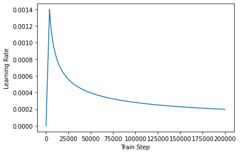

# 한국어 데이터로 챗봇 만들기

## 데이터 수집하기


```python
import tensorflow as tf
import tensorflow_datasets as tfds
import os
import re
import numpy as np
import matplotlib.pyplot as plt
import pandas as pd
```


```python
data = pd.read_csv(os.getenv('HOME') + '/aiffel/transformer_chatbot/data/ChatbotData .csv')
data
```


<table border="1" class="dataframe">
  <thead>
    <tr style="text-align: right;">
      <th></th>
      <th>Q</th>
      <th>A</th>
      <th>label</th>
    </tr>
  </thead>
  <tbody>
    <tr>
      <th>0</th>
      <td>12시 땡!</td>
      <td>하루가 또 가네요.</td>
      <td>0</td>
    </tr>
    <tr>
      <th>1</th>
      <td>1지망 학교 떨어졌어</td>
      <td>위로해 드립니다.</td>
      <td>0</td>
    </tr>
    <tr>
      <th>2</th>
      <td>3박4일 놀러가고 싶다</td>
      <td>여행은 언제나 좋죠.</td>
      <td>0</td>
    </tr>
    <tr>
      <th>3</th>
      <td>3박4일 정도 놀러가고 싶다</td>
      <td>여행은 언제나 좋죠.</td>
      <td>0</td>
    </tr>
    <tr>
      <th>4</th>
      <td>PPL 심하네</td>
      <td>눈살이 찌푸려지죠.</td>
      <td>0</td>
    </tr>
    <tr>
      <th>...</th>
      <td>...</td>
      <td>...</td>
      <td>...</td>
    </tr>
    <tr>
      <th>11818</th>
      <td>훔쳐보는 것도 눈치 보임.</td>
      <td>티가 나니까 눈치가 보이는 거죠!</td>
      <td>2</td>
    </tr>
    <tr>
      <th>11819</th>
      <td>훔쳐보는 것도 눈치 보임.</td>
      <td>훔쳐보는 거 티나나봐요.</td>
      <td>2</td>
    </tr>
    <tr>
      <th>11820</th>
      <td>흑기사 해주는 짝남.</td>
      <td>설렜겠어요.</td>
      <td>2</td>
    </tr>
    <tr>
      <th>11821</th>
      <td>힘든 연애 좋은 연애라는게 무슨 차이일까?</td>
      <td>잘 헤어질 수 있는 사이 여부인 거 같아요.</td>
      <td>2</td>
    </tr>
    <tr>
      <th>11822</th>
      <td>힘들어서 결혼할까봐</td>
      <td>도피성 결혼은 하지 않길 바라요.</td>
      <td>2</td>
    </tr>
  </tbody>
</table>
<p>11823 rows × 3 columns</p>
</div>


```python
MAX_SAMPLES = 11823
print(MAX_SAMPLES)
```

    11823


## 데이터 전처리하기


```python
def preprocess_sentence(sentence):
    sentence = sentence.lower().strip()
    sentence = re.sub(r"([?.!,])", r" \1 ", sentence)
    sentence = re.sub(r'[" "]+', " ", sentence)
    sentence = re.sub(r"[^가-힣?.!,]+", " ", sentence) #한글 전처리
    sentence = sentence.strip()
    return sentence
```


```python
def load_conversations():
    inputs, outputs = [], []
  #with open(path_to_movie_conversations, 'r') as file:
    #lines = file.readlines()

    for i in range(len(data)):
      # 전처리 함수를 질문에 해당되는 inputs와 답변에 해당되는 outputs에 적용.
        inputs.append(preprocess_sentence(data['Q'][i])) #questions
        outputs.append(preprocess_sentence(data['A'][i])) #answers
       
        if len(inputs) >= MAX_SAMPLES:
            return inputs, outputs
        
    return inputs, outputs
```


```python
questions, answers = load_conversations()
print('전체 샘플 수 :', len(questions))
print('전체 샘플 수 :', len(answers))
```

    전체 샘플 수 : 11823
    전체 샘플 수 : 11823


```python
print('전처리 후의 15번째 질문 샘플: {}'.format(questions[14]))
print('전처리 후의 15번째 답변 샘플: {}'.format(answers[14]))
```

    전처리 후의 15번째 질문 샘플: 가난한 자의 설움
    전처리 후의 15번째 답변 샘플: 돈은 다시 들어올 거예요 .


## SubwordTextEncoder 사용하기


```python
#각 단어에 고유한 정수 인덱스를 부여하기 위해 생성
import tensorflow_datasets as tfds

# 질문과 답변 데이터셋에 대해서 Vocabulary 생성. (Tensorflow 2.3.0 이상) (클라우드는 2.4 입니다)
tokenizer = tfds.deprecated.text.SubwordTextEncoder.build_from_corpus(questions + answers, target_vocab_size=2**13)

# 시작 토큰과 종료 토큰에 고유한 정수를 부여
START_TOKEN, END_TOKEN = [tokenizer.vocab_size], [tokenizer.vocab_size + 1]

#시작 토큰과 종료 토큰에 부여된 정수를 출력
print('START_TOKEN의 번호 :' ,[tokenizer.vocab_size])
print('END_TOKEN의 번호 :' ,[tokenizer.vocab_size + 1])
```

    START_TOKEN의 번호 : [8127]
    END_TOKEN의 번호 : [8128]


```python
VOCAB_SIZE = tokenizer.vocab_size + 2
print(VOCAB_SIZE)
```

    8129


```python
print('정수 인코딩 후의 15번째 질문 샘플: {}'.format(tokenizer.encode(questions[14])))
print('정수 인코딩 후의 15번째 답변 샘플: {}'.format(tokenizer.encode(answers[14])))
```

    정수 인코딩 후의 15번째 질문 샘플: [78, 743, 23, 149, 58, 957, 947]
    정수 인코딩 후의 15번째 답변 샘플: [5498, 69, 5471, 7903, 3, 1]


```python
MAX_LENGTH = 40
print(MAX_LENGTH)
```

    40


```python
def tokenize_and_filter(inputs, outputs):
  tokenized_inputs, tokenized_outputs = [], []
  
  for (sentence1, sentence2) in zip(inputs, outputs):
    # 정수 인코딩 과정에서 시작 토큰과 종료 토큰을 추가
    sentence1 = START_TOKEN + tokenizer.encode(sentence1) + END_TOKEN
    sentence2 = START_TOKEN + tokenizer.encode(sentence2) + END_TOKEN

    # 최대 길이 40 이하인 경우에만 데이터셋으로 허용
    if len(sentence1) <= MAX_LENGTH and len(sentence2) <= MAX_LENGTH:
      tokenized_inputs.append(sentence1)
      tokenized_outputs.append(sentence2)
  
  # 최대 길이 40으로 모든 데이터셋을 패딩
  tokenized_inputs = tf.keras.preprocessing.sequence.pad_sequences(
      tokenized_inputs, maxlen=MAX_LENGTH, padding='post')
  tokenized_outputs = tf.keras.preprocessing.sequence.pad_sequences(
      tokenized_outputs, maxlen=MAX_LENGTH, padding='post')
  
  return tokenized_inputs, tokenized_outputs
```


```python
questions, answers = tokenize_and_filter(questions, answers)
print('단어장의 크기 :',(VOCAB_SIZE))
print('필터링 후의 질문 샘플 개수: {}'.format(len(questions)))
print('필터링 후의 답변 샘플 개수: {}'.format(len(answers)))
```

    단어장의 크기 : 8129
    필터링 후의 질문 샘플 개수: 11823
    필터링 후의 답변 샘플 개수: 11823


```python
BATCH_SIZE = 128
BUFFER_SIZE = 20000

# 디코더는 이전의 target을 다음의 input으로 사용합니다.
# 이에 따라 outputs에서는 START_TOKEN을 제거하겠습니다.
dataset = tf.data.Dataset.from_tensor_slices((
    {
        'inputs': questions,
        'dec_inputs': answers[:, :-1]
    },
    {
        'outputs': answers[:, 1:]
    },
))

dataset = dataset.cache()
dataset = dataset.shuffle(BUFFER_SIZE)
dataset = dataset.batch(BATCH_SIZE)
dataset = dataset.prefetch(tf.data.experimental.AUTOTUNE)
```

## 모델 구성하기


```python
class PositionalEncoding(tf.keras.layers.Layer):

  def __init__(self, position, d_model):
    super(PositionalEncoding, self).__init__()
    self.pos_encoding = self.positional_encoding(position, d_model)

  def get_angles(self, position, i, d_model):
    angles = 1 / tf.pow(10000, (2 * (i // 2)) / tf.cast(d_model, tf.float32))
    return position * angles

  def positional_encoding(self, position, d_model):
    # 각도 배열 생성
    angle_rads = self.get_angles(
        position=tf.range(position, dtype=tf.float32)[:, tf.newaxis],
        i=tf.range(d_model, dtype=tf.float32)[tf.newaxis, :],
        d_model=d_model)

    # 배열의 짝수 인덱스에는 sin 함수 적용
    sines = tf.math.sin(angle_rads[:, 0::2])
    # 배열의 홀수 인덱스에는 cosine 함수 적용
    cosines = tf.math.cos(angle_rads[:, 1::2])

    # sin과 cosine이 교차되도록 재배열
    pos_encoding = tf.stack([sines, cosines], axis=0)
    pos_encoding = tf.transpose(pos_encoding,[1, 2, 0]) 
    pos_encoding = tf.reshape(pos_encoding, [position, d_model])

    pos_encoding = pos_encoding[tf.newaxis, ...]
    return tf.cast(pos_encoding, tf.float32)

  def call(self, inputs):
    return inputs + self.pos_encoding[:, :tf.shape(inputs)[1], :]
```


```python
def scaled_dot_product_attention(query, key, value, mask):
  # 어텐션 가중치는 Q와 K의 닷 프로덕트
  matmul_qk = tf.matmul(query, key, transpose_b=True)

  # 가중치를 정규화
  depth = tf.cast(tf.shape(key)[-1], tf.float32)
  logits = matmul_qk / tf.math.sqrt(depth)

  # 패딩에 마스크 추가
  if mask is not None:
    logits += (mask * -1e9)

  # softmax적용
  attention_weights = tf.nn.softmax(logits, axis=-1)

  # 최종 어텐션은 가중치와 V의 닷 프로덕트
  output = tf.matmul(attention_weights, value)
  return output
```


```python
class MultiHeadAttention(tf.keras.layers.Layer):

  def __init__(self, d_model, num_heads, name="multi_head_attention"):
    super(MultiHeadAttention, self).__init__(name=name)
    self.num_heads = num_heads
    self.d_model = d_model

    assert d_model % self.num_heads == 0

    self.depth = d_model // self.num_heads

    self.query_dense = tf.keras.layers.Dense(units=d_model)
    self.key_dense = tf.keras.layers.Dense(units=d_model)
    self.value_dense = tf.keras.layers.Dense(units=d_model)

    self.dense = tf.keras.layers.Dense(units=d_model)

  def split_heads(self, inputs, batch_size):
    inputs = tf.reshape(
        inputs, shape=(batch_size, -1, self.num_heads, self.depth))
    return tf.transpose(inputs, perm=[0, 2, 1, 3])

  def call(self, inputs):
    query, key, value, mask = inputs['query'], inputs['key'], inputs[
        'value'], inputs['mask']
    batch_size = tf.shape(query)[0]

    # Q, K, V에 각각 Dense를 적용합니다
    query = self.query_dense(query)
    key = self.key_dense(key)
    value = self.value_dense(value)

    # 병렬 연산을 위한 머리를 여러 개 만듭니다
    query = self.split_heads(query, batch_size)
    key = self.split_heads(key, batch_size)
    value = self.split_heads(value, batch_size)

    # 스케일드 닷 프로덕트 어텐션 함수
    scaled_attention = scaled_dot_product_attention(query, key, value, mask)

    scaled_attention = tf.transpose(scaled_attention, perm=[0, 2, 1, 3])

    # 어텐션 연산 후에 각 결과를 다시 연결(concatenate)합니다
    concat_attention = tf.reshape(scaled_attention,
                                  (batch_size, -1, self.d_model))

    # 최종 결과에도 Dense를 한 번 더 적용합니다
    outputs = self.dense(concat_attention)

    return outputs
```


```python
def create_padding_mask(x):
  mask = tf.cast(tf.math.equal(x, 0), tf.float32)
  # (batch_size, 1, 1, sequence length)
  return mask[:, tf.newaxis, tf.newaxis, :]
```


```python
def create_look_ahead_mask(x):
  seq_len = tf.shape(x)[1]
  look_ahead_mask = 1 - tf.linalg.band_part(tf.ones((seq_len, seq_len)), -1, 0)
  padding_mask = create_padding_mask(x)
  return tf.maximum(look_ahead_mask, padding_mask)
```


```python
def encoder_layer(units, d_model, num_heads, dropout, name="encoder_layer"):
  inputs = tf.keras.Input(shape=(None, d_model), name="inputs")

  # 패딩 마스크 사용
  padding_mask = tf.keras.Input(shape=(1, 1, None), name="padding_mask")

  # 첫 번째 서브 레이어 : 멀티 헤드 어텐션 수행 (셀프 어텐션)
  attention = MultiHeadAttention(
      d_model, num_heads, name="attention")({
          'query': inputs,
          'key': inputs,
          'value': inputs,
          'mask': padding_mask
      })

  # 어텐션의 결과는 Dropout과 Layer Normalization이라는 훈련을 돕는 테크닉을 수행
  attention = tf.keras.layers.Dropout(rate=dropout)(attention)
  attention = tf.keras.layers.LayerNormalization(
      epsilon=1e-6)(inputs + attention)

  # 두 번째 서브 레이어 : 2개의 완전연결층
  outputs = tf.keras.layers.Dense(units=units, activation='relu')(attention)
  outputs = tf.keras.layers.Dense(units=d_model)(outputs)

  # 완전연결층의 결과는 Dropout과 LayerNormalization이라는 훈련을 돕는 테크닉을 수행
  outputs = tf.keras.layers.Dropout(rate=dropout)(outputs)
  outputs = tf.keras.layers.LayerNormalization(
      epsilon=1e-6)(attention + outputs)

  return tf.keras.Model(
      inputs=[inputs, padding_mask], outputs=outputs, name=name)
```


```python
def encoder(vocab_size,
            num_layers,
            units,
            d_model,
            num_heads,
            dropout,
            name="encoder"):
  inputs = tf.keras.Input(shape=(None,), name="inputs")

  # 패딩 마스크 사용
  padding_mask = tf.keras.Input(shape=(1, 1, None), name="padding_mask")

  # 임베딩 레이어
  embeddings = tf.keras.layers.Embedding(vocab_size, d_model)(inputs)
  embeddings *= tf.math.sqrt(tf.cast(d_model, tf.float32))

  # 포지셔널 인코딩
  embeddings = PositionalEncoding(vocab_size, d_model)(embeddings)

  outputs = tf.keras.layers.Dropout(rate=dropout)(embeddings)

  # num_layers만큼 쌓아올린 인코더의 층.
  for i in range(num_layers):
    outputs = encoder_layer(
        units=units,
        d_model=d_model,
        num_heads=num_heads,
        dropout=dropout,
        name="encoder_layer_{}".format(i),
    )([outputs, padding_mask])

  return tf.keras.Model(
      inputs=[inputs, padding_mask], outputs=outputs, name=name)
```


```python
def decoder_layer(units, d_model, num_heads, dropout, name="decoder_layer"):
  inputs = tf.keras.Input(shape=(None, d_model), name="inputs")
  enc_outputs = tf.keras.Input(shape=(None, d_model), name="encoder_outputs")
  look_ahead_mask = tf.keras.Input(
      shape=(1, None, None), name="look_ahead_mask")
  padding_mask = tf.keras.Input(shape=(1, 1, None), name='padding_mask')

  # 첫 번째 서브 레이어 : 멀티 헤드 어텐션 수행 (셀프 어텐션)
  attention1 = MultiHeadAttention(
      d_model, num_heads, name="attention_1")(inputs={
          'query': inputs,
          'key': inputs,
          'value': inputs,
          'mask': look_ahead_mask
      })

  # 멀티 헤드 어텐션의 결과는 LayerNormalization이라는 훈련을 돕는 테크닉을 수행
  attention1 = tf.keras.layers.LayerNormalization(
      epsilon=1e-6)(attention1 + inputs)

  # 두 번째 서브 레이어 : 마스크드 멀티 헤드 어텐션 수행 (인코더-디코더 어텐션)
  attention2 = MultiHeadAttention(
      d_model, num_heads, name="attention_2")(inputs={
          'query': attention1,
          'key': enc_outputs,
          'value': enc_outputs,
          'mask': padding_mask
      })

  # 마스크드 멀티 헤드 어텐션의 결과는
  # Dropout과 LayerNormalization이라는 훈련을 돕는 테크닉을 수행
  attention2 = tf.keras.layers.Dropout(rate=dropout)(attention2)
  attention2 = tf.keras.layers.LayerNormalization(
      epsilon=1e-6)(attention2 + attention1)

  # 세 번째 서브 레이어 : 2개의 완전연결층
  outputs = tf.keras.layers.Dense(units=units, activation='relu')(attention2)
  outputs = tf.keras.layers.Dense(units=d_model)(outputs)

  # 완전연결층의 결과는 Dropout과 LayerNormalization 수행
  outputs = tf.keras.layers.Dropout(rate=dropout)(outputs)
  outputs = tf.keras.layers.LayerNormalization(
      epsilon=1e-6)(outputs + attention2)

  return tf.keras.Model(
      inputs=[inputs, enc_outputs, look_ahead_mask, padding_mask],
      outputs=outputs,
      name=name)
```


```python
def decoder(vocab_size,
            num_layers,
            units,
            d_model,
            num_heads,
            dropout,
            name='decoder'):
  inputs = tf.keras.Input(shape=(None,), name='inputs')
  enc_outputs = tf.keras.Input(shape=(None, d_model), name='encoder_outputs')
  look_ahead_mask = tf.keras.Input(
      shape=(1, None, None), name='look_ahead_mask')

  # 패딩 마스크
  padding_mask = tf.keras.Input(shape=(1, 1, None), name='padding_mask')
  
  # 임베딩 레이어
  embeddings = tf.keras.layers.Embedding(vocab_size, d_model)(inputs)
  embeddings *= tf.math.sqrt(tf.cast(d_model, tf.float32))

  # 포지셔널 인코딩
  embeddings = PositionalEncoding(vocab_size, d_model)(embeddings)

  # Dropout이라는 훈련을 돕는 테크닉을 수행
  outputs = tf.keras.layers.Dropout(rate=dropout)(embeddings)

  for i in range(num_layers):
    outputs = decoder_layer(
        units=units,
        d_model=d_model,
        num_heads=num_heads,
        dropout=dropout,
        name='decoder_layer_{}'.format(i),
    )(inputs=[outputs, enc_outputs, look_ahead_mask, padding_mask])

  return tf.keras.Model(
      inputs=[inputs, enc_outputs, look_ahead_mask, padding_mask],
      outputs=outputs,
      name=name)
```


```python
#앞서 사용한 인코더 층 함수와 디코더 층 함수를 사용하여 트랜스포머 함수를 정의
def transformer(vocab_size,
                num_layers,
                units,
                d_model,
                num_heads,
                dropout,
                name="transformer"):
  inputs = tf.keras.Input(shape=(None,), name="inputs")
  dec_inputs = tf.keras.Input(shape=(None,), name="dec_inputs")

  # 인코더에서 패딩을 위한 마스크
  enc_padding_mask = tf.keras.layers.Lambda(
      create_padding_mask, output_shape=(1, 1, None),
      name='enc_padding_mask')(inputs)

  # 디코더에서 미래의 토큰을 마스크 하기 위해서 사용합니다.
  # 내부적으로 패딩 마스크도 포함되어져 있습니다.
  look_ahead_mask = tf.keras.layers.Lambda(
      create_look_ahead_mask,
      output_shape=(1, None, None),
      name='look_ahead_mask')(dec_inputs)

  # 두 번째 어텐션 블록에서 인코더의 벡터들을 마스킹
  # 디코더에서 패딩을 위한 마스크
  dec_padding_mask = tf.keras.layers.Lambda(
      create_padding_mask, output_shape=(1, 1, None),
      name='dec_padding_mask')(inputs)

  # 인코더
  enc_outputs = encoder(
      vocab_size=vocab_size,
      num_layers=num_layers,
      units=units,
      d_model=d_model,
      num_heads=num_heads,
      dropout=dropout,
  )(inputs=[inputs, enc_padding_mask])

  # 디코더
  dec_outputs = decoder(
      vocab_size=vocab_size,
      num_layers=num_layers,
      units=units,
      d_model=d_model,
      num_heads=num_heads,
      dropout=dropout,
  )(inputs=[dec_inputs, enc_outputs, look_ahead_mask, dec_padding_mask])

  # 완전연결층
  outputs = tf.keras.layers.Dense(units=vocab_size, name="outputs")(dec_outputs)

  return tf.keras.Model(inputs=[inputs, dec_inputs], outputs=outputs, name=name)
```


```python
tf.keras.backend.clear_session()


NUM_LAYERS = 2
D_MODEL = 256 
NUM_HEADS = 8 
UNITS = 512 
DROPOUT = 0.1 

model = transformer(
    vocab_size=VOCAB_SIZE,
    num_layers=NUM_LAYERS,
    units=UNITS,
    d_model=D_MODEL,
    num_heads=NUM_HEADS,
    dropout=DROPOUT)

model.summary()
```

    Model: "transformer"
    __________________________________________________________________________________________________
    Layer (type)                    Output Shape         Param #     Connected to                     
    ==================================================================================================
    inputs (InputLayer)             [(None, None)]       0                                            
    __________________________________________________________________________________________________
    dec_inputs (InputLayer)         [(None, None)]       0                                            
    __________________________________________________________________________________________________
    enc_padding_mask (Lambda)       (None, 1, 1, None)   0           inputs[0][0]                     
    __________________________________________________________________________________________________
    encoder (Functional)            (None, None, 256)    3135232     inputs[0][0]                     
                                                                     enc_padding_mask[0][0]           
    __________________________________________________________________________________________________
    look_ahead_mask (Lambda)        (None, 1, None, None 0           dec_inputs[0][0]                 
    __________________________________________________________________________________________________
    dec_padding_mask (Lambda)       (None, 1, 1, None)   0           inputs[0][0]                     
    __________________________________________________________________________________________________
    decoder (Functional)            (None, None, 256)    3662592     dec_inputs[0][0]                 
                                                                     encoder[0][0]                    
                                                                     look_ahead_mask[0][0]            
                                                                     dec_padding_mask[0][0]           
    __________________________________________________________________________________________________
    outputs (Dense)                 (None, None, 8129)   2089153     decoder[0][0]                    
    ==================================================================================================
    Total params: 8,886,977
    Trainable params: 8,886,977
    Non-trainable params: 0
    __________________________________________________________________________________________________


```python
def loss_function(y_true, y_pred):
  y_true = tf.reshape(y_true, shape=(-1, MAX_LENGTH - 1))
  
  loss = tf.keras.losses.SparseCategoricalCrossentropy(
      from_logits=True, reduction='none')(y_true, y_pred)

  mask = tf.cast(tf.not_equal(y_true, 0), tf.float32)
  loss = tf.multiply(loss, mask)

  return tf.reduce_mean(loss)
```


```python
class CustomSchedule(tf.keras.optimizers.schedules.LearningRateSchedule):

  def __init__(self, d_model, warmup_steps=4000):
    super(CustomSchedule, self).__init__()

    self.d_model = d_model
    self.d_model = tf.cast(self.d_model, tf.float32)

    self.warmup_steps = warmup_steps

  def __call__(self, step):
    arg1 = tf.math.rsqrt(step)
    arg2 = step * (self.warmup_steps**-1.5)

    return tf.math.rsqrt(self.d_model) * tf.math.minimum(arg1, arg2)
```


```python
sample_learning_rate = CustomSchedule(d_model=128)

plt.plot(sample_learning_rate(tf.range(200000, dtype=tf.float32)))
plt.ylabel("Learning Rate")
plt.xlabel("Train Step")
```


    Text(0.5, 0, 'Train Step')


    

    


```python
learning_rate = CustomSchedule(D_MODEL)

optimizer = tf.keras.optimizers.Adam(
    learning_rate, beta_1=0.9, beta_2=0.98, epsilon=1e-9)

def accuracy(y_true, y_pred):
  y_true = tf.reshape(y_true, shape=(-1, MAX_LENGTH - 1))
  return tf.keras.metrics.sparse_categorical_accuracy(y_true, y_pred)

model.compile(optimizer=optimizer, loss=loss_function, metrics=[accuracy])
```


```python
EPOCHS = 50
model.fit(dataset, epochs=EPOCHS, verbose=1)
```

    Epoch 1/50
    93/93 [==============================] - 16s 90ms/step - loss: 1.5212 - accuracy: 0.0181
    Epoch 2/50
    93/93 [==============================] - 8s 89ms/step - loss: 1.3768 - accuracy: 0.0461
    Epoch 3/50
    93/93 [==============================] - 8s 89ms/step - loss: 1.2221 - accuracy: 0.0493
    Epoch 4/50
    93/93 [==============================] - 8s 90ms/step - loss: 1.0918 - accuracy: 0.0499
    Epoch 5/50
    93/93 [==============================] - 8s 90ms/step - loss: 1.0029 - accuracy: 0.0503
    Epoch 6/50
    93/93 [==============================] - 8s 90ms/step - loss: 0.9480 - accuracy: 0.0530
    Epoch 7/50
    93/93 [==============================] - 8s 91ms/step - loss: 0.9065 - accuracy: 0.0554
    Epoch 8/50
    93/93 [==============================] - 8s 91ms/step - loss: 0.8676 - accuracy: 0.0575
    Epoch 9/50
    93/93 [==============================] - 9s 92ms/step - loss: 0.8290 - accuracy: 0.0600
    Epoch 10/50
    93/93 [==============================] - 9s 92ms/step - loss: 0.7885 - accuracy: 0.0637
    Epoch 11/50
    93/93 [==============================] - 9s 93ms/step - loss: 0.7444 - accuracy: 0.0678
    Epoch 12/50
    93/93 [==============================] - 9s 93ms/step - loss: 0.6973 - accuracy: 0.0730
    Epoch 13/50
    93/93 [==============================] - 9s 93ms/step - loss: 0.6469 - accuracy: 0.0787
    Epoch 14/50
    93/93 [==============================] - 9s 92ms/step - loss: 0.5946 - accuracy: 0.0845
    Epoch 15/50
    93/93 [==============================] - 9s 92ms/step - loss: 0.5404 - accuracy: 0.0909
    Epoch 16/50
    93/93 [==============================] - 9s 92ms/step - loss: 0.4855 - accuracy: 0.0976
    Epoch 17/50
    93/93 [==============================] - 9s 92ms/step - loss: 0.4306 - accuracy: 0.1046
    Epoch 18/50
    93/93 [==============================] - 9s 92ms/step - loss: 0.3755 - accuracy: 0.1122
    Epoch 19/50
    93/93 [==============================] - 9s 92ms/step - loss: 0.3220 - accuracy: 0.1205
    Epoch 20/50
    93/93 [==============================] - 9s 93ms/step - loss: 0.2710 - accuracy: 0.1284
    Epoch 21/50
    93/93 [==============================] - 9s 93ms/step - loss: 0.2238 - accuracy: 0.1362
    Epoch 22/50
    93/93 [==============================] - 9s 93ms/step - loss: 0.1804 - accuracy: 0.1434
    Epoch 23/50
    93/93 [==============================] - 9s 92ms/step - loss: 0.1423 - accuracy: 0.1502
    Epoch 24/50
    93/93 [==============================] - 9s 92ms/step - loss: 0.1092 - accuracy: 0.1564
    Epoch 25/50
    93/93 [==============================] - 9s 93ms/step - loss: 0.0828 - accuracy: 0.1615
    Epoch 26/50
    93/93 [==============================] - 9s 92ms/step - loss: 0.0620 - accuracy: 0.1650
    Epoch 27/50
    93/93 [==============================] - 9s 93ms/step - loss: 0.0461 - accuracy: 0.1676
    Epoch 28/50
    93/93 [==============================] - 9s 93ms/step - loss: 0.0359 - accuracy: 0.1689
    Epoch 29/50
    93/93 [==============================] - 9s 92ms/step - loss: 0.0292 - accuracy: 0.1698
    Epoch 30/50
    93/93 [==============================] - 9s 93ms/step - loss: 0.0253 - accuracy: 0.1702
    Epoch 31/50
    93/93 [==============================] - 9s 93ms/step - loss: 0.0216 - accuracy: 0.1706
    Epoch 32/50
    93/93 [==============================] - 9s 93ms/step - loss: 0.0203 - accuracy: 0.1706
    Epoch 33/50
    93/93 [==============================] - 9s 93ms/step - loss: 0.0187 - accuracy: 0.1709
    Epoch 34/50
    93/93 [==============================] - 9s 92ms/step - loss: 0.0180 - accuracy: 0.1708
    Epoch 35/50
    93/93 [==============================] - 9s 92ms/step - loss: 0.0179 - accuracy: 0.1708
    Epoch 36/50
    93/93 [==============================] - 9s 93ms/step - loss: 0.0165 - accuracy: 0.1711
    Epoch 37/50
    93/93 [==============================] - 9s 92ms/step - loss: 0.0168 - accuracy: 0.1709
    Epoch 38/50
    93/93 [==============================] - 9s 92ms/step - loss: 0.0161 - accuracy: 0.1710
    Epoch 39/50
    93/93 [==============================] - 9s 93ms/step - loss: 0.0154 - accuracy: 0.1712
    Epoch 40/50
    93/93 [==============================] - 9s 93ms/step - loss: 0.0156 - accuracy: 0.1710
    Epoch 41/50
    93/93 [==============================] - 9s 93ms/step - loss: 0.0157 - accuracy: 0.1710
    Epoch 42/50
    93/93 [==============================] - 9s 93ms/step - loss: 0.0150 - accuracy: 0.1713
    Epoch 43/50
    93/93 [==============================] - 9s 93ms/step - loss: 0.0155 - accuracy: 0.1710
    Epoch 44/50
    93/93 [==============================] - 9s 92ms/step - loss: 0.0152 - accuracy: 0.1711
    Epoch 45/50
    93/93 [==============================] - 9s 92ms/step - loss: 0.0135 - accuracy: 0.1715
    Epoch 46/50
    93/93 [==============================] - 9s 92ms/step - loss: 0.0132 - accuracy: 0.1716
    Epoch 47/50
    93/93 [==============================] - 9s 92ms/step - loss: 0.0121 - accuracy: 0.1718
    Epoch 48/50
    93/93 [==============================] - 9s 92ms/step - loss: 0.0122 - accuracy: 0.1718
    Epoch 49/50
    93/93 [==============================] - 9s 92ms/step - loss: 0.0111 - accuracy: 0.1721
    Epoch 50/50
    93/93 [==============================] - 9s 92ms/step - loss: 0.0107 - accuracy: 0.1722


    <keras.callbacks.History at 0x7f42d8165dc0>


## 모델 평가하기


```python
#예측(inference)으로 챗봇 테스트하기
def decoder_inference(sentence):
  sentence = preprocess_sentence(sentence)

  # 입력된 문장을 정수 인코딩 후, 시작 토큰과 종료 토큰을 앞뒤로 추가.
  # ex) Where have you been? → [[8331   86   30    5 1059    7 8332]]
  sentence = tf.expand_dims(
      START_TOKEN + tokenizer.encode(sentence) + END_TOKEN, axis=0)

  # 디코더의 현재까지의 예측한 출력 시퀀스가 지속적으로 저장되는 변수.
  # 처음에는 예측한 내용이 없음으로 시작 토큰만 별도 저장. ex) 8331
  output_sequence = tf.expand_dims(START_TOKEN, 0)

  # 디코더의 인퍼런스 단계
  for i in range(MAX_LENGTH):
    # 디코더는 최대 MAX_LENGTH의 길이만큼 다음 단어 예측을 반복합니다.
    predictions = model(inputs=[sentence, output_sequence], training=False)
    predictions = predictions[:, -1:, :]

    # 현재 예측한 단어의 정수
    predicted_id = tf.cast(tf.argmax(predictions, axis=-1), tf.int32)

    # 만약 현재 예측한 단어가 종료 토큰이라면 for문을 종료
    if tf.equal(predicted_id, END_TOKEN[0]):
      break

    # 예측한 단어들은 지속적으로 output_sequence에 추가됩니다.
    # 이 output_sequence는 다시 디코더의 입력이 됩니다.
    output_sequence = tf.concat([output_sequence, predicted_id], axis=-1)

  return tf.squeeze(output_sequence, axis=0)
```


```python
#임의의 입력 문장에 대해서 decoder_inference() 함수를 호출하여 챗봇의 대답을 얻는 sentence_generation() 함수를 만듭니다.
def sentence_generation(sentence):
  # 입력 문장에 대해서 디코더를 동작 시켜 예측된 정수 시퀀스를 리턴받습니다.
  prediction = decoder_inference(sentence)

  # 정수 시퀀스를 다시 텍스트 시퀀스로 변환합니다.
  predicted_sentence = tokenizer.decode(
      [i for i in prediction if i < tokenizer.vocab_size])

  print('입력 : {}'.format(sentence))
  print('출력 : {}'.format(predicted_sentence))

  return predicted_sentence
```


```python
sentence_generation('뭐 먹을까')
```

    입력 : 뭐 먹을까
    출력 : 좀 먹어도 괜찮아요 .


    '좀 먹어도 괜찮아요 .'


```python
sentence_generation('심심해')
```

    입력 : 심심해
    출력 : 친구들과 연락해보세요 .


    '친구들과 연락해보세요 .'


```python
sentence_generation('피곤하다')
```

    입력 : 피곤하다
    출력 : 사소한 거라도 있을 거예요 .


    '사소한 거라도 있을 거예요 .'


```python

```


```python

```
