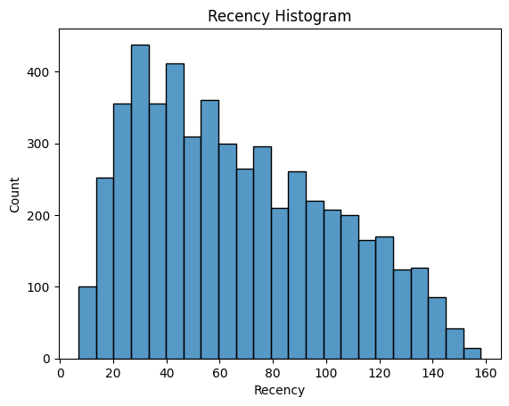

위에서 했던 게임 회사 매출 분석을 이어서 해보려고 한다.

목차

[1. 기업 고객 이탈 원인 분석](#기업-고객-이탈-원인-분석)

2월, 3월 고객에 이어 4월 고객이 또 줄어들었다.

기존 원인과는 다른 결과를 찾아내보자.

[2. 기업의 VIP](#기업의-vip)

게임을 많이 즐기고, 결제를 많이 한 고객을 위해 VIP 선정을 하려고 한다.

VIP 선정 기준은 RFM(Recency, Frequency, Monetary)으로

가장 최근에 구매한 고객, 가장 빈번하게 구매한 고객, 가장 많은 금액을 구매한 고객을 기준으로 고객에게 등급을 부여하는 방식이다.

5월까지의 고객데이터를 이용하여 분석

[1. VIP들은 어떤 게임 플레이를 하고 있을까?](#vip들은-어떤-게임-플레이를-하고-있을까?)

고객들의 레벨점수와 시간점수를 이용해 머신러닝 중 비지도학습 유형인 군집분석으로 플레이 유형을 도출

# 기업 고객 이탈 원인 분석

2월, 3월 고객에 이어 4월 고객이 또 줄어들었다.

기존 원인과는 다른 결과를 찾아내보자.

목차

1. 데이터 불러오기


2. 데이터 시각화


## 데이터 불러오기


```python
import pandas as pd
import numpy as np
import matplotlib.pyplot as plt
plt.style.use('default')
import seaborn as sns
```


```python
sales_data = pd.read_csv('~/aiffel/data_analysis_basic/data/sales_7.csv')
customer_data = pd.read_csv('~/aiffel/data_analysis_basic/data/customer_7.csv')
```


```python
customer_data.head()
```


<div>
<style scoped>
    .dataframe tbody tr th:only-of-type {
        vertical-align: middle;
    }

    .dataframe tbody tr th {
        vertical-align: top;
    }

    .dataframe thead th {
        text-align: right;
    }
</style>
<table border="1" class="dataframe">
  <thead>
    <tr style="text-align: right;">
      <th></th>
      <th>Customer_ID</th>
      <th>Name</th>
      <th>Nickname</th>
      <th>Password</th>
      <th>Email</th>
      <th>Birth</th>
      <th>Gender</th>
      <th>C.P.</th>
      <th>MobileCompany</th>
      <th>OS</th>
    </tr>
  </thead>
  <tbody>
    <tr>
      <th>0</th>
      <td>facilis140</td>
      <td>이영순</td>
      <td>quos</td>
      <td>********</td>
      <td>coejongsu@yu.kr</td>
      <td>1989-03-11</td>
      <td>female</td>
      <td>01x9-4x625-x5x3x</td>
      <td>LGU</td>
      <td>iOS</td>
    </tr>
    <tr>
      <th>1</th>
      <td>debitis994</td>
      <td>김중수</td>
      <td>molestiae</td>
      <td>********</td>
      <td>jiweon02@ju.org</td>
      <td>1995-11-19</td>
      <td>male</td>
      <td>01x9-3x228-x3x9x</td>
      <td>KT</td>
      <td>iOS</td>
    </tr>
    <tr>
      <th>2</th>
      <td>possimus246</td>
      <td>양은경</td>
      <td>rem</td>
      <td>********</td>
      <td>coesubin@jusighoesa.com</td>
      <td>2005-12-24</td>
      <td>female</td>
      <td>01x9-7x873-x2x2x</td>
      <td>LGU</td>
      <td>Android</td>
    </tr>
    <tr>
      <th>3</th>
      <td>occaecati138</td>
      <td>백도윤</td>
      <td>libero</td>
      <td>********</td>
      <td>yeongceol80@gangryu.kr</td>
      <td>2003-02-09</td>
      <td>female</td>
      <td>01x9-3x519-x7x1x</td>
      <td>SKT</td>
      <td>iOS</td>
    </tr>
    <tr>
      <th>4</th>
      <td>corrupti325</td>
      <td>김영수</td>
      <td>temporibus</td>
      <td>********</td>
      <td>jiweon96@yu.net</td>
      <td>2004-05-04</td>
      <td>male</td>
      <td>01x9-0x079-x9x2x</td>
      <td>LGU</td>
      <td>Android</td>
    </tr>
  </tbody>
</table>
</div>


```python
customer_data.info()
```

    <class 'pandas.core.frame.DataFrame'>
    RangeIndex: 99845 entries, 0 to 99844
    Data columns (total 10 columns):
     #   Column         Non-Null Count  Dtype 
    ---  ------         --------------  ----- 
     0   Customer_ID    99845 non-null  object
     1   Name           99845 non-null  object
     2   Nickname       99845 non-null  object
     3   Password       99845 non-null  object
     4   Email          99845 non-null  object
     5   Birth          99845 non-null  object
     6   Gender         99845 non-null  object
     7   C.P.           99845 non-null  object
     8   MobileCompany  99845 non-null  object
     9   OS             99845 non-null  object
    dtypes: object(10)
    memory usage: 7.6+ MB


3월 까지의 데이터이므로 두 개의 데이터를 결합한다.


```python
customer_03 = pd.merge(sales_data, customer_data, on="Customer_ID")
customer_03.head()
```


<div>
<style scoped>
    .dataframe tbody tr th:only-of-type {
        vertical-align: middle;
    }

    .dataframe tbody tr th {
        vertical-align: top;
    }

    .dataframe thead th {
        text-align: right;
    }
</style>
<table border="1" class="dataframe">
  <thead>
    <tr style="text-align: right;">
      <th></th>
      <th>install</th>
      <th>Time_stamp</th>
      <th>Game_Name</th>
      <th>Status</th>
      <th>Payment</th>
      <th>Customer_ID</th>
      <th>Name</th>
      <th>Nickname</th>
      <th>Password</th>
      <th>Email</th>
      <th>Birth</th>
      <th>Gender</th>
      <th>C.P.</th>
      <th>MobileCompany</th>
      <th>OS</th>
    </tr>
  </thead>
  <tbody>
    <tr>
      <th>0</th>
      <td>2022-01-08</td>
      <td>2022-02-05</td>
      <td>MineGround</td>
      <td>play</td>
      <td>4900</td>
      <td>facilis140</td>
      <td>이영순</td>
      <td>quos</td>
      <td>********</td>
      <td>coejongsu@yu.kr</td>
      <td>1989-03-11</td>
      <td>female</td>
      <td>01x9-4x625-x5x3x</td>
      <td>LGU</td>
      <td>iOS</td>
    </tr>
    <tr>
      <th>1</th>
      <td>2022-01-05</td>
      <td>2022-02-17</td>
      <td>MineGround</td>
      <td>play</td>
      <td>29900</td>
      <td>debitis994</td>
      <td>김중수</td>
      <td>molestiae</td>
      <td>********</td>
      <td>jiweon02@ju.org</td>
      <td>1995-11-19</td>
      <td>male</td>
      <td>01x9-3x228-x3x9x</td>
      <td>KT</td>
      <td>iOS</td>
    </tr>
    <tr>
      <th>2</th>
      <td>2022-01-29</td>
      <td>2022-02-06</td>
      <td>MineGround</td>
      <td>play</td>
      <td>4900</td>
      <td>possimus246</td>
      <td>양은경</td>
      <td>rem</td>
      <td>********</td>
      <td>coesubin@jusighoesa.com</td>
      <td>2005-12-24</td>
      <td>female</td>
      <td>01x9-7x873-x2x2x</td>
      <td>LGU</td>
      <td>Android</td>
    </tr>
    <tr>
      <th>3</th>
      <td>2022-01-09</td>
      <td>2022-02-05</td>
      <td>MineGround</td>
      <td>play</td>
      <td>900</td>
      <td>occaecati138</td>
      <td>백도윤</td>
      <td>libero</td>
      <td>********</td>
      <td>yeongceol80@gangryu.kr</td>
      <td>2003-02-09</td>
      <td>female</td>
      <td>01x9-3x519-x7x1x</td>
      <td>SKT</td>
      <td>iOS</td>
    </tr>
    <tr>
      <th>4</th>
      <td>2022-01-08</td>
      <td>2022-02-01</td>
      <td>MineGround</td>
      <td>play</td>
      <td>900</td>
      <td>corrupti325</td>
      <td>김영수</td>
      <td>temporibus</td>
      <td>********</td>
      <td>jiweon96@yu.net</td>
      <td>2004-05-04</td>
      <td>male</td>
      <td>01x9-0x079-x9x2x</td>
      <td>LGU</td>
      <td>Android</td>
    </tr>
  </tbody>
</table>
</div>


4월 데이터


```python
customer_04 = pd.read_csv('~/aiffel/data_analysis_basic/data/customer_04_7.csv')
customer_04.head()
```


<div>
<style scoped>
    .dataframe tbody tr th:only-of-type {
        vertical-align: middle;
    }

    .dataframe tbody tr th {
        vertical-align: top;
    }

    .dataframe thead th {
        text-align: right;
    }
</style>
<table border="1" class="dataframe">
  <thead>
    <tr style="text-align: right;">
      <th></th>
      <th>install</th>
      <th>Time_stamp</th>
      <th>Game_Name</th>
      <th>Status</th>
      <th>Payment</th>
      <th>Customer_ID</th>
      <th>Name</th>
      <th>Nickname</th>
      <th>Password</th>
      <th>Email</th>
      <th>Birth</th>
      <th>Gender</th>
      <th>C.P.</th>
      <th>MobileCompany</th>
      <th>OS</th>
    </tr>
  </thead>
  <tbody>
    <tr>
      <th>0</th>
      <td>2022-03-12</td>
      <td>2022-04-03</td>
      <td>MineGround</td>
      <td>play</td>
      <td>19900.0</td>
      <td>cupiditate206</td>
      <td>우은정</td>
      <td>tempora</td>
      <td>********</td>
      <td>jangsugja@ijijang.com</td>
      <td>1987-05-31</td>
      <td>female</td>
      <td>01x9-2x483-x1x2x</td>
      <td>SKT</td>
      <td>Android</td>
    </tr>
    <tr>
      <th>1</th>
      <td>2022-01-25</td>
      <td>2022-04-03</td>
      <td>MineGround</td>
      <td>play</td>
      <td>0.0</td>
      <td>quis973</td>
      <td>박지아</td>
      <td>unde</td>
      <td>********</td>
      <td>gimjieun@yuhanhoesa.com</td>
      <td>2000-01-24</td>
      <td>male</td>
      <td>01x9-4x193-x4x2x</td>
      <td>KT</td>
      <td>Android</td>
    </tr>
    <tr>
      <th>2</th>
      <td>2022-01-20</td>
      <td>2022-04-02</td>
      <td>SoccerManager</td>
      <td>play</td>
      <td>49900.0</td>
      <td>ex368</td>
      <td>김하윤</td>
      <td>animi</td>
      <td>********</td>
      <td>jangyeongil@gimcoe.org</td>
      <td>1984-05-16</td>
      <td>male</td>
      <td>01x9-1x376-x1x2x</td>
      <td>MVNO</td>
      <td>Android</td>
    </tr>
    <tr>
      <th>3</th>
      <td>2022-01-18</td>
      <td>2022-04-04</td>
      <td>SoccerManager</td>
      <td>play</td>
      <td>0.0</td>
      <td>labore792</td>
      <td>최경자</td>
      <td>asperiores</td>
      <td>********</td>
      <td>jangjeongsig@ju.com</td>
      <td>1984-02-21</td>
      <td>female</td>
      <td>01x9-6x056-x4x5x</td>
      <td>SKT</td>
      <td>iOS</td>
    </tr>
    <tr>
      <th>4</th>
      <td>2022-02-11</td>
      <td>2022-04-26</td>
      <td>SoccerManager</td>
      <td>play</td>
      <td>900.0</td>
      <td>quibusdam041</td>
      <td>류민재</td>
      <td>fugit</td>
      <td>********</td>
      <td>cgang@jusighoesa.com</td>
      <td>2004-11-06</td>
      <td>female</td>
      <td>01x9-6x314-x5x1x</td>
      <td>MVNO</td>
      <td>iOS</td>
    </tr>
  </tbody>
</table>
</div>


```python
customer_04.info()
```

    <class 'pandas.core.frame.DataFrame'>
    RangeIndex: 35123 entries, 0 to 35122
    Data columns (total 15 columns):
     #   Column         Non-Null Count  Dtype  
    ---  ------         --------------  -----  
     0   install        35123 non-null  object 
     1   Time_stamp     35123 non-null  object 
     2   Game_Name      35123 non-null  object 
     3   Status         35123 non-null  object 
     4   Payment        35123 non-null  float64
     5   Customer_ID    35123 non-null  object 
     6   Name           35123 non-null  object 
     7   Nickname       35123 non-null  object 
     8   Password       35123 non-null  object 
     9   Email          35123 non-null  object 
     10  Birth          35123 non-null  object 
     11  Gender         35123 non-null  object 
     12  C.P.           35123 non-null  object 
     13  MobileCompany  35123 non-null  object 
     14  OS             35123 non-null  object 
    dtypes: float64(1), object(14)
    memory usage: 4.0+ MB


sales 데이터까지 합쳐져있다.

3월, 4월 데이터도 합쳐본다.


```python
total_sales_data = pd.concat([customer_03, customer_04])
```

play인 행들만 골라 player_data 변수로 정의한 후,

Time_stamp 값 중 앞에서 7번째 값까지 입력


```python
player_data = total_sales_data[total_sales_data['Status'] == 'play']

player_data['date'] = player_data['Time_stamp'].str[:7]
player_data.head()
```

    /tmp/ipykernel_152/1233916796.py:3: SettingWithCopyWarning: 
    A value is trying to be set on a copy of a slice from a DataFrame.
    Try using .loc[row_indexer,col_indexer] = value instead
    
    See the caveats in the documentation: https://pandas.pydata.org/pandas-docs/stable/user_guide/indexing.html#returning-a-view-versus-a-copy
      player_data['date'] = player_data['Time_stamp'].str[:7]


<div>
<style scoped>
    .dataframe tbody tr th:only-of-type {
        vertical-align: middle;
    }

    .dataframe tbody tr th {
        vertical-align: top;
    }

    .dataframe thead th {
        text-align: right;
    }
</style>
<table border="1" class="dataframe">
  <thead>
    <tr style="text-align: right;">
      <th></th>
      <th>install</th>
      <th>Time_stamp</th>
      <th>Game_Name</th>
      <th>Status</th>
      <th>Payment</th>
      <th>Customer_ID</th>
      <th>Name</th>
      <th>Nickname</th>
      <th>Password</th>
      <th>Email</th>
      <th>Birth</th>
      <th>Gender</th>
      <th>C.P.</th>
      <th>MobileCompany</th>
      <th>OS</th>
      <th>date</th>
    </tr>
  </thead>
  <tbody>
    <tr>
      <th>0</th>
      <td>2022-01-08</td>
      <td>2022-02-05</td>
      <td>MineGround</td>
      <td>play</td>
      <td>4900.0</td>
      <td>facilis140</td>
      <td>이영순</td>
      <td>quos</td>
      <td>********</td>
      <td>coejongsu@yu.kr</td>
      <td>1989-03-11</td>
      <td>female</td>
      <td>01x9-4x625-x5x3x</td>
      <td>LGU</td>
      <td>iOS</td>
      <td>2022-02</td>
    </tr>
    <tr>
      <th>1</th>
      <td>2022-01-05</td>
      <td>2022-02-17</td>
      <td>MineGround</td>
      <td>play</td>
      <td>29900.0</td>
      <td>debitis994</td>
      <td>김중수</td>
      <td>molestiae</td>
      <td>********</td>
      <td>jiweon02@ju.org</td>
      <td>1995-11-19</td>
      <td>male</td>
      <td>01x9-3x228-x3x9x</td>
      <td>KT</td>
      <td>iOS</td>
      <td>2022-02</td>
    </tr>
    <tr>
      <th>2</th>
      <td>2022-01-29</td>
      <td>2022-02-06</td>
      <td>MineGround</td>
      <td>play</td>
      <td>4900.0</td>
      <td>possimus246</td>
      <td>양은경</td>
      <td>rem</td>
      <td>********</td>
      <td>coesubin@jusighoesa.com</td>
      <td>2005-12-24</td>
      <td>female</td>
      <td>01x9-7x873-x2x2x</td>
      <td>LGU</td>
      <td>Android</td>
      <td>2022-02</td>
    </tr>
    <tr>
      <th>3</th>
      <td>2022-01-09</td>
      <td>2022-02-05</td>
      <td>MineGround</td>
      <td>play</td>
      <td>900.0</td>
      <td>occaecati138</td>
      <td>백도윤</td>
      <td>libero</td>
      <td>********</td>
      <td>yeongceol80@gangryu.kr</td>
      <td>2003-02-09</td>
      <td>female</td>
      <td>01x9-3x519-x7x1x</td>
      <td>SKT</td>
      <td>iOS</td>
      <td>2022-02</td>
    </tr>
    <tr>
      <th>4</th>
      <td>2022-01-08</td>
      <td>2022-02-01</td>
      <td>MineGround</td>
      <td>play</td>
      <td>900.0</td>
      <td>corrupti325</td>
      <td>김영수</td>
      <td>temporibus</td>
      <td>********</td>
      <td>jiweon96@yu.net</td>
      <td>2004-05-04</td>
      <td>male</td>
      <td>01x9-0x079-x9x2x</td>
      <td>LGU</td>
      <td>Android</td>
      <td>2022-02</td>
    </tr>
  </tbody>
</table>
</div>


## 데이터 시각화


```python
ax = sns.countplot(data=player_data, x='date')

containers = ax.containers[0]
ax.bar_label(containers, labels=[f'{x:,.0f}' for x in containers.datavalues], label_type='center')
plt.title('Player Count By Month')
plt.show()
```


    

    


고객 수가 점점 감소하는 추세를 보이고 있다.

플레이어들이 지불한 금액 확인


```python
grouped = player_data['Payment'].groupby(player_data['date']).sum()
grouped
```


    date
    2022-02    80841800.0
    2022-03    68361200.0
    2022-04    43007400.0
    Name: Payment, dtype: float64


```python
ax = sns.barplot(data=grouped.reset_index(), x='date', y='Payment')
containers = ax.containers[0]
ax.bar_label(containers, labels=[f'{x:,.0f}' for x in containers.datavalues], label_type='center')
plt.title('Payment Count By Month')
plt.show()
```


    

    


매출이 약 46% 감소한 것을 볼 수 있다.

4월 매출액을 게임별로 구분


```python
player_data_04 = player_data[player_data['date'] == '2022-04']

grouped = player_data_04['Payment'].groupby(player_data_04['Game_Name']).sum()

ax = sns.barplot(data=grouped.reset_index(), x='Game_Name', y='Payment')
containers = ax.containers[0]
ax.bar_label(containers, labels=[f'{x:,.0f}' for x in containers.datavalues], label_type='center')
plt.title('Payment By Game')
plt.show()
```


    

    


일 별로 구분


```python
grouped = player_data_04['Payment'].groupby([player_data_04['Time_stamp'], player_data_04['Game_Name']]).sum()

ax = sns.lineplot(data=grouped.unstack())
plt.xticks([0,10,20, 28])
plt.title('Payment By Game')
plt.show()
```


    

    


Mine Ground 게임이 4월 11일부터 매출이 급락을 했다.

일자별 고객 수를 확인해보자.


```python
temp_var = pd.crosstab(player_data_04['Time_stamp'], player_data_04['Game_Name'])

temp_var.plot()
plt.title('Customer Count By Game')
plt.show()
```


    

    


성별에 따른 일자 고객 숫자 집계


```python
player_data_04 = player_data_04[player_data_04['Game_Name'] == 'MineGround']

temp_var = pd.crosstab(player_data_04['Time_stamp'], player_data_04['Gender'])

temp_var.plot()
plt.title('Customer Count By Gender')
plt.show()
```


    

    


연령에 따른 일자 고객 숫자 집계


```python
player_data_04['age'] = 2022 - pd.to_numeric(player_data_04['Birth'].str[:4])

temp_var = pd.crosstab(player_data_04['Time_stamp'], player_data_04['age'])

player_data_04['age'].describe()

bins = [16, 20, 30, 40, 50] 

bins_label = ['10', '20', '30', '40']

player_data_04['Generation'] = pd.cut(player_data_04['age'], bins,right=False, labels=bins_label)

temp_var = pd.crosstab(player_data_04['Time_stamp'], player_data_04['Generation'])

temp_var.plot()
plt.title('Customer count By age')
plt.show()
```


    

    


단말기의 OS를 확인


```python
temp_var = pd.crosstab(player_data_04['Time_stamp'], player_data_04['OS'])

temp_var.plot()
plt.title('Customer Count By OS')
plt.show()
```


    

    


Android 고객 수가 0으로 된 것을 확인할 수 있다.

# 기업의 VIP

지금까지 매출이 감소하는 원인과 고객이 떠나가는 이유를 명확하게 밝혀냈다.

이번에는 게임을 많이 즐기고, 결제를 많이 한 고객을 위해 VIP 선정을 하려고 한다.

VIP 선정 기준은 RFM(Recency, Frequency, Monetary)으로

가장 최근에 구매한 고객, 가장 빈번하게 구매한 고객, 가장 많은 금액을 구매한 고객을 기준으로 고객에게 등급을 부여하는 방식이다.

5월까지의 고객데이터를 이용하여 분석해보자.

목차

1. 데이터 불러오기

2. RFM 시각화

3. VIP 찾기

4. 결론

## 데이터 불러오기


```python
import pandas as pd
import numpy as np
import matplotlib.pyplot as plt
plt.style.use('default')
import seaborn as sns
import datetime as dt

sales_data = pd.read_csv('~/aiffel/data_analysis_basic/data/sales_05_8.csv')
sales_data.head()
```

    <class 'pandas.core.frame.DataFrame'>
    RangeIndex: 75087 entries, 0 to 75086
    Data columns (total 6 columns):
     #   Column      Non-Null Count  Dtype 
    ---  ------      --------------  ----- 
     0   Install     75087 non-null  object
     1   Time_stamp  75087 non-null  object
     2   Status      75087 non-null  object
     3   ID          75087 non-null  object
     4   Payment     75087 non-null  int64 
     5   Game_Name   75087 non-null  object
    dtypes: int64(1), object(5)
    memory usage: 3.4+ MB


```python
sales_data.info()
```

    <class 'pandas.core.frame.DataFrame'>
    RangeIndex: 75087 entries, 0 to 75086
    Data columns (total 6 columns):
     #   Column      Non-Null Count  Dtype 
    ---  ------      --------------  ----- 
     0   Install     75087 non-null  object
     1   Time_stamp  75087 non-null  object
     2   Status      75087 non-null  object
     3   ID          75087 non-null  object
     4   Payment     75087 non-null  int64 
     5   Game_Name   75087 non-null  object
    dtypes: int64(1), object(5)
    memory usage: 3.4+ MB


75,087건의 로그(Log)기록이 저장되어 있는 것을 볼 수 있다.

중복 결제가 있을 수 있기 때문데 고유한 ID의 개수를 확인해본다.

## RFM 시각화


```python
len(sales_data['ID'].unique())
```


    52672


```python
# sales_data에 Now열을 만들고 2022년 6월 10일로 가정
sales_data['Now'] = '2022-06-10'

sales_data['Now'] = pd.to_datetime(sales_data['Now'])

sales_data['Time_stamp'] = pd.to_datetime(sales_data['Time_stamp'])

# sales_data 중 Status가 'Purchase'인 행들만 골라내기
sales_data = sales_data[sales_data['Status']=='purchase']

sales_data.info()
```

    <class 'pandas.core.frame.DataFrame'>
    Int64Index: 27682 entries, 0 to 27681
    Data columns (total 7 columns):
     #   Column      Non-Null Count  Dtype         
    ---  ------      --------------  -----         
     0   Install     27682 non-null  object        
     1   Time_stamp  27682 non-null  datetime64[ns]
     2   Status      27682 non-null  object        
     3   ID          27682 non-null  object        
     4   Payment     27682 non-null  int64         
     5   Game_Name   27682 non-null  object        
     6   Now         27682 non-null  datetime64[ns]
    dtypes: datetime64[ns](2), int64(1), object(4)
    memory usage: 1.7+ MB


결제한 기록이 있는 행만 빼서 RFM도출 


```python
sales_data['Interval'] = sales_data['Now'] - sales_data['Time_stamp']

RFM_data = sales_data.groupby(['ID']).agg({'Interval':'min','ID': 'count', 'Payment': 'sum'})

RFM_data.columns = ['Recency', 'Frequency', 'Monetary']
RFM_data.head()
```


<div>
<style scoped>
    .dataframe tbody tr th:only-of-type {
        vertical-align: middle;
    }

    .dataframe tbody tr th {
        vertical-align: top;
    }

    .dataframe thead th {
        text-align: right;
    }
</style>
<table border="1" class="dataframe">
  <thead>
    <tr style="text-align: right;">
      <th></th>
      <th>Recency</th>
      <th>Frequency</th>
      <th>Monetary</th>
    </tr>
    <tr>
      <th>ID</th>
      <th></th>
      <th></th>
      <th></th>
    </tr>
  </thead>
  <tbody>
    <tr>
      <th>Aaron_027</th>
      <td>60 days</td>
      <td>5</td>
      <td>40500</td>
    </tr>
    <tr>
      <th>Aaron_031</th>
      <td>102 days</td>
      <td>5</td>
      <td>17500</td>
    </tr>
    <tr>
      <th>Aaron_077</th>
      <td>40 days</td>
      <td>4</td>
      <td>26600</td>
    </tr>
    <tr>
      <th>Aaron_165</th>
      <td>21 days</td>
      <td>4</td>
      <td>49600</td>
    </tr>
    <tr>
      <th>Aaron_224</th>
      <td>108 days</td>
      <td>1</td>
      <td>900</td>
    </tr>
  </tbody>
</table>
</div>


```python
RFM_data['Recency'] = RFM_data['Recency'].dt.days
RFM_data
```


<div>
<style scoped>
    .dataframe tbody tr th:only-of-type {
        vertical-align: middle;
    }

    .dataframe tbody tr th {
        vertical-align: top;
    }

    .dataframe thead th {
        text-align: right;
    }
</style>
<table border="1" class="dataframe">
  <thead>
    <tr style="text-align: right;">
      <th></th>
      <th>Recency</th>
      <th>Frequency</th>
      <th>Monetary</th>
    </tr>
    <tr>
      <th>ID</th>
      <th></th>
      <th></th>
      <th></th>
    </tr>
  </thead>
  <tbody>
    <tr>
      <th>Aaron_027</th>
      <td>60</td>
      <td>5</td>
      <td>40500</td>
    </tr>
    <tr>
      <th>Aaron_031</th>
      <td>102</td>
      <td>5</td>
      <td>17500</td>
    </tr>
    <tr>
      <th>Aaron_077</th>
      <td>40</td>
      <td>4</td>
      <td>26600</td>
    </tr>
    <tr>
      <th>Aaron_165</th>
      <td>21</td>
      <td>4</td>
      <td>49600</td>
    </tr>
    <tr>
      <th>Aaron_224</th>
      <td>108</td>
      <td>1</td>
      <td>900</td>
    </tr>
    <tr>
      <th>...</th>
      <td>...</td>
      <td>...</td>
      <td>...</td>
    </tr>
    <tr>
      <th>Zachary_937</th>
      <td>101</td>
      <td>4</td>
      <td>11600</td>
    </tr>
    <tr>
      <th>Zachary_948</th>
      <td>48</td>
      <td>5</td>
      <td>26500</td>
    </tr>
    <tr>
      <th>Zoe_163</th>
      <td>11</td>
      <td>5</td>
      <td>105500</td>
    </tr>
    <tr>
      <th>Zoe_536</th>
      <td>88</td>
      <td>1</td>
      <td>900</td>
    </tr>
    <tr>
      <th>Zoe_638</th>
      <td>117</td>
      <td>3</td>
      <td>25700</td>
    </tr>
  </tbody>
</table>
<p>5267 rows × 3 columns</p>
</div>


```python
RFM_data.describe().T.round(2)
```


<div>
<style scoped>
    .dataframe tbody tr th:only-of-type {
        vertical-align: middle;
    }

    .dataframe tbody tr th {
        vertical-align: top;
    }

    .dataframe thead th {
        text-align: right;
    }
</style>
<table border="1" class="dataframe">
  <thead>
    <tr style="text-align: right;">
      <th></th>
      <th>count</th>
      <th>mean</th>
      <th>std</th>
      <th>min</th>
      <th>25%</th>
      <th>50%</th>
      <th>75%</th>
      <th>max</th>
    </tr>
  </thead>
  <tbody>
    <tr>
      <th>Recency</th>
      <td>5267.0</td>
      <td>66.52</td>
      <td>35.68</td>
      <td>7.0</td>
      <td>36.0</td>
      <td>61.0</td>
      <td>94.0</td>
      <td>158.0</td>
    </tr>
    <tr>
      <th>Frequency</th>
      <td>5267.0</td>
      <td>5.26</td>
      <td>7.00</td>
      <td>1.0</td>
      <td>1.0</td>
      <td>5.0</td>
      <td>5.0</td>
      <td>37.0</td>
    </tr>
    <tr>
      <th>Monetary</th>
      <td>5267.0</td>
      <td>50340.00</td>
      <td>73012.36</td>
      <td>900.0</td>
      <td>9900.0</td>
      <td>29900.0</td>
      <td>55500.0</td>
      <td>582700.0</td>
    </tr>
  </tbody>
</table>
</div>


```python
temp_var = RFM_data.sort_values(by=['Recency'], ascending=False)
```


```python
ax = sns.histplot(data=RFM_data['Recency'])
plt.title('Recency Histogram')
plt.show()
```


    

    


```python
ax = sns.boxplot(data=temp_var, x='Recency')
plt.title('Recency Box plot')
plt.show()
```


    

    


```python
temp_var = RFM_data.sort_values(by='Frequency', ascending=False)

ax = sns.histplot(data = RFM_data['Frequency'])
plt.title('Frequency Histogram')
plt.show()
```


    

    


```python
sns.boxplot(data=temp_var, x='Frequency')
plt.title('Frequency Box plot')
plt.show()
```


    

    


```python
temp_var = RFM_data.sort_values(by='Monetary', ascending=False)

ax = sns.histplot(data = RFM_data['Monetary'])
plt.title('Monetary Histogram')
plt.show()
```


    

    


```python
sns.boxplot(data=temp_var, x='Monetary')
plt.title('Monetary Box plot')
plt.show()
```


    

    


## VIP 찾기

RFM_data의 R_score열을 만들고, Recency열 값을 기준으로 1부터 100까지의 실수로 정규화 작업을 실시한다.

Recency의 경우 Frequency와 Monetary와는 다르게 각 열값이 작을수록 높은 점수.


```python
RFM_data['R_score'] = np.interp(RFM_data['Recency'], (RFM_data['Recency'].min(), RFM_data['Recency'].max()), (100, 1)).round(2)
RFM_data.head()
```


<div>
<style scoped>
    .dataframe tbody tr th:only-of-type {
        vertical-align: middle;
    }

    .dataframe tbody tr th {
        vertical-align: top;
    }

    .dataframe thead th {
        text-align: right;
    }
</style>
<table border="1" class="dataframe">
  <thead>
    <tr style="text-align: right;">
      <th></th>
      <th>Recency</th>
      <th>Frequency</th>
      <th>Monetary</th>
      <th>R_score</th>
    </tr>
    <tr>
      <th>ID</th>
      <th></th>
      <th></th>
      <th></th>
      <th></th>
    </tr>
  </thead>
  <tbody>
    <tr>
      <th>Aaron_027</th>
      <td>60</td>
      <td>5</td>
      <td>40500</td>
      <td>65.25</td>
    </tr>
    <tr>
      <th>Aaron_031</th>
      <td>102</td>
      <td>5</td>
      <td>17500</td>
      <td>37.72</td>
    </tr>
    <tr>
      <th>Aaron_077</th>
      <td>40</td>
      <td>4</td>
      <td>26600</td>
      <td>78.36</td>
    </tr>
    <tr>
      <th>Aaron_165</th>
      <td>21</td>
      <td>4</td>
      <td>49600</td>
      <td>90.82</td>
    </tr>
    <tr>
      <th>Aaron_224</th>
      <td>108</td>
      <td>1</td>
      <td>900</td>
      <td>33.78</td>
    </tr>
  </tbody>
</table>
</div>


```python
RFM_data['F_score'] = np.interp(RFM_data['Frequency'], (RFM_data['Frequency'].min(), RFM_data['Frequency'].max()), (1, 100)).round(2)
RFM_data['M_score'] = np.interp(RFM_data['Monetary'], (RFM_data['Monetary'].min(), RFM_data['Monetary'].max()), (1, 100)).round(2)
RFM_data.head()
```


<div>
<style scoped>
    .dataframe tbody tr th:only-of-type {
        vertical-align: middle;
    }

    .dataframe tbody tr th {
        vertical-align: top;
    }

    .dataframe thead th {
        text-align: right;
    }
</style>
<table border="1" class="dataframe">
  <thead>
    <tr style="text-align: right;">
      <th></th>
      <th>Recency</th>
      <th>Frequency</th>
      <th>Monetary</th>
      <th>R_score</th>
      <th>F_score</th>
      <th>M_score</th>
    </tr>
    <tr>
      <th>ID</th>
      <th></th>
      <th></th>
      <th></th>
      <th></th>
      <th></th>
      <th></th>
    </tr>
  </thead>
  <tbody>
    <tr>
      <th>Aaron_027</th>
      <td>60</td>
      <td>5</td>
      <td>40500</td>
      <td>65.25</td>
      <td>12.00</td>
      <td>7.74</td>
    </tr>
    <tr>
      <th>Aaron_031</th>
      <td>102</td>
      <td>5</td>
      <td>17500</td>
      <td>37.72</td>
      <td>12.00</td>
      <td>3.82</td>
    </tr>
    <tr>
      <th>Aaron_077</th>
      <td>40</td>
      <td>4</td>
      <td>26600</td>
      <td>78.36</td>
      <td>9.25</td>
      <td>5.37</td>
    </tr>
    <tr>
      <th>Aaron_165</th>
      <td>21</td>
      <td>4</td>
      <td>49600</td>
      <td>90.82</td>
      <td>9.25</td>
      <td>9.29</td>
    </tr>
    <tr>
      <th>Aaron_224</th>
      <td>108</td>
      <td>1</td>
      <td>900</td>
      <td>33.78</td>
      <td>1.00</td>
      <td>1.00</td>
    </tr>
  </tbody>
</table>
</div>


산술평균을 기준으로 등급을 매긴다.

전체의 40%를 5등급, 25%를 4등급, 20%를 3등급, 14%를 2등급, 1%를 1등급


```python
RFM_data["RFM_score"] = ((RFM_data['R_score'] + RFM_data['F_score'] + RFM_data['M_score'])/3).round(2)

RFM_data["Class"] = pd.qcut(RFM_data['RFM_score'], q=[0, 0.4, 0.65, 0.85, 0.99, 1], labels=[5,4,3,2,1])
```


```python
RFM_data = RFM_data.reset_index()
RFM_data
```


<div>
<style scoped>
    .dataframe tbody tr th:only-of-type {
        vertical-align: middle;
    }

    .dataframe tbody tr th {
        vertical-align: top;
    }

    .dataframe thead th {
        text-align: right;
    }
</style>
<table border="1" class="dataframe">
  <thead>
    <tr style="text-align: right;">
      <th></th>
      <th>ID</th>
      <th>Recency</th>
      <th>Frequency</th>
      <th>Monetary</th>
      <th>R_score</th>
      <th>F_score</th>
      <th>M_score</th>
      <th>RFM_score</th>
      <th>Class</th>
    </tr>
  </thead>
  <tbody>
    <tr>
      <th>0</th>
      <td>Aaron_027</td>
      <td>60</td>
      <td>5</td>
      <td>40500</td>
      <td>65.25</td>
      <td>12.00</td>
      <td>7.74</td>
      <td>28.33</td>
      <td>4</td>
    </tr>
    <tr>
      <th>1</th>
      <td>Aaron_031</td>
      <td>102</td>
      <td>5</td>
      <td>17500</td>
      <td>37.72</td>
      <td>12.00</td>
      <td>3.82</td>
      <td>17.85</td>
      <td>5</td>
    </tr>
    <tr>
      <th>2</th>
      <td>Aaron_077</td>
      <td>40</td>
      <td>4</td>
      <td>26600</td>
      <td>78.36</td>
      <td>9.25</td>
      <td>5.37</td>
      <td>30.99</td>
      <td>3</td>
    </tr>
    <tr>
      <th>3</th>
      <td>Aaron_165</td>
      <td>21</td>
      <td>4</td>
      <td>49600</td>
      <td>90.82</td>
      <td>9.25</td>
      <td>9.29</td>
      <td>36.45</td>
      <td>2</td>
    </tr>
    <tr>
      <th>4</th>
      <td>Aaron_224</td>
      <td>108</td>
      <td>1</td>
      <td>900</td>
      <td>33.78</td>
      <td>1.00</td>
      <td>1.00</td>
      <td>11.93</td>
      <td>5</td>
    </tr>
    <tr>
      <th>...</th>
      <td>...</td>
      <td>...</td>
      <td>...</td>
      <td>...</td>
      <td>...</td>
      <td>...</td>
      <td>...</td>
      <td>...</td>
      <td>...</td>
    </tr>
    <tr>
      <th>5262</th>
      <td>Zachary_937</td>
      <td>101</td>
      <td>4</td>
      <td>11600</td>
      <td>38.37</td>
      <td>9.25</td>
      <td>2.82</td>
      <td>16.81</td>
      <td>5</td>
    </tr>
    <tr>
      <th>5263</th>
      <td>Zachary_948</td>
      <td>48</td>
      <td>5</td>
      <td>26500</td>
      <td>73.12</td>
      <td>12.00</td>
      <td>5.36</td>
      <td>30.16</td>
      <td>4</td>
    </tr>
    <tr>
      <th>5264</th>
      <td>Zoe_163</td>
      <td>11</td>
      <td>5</td>
      <td>105500</td>
      <td>97.38</td>
      <td>12.00</td>
      <td>18.80</td>
      <td>42.73</td>
      <td>2</td>
    </tr>
    <tr>
      <th>5265</th>
      <td>Zoe_536</td>
      <td>88</td>
      <td>1</td>
      <td>900</td>
      <td>46.89</td>
      <td>1.00</td>
      <td>1.00</td>
      <td>16.30</td>
      <td>5</td>
    </tr>
    <tr>
      <th>5266</th>
      <td>Zoe_638</td>
      <td>117</td>
      <td>3</td>
      <td>25700</td>
      <td>27.88</td>
      <td>6.50</td>
      <td>5.22</td>
      <td>13.20</td>
      <td>5</td>
    </tr>
  </tbody>
</table>
<p>5267 rows × 9 columns</p>
</div>


```python
sns.scatterplot(data=RFM_data, x='R_score', y='M_score', hue='Class')
plt.title('Customer By Class')
plt.show()
```


    

    


Class를 기준으로 Recency, Frequency, Monetary의 평균값을 계산


```python
temp_var = RFM_data.groupby('Class').agg({'Recency': 'mean', 'Frequency':'mean', 'Monetary':'mean'}).round(1)

temp_var.T
```


<div>
<style scoped>
    .dataframe tbody tr th:only-of-type {
        vertical-align: middle;
    }

    .dataframe tbody tr th {
        vertical-align: top;
    }

    .dataframe thead th {
        text-align: right;
    }
</style>
<table border="1" class="dataframe">
  <thead>
    <tr style="text-align: right;">
      <th>Class</th>
      <th>5</th>
      <th>4</th>
      <th>3</th>
      <th>2</th>
      <th>1</th>
    </tr>
  </thead>
  <tbody>
    <tr>
      <th>Recency</th>
      <td>101.7</td>
      <td>55.0</td>
      <td>34.3</td>
      <td>35.1</td>
      <td>27.2</td>
    </tr>
    <tr>
      <th>Frequency</th>
      <td>2.7</td>
      <td>3.6</td>
      <td>4.3</td>
      <td>15.0</td>
      <td>33.9</td>
    </tr>
    <tr>
      <th>Monetary</th>
      <td>23367.4</td>
      <td>32101.2</td>
      <td>40620.6</td>
      <td>150000.1</td>
      <td>384081.1</td>
    </tr>
  </tbody>
</table>
</div>


1등급은 27일 전 구매, 34회 결제, 누적결제금액 384,081원을 보여주고 있다.

1등급 고객리스트


```python
VIP_customer = RFM_data[RFM_data['Class'] == 1]
VIP_customer = VIP_customer.reset_index(drop=True)

VIP_customer
```


<div>
<style scoped>
    .dataframe tbody tr th:only-of-type {
        vertical-align: middle;
    }

    .dataframe tbody tr th {
        vertical-align: top;
    }

    .dataframe thead th {
        text-align: right;
    }
</style>
<table border="1" class="dataframe">
  <thead>
    <tr style="text-align: right;">
      <th></th>
      <th>ID</th>
      <th>Recency</th>
      <th>Frequency</th>
      <th>Monetary</th>
      <th>R_score</th>
      <th>F_score</th>
      <th>M_score</th>
      <th>RFM_score</th>
      <th>Class</th>
    </tr>
  </thead>
  <tbody>
    <tr>
      <th>0</th>
      <td>Amanda_596</td>
      <td>25</td>
      <td>33</td>
      <td>342700</td>
      <td>88.20</td>
      <td>89.00</td>
      <td>59.16</td>
      <td>78.79</td>
      <td>1</td>
    </tr>
    <tr>
      <th>1</th>
      <td>Andrew_661</td>
      <td>20</td>
      <td>33</td>
      <td>374700</td>
      <td>91.48</td>
      <td>89.00</td>
      <td>64.61</td>
      <td>81.70</td>
      <td>1</td>
    </tr>
    <tr>
      <th>2</th>
      <td>Ann_400</td>
      <td>22</td>
      <td>32</td>
      <td>345800</td>
      <td>90.17</td>
      <td>86.25</td>
      <td>59.69</td>
      <td>78.70</td>
      <td>1</td>
    </tr>
    <tr>
      <th>3</th>
      <td>Anne_496</td>
      <td>12</td>
      <td>32</td>
      <td>368800</td>
      <td>96.72</td>
      <td>86.25</td>
      <td>63.60</td>
      <td>82.19</td>
      <td>1</td>
    </tr>
    <tr>
      <th>4</th>
      <td>Ashley_869</td>
      <td>35</td>
      <td>36</td>
      <td>425400</td>
      <td>81.64</td>
      <td>97.25</td>
      <td>73.23</td>
      <td>84.04</td>
      <td>1</td>
    </tr>
    <tr>
      <th>5</th>
      <td>Bernard_818</td>
      <td>22</td>
      <td>32</td>
      <td>362800</td>
      <td>90.17</td>
      <td>86.25</td>
      <td>62.58</td>
      <td>79.67</td>
      <td>1</td>
    </tr>
    <tr>
      <th>6</th>
      <td>Caleb_717</td>
      <td>30</td>
      <td>37</td>
      <td>555300</td>
      <td>84.92</td>
      <td>100.00</td>
      <td>95.34</td>
      <td>93.42</td>
      <td>1</td>
    </tr>
    <tr>
      <th>7</th>
      <td>Charles_200</td>
      <td>17</td>
      <td>34</td>
      <td>346600</td>
      <td>93.44</td>
      <td>91.75</td>
      <td>59.82</td>
      <td>81.67</td>
      <td>1</td>
    </tr>
    <tr>
      <th>8</th>
      <td>Christie_867</td>
      <td>18</td>
      <td>36</td>
      <td>396400</td>
      <td>92.79</td>
      <td>97.25</td>
      <td>68.30</td>
      <td>86.11</td>
      <td>1</td>
    </tr>
    <tr>
      <th>9</th>
      <td>Christine_658</td>
      <td>23</td>
      <td>30</td>
      <td>431000</td>
      <td>89.51</td>
      <td>80.75</td>
      <td>74.19</td>
      <td>81.48</td>
      <td>1</td>
    </tr>
    <tr>
      <th>10</th>
      <td>Cody_314</td>
      <td>29</td>
      <td>35</td>
      <td>393500</td>
      <td>85.58</td>
      <td>94.50</td>
      <td>67.81</td>
      <td>82.63</td>
      <td>1</td>
    </tr>
    <tr>
      <th>11</th>
      <td>Curtis_635</td>
      <td>11</td>
      <td>33</td>
      <td>307700</td>
      <td>97.38</td>
      <td>89.00</td>
      <td>53.21</td>
      <td>79.86</td>
      <td>1</td>
    </tr>
    <tr>
      <th>12</th>
      <td>Debbie_358</td>
      <td>22</td>
      <td>33</td>
      <td>330700</td>
      <td>90.17</td>
      <td>89.00</td>
      <td>57.12</td>
      <td>78.76</td>
      <td>1</td>
    </tr>
    <tr>
      <th>13</th>
      <td>Donna_273</td>
      <td>34</td>
      <td>35</td>
      <td>368500</td>
      <td>82.30</td>
      <td>94.50</td>
      <td>63.55</td>
      <td>80.12</td>
      <td>1</td>
    </tr>
    <tr>
      <th>14</th>
      <td>Douglas_226</td>
      <td>22</td>
      <td>33</td>
      <td>367700</td>
      <td>90.17</td>
      <td>89.00</td>
      <td>63.42</td>
      <td>80.86</td>
      <td>1</td>
    </tr>
    <tr>
      <th>15</th>
      <td>Eric_195</td>
      <td>47</td>
      <td>35</td>
      <td>407500</td>
      <td>73.77</td>
      <td>94.50</td>
      <td>70.19</td>
      <td>79.49</td>
      <td>1</td>
    </tr>
    <tr>
      <th>16</th>
      <td>Grace_792</td>
      <td>87</td>
      <td>35</td>
      <td>551500</td>
      <td>47.55</td>
      <td>94.50</td>
      <td>94.69</td>
      <td>78.91</td>
      <td>1</td>
    </tr>
    <tr>
      <th>17</th>
      <td>Harry_673</td>
      <td>32</td>
      <td>36</td>
      <td>360400</td>
      <td>83.61</td>
      <td>97.25</td>
      <td>62.17</td>
      <td>81.01</td>
      <td>1</td>
    </tr>
    <tr>
      <th>18</th>
      <td>Heather_213</td>
      <td>25</td>
      <td>35</td>
      <td>433500</td>
      <td>88.20</td>
      <td>94.50</td>
      <td>74.61</td>
      <td>85.77</td>
      <td>1</td>
    </tr>
    <tr>
      <th>19</th>
      <td>Heather_687</td>
      <td>8</td>
      <td>30</td>
      <td>320000</td>
      <td>99.34</td>
      <td>80.75</td>
      <td>55.30</td>
      <td>78.46</td>
      <td>1</td>
    </tr>
    <tr>
      <th>20</th>
      <td>Jaime_521</td>
      <td>14</td>
      <td>34</td>
      <td>337600</td>
      <td>95.41</td>
      <td>91.75</td>
      <td>58.29</td>
      <td>81.82</td>
      <td>1</td>
    </tr>
    <tr>
      <th>21</th>
      <td>James_683</td>
      <td>21</td>
      <td>35</td>
      <td>289500</td>
      <td>90.82</td>
      <td>94.50</td>
      <td>50.11</td>
      <td>78.48</td>
      <td>1</td>
    </tr>
    <tr>
      <th>22</th>
      <td>Jennifer_402</td>
      <td>22</td>
      <td>34</td>
      <td>384600</td>
      <td>90.17</td>
      <td>91.75</td>
      <td>66.29</td>
      <td>82.74</td>
      <td>1</td>
    </tr>
    <tr>
      <th>23</th>
      <td>Jennifer_617</td>
      <td>33</td>
      <td>31</td>
      <td>426900</td>
      <td>82.95</td>
      <td>83.50</td>
      <td>73.49</td>
      <td>79.98</td>
      <td>1</td>
    </tr>
    <tr>
      <th>24</th>
      <td>Jenny_542</td>
      <td>52</td>
      <td>33</td>
      <td>462700</td>
      <td>70.50</td>
      <td>89.00</td>
      <td>79.58</td>
      <td>79.69</td>
      <td>1</td>
    </tr>
    <tr>
      <th>25</th>
      <td>Jimmy_417</td>
      <td>11</td>
      <td>28</td>
      <td>373200</td>
      <td>97.38</td>
      <td>75.25</td>
      <td>64.35</td>
      <td>78.99</td>
      <td>1</td>
    </tr>
    <tr>
      <th>26</th>
      <td>John_991</td>
      <td>20</td>
      <td>34</td>
      <td>371600</td>
      <td>91.48</td>
      <td>91.75</td>
      <td>64.08</td>
      <td>82.44</td>
      <td>1</td>
    </tr>
    <tr>
      <th>27</th>
      <td>Joshua_016</td>
      <td>7</td>
      <td>35</td>
      <td>439500</td>
      <td>100.00</td>
      <td>94.50</td>
      <td>75.63</td>
      <td>90.04</td>
      <td>1</td>
    </tr>
    <tr>
      <th>28</th>
      <td>Joshua_761</td>
      <td>31</td>
      <td>37</td>
      <td>402300</td>
      <td>84.26</td>
      <td>100.00</td>
      <td>69.30</td>
      <td>84.52</td>
      <td>1</td>
    </tr>
    <tr>
      <th>29</th>
      <td>Kathleen_858</td>
      <td>39</td>
      <td>35</td>
      <td>361500</td>
      <td>79.02</td>
      <td>94.50</td>
      <td>62.36</td>
      <td>78.63</td>
      <td>1</td>
    </tr>
    <tr>
      <th>30</th>
      <td>Katie_756</td>
      <td>38</td>
      <td>35</td>
      <td>377500</td>
      <td>79.68</td>
      <td>94.50</td>
      <td>65.08</td>
      <td>79.75</td>
      <td>1</td>
    </tr>
    <tr>
      <th>31</th>
      <td>Krystal_778</td>
      <td>16</td>
      <td>35</td>
      <td>284500</td>
      <td>94.10</td>
      <td>94.50</td>
      <td>49.26</td>
      <td>79.29</td>
      <td>1</td>
    </tr>
    <tr>
      <th>32</th>
      <td>Laura_004</td>
      <td>33</td>
      <td>36</td>
      <td>312400</td>
      <td>82.95</td>
      <td>97.25</td>
      <td>54.01</td>
      <td>78.07</td>
      <td>1</td>
    </tr>
    <tr>
      <th>33</th>
      <td>Laura_218</td>
      <td>33</td>
      <td>35</td>
      <td>470500</td>
      <td>82.95</td>
      <td>94.50</td>
      <td>80.91</td>
      <td>86.12</td>
      <td>1</td>
    </tr>
    <tr>
      <th>34</th>
      <td>Matthew_489</td>
      <td>34</td>
      <td>35</td>
      <td>372500</td>
      <td>82.30</td>
      <td>94.50</td>
      <td>64.23</td>
      <td>80.34</td>
      <td>1</td>
    </tr>
    <tr>
      <th>35</th>
      <td>Micheal_844</td>
      <td>12</td>
      <td>33</td>
      <td>350700</td>
      <td>96.72</td>
      <td>89.00</td>
      <td>60.52</td>
      <td>82.08</td>
      <td>1</td>
    </tr>
    <tr>
      <th>36</th>
      <td>Nancy_098</td>
      <td>26</td>
      <td>33</td>
      <td>582700</td>
      <td>87.54</td>
      <td>89.00</td>
      <td>100.00</td>
      <td>92.18</td>
      <td>1</td>
    </tr>
    <tr>
      <th>37</th>
      <td>Natasha_477</td>
      <td>9</td>
      <td>30</td>
      <td>334000</td>
      <td>98.69</td>
      <td>80.75</td>
      <td>57.68</td>
      <td>79.04</td>
      <td>1</td>
    </tr>
    <tr>
      <th>38</th>
      <td>Patricia_145</td>
      <td>25</td>
      <td>33</td>
      <td>381700</td>
      <td>88.20</td>
      <td>89.00</td>
      <td>65.80</td>
      <td>81.00</td>
      <td>1</td>
    </tr>
    <tr>
      <th>39</th>
      <td>Peter_977</td>
      <td>33</td>
      <td>33</td>
      <td>455700</td>
      <td>82.95</td>
      <td>89.00</td>
      <td>78.39</td>
      <td>83.45</td>
      <td>1</td>
    </tr>
    <tr>
      <th>40</th>
      <td>Rebecca_146</td>
      <td>25</td>
      <td>31</td>
      <td>366900</td>
      <td>88.20</td>
      <td>83.50</td>
      <td>63.28</td>
      <td>78.33</td>
      <td>1</td>
    </tr>
    <tr>
      <th>41</th>
      <td>Rebecca_377</td>
      <td>15</td>
      <td>33</td>
      <td>351700</td>
      <td>94.75</td>
      <td>89.00</td>
      <td>60.69</td>
      <td>81.48</td>
      <td>1</td>
    </tr>
    <tr>
      <th>42</th>
      <td>Robert_522</td>
      <td>25</td>
      <td>37</td>
      <td>306300</td>
      <td>88.20</td>
      <td>100.00</td>
      <td>52.97</td>
      <td>80.39</td>
      <td>1</td>
    </tr>
    <tr>
      <th>43</th>
      <td>Samuel_463</td>
      <td>28</td>
      <td>31</td>
      <td>391900</td>
      <td>86.23</td>
      <td>83.50</td>
      <td>67.53</td>
      <td>79.09</td>
      <td>1</td>
    </tr>
    <tr>
      <th>44</th>
      <td>Sharon_379</td>
      <td>20</td>
      <td>36</td>
      <td>340400</td>
      <td>91.48</td>
      <td>97.25</td>
      <td>58.77</td>
      <td>82.50</td>
      <td>1</td>
    </tr>
    <tr>
      <th>45</th>
      <td>Steven_305</td>
      <td>49</td>
      <td>33</td>
      <td>450700</td>
      <td>72.46</td>
      <td>89.00</td>
      <td>77.54</td>
      <td>79.67</td>
      <td>1</td>
    </tr>
    <tr>
      <th>46</th>
      <td>Steven_767</td>
      <td>23</td>
      <td>37</td>
      <td>391300</td>
      <td>89.51</td>
      <td>100.00</td>
      <td>67.43</td>
      <td>85.65</td>
      <td>1</td>
    </tr>
    <tr>
      <th>47</th>
      <td>Suzanne_245</td>
      <td>26</td>
      <td>35</td>
      <td>313500</td>
      <td>87.54</td>
      <td>94.50</td>
      <td>54.19</td>
      <td>78.74</td>
      <td>1</td>
    </tr>
    <tr>
      <th>48</th>
      <td>Terri_531</td>
      <td>27</td>
      <td>36</td>
      <td>295400</td>
      <td>86.89</td>
      <td>97.25</td>
      <td>51.11</td>
      <td>78.42</td>
      <td>1</td>
    </tr>
    <tr>
      <th>49</th>
      <td>Thomas_446</td>
      <td>26</td>
      <td>36</td>
      <td>413400</td>
      <td>87.54</td>
      <td>97.25</td>
      <td>71.19</td>
      <td>85.33</td>
      <td>1</td>
    </tr>
    <tr>
      <th>50</th>
      <td>Thomas_743</td>
      <td>51</td>
      <td>36</td>
      <td>404400</td>
      <td>71.15</td>
      <td>97.25</td>
      <td>69.66</td>
      <td>79.35</td>
      <td>1</td>
    </tr>
    <tr>
      <th>51</th>
      <td>Victoria_222</td>
      <td>37</td>
      <td>35</td>
      <td>351500</td>
      <td>80.33</td>
      <td>94.50</td>
      <td>60.66</td>
      <td>78.50</td>
      <td>1</td>
    </tr>
    <tr>
      <th>52</th>
      <td>Walter_054</td>
      <td>42</td>
      <td>32</td>
      <td>416800</td>
      <td>77.05</td>
      <td>86.25</td>
      <td>71.77</td>
      <td>78.36</td>
      <td>1</td>
    </tr>
  </tbody>
</table>
</div>


RFM_score를 기준으로 3차원 시각화해보기


```python
from mpl_toolkits.mplot3d import Axes3D

 
fig=plt.figure()
ax = fig.add_subplot(111, projection = '3d')

# x축, y축, z축에 각 데이터를 할당
x = RFM_data['R_score']
y = RFM_data['F_score']
z = RFM_data['M_score']

# x축, y축, z축에 각 레이블을 부여. 
ax.set_xlabel('Recency')
ax.set_ylabel('Frequency')
ax.set_zlabel('Monetary')


ax = ax.scatter(x,y,z, c=x)

plt.title('RFM Score of All Customers')
plt.show()
```


    

    


## 결론

2.7회 구매, 누적결제금액 23,367원인 Class 5와 비교했을 때

VIP 등급인 Class 1은 평균 33.9회 결제, 누적금액 384,081원을 보이고 있었다.

RFM을 이용하면 고객에 대한 마케팅 전략의 방향성을 쉽게 정의할 수 있다.

1. 이탈고객의 Recency를 상승시켜 다시 신규고객으로 모집하는 전략


2. 비우량 고객의 Recency와 Monetary, Frequency를 상승시켜 우량고객으로 전환하는 전략


3. 신규고객의 Monetary를 상승시켜 우량고객으로 전환하는 전략


4. 신규우량고객과 우량고객을 기존대로 유지하거나 안정 고객으로 전환하는 전략

# VIP들은 어떤 게임 플레이를 하고 있을까?

위에서 RFM을 이용해 VIP고객들을 추출해냈다.

그러나 결제 관점에서 정의된 것으로 직접적으로 우리 게임을 즐기고 있는지에 대해 파악하기는 어렵다.

고객들의 레벨점수와 시간점수를 이용해 머신러닝 중 비지도학습 유형인 군집분석으로 플레이 유형을 도출해내고자 한다.

Level_score(레벨점수: 플레이어들이 획득한 게임 내 레벨 점수)


Time_score(시간점수: 플레이어들이 플레이한 게임 내 시간 점수)


PK(플레이어킬: 게임 안에서 PK한 횟수를 수치화)


BOSS(보스플레이: 게임 안에서 BOSS를 잡은 횟수를 수치화)


Gacha(가챠플레이: 게임 안에서 아이템을 구매한 횟수를 수치화)


Attack(어택포인트: 게임 안에서 몬스터를 사냥한 횟수를 수치화)


Mining(마이닝포인트: 게임 안에서 채집, 수집 등 자원채취 횟수를 수치화)

목차

1. 데이터 불러오기


2. 데이터 전처리


3. 시각화


4. Radar Chart를 이용한 집계결과 시각화


5. 결론

## 데이터 불러오기


```python
import pandas as pd
import matplotlib.pyplot as plt
plt.style.use('default')
import seaborn as sns

customer_data = pd.read_csv('~/aiffel/data_analysis_basic/data/customer_for_cluster.csv')
customer_data.head()
```


<div>
<style scoped>
    .dataframe tbody tr th:only-of-type {
        vertical-align: middle;
    }

    .dataframe tbody tr th {
        vertical-align: top;
    }

    .dataframe thead th {
        text-align: right;
    }
</style>
<table border="1" class="dataframe">
  <thead>
    <tr style="text-align: right;">
      <th></th>
      <th>Install</th>
      <th>Time_stamp</th>
      <th>Status</th>
      <th>ID</th>
      <th>Payment</th>
      <th>Game_Name</th>
      <th>Level_score</th>
      <th>Time_score</th>
      <th>PK</th>
      <th>BOSS</th>
      <th>Gacha</th>
      <th>Attack</th>
      <th>Mining</th>
    </tr>
  </thead>
  <tbody>
    <tr>
      <th>0</th>
      <td>2022-05-12</td>
      <td>2022-05-27</td>
      <td>purchase</td>
      <td>Jaime_521</td>
      <td>4900</td>
      <td>Mine Ground</td>
      <td>83.156420</td>
      <td>71.314875</td>
      <td>48.576665</td>
      <td>57.254297</td>
      <td>14.831634</td>
      <td>88.947130</td>
      <td>72.991489</td>
    </tr>
    <tr>
      <th>1</th>
      <td>2022-01-29</td>
      <td>2022-02-08</td>
      <td>purchase</td>
      <td>Jasmine_839</td>
      <td>9900</td>
      <td>Mine Ground</td>
      <td>85.171839</td>
      <td>73.128354</td>
      <td>78.095900</td>
      <td>74.245402</td>
      <td>31.625817</td>
      <td>33.573938</td>
      <td>77.701619</td>
    </tr>
    <tr>
      <th>2</th>
      <td>2022-01-14</td>
      <td>2022-01-23</td>
      <td>purchase</td>
      <td>Rebecca_530</td>
      <td>4900</td>
      <td>Mine Ground</td>
      <td>82.928130</td>
      <td>70.780184</td>
      <td>46.003125</td>
      <td>69.213774</td>
      <td>37.878962</td>
      <td>76.024761</td>
      <td>61.387637</td>
    </tr>
    <tr>
      <th>3</th>
      <td>2022-02-19</td>
      <td>2022-03-08</td>
      <td>purchase</td>
      <td>Kimberly_648</td>
      <td>9900</td>
      <td>Mine Ground</td>
      <td>83.700084</td>
      <td>77.175798</td>
      <td>36.722313</td>
      <td>67.653544</td>
      <td>26.107783</td>
      <td>86.274249</td>
      <td>65.007521</td>
    </tr>
    <tr>
      <th>4</th>
      <td>2022-04-02</td>
      <td>2022-04-11</td>
      <td>purchase</td>
      <td>Edward_512</td>
      <td>19900</td>
      <td>Mine Ground</td>
      <td>86.330819</td>
      <td>76.646228</td>
      <td>63.983821</td>
      <td>74.986060</td>
      <td>47.469284</td>
      <td>35.454266</td>
      <td>72.015434</td>
    </tr>
  </tbody>
</table>
</div>


```python
customer_data.info()
```

    <class 'pandas.core.frame.DataFrame'>
    RangeIndex: 18506 entries, 0 to 18505
    Data columns (total 13 columns):
     #   Column       Non-Null Count  Dtype  
    ---  ------       --------------  -----  
     0   Install      18506 non-null  object 
     1   Time_stamp   18506 non-null  object 
     2   Status       18506 non-null  object 
     3   ID           18506 non-null  object 
     4   Payment      18506 non-null  int64  
     5   Game_Name    18506 non-null  object 
     6   Level_score  18506 non-null  float64
     7   Time_score   18506 non-null  float64
     8   PK           18506 non-null  float64
     9   BOSS         18506 non-null  float64
     10  Gacha        18506 non-null  float64
     11  Attack       18506 non-null  float64
     12  Mining       18506 non-null  float64
    dtypes: float64(7), int64(1), object(5)
    memory usage: 1.8+ MB


## 데이터 전처리


```python
from sklearn.cluster import KMeans
from sklearn import preprocessing

temp_var = customer_data[['Level_score','Time_score']]
temp_var
```


<div>
<style scoped>
    .dataframe tbody tr th:only-of-type {
        vertical-align: middle;
    }

    .dataframe tbody tr th {
        vertical-align: top;
    }

    .dataframe thead th {
        text-align: right;
    }
</style>
<table border="1" class="dataframe">
  <thead>
    <tr style="text-align: right;">
      <th></th>
      <th>Level_score</th>
      <th>Time_score</th>
    </tr>
  </thead>
  <tbody>
    <tr>
      <th>0</th>
      <td>83.156420</td>
      <td>71.314875</td>
    </tr>
    <tr>
      <th>1</th>
      <td>85.171839</td>
      <td>73.128354</td>
    </tr>
    <tr>
      <th>2</th>
      <td>82.928130</td>
      <td>70.780184</td>
    </tr>
    <tr>
      <th>3</th>
      <td>83.700084</td>
      <td>77.175798</td>
    </tr>
    <tr>
      <th>4</th>
      <td>86.330819</td>
      <td>76.646228</td>
    </tr>
    <tr>
      <th>...</th>
      <td>...</td>
      <td>...</td>
    </tr>
    <tr>
      <th>18501</th>
      <td>28.755368</td>
      <td>63.765649</td>
    </tr>
    <tr>
      <th>18502</th>
      <td>27.767066</td>
      <td>58.762254</td>
    </tr>
    <tr>
      <th>18503</th>
      <td>30.275532</td>
      <td>37.941294</td>
    </tr>
    <tr>
      <th>18504</th>
      <td>28.758063</td>
      <td>65.117374</td>
    </tr>
    <tr>
      <th>18505</th>
      <td>16.845284</td>
      <td>43.188782</td>
    </tr>
  </tbody>
</table>
<p>18506 rows × 2 columns</p>
</div>


정규화 작업


```python
temp_var = preprocessing.StandardScaler().fit(temp_var).transform(temp_var)
```


```python
# 군집분석을 하기 위해 Kmeans 변수를 만들고 군집분석 초기 모델을 할당
Kmeans = KMeans(n_clusters=5, # 군집 개수는 5개 도출
                init='k-means++', # 모델 초기화 방법은 K-means++ 사용
                n_init=10, # 모델의 초기화 횟수 (초기화-학습 10회 반복 후 최선의 결과 선택)
                verbose=True, # 군집분석 수행 중 각 단계별 메세지 출력 여부
                max_iter=100, # 최대 반복 횟수
                random_state=1111 # 랜덤시드 고정
                               )

# 할당된 군집분석 모델에 temp_var를 적용(fit)
Kmeans.fit(temp_var)
```

    Initialization complete
    Iteration 0, inertia 2497.8632079961108
    Iteration 1, inertia 2200.883438081366
    Iteration 2, inertia 2092.338616177069
    Iteration 3, inertia 2007.5957692174911
    Iteration 4, inertia 1945.6131933510846
    Iteration 5, inertia 1906.2578810272917
    Iteration 6, inertia 1885.3067588011133
    Iteration 7, inertia 1873.7510076411158
    Iteration 8, inertia 1866.9684670908505
    Iteration 9, inertia 1863.0984968737648
    Iteration 10, inertia 1861.1510878670192
    Iteration 11, inertia 1860.2433556391384
    Converged at iteration 11: center shift 4.568322224962504e-05 within tolerance 0.00010000000000000034.
    Initialization complete
    Iteration 0, inertia 2652.9598170024774
    Iteration 1, inertia 1997.143046755115
    Iteration 2, inertia 1915.4711878357073
    Iteration 3, inertia 1886.96431328181
    Iteration 4, inertia 1873.6864541358068
    Iteration 5, inertia 1866.7431300342519
    Iteration 6, inertia 1862.9879945727562
    Iteration 7, inertia 1861.1011652223392
    Iteration 8, inertia 1860.2255695759477
    Converged at iteration 8: center shift 4.7015107940123924e-05 within tolerance 0.00010000000000000034.
    Initialization complete
    Iteration 0, inertia 2802.8665748499325
    Iteration 1, inertia 2083.8379892792273
    Iteration 2, inertia 1998.87162666641
    Iteration 3, inertia 1942.5786731819162
    Iteration 4, inertia 1905.96947259325
    Iteration 5, inertia 1885.0337556293662
    Iteration 6, inertia 1872.488167764591
    Iteration 7, inertia 1865.7819325260866
    Iteration 8, inertia 1862.4016148679207
    Iteration 9, inertia 1860.3968254016313
    Iteration 10, inertia 1859.6739371135463
    Converged at iteration 10: center shift 4.662426108289021e-05 within tolerance 0.00010000000000000034.
    Initialization complete
    Iteration 0, inertia 3306.130691595371
    Iteration 1, inertia 2360.7186906094066
    Iteration 2, inertia 2256.0426724666386
    Iteration 3, inertia 2163.3610262892626
    Iteration 4, inertia 2084.4586037760514
    Iteration 5, inertia 2013.1497541411204
    Iteration 6, inertia 1955.5446602836523
    Iteration 7, inertia 1914.2274494712474
    Iteration 8, inertia 1889.58570873111
    Iteration 9, inertia 1874.9799298078033
    Iteration 10, inertia 1867.221781865891
    Iteration 11, inertia 1863.0614248798547
    Iteration 12, inertia 1860.8586973739016
    Iteration 13, inertia 1859.7823076459072
    Converged at iteration 13: center shift 4.8559327671652046e-05 within tolerance 0.00010000000000000034.
    Initialization complete
    Iteration 0, inertia 2389.3113789649824
    Iteration 1, inertia 2005.4296073608803
    Iteration 2, inertia 1916.2933869048957
    Iteration 3, inertia 1881.323137543135
    Iteration 4, inertia 1868.3168250411659
    Iteration 5, inertia 1863.2682487631914
    Iteration 6, inertia 1860.8060474689637
    Iteration 7, inertia 1859.7993415494461
    Converged at iteration 7: center shift 4.8699732360376596e-05 within tolerance 0.00010000000000000034.
    Initialization complete
    Iteration 0, inertia 3096.7392685328687
    Iteration 1, inertia 2302.4003924644735
    Iteration 2, inertia 2289.252025681601
    Iteration 3, inertia 2283.877501344751
    Iteration 4, inertia 2279.4249712666397
    Iteration 5, inertia 2273.1823213933594
    Iteration 6, inertia 2262.500201018039
    Iteration 7, inertia 2242.165027572173
    Iteration 8, inertia 2203.60909831176
    Iteration 9, inertia 2141.1424295375623
    Iteration 10, inertia 2063.041698891819
    Iteration 11, inertia 1988.1931552644373
    Iteration 12, inertia 1932.5598946514983
    Iteration 13, inertia 1896.7577040161023
    Iteration 14, inertia 1877.5599607668119
    Iteration 15, inertia 1868.3996010867659
    Iteration 16, inertia 1863.7093517980838
    Iteration 17, inertia 1861.205839162687
    Iteration 18, inertia 1859.9799398621626
    Converged at iteration 18: center shift 6.528295279241538e-05 within tolerance 0.00010000000000000034.
    Initialization complete
    Iteration 0, inertia 3137.790913664894
    Iteration 1, inertia 2503.601694933476
    Iteration 2, inertia 2407.6231139287725
    Iteration 3, inertia 2363.359615826749
    Iteration 4, inertia 2330.1128032291913
    Iteration 5, inertia 2307.377603344017
    Iteration 6, inertia 2290.6825807476043
    Iteration 7, inertia 2272.6527794149893
    Iteration 8, inertia 2242.23987740272
    Iteration 9, inertia 2186.3317578140077
    Iteration 10, inertia 2108.1779492023006
    Iteration 11, inertia 2028.3534327041743
    Iteration 12, inertia 1958.5933711877274
    Iteration 13, inertia 1911.5027691130658
    Iteration 14, inertia 1885.809026912017
    Iteration 15, inertia 1872.0879795689448
    Iteration 16, inertia 1865.6699699524363
    Iteration 17, inertia 1862.3188796373233
    Iteration 18, inertia 1860.3397634682406
    Iteration 19, inertia 1859.6654452469286
    Converged at iteration 19: center shift 3.9132039157810353e-05 within tolerance 0.00010000000000000034.
    Initialization complete
    Iteration 0, inertia 2429.777751361803
    Iteration 1, inertia 2132.566832825729
    Iteration 2, inertia 2068.1282310725032
    Iteration 3, inertia 1998.3797985246897
    Iteration 4, inertia 1936.4809380562647
    Iteration 5, inertia 1898.511165716009
    Iteration 6, inertia 1878.265109621197
    Iteration 7, inertia 1868.0569126069272
    Iteration 8, inertia 1863.28994879973
    Iteration 9, inertia 1860.8936403668124
    Iteration 10, inertia 1859.8007380234649
    Converged at iteration 10: center shift 5.226259999970431e-05 within tolerance 0.00010000000000000034.
    Initialization complete
    Iteration 0, inertia 2452.822329426552
    Iteration 1, inertia 1947.9895720002432
    Iteration 2, inertia 1886.2509344212212
    Iteration 3, inertia 1868.414412056702
    Iteration 4, inertia 1862.5640554257798
    Iteration 5, inertia 1860.4147531271244
    Iteration 6, inertia 1859.6936392941507
    Converged at iteration 6: center shift 4.3632086304997306e-05 within tolerance 0.00010000000000000034.
    Initialization complete
    Iteration 0, inertia 2378.117683050756
    Iteration 1, inertia 1892.0601096082746
    Iteration 2, inertia 1868.2776411794373
    Iteration 3, inertia 1862.61890773618
    Iteration 4, inertia 1860.471112265454
    Iteration 5, inertia 1859.7028973428937
    Converged at iteration 5: center shift 4.466323151120862e-05 within tolerance 0.00010000000000000034.


    KMeans(max_iter=100, n_clusters=5, random_state=1111, verbose=True)


```python
# 분류된 각 군집이름(Label)을 변수 Cluster_label로 할당
cluster_label = Kmeans.labels_

# 할당된 Cluster_label을 customer_data의 Cluster열 값으로 할당
customer_data['Cluster'] = pd.DataFrame(cluster_label)
customer_data
```


<div>
<style scoped>
    .dataframe tbody tr th:only-of-type {
        vertical-align: middle;
    }

    .dataframe tbody tr th {
        vertical-align: top;
    }

    .dataframe thead th {
        text-align: right;
    }
</style>
<table border="1" class="dataframe">
  <thead>
    <tr style="text-align: right;">
      <th></th>
      <th>Install</th>
      <th>Time_stamp</th>
      <th>Status</th>
      <th>ID</th>
      <th>Payment</th>
      <th>Game_Name</th>
      <th>Level_score</th>
      <th>Time_score</th>
      <th>PK</th>
      <th>BOSS</th>
      <th>Gacha</th>
      <th>Attack</th>
      <th>Mining</th>
      <th>Cluster</th>
    </tr>
  </thead>
  <tbody>
    <tr>
      <th>0</th>
      <td>2022-05-12</td>
      <td>2022-05-27</td>
      <td>purchase</td>
      <td>Jaime_521</td>
      <td>4900</td>
      <td>Mine Ground</td>
      <td>83.156420</td>
      <td>71.314875</td>
      <td>48.576665</td>
      <td>57.254297</td>
      <td>14.831634</td>
      <td>88.947130</td>
      <td>72.991489</td>
      <td>1</td>
    </tr>
    <tr>
      <th>1</th>
      <td>2022-01-29</td>
      <td>2022-02-08</td>
      <td>purchase</td>
      <td>Jasmine_839</td>
      <td>9900</td>
      <td>Mine Ground</td>
      <td>85.171839</td>
      <td>73.128354</td>
      <td>78.095900</td>
      <td>74.245402</td>
      <td>31.625817</td>
      <td>33.573938</td>
      <td>77.701619</td>
      <td>1</td>
    </tr>
    <tr>
      <th>2</th>
      <td>2022-01-14</td>
      <td>2022-01-23</td>
      <td>purchase</td>
      <td>Rebecca_530</td>
      <td>4900</td>
      <td>Mine Ground</td>
      <td>82.928130</td>
      <td>70.780184</td>
      <td>46.003125</td>
      <td>69.213774</td>
      <td>37.878962</td>
      <td>76.024761</td>
      <td>61.387637</td>
      <td>1</td>
    </tr>
    <tr>
      <th>3</th>
      <td>2022-02-19</td>
      <td>2022-03-08</td>
      <td>purchase</td>
      <td>Kimberly_648</td>
      <td>9900</td>
      <td>Mine Ground</td>
      <td>83.700084</td>
      <td>77.175798</td>
      <td>36.722313</td>
      <td>67.653544</td>
      <td>26.107783</td>
      <td>86.274249</td>
      <td>65.007521</td>
      <td>1</td>
    </tr>
    <tr>
      <th>4</th>
      <td>2022-04-02</td>
      <td>2022-04-11</td>
      <td>purchase</td>
      <td>Edward_512</td>
      <td>19900</td>
      <td>Mine Ground</td>
      <td>86.330819</td>
      <td>76.646228</td>
      <td>63.983821</td>
      <td>74.986060</td>
      <td>47.469284</td>
      <td>35.454266</td>
      <td>72.015434</td>
      <td>1</td>
    </tr>
    <tr>
      <th>...</th>
      <td>...</td>
      <td>...</td>
      <td>...</td>
      <td>...</td>
      <td>...</td>
      <td>...</td>
      <td>...</td>
      <td>...</td>
      <td>...</td>
      <td>...</td>
      <td>...</td>
      <td>...</td>
      <td>...</td>
      <td>...</td>
    </tr>
    <tr>
      <th>18501</th>
      <td>2022-05-09</td>
      <td>2022-05-10</td>
      <td>play</td>
      <td>Danielle_910</td>
      <td>0</td>
      <td>Mine Ground</td>
      <td>28.755368</td>
      <td>63.765649</td>
      <td>30.427502</td>
      <td>58.852150</td>
      <td>56.549457</td>
      <td>24.272387</td>
      <td>46.070132</td>
      <td>3</td>
    </tr>
    <tr>
      <th>18502</th>
      <td>2022-04-04</td>
      <td>2022-04-23</td>
      <td>play</td>
      <td>Marilyn_968</td>
      <td>0</td>
      <td>Mine Ground</td>
      <td>27.767066</td>
      <td>58.762254</td>
      <td>54.093863</td>
      <td>69.246963</td>
      <td>65.541975</td>
      <td>41.359648</td>
      <td>36.397338</td>
      <td>3</td>
    </tr>
    <tr>
      <th>18503</th>
      <td>2022-01-15</td>
      <td>2022-01-16</td>
      <td>play</td>
      <td>Monique_818</td>
      <td>0</td>
      <td>Mine Ground</td>
      <td>30.275532</td>
      <td>37.941294</td>
      <td>12.596498</td>
      <td>46.007774</td>
      <td>64.563203</td>
      <td>31.749220</td>
      <td>37.573881</td>
      <td>2</td>
    </tr>
    <tr>
      <th>18504</th>
      <td>2022-01-29</td>
      <td>2022-02-03</td>
      <td>play</td>
      <td>Mark_684</td>
      <td>0</td>
      <td>Mine Ground</td>
      <td>28.758063</td>
      <td>65.117374</td>
      <td>51.919927</td>
      <td>63.716950</td>
      <td>58.105054</td>
      <td>40.035940</td>
      <td>41.720459</td>
      <td>3</td>
    </tr>
    <tr>
      <th>18505</th>
      <td>2022-01-09</td>
      <td>2022-01-23</td>
      <td>play</td>
      <td>Erika_151</td>
      <td>0</td>
      <td>Mine Ground</td>
      <td>16.845284</td>
      <td>43.188782</td>
      <td>58.157193</td>
      <td>76.168501</td>
      <td>55.216182</td>
      <td>34.224525</td>
      <td>32.486555</td>
      <td>4</td>
    </tr>
  </tbody>
</table>
<p>18506 rows × 14 columns</p>
</div>


```python
# customer_data의 Cluster열의 각 고유값 계산하기
customer_data['Cluster'].value_counts()
```


    0    3915
    1    3701
    2    3698
    4    3687
    3    3505
    Name: Cluster, dtype: int64


```python
# RFM_data의 Class를 기준으로 Recency, Frequency, Monetary의 평균값 집계
temp_var = customer_data.groupby('Cluster').agg({'Time_score': 'mean', 'Level_score':'mean', 'Payment':'mean'}).round(1)
temp_var
```


<div>
<style scoped>
    .dataframe tbody tr th:only-of-type {
        vertical-align: middle;
    }

    .dataframe tbody tr th {
        vertical-align: top;
    }

    .dataframe thead th {
        text-align: right;
    }
</style>
<table border="1" class="dataframe">
  <thead>
    <tr style="text-align: right;">
      <th></th>
      <th>Time_score</th>
      <th>Level_score</th>
      <th>Payment</th>
    </tr>
    <tr>
      <th>Cluster</th>
      <th></th>
      <th></th>
      <th></th>
    </tr>
  </thead>
  <tbody>
    <tr>
      <th>0</th>
      <td>54.3</td>
      <td>27.7</td>
      <td>932.1</td>
    </tr>
    <tr>
      <th>1</th>
      <td>73.6</td>
      <td>85.7</td>
      <td>1019.3</td>
    </tr>
    <tr>
      <th>2</th>
      <td>40.2</td>
      <td>27.4</td>
      <td>990.0</td>
    </tr>
    <tr>
      <th>3</th>
      <td>62.6</td>
      <td>31.3</td>
      <td>1019.7</td>
    </tr>
    <tr>
      <th>4</th>
      <td>47.8</td>
      <td>14.6</td>
      <td>861.0</td>
    </tr>
  </tbody>
</table>
</div>


```python
temp_var.T
```


<div>
<style scoped>
    .dataframe tbody tr th:only-of-type {
        vertical-align: middle;
    }

    .dataframe tbody tr th {
        vertical-align: top;
    }

    .dataframe thead th {
        text-align: right;
    }
</style>
<table border="1" class="dataframe">
  <thead>
    <tr style="text-align: right;">
      <th>Cluster</th>
      <th>0</th>
      <th>1</th>
      <th>2</th>
      <th>3</th>
      <th>4</th>
    </tr>
  </thead>
  <tbody>
    <tr>
      <th>Time_score</th>
      <td>54.3</td>
      <td>73.6</td>
      <td>40.2</td>
      <td>62.6</td>
      <td>47.8</td>
    </tr>
    <tr>
      <th>Level_score</th>
      <td>27.7</td>
      <td>85.7</td>
      <td>27.4</td>
      <td>31.3</td>
      <td>14.6</td>
    </tr>
    <tr>
      <th>Payment</th>
      <td>932.1</td>
      <td>1019.3</td>
      <td>990.0</td>
      <td>1019.7</td>
      <td>861.0</td>
    </tr>
  </tbody>
</table>
</div>


 1번 군집에 속한 고객들이 우리 게임의 VIP, 즉 상위랭커들

## 시각화


```python
# 각 군집별 Level_score와 Time_score를 산포도로 시각화
ax = sns.scatterplot(data=customer_data, x='Level_score', y='Time_score', hue='Cluster')
plt.title('Scatter Chart By Cluster')
plt.show()
```


    

    


```python
temp_var.index = temp_var.index.tolist()
temp_var = temp_var.reset_index()
temp_var = temp_var.rename(columns = {'index':'Cluster'})
temp_var
```


<div>
<style scoped>
    .dataframe tbody tr th:only-of-type {
        vertical-align: middle;
    }

    .dataframe tbody tr th {
        vertical-align: top;
    }

    .dataframe thead th {
        text-align: right;
    }
</style>
<table border="1" class="dataframe">
  <thead>
    <tr style="text-align: right;">
      <th></th>
      <th>Cluster</th>
      <th>Time_score</th>
      <th>Level_score</th>
      <th>Payment</th>
    </tr>
  </thead>
  <tbody>
    <tr>
      <th>0</th>
      <td>0</td>
      <td>54.3</td>
      <td>27.7</td>
      <td>932.1</td>
    </tr>
    <tr>
      <th>1</th>
      <td>1</td>
      <td>73.6</td>
      <td>85.7</td>
      <td>1019.3</td>
    </tr>
    <tr>
      <th>2</th>
      <td>2</td>
      <td>40.2</td>
      <td>27.4</td>
      <td>990.0</td>
    </tr>
    <tr>
      <th>3</th>
      <td>3</td>
      <td>62.6</td>
      <td>31.3</td>
      <td>1019.7</td>
    </tr>
    <tr>
      <th>4</th>
      <td>4</td>
      <td>47.8</td>
      <td>14.6</td>
      <td>861.0</td>
    </tr>
  </tbody>
</table>
</div>


```python
ax = sns.barplot(data=temp_var, x='Cluster', y='Level_score')
containers = ax.containers[0]
ax.bar_label(containers, labels=[f'{x:,.0f}' for x in containers.datavalues], label_type='center')
plt.title('level_score By Cluster')
plt.show()
```


    

    


```python
ax = sns.barplot(data=temp_var, x='Cluster', y='Time_score')
containers = ax.containers[0]
ax.bar_label(containers, labels=[f'{x:,.0f}' for x in containers.datavalues], label_type='center')
plt.title('Time_score By Cluster')
plt.show()
```


    

    


Time_score에 영향을 미치는 게임 행동들을 찾아내기 위해

상관관계 분석 함수 corr()을 사용


```python
corr_data = customer_data[['Time_score', 'PK', 'BOSS', 'Gacha', 'Attack', 'Mining']].corr().round(2)
corr_data
```


<div>
<style scoped>
    .dataframe tbody tr th:only-of-type {
        vertical-align: middle;
    }

    .dataframe tbody tr th {
        vertical-align: top;
    }

    .dataframe thead th {
        text-align: right;
    }
</style>
<table border="1" class="dataframe">
  <thead>
    <tr style="text-align: right;">
      <th></th>
      <th>Time_score</th>
      <th>PK</th>
      <th>BOSS</th>
      <th>Gacha</th>
      <th>Attack</th>
      <th>Mining</th>
    </tr>
  </thead>
  <tbody>
    <tr>
      <th>Time_score</th>
      <td>1.00</td>
      <td>0.32</td>
      <td>0.06</td>
      <td>-0.08</td>
      <td>0.08</td>
      <td>0.63</td>
    </tr>
    <tr>
      <th>PK</th>
      <td>0.32</td>
      <td>1.00</td>
      <td>0.65</td>
      <td>0.05</td>
      <td>-0.14</td>
      <td>0.24</td>
    </tr>
    <tr>
      <th>BOSS</th>
      <td>0.06</td>
      <td>0.65</td>
      <td>1.00</td>
      <td>-0.17</td>
      <td>0.02</td>
      <td>-0.08</td>
    </tr>
    <tr>
      <th>Gacha</th>
      <td>-0.08</td>
      <td>0.05</td>
      <td>-0.17</td>
      <td>1.00</td>
      <td>-0.69</td>
      <td>-0.05</td>
    </tr>
    <tr>
      <th>Attack</th>
      <td>0.08</td>
      <td>-0.14</td>
      <td>0.02</td>
      <td>-0.69</td>
      <td>1.00</td>
      <td>0.06</td>
    </tr>
    <tr>
      <th>Mining</th>
      <td>0.63</td>
      <td>0.24</td>
      <td>-0.08</td>
      <td>-0.05</td>
      <td>0.06</td>
      <td>1.00</td>
    </tr>
  </tbody>
</table>
</div>


```python
sns.heatmap(data = corr_data, annot=True)
plt.title('Heatmap By Correlation')
plt.show()
```


    

    


Time_score와 가장 높은 상관관계를 보이는 건 PK와 Mining

나머지 행동 요소들은 비슷한 수준

## Radar Chart를 이용한 집계결과 시각화

Time_score와 Level_score가 높은 1번 클러스터와

Time_score와 Level_score가 낮은 5번 클러스터를 직접적으로 비교


```python
temp_var = customer_data.groupby('Cluster').agg({'PK': 'mean', 'BOSS':'mean', 'Gacha':'mean', 'Attack':'mean', 'Mining':'mean'}).round(1)

temp_var.index = temp_var.index.tolist()
temp_var = temp_var.reset_index(drop=True)
```


```python
# Radar Chart를 이용한 집계결과 시각화
from math import pi

# Radar Chart의 각 방향 개수 정의
categories=list(temp_var)
N = len(categories)

# 방향변수 개수에 따른 레이더 차트 각(angle) 정의
angles = [n / float(N) * 2 * pi for n in range(N)]
angles += angles[:1]

# 초기 레이더 차트 생성
plt.figure(figsize=(8,8)) #차트 크기
ax = plt.subplot(111, polar=True) #sub차트 생성

# 12시 방향을 기준으로 차트 생성
ax.set_theta_offset(pi / 2)
ax.set_theta_direction(-1)

# 레이더차트에 Cluster1 표기
values = temp_var.loc[1].tolist()
values.append(values[0])
ax.plot(angles, values, linewidth=1, linestyle='solid', label='Cluster1')
ax.fill(angles, values, 'b', alpha=0.1)

# 레이더차트에 Cluster5 표기
values = temp_var.loc[4].tolist()
values.append(values[0])
ax.plot(angles, values, linewidth=1, linestyle='solid', label='Cluster5')
ax.fill(angles, values, 'c', alpha=0.1)

# 각 변수이름 부여
plt.xticks(angles[:-1], categories)
plt.legend()
plt.show()
```


    

    


## 결론

지금까지 분석 결과를 통해 다음과 같은 사실을 확인할 수 있었다.


1. Mine Ground의 경우 게임을 오랫동안 즐기는 1번 클러스터가 존재한다.


2. 다른 클러스터의 고객들은 상대적으로 게임을 오래즐기지 않고, 레벨이 낮은 편이다.


3.  1번 클러스터 고객들이 게임 안에서 보이는 행동패턴을 파악하고, 다른 클러스터 고객들이 쉽게 따라할 수 있도록 업데이트가 필요
