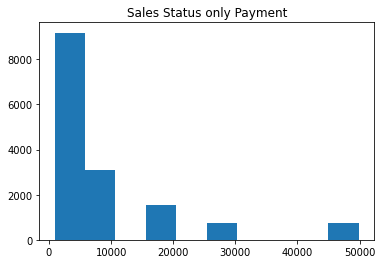
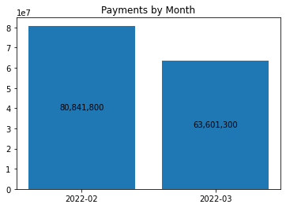
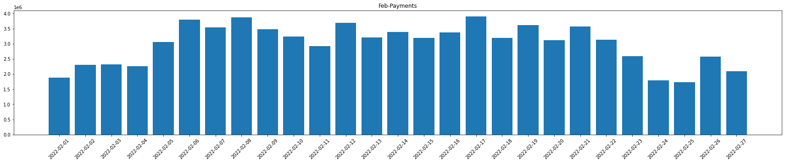

3월 매출이 2월에 비해 약 20% 정도 감소한 것을 볼 수 있었지만

유의미한 원인을 도출할 수 없었다.

새로운 데이터를 통해 매출이 떨어지고 있는 원인을 분석하고 대응 전략을 수립해보자.


Sales data

    * 고객들이 게임을 설치한 일자(install)
    * 최종 로그기록(Time_stamp)    
    * 게임명(Game_Name)
    * 상태(Status)
    * 결제금액(Payment)
    * 유저 아이디(Customer_ID)

목차

1. 데이터 가져오기


2. 데이터 시각화
    * 고객 현황을 월별로 구분
    * 월별 각 게임 고객 수
    * 월별 play와 install의 고객 수
    * 월별 결제 횟수
    * 월과 게임별 결제 횟수
    * 월과 게임별 결제 금액
    * 매출액에 영향을 주는 play인 고객들만 추출
    * 월별 신규 고객과 기존 고객의 결제 금액
    * 신규 고객과 기존 고객의 결제 이력 비교
    
    
3. 결론

    

## 데이터 가져오기


```python
import pandas as pd
import numpy as np
import matplotlib.pyplot as plt
plt.style.use('default')
import seaborn as sns
```


```python
sales_data = pd.read_csv('~/aiffel/data_analysis_basic/data/sales_6.csv')

sales_data
```


<table border="1" class="dataframe">
  <thead>
    <tr style="text-align: right;">
      <th></th>
      <th>install</th>
      <th>Time_stamp</th>
      <th>Game_Name</th>
      <th>Status</th>
      <th>Payment</th>
      <th>Customer_ID</th>
    </tr>
  </thead>
  <tbody>
    <tr>
      <th>0</th>
      <td>2022-01-08</td>
      <td>2022-02-05</td>
      <td>MineGround</td>
      <td>play</td>
      <td>4900</td>
      <td>facilis140</td>
    </tr>
    <tr>
      <th>1</th>
      <td>2022-01-05</td>
      <td>2022-02-17</td>
      <td>MineGround</td>
      <td>play</td>
      <td>29900</td>
      <td>debitis994</td>
    </tr>
    <tr>
      <th>2</th>
      <td>2022-01-29</td>
      <td>2022-02-06</td>
      <td>MineGround</td>
      <td>play</td>
      <td>4900</td>
      <td>possimus246</td>
    </tr>
    <tr>
      <th>3</th>
      <td>2022-01-09</td>
      <td>2022-02-05</td>
      <td>MineGround</td>
      <td>play</td>
      <td>900</td>
      <td>occaecati138</td>
    </tr>
    <tr>
      <th>4</th>
      <td>2022-01-08</td>
      <td>2022-02-01</td>
      <td>MineGround</td>
      <td>play</td>
      <td>900</td>
      <td>corrupti325</td>
    </tr>
    <tr>
      <th>...</th>
      <td>...</td>
      <td>...</td>
      <td>...</td>
      <td>...</td>
      <td>...</td>
      <td>...</td>
    </tr>
    <tr>
      <th>99840</th>
      <td>2022-03-27</td>
      <td>2022-03-27</td>
      <td>SoccerManager</td>
      <td>install</td>
      <td>0</td>
      <td>dicta630</td>
    </tr>
    <tr>
      <th>99841</th>
      <td>2022-03-28</td>
      <td>2022-03-28</td>
      <td>SoccerManager</td>
      <td>install</td>
      <td>0</td>
      <td>tempora976</td>
    </tr>
    <tr>
      <th>99842</th>
      <td>2022-03-26</td>
      <td>2022-03-26</td>
      <td>SoccerManager</td>
      <td>install</td>
      <td>0</td>
      <td>iusto840</td>
    </tr>
    <tr>
      <th>99843</th>
      <td>2022-03-20</td>
      <td>2022-03-20</td>
      <td>SoccerManager</td>
      <td>install</td>
      <td>0</td>
      <td>nemo273</td>
    </tr>
    <tr>
      <th>99844</th>
      <td>2022-03-07</td>
      <td>2022-03-07</td>
      <td>SoccerManager</td>
      <td>install</td>
      <td>0</td>
      <td>consequatur371</td>
    </tr>
  </tbody>
</table>
<p>99845 rows × 6 columns</p>
</div>


```python
# sales_data의 date열을 만들기

sales_data['date'] = sales_data['Time_stamp'].str[:7]
print(sales_data.head())

sales_data['date'].value_counts()
```

          install  Time_stamp   Game_Name Status  Payment   Customer_ID     date
    0  2022-01-08  2022-02-05  MineGround   play     4900    facilis140  2022-02
    1  2022-01-05  2022-02-17  MineGround   play    29900    debitis994  2022-02
    2  2022-01-29  2022-02-06  MineGround   play     4900   possimus246  2022-02
    3  2022-01-09  2022-02-05  MineGround   play      900  occaecati138  2022-02
    4  2022-01-08  2022-02-01  MineGround   play      900   corrupti325  2022-02


    2022-03    50465
    2022-02    49380
    Name: date, dtype: int64


## 데이터 시각화


```python
# 월별 고객 수 현황 시각화
ax = sns.countplot(data=sales_data, x='date')

containers = ax.containers[0]
ax.bar_label(containers, labels=[f'{x:,.0f}' for x in containers.datavalues], label_type='center')
containers0 = ax.containers[-1]
ax.bar_label(containers0, labels=[f'{x:,.0f}' for x in containers0.datavalues], label_type='center')
plt.title('Customer By Month')

plt.show()
```


    

    


고객 현황을 월별로 구분해보았다.

2월 고객수는 49,380명, 3월은 50,465명으로 매출은 줄었는데 오히려 증가한 것을 볼 수 있다.

groupby 함수를 이용하여 게임별 고객 수를 조사한다.


```python
grouped = sales_data['Status'].groupby([sales_data['date'], sales_data['Game_Name']]).count()
grouped
```


    date     Game_Name    
    2022-02  MineGround       27721
             SoccerManager    21659
    2022-03  MineGround       32192
             SoccerManager    18273
    Name: Status, dtype: int64


```python
# 월별 각 게임 고객 수 시각화
ax = sns.barplot(data=grouped.reset_index(), x='date', y='Status', hue='Game_Name')

containers = ax.containers[-1]
containers0 = ax.containers[0]
ax.bar_label(containers, labels=[f'{x:,.0f}' for x in containers.datavalues], label_type='center')
ax.bar_label(containers0, labels=[f'{x:,.0f}' for x in containers0.datavalues], label_type='center')
plt.title('Customer Count by Game')
plt.show()
```


    

    


Mine Ground 고객은 2월에 27,721명, 3월 32,192명으로 증가

반면에, Soccer Manager 고객은 2월에 21,659명, 3월 18,273명으로 감소

월별로 play와 install의 고객 수를 살펴본다.


```python
ax = sns.countplot(data=sales_data, x='date', hue='Status')

containers = ax.containers[0]
ax.bar_label(containers, labels=[f'{x:,.0f}' for x in containers.datavalues], label_type='center')
containers0 = ax.containers[-1]
ax.bar_label(containers0, labels=[f'{x:,.0f}' for x in containers0.datavalues], label_type='center')
plt.title('Customer By Real Play')

plt.show()
```


    

    


install의 고객 수는 늘어났지만, 

play의 고객 수는 감소한 것을 볼 수 있다.


```python
# 월별 결제 횟수 시각화
temp_data = sales_data[sales_data['Payment'] !=0]

ax = sns.countplot(data=temp_data, x='date')
containers = ax.containers[0]
ax.bar_label(containers, labels=[f'{x:,.0f}' for x in containers.datavalues], label_type='center')
plt.title('Payment Counts by Month')
plt.show()
```


    

    


월과 게임별 결제 건수를 확인하자.


```python
grouped = temp_data['Payment'].groupby([temp_data['date'], temp_data['Game_Name']]).count()

ax = sns.barplot(data=grouped.reset_index(), x='date', y='Payment', hue='Game_Name')

containers = ax.containers[-1]
containers0 = ax.containers[0]
ax.bar_label(containers, labels=[f'{x:,.0f}' for x in containers.datavalues], label_type='center')
ax.bar_label(containers0, labels=[f'{x:,.0f}' for x in containers0.datavalues], label_type='center')
plt.title('Payment Count By Game')
plt.show()
```


    

    


```python
grouped = temp_data['Payment'].groupby([temp_data['date'], temp_data['Game_Name']]).sum()

ax = sns.barplot(data=grouped.reset_index(), x='date', y='Payment', hue='Game_Name')

containers = ax.containers[-1]
containers0 = ax.containers[0]
ax.bar_label(containers, labels=[f'{x:,.0f}' for x in containers.datavalues], label_type='center')
ax.bar_label(containers0, labels=[f'{x:,.0f}' for x in containers0.datavalues], label_type='center')
plt.title('Payment Count By Game')
plt.show()
```


    

    


Mine Ground와 Soccer Manager 모두 결제 건수와 결제 금액이 줄어들었다.

즉, 매출액이 줄어든 것에 대한 원인은 Soccer Manager의 고객 수가 줄어든 것보다

두 게임에서의 결제 인원이 줄어든 것이 더 큰 원인이라고 볼 수 있다.

매출액에 영향을 주는 play인 고객들만 추출하기


```python
player_data = sales_data[sales_data['Status'] == 'play']
player_data
```


<table border="1" class="dataframe">
  <thead>
    <tr style="text-align: right;">
      <th></th>
      <th>install</th>
      <th>Time_stamp</th>
      <th>Game_Name</th>
      <th>Status</th>
      <th>Payment</th>
      <th>Customer_ID</th>
      <th>date</th>
    </tr>
  </thead>
  <tbody>
    <tr>
      <th>0</th>
      <td>2022-01-08</td>
      <td>2022-02-05</td>
      <td>MineGround</td>
      <td>play</td>
      <td>4900</td>
      <td>facilis140</td>
      <td>2022-02</td>
    </tr>
    <tr>
      <th>1</th>
      <td>2022-01-05</td>
      <td>2022-02-17</td>
      <td>MineGround</td>
      <td>play</td>
      <td>29900</td>
      <td>debitis994</td>
      <td>2022-02</td>
    </tr>
    <tr>
      <th>2</th>
      <td>2022-01-29</td>
      <td>2022-02-06</td>
      <td>MineGround</td>
      <td>play</td>
      <td>4900</td>
      <td>possimus246</td>
      <td>2022-02</td>
    </tr>
    <tr>
      <th>3</th>
      <td>2022-01-09</td>
      <td>2022-02-05</td>
      <td>MineGround</td>
      <td>play</td>
      <td>900</td>
      <td>occaecati138</td>
      <td>2022-02</td>
    </tr>
    <tr>
      <th>4</th>
      <td>2022-01-08</td>
      <td>2022-02-01</td>
      <td>MineGround</td>
      <td>play</td>
      <td>900</td>
      <td>corrupti325</td>
      <td>2022-02</td>
    </tr>
    <tr>
      <th>...</th>
      <td>...</td>
      <td>...</td>
      <td>...</td>
      <td>...</td>
      <td>...</td>
      <td>...</td>
      <td>...</td>
    </tr>
    <tr>
      <th>84816</th>
      <td>2022-03-06</td>
      <td>2022-03-11</td>
      <td>SoccerManager</td>
      <td>play</td>
      <td>0</td>
      <td>sed821</td>
      <td>2022-03</td>
    </tr>
    <tr>
      <th>84817</th>
      <td>2022-03-20</td>
      <td>2022-03-23</td>
      <td>SoccerManager</td>
      <td>play</td>
      <td>0</td>
      <td>minima581</td>
      <td>2022-03</td>
    </tr>
    <tr>
      <th>84818</th>
      <td>2022-03-25</td>
      <td>2022-03-27</td>
      <td>SoccerManager</td>
      <td>play</td>
      <td>0</td>
      <td>harum162</td>
      <td>2022-03</td>
    </tr>
    <tr>
      <th>84819</th>
      <td>2022-03-15</td>
      <td>2022-03-18</td>
      <td>SoccerManager</td>
      <td>play</td>
      <td>0</td>
      <td>eveniet498</td>
      <td>2022-03</td>
    </tr>
    <tr>
      <th>84820</th>
      <td>2022-03-12</td>
      <td>2022-03-17</td>
      <td>SoccerManager</td>
      <td>play</td>
      <td>0</td>
      <td>quis906</td>
      <td>2022-03</td>
    </tr>
  </tbody>
</table>
<p>84821 rows × 7 columns</p>
</div>


```python
pd.set_option('mode.chained_assignment',  None)

player_data['install_date'] = player_data['install'].str[:7]
player_data['play_date'] = player_data['Time_stamp'].str[:7]
```

play한 고객들을 install 날짜와 비교하여

install 시기와 play 시기가 같으면 신규 고객(New Player) 으로 정의하고,

install 시기와 play 시기가 다르면 기존 고객(Existing) 으로 정의한다.


```python
player_data['type'] = np.where(player_data['install_date']==player_data['play_date'], 'New Player', 'Existing')
```


```python
# 월별 신규 고객과 기존 고객 현황 세어보기
grouped = player_data['Status'].groupby([player_data['play_date'], player_data['type']]).count()
grouped
```


    play_date  type      
    2022-02    Existing      28668
               New Player    15480
    2022-03    Existing      28207
               New Player    12466
    Name: Status, dtype: int64


```python
ax = sns.countplot(data=player_data, x='play_date', hue="type")

containers = ax.containers[-1]
containers0 = ax.containers[0]
ax.bar_label(containers, labels=[f'{x:,.0f}' for x in containers.datavalues], label_type='center')
ax.bar_label(containers0, labels=[f'{x:,.0f}' for x in containers0.datavalues], label_type='center')
plt.title('Customer Type By Month')
plt.show()
```


    

    


신규 플레이 고객이 약 20% 감소한 것을 볼 수 있다.

즉, 기존 플레이 고객보다 감소량이 크다.

월별 신규 고객과 기존 고객의 결제 현황


```python
grouped = player_data['Payment'].groupby([player_data['play_date'], player_data['type']]).sum()
grouped
```


    play_date  type      
    2022-02    Existing      50140500
               New Player    30701300
    2022-03    Existing      50140500
               New Player    18220700
    Name: Payment, dtype: int64


```python
ax = sns.barplot(data=grouped.reset_index(), x='play_date', y='Payment', hue='type')

containers = ax.containers[-1]
containers0 = ax.containers[0]
ax.bar_label(containers, labels=[f'{x:,.0f}' for x in containers.datavalues], label_type='center')
ax.bar_label(containers0, labels=[f'{x:,.0f}' for x in containers0.datavalues], label_type='center')
plt.title('Customer Type By Month')
plt.show()
```


    

    


```python
ax = grouped.unstack().plot(kind='bar', stacked=True, grid=False, figsize=[6,6])

containers = ax.containers[-1]
ax.bar_label(containers, labels=[f'{x:,.0f}' for x in containers.datavalues], label_type='center')
containers0 = ax.containers[-2]
ax.bar_label(containers0, labels=[f'{x:,.0f}' for x in containers0.datavalues], label_type='center')

plt.title('Payment by Type')
plt.show()
```


    

    


기존 고객이 결제한 금액은 50,140,500원 동일

하지만 신규 고객이 결제한 금액은 약 40% 수준이 감소

동 기간에 신규 고객이 줄어든 수치가 약 20%수준이 줄어든 것에 비해 매우 크다.


```python
payment_data = player_data.set_index('type', drop=True)
```


<table border="1" class="dataframe">
  <thead>
    <tr style="text-align: right;">
      <th></th>
      <th>install</th>
      <th>Time_stamp</th>
      <th>Game_Name</th>
      <th>Status</th>
      <th>Payment</th>
      <th>Customer_ID</th>
      <th>date</th>
      <th>install_date</th>
      <th>play_date</th>
    </tr>
    <tr>
      <th>type</th>
      <th></th>
      <th></th>
      <th></th>
      <th></th>
      <th></th>
      <th></th>
      <th></th>
      <th></th>
      <th></th>
    </tr>
  </thead>
  <tbody>
    <tr>
      <th>Existing</th>
      <td>2022-01-08</td>
      <td>2022-02-05</td>
      <td>MineGround</td>
      <td>play</td>
      <td>4900</td>
      <td>facilis140</td>
      <td>2022-02</td>
      <td>2022-01</td>
      <td>2022-02</td>
    </tr>
    <tr>
      <th>Existing</th>
      <td>2022-01-05</td>
      <td>2022-02-17</td>
      <td>MineGround</td>
      <td>play</td>
      <td>29900</td>
      <td>debitis994</td>
      <td>2022-02</td>
      <td>2022-01</td>
      <td>2022-02</td>
    </tr>
    <tr>
      <th>Existing</th>
      <td>2022-01-29</td>
      <td>2022-02-06</td>
      <td>MineGround</td>
      <td>play</td>
      <td>4900</td>
      <td>possimus246</td>
      <td>2022-02</td>
      <td>2022-01</td>
      <td>2022-02</td>
    </tr>
    <tr>
      <th>Existing</th>
      <td>2022-01-09</td>
      <td>2022-02-05</td>
      <td>MineGround</td>
      <td>play</td>
      <td>900</td>
      <td>occaecati138</td>
      <td>2022-02</td>
      <td>2022-01</td>
      <td>2022-02</td>
    </tr>
    <tr>
      <th>Existing</th>
      <td>2022-01-08</td>
      <td>2022-02-01</td>
      <td>MineGround</td>
      <td>play</td>
      <td>900</td>
      <td>corrupti325</td>
      <td>2022-02</td>
      <td>2022-01</td>
      <td>2022-02</td>
    </tr>
    <tr>
      <th>...</th>
      <td>...</td>
      <td>...</td>
      <td>...</td>
      <td>...</td>
      <td>...</td>
      <td>...</td>
      <td>...</td>
      <td>...</td>
      <td>...</td>
    </tr>
    <tr>
      <th>New Player</th>
      <td>2022-03-06</td>
      <td>2022-03-11</td>
      <td>SoccerManager</td>
      <td>play</td>
      <td>0</td>
      <td>sed821</td>
      <td>2022-03</td>
      <td>2022-03</td>
      <td>2022-03</td>
    </tr>
    <tr>
      <th>New Player</th>
      <td>2022-03-20</td>
      <td>2022-03-23</td>
      <td>SoccerManager</td>
      <td>play</td>
      <td>0</td>
      <td>minima581</td>
      <td>2022-03</td>
      <td>2022-03</td>
      <td>2022-03</td>
    </tr>
    <tr>
      <th>New Player</th>
      <td>2022-03-25</td>
      <td>2022-03-27</td>
      <td>SoccerManager</td>
      <td>play</td>
      <td>0</td>
      <td>harum162</td>
      <td>2022-03</td>
      <td>2022-03</td>
      <td>2022-03</td>
    </tr>
    <tr>
      <th>New Player</th>
      <td>2022-03-15</td>
      <td>2022-03-18</td>
      <td>SoccerManager</td>
      <td>play</td>
      <td>0</td>
      <td>eveniet498</td>
      <td>2022-03</td>
      <td>2022-03</td>
      <td>2022-03</td>
    </tr>
    <tr>
      <th>New Player</th>
      <td>2022-03-12</td>
      <td>2022-03-17</td>
      <td>SoccerManager</td>
      <td>play</td>
      <td>0</td>
      <td>quis906</td>
      <td>2022-03</td>
      <td>2022-03</td>
      <td>2022-03</td>
    </tr>
  </tbody>
</table>
<p>84821 rows × 9 columns</p>
</div>


신규 고객과 기존 고객의 결제 이력을 비교해본다.


```python
# 신규 고객들만 남기기
payment_data.drop('Existing', inplace=True)
```


```python
payment_data = payment_data.set_index('Payment')

# 결제 이력이 있는 고객만 남기기
payment_data.drop(0, inplace=True)
payment_data = payment_data.reset_index()
```


```python
# 고객의 결제이력을 월별로 구분하기
payment_data_02 = payment_data.set_index('play_date').loc['2022-02'].Payment.values
payment_data_03 = payment_data.set_index('play_date').loc['2022-03'].Payment.values

# 월별 데이터를 하나로 합치기
total_payment = np.array([payment_data_02, payment_data_03],dtype=object,)
```


```python
bins = np.linspace(0, 50000, 10)
plt.xlabel("Payments")
plt.ylabel("Count")
plt.hist(total_payment, bins, label=['2022-02', '2022-03'])
plt.title("New Player Payment Histogram", fontsize=15)
plt.show()
```


    

    


```python
payment_data = player_data.set_index('type', drop=True)

payment_data.drop('New Player', inplace=True)


payment_data = payment_data.set_index('Payment')


payment_data.drop(0, inplace=True)
payment_data = payment_data.reset_index()


payment_data_02 = payment_data.set_index('play_date').loc['2022-02'].Payment.values
payment_data_03 = payment_data.set_index('play_date').loc['2022-03'].Payment.values


total_payment = np.array([payment_data_02, payment_data_03],dtype=object,)


bins = np.linspace(0, 50000, 10)
plt.xlabel("Payments")
plt.ylabel("Count")
plt.hist(total_payment, bins, label=['2022-02', '2022-03'])
plt.title("New Player Payment Histogram", fontsize=15)
plt.show()
```


    

    


신규 고객은 모든 구간에 결제 금액이 줄었다.

기존 고객의 경우 소액부분 결제금액은 줄었지만

30,000원 이상이 되는 구간부터는 결제 건수가 늘었다.

## 결론

1. 고객수는 증가했지만 총 매출액은 감소하고 있다.

2. install한 고객이 증가했을 뿐, 매출에 도움이 되는 play 고객은 줄어들었다.

3. 각 게임 모두 결제 건수와 결제 금액이 줄어들었다.

4. 기존 고객들의 고액 결제 건수는 증가했으나, 신규 고객들의 결제 금액은 현저히 줄어들었다.

신규 고객의 결제가 줄어 매출액이 줄어들었다는 것을 확인할 수 있었다.

신규 고객의 결제를 유도할 수있는 혜택 및 광고를 이용하는 것이 좋을 것 같다.
