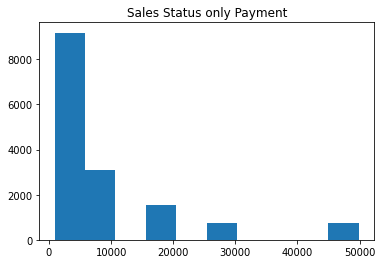
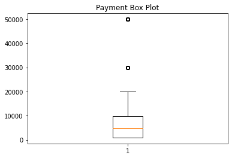
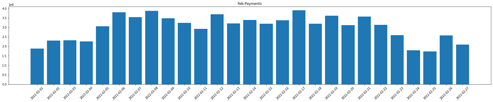
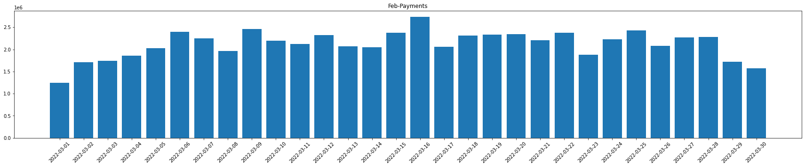
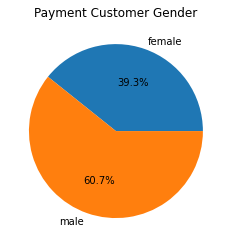
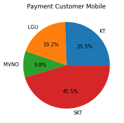
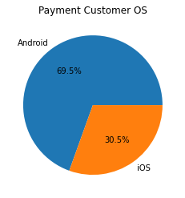
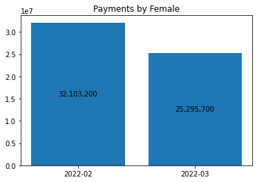
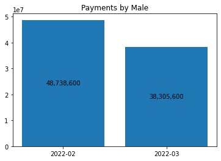

# 게임 회사 매출 분석

새로 런칭한 게임은 Mine Ground와 Soccer Manager로

각 게임은 인앱 결제를 통해 게임 내 아이템을 판매하고 있다.

수익극대화를 위해 게임에서 측정되는 각종 데이터를 수집하고 모니터링

게임 상 수집되는 Sales Data

런처에서 수집되는 Customer Data로

회사에서 수집되는 데이터는 크게 두 종류이다.

각 데이터들은 일간 단위로 수집되는데

2가지를 통해 데이터를 분석해보자.

목차

1. 데이터 가져오기
 
2. 데이터 시각화

    * Salse data
    * Customer data

3. 결론

## 데이터 가져오기


```python
import pandas as pd
import matplotlib.pyplot as plt

SalesLog = pd.read_csv('~/aiffel/data_analysis_basic/data/Sales.csv')
SalesLog
```


<table border="1" class="dataframe">
  <thead>
    <tr style="text-align: right;">
      <th></th>
      <th>install</th>
      <th>Time_stamp</th>
      <th>Game_Name</th>
      <th>Status</th>
      <th>Payment</th>
      <th>Customer_ID</th>
    </tr>
  </thead>
  <tbody>
    <tr>
      <th>0</th>
      <td>2022-01-08</td>
      <td>2022-02-05</td>
      <td>MineGround</td>
      <td>play</td>
      <td>4900</td>
      <td>facilis140</td>
    </tr>
    <tr>
      <th>1</th>
      <td>2022-01-05</td>
      <td>2022-02-17</td>
      <td>MineGround</td>
      <td>play</td>
      <td>29900</td>
      <td>debitis994</td>
    </tr>
    <tr>
      <th>2</th>
      <td>2022-01-29</td>
      <td>2022-02-06</td>
      <td>MineGround</td>
      <td>play</td>
      <td>4900</td>
      <td>possimus246</td>
    </tr>
    <tr>
      <th>3</th>
      <td>2022-01-09</td>
      <td>2022-02-05</td>
      <td>MineGround</td>
      <td>play</td>
      <td>900</td>
      <td>occaecati138</td>
    </tr>
    <tr>
      <th>4</th>
      <td>2022-01-08</td>
      <td>2022-02-01</td>
      <td>MineGround</td>
      <td>play</td>
      <td>900</td>
      <td>corrupti325</td>
    </tr>
    <tr>
      <th>...</th>
      <td>...</td>
      <td>...</td>
      <td>...</td>
      <td>...</td>
      <td>...</td>
      <td>...</td>
    </tr>
    <tr>
      <th>99840</th>
      <td>2022-03-27</td>
      <td>2022-03-27</td>
      <td>SoccerManager</td>
      <td>install</td>
      <td>0</td>
      <td>dicta630</td>
    </tr>
    <tr>
      <th>99841</th>
      <td>2022-03-28</td>
      <td>2022-03-28</td>
      <td>SoccerManager</td>
      <td>install</td>
      <td>0</td>
      <td>tempora976</td>
    </tr>
    <tr>
      <th>99842</th>
      <td>2022-03-26</td>
      <td>2022-03-26</td>
      <td>SoccerManager</td>
      <td>install</td>
      <td>0</td>
      <td>iusto840</td>
    </tr>
    <tr>
      <th>99843</th>
      <td>2022-03-20</td>
      <td>2022-03-20</td>
      <td>SoccerManager</td>
      <td>install</td>
      <td>0</td>
      <td>nemo273</td>
    </tr>
    <tr>
      <th>99844</th>
      <td>2022-03-07</td>
      <td>2022-03-07</td>
      <td>SoccerManager</td>
      <td>install</td>
      <td>0</td>
      <td>consequatur371</td>
    </tr>
  </tbody>
</table>
<p>99845 rows × 6 columns</p>
</div>


```python
SalesLog.info()
```

    <class 'pandas.core.frame.DataFrame'>
    RangeIndex: 99845 entries, 0 to 99844
    Data columns (total 6 columns):
     #   Column       Non-Null Count  Dtype 
    ---  ------       --------------  ----- 
     0   install      99845 non-null  object
     1   Time_stamp   99845 non-null  object
     2   Game_Name    99845 non-null  object
     3   Status       99845 non-null  object
     4   Payment      99845 non-null  int64 
     5   Customer_ID  99845 non-null  object
    dtypes: int64(1), object(5)
    memory usage: 4.6+ MB


## 데이터  시각화

### Sales data


```python
# 히스토그램

# 결제금액이 0원이 아닌 경우만 골라내서 Sales 변수에 할당
Sales = SalesLog[SalesLog['Payment']!=0]

plt.hist(Sales['Payment'])
plt.title('Sales Status only Payment')
plt.show()
```


    

    


```python
# Boxplot

plt.boxplot(Sales['Payment'])
plt.title('Payment Box Plot')
plt.show()
Sales['Payment'].value_counts()/len(Sales['Payment'])
```


    

    


    900      0.350709
    4900     0.248677
    9900     0.201581
    19900    0.100856
    29900    0.050036
    49900    0.048142
    Name: Payment, dtype: float64


```python
# SalesLog에 Month열을 만들고, 월별 날짜값을 입력
SalesLog['Month'] = SalesLog['Time_stamp'].str[:7]

# 월별 결제금액 확인하기
SalesLog['Payment'].groupby(SalesLog['Month']).sum()
```


    Month
    2022-02    80841800
    2022-03    63601300
    Name: Payment, dtype: int64


2월과 3월 결제 금액을 살펴보자.


```python
temp_data = SalesLog['Payment'].groupby(SalesLog['Month']).sum()
ax = plt.bar(temp_data.index, temp_data)
plt.bar_label(ax, labels=[f'{x:,.0f}' for x in ax.datavalues], label_type='center')
plt.title('Payments by Month')
plt.show()
```


    

    


3월의 결제금액이 전월에 비해 20% 정도 줄어든 것을 볼 수 있다.

2월과 3월의 차이를 비교해자.

2월에 무과금을 제외하고 결제한 데이터를 할당해본다.


```python
# Sales02변수를 만들고, 2월에 결제한 데이터 할당하기
Sales02 = SalesLog[(SalesLog['Month'] == '2022-02')& (SalesLog['Payment'] != 0)]
Sales02.reset_index(drop=True)
```


<table border="1" class="dataframe">
  <thead>
    <tr style="text-align: right;">
      <th></th>
      <th>install</th>
      <th>Time_stamp</th>
      <th>Game_Name</th>
      <th>Status</th>
      <th>Payment</th>
      <th>Customer_ID</th>
      <th>Month</th>
    </tr>
  </thead>
  <tbody>
    <tr>
      <th>0</th>
      <td>2022-01-08</td>
      <td>2022-02-05</td>
      <td>MineGround</td>
      <td>play</td>
      <td>4900</td>
      <td>facilis140</td>
      <td>2022-02</td>
    </tr>
    <tr>
      <th>1</th>
      <td>2022-01-05</td>
      <td>2022-02-17</td>
      <td>MineGround</td>
      <td>play</td>
      <td>29900</td>
      <td>debitis994</td>
      <td>2022-02</td>
    </tr>
    <tr>
      <th>2</th>
      <td>2022-01-29</td>
      <td>2022-02-06</td>
      <td>MineGround</td>
      <td>play</td>
      <td>4900</td>
      <td>possimus246</td>
      <td>2022-02</td>
    </tr>
    <tr>
      <th>3</th>
      <td>2022-01-09</td>
      <td>2022-02-05</td>
      <td>MineGround</td>
      <td>play</td>
      <td>900</td>
      <td>occaecati138</td>
      <td>2022-02</td>
    </tr>
    <tr>
      <th>4</th>
      <td>2022-01-08</td>
      <td>2022-02-01</td>
      <td>MineGround</td>
      <td>play</td>
      <td>900</td>
      <td>corrupti325</td>
      <td>2022-02</td>
    </tr>
    <tr>
      <th>...</th>
      <td>...</td>
      <td>...</td>
      <td>...</td>
      <td>...</td>
      <td>...</td>
      <td>...</td>
      <td>...</td>
    </tr>
    <tr>
      <th>8537</th>
      <td>2022-02-12</td>
      <td>2022-02-14</td>
      <td>SoccerManager</td>
      <td>play</td>
      <td>4900</td>
      <td>quam946</td>
      <td>2022-02</td>
    </tr>
    <tr>
      <th>8538</th>
      <td>2022-02-10</td>
      <td>2022-02-14</td>
      <td>SoccerManager</td>
      <td>play</td>
      <td>4900</td>
      <td>commodi507</td>
      <td>2022-02</td>
    </tr>
    <tr>
      <th>8539</th>
      <td>2022-02-16</td>
      <td>2022-02-21</td>
      <td>SoccerManager</td>
      <td>play</td>
      <td>900</td>
      <td>rerum275</td>
      <td>2022-02</td>
    </tr>
    <tr>
      <th>8540</th>
      <td>2022-02-16</td>
      <td>2022-02-20</td>
      <td>SoccerManager</td>
      <td>play</td>
      <td>9900</td>
      <td>quo151</td>
      <td>2022-02</td>
    </tr>
    <tr>
      <th>8541</th>
      <td>2022-02-07</td>
      <td>2022-02-12</td>
      <td>SoccerManager</td>
      <td>play</td>
      <td>4900</td>
      <td>aspernatur159</td>
      <td>2022-02</td>
    </tr>
  </tbody>
</table>
<p>8542 rows × 7 columns</p>
</div>


```python
# 데이터 시각화

temp_data = Sales02['Payment'].groupby(Sales02['Time_stamp']).sum()
plt.figure(figsize=(30,5))
plt.bar(temp_data.index, temp_data)
plt.title('Feb-Payments')
plt.xticks(rotation=45)
plt.show()
```


    

    


3월에 무과금을 제외하고 결제한 데이터를 할당해본다.


```python
# Sales03변수를 만들고, 3월에 결제한 데이터 할당하기
Sales03 = SalesLog[(SalesLog['Month'] == '2022-03')& (SalesLog['Payment'] != 0)]
Sales03.reset_index(drop=True)
```


<table border="1" class="dataframe">
  <thead>
    <tr style="text-align: right;">
      <th></th>
      <th>install</th>
      <th>Time_stamp</th>
      <th>Game_Name</th>
      <th>Status</th>
      <th>Payment</th>
      <th>Customer_ID</th>
      <th>Month</th>
    </tr>
  </thead>
  <tbody>
    <tr>
      <th>0</th>
      <td>2022-01-13</td>
      <td>2022-03-14</td>
      <td>MineGround</td>
      <td>play</td>
      <td>900</td>
      <td>quod578</td>
      <td>2022-03</td>
    </tr>
    <tr>
      <th>1</th>
      <td>2022-02-08</td>
      <td>2022-03-21</td>
      <td>MineGround</td>
      <td>play</td>
      <td>9900</td>
      <td>saepe705</td>
      <td>2022-03</td>
    </tr>
    <tr>
      <th>2</th>
      <td>2022-01-24</td>
      <td>2022-03-20</td>
      <td>MineGround</td>
      <td>play</td>
      <td>19900</td>
      <td>voluptates561</td>
      <td>2022-03</td>
    </tr>
    <tr>
      <th>3</th>
      <td>2022-02-05</td>
      <td>2022-03-18</td>
      <td>MineGround</td>
      <td>play</td>
      <td>9900</td>
      <td>quaerat318</td>
      <td>2022-03</td>
    </tr>
    <tr>
      <th>4</th>
      <td>2022-01-19</td>
      <td>2022-03-24</td>
      <td>MineGround</td>
      <td>play</td>
      <td>4900</td>
      <td>perspiciatis026</td>
      <td>2022-03</td>
    </tr>
    <tr>
      <th>...</th>
      <td>...</td>
      <td>...</td>
      <td>...</td>
      <td>...</td>
      <td>...</td>
      <td>...</td>
      <td>...</td>
    </tr>
    <tr>
      <th>6762</th>
      <td>2022-03-21</td>
      <td>2022-03-25</td>
      <td>SoccerManager</td>
      <td>play</td>
      <td>9900</td>
      <td>a329</td>
      <td>2022-03</td>
    </tr>
    <tr>
      <th>6763</th>
      <td>2022-03-18</td>
      <td>2022-03-20</td>
      <td>SoccerManager</td>
      <td>play</td>
      <td>9900</td>
      <td>dignissimos737</td>
      <td>2022-03</td>
    </tr>
    <tr>
      <th>6764</th>
      <td>2022-03-17</td>
      <td>2022-03-20</td>
      <td>SoccerManager</td>
      <td>play</td>
      <td>900</td>
      <td>sequi289</td>
      <td>2022-03</td>
    </tr>
    <tr>
      <th>6765</th>
      <td>2022-03-13</td>
      <td>2022-03-16</td>
      <td>SoccerManager</td>
      <td>play</td>
      <td>4900</td>
      <td>delectus499</td>
      <td>2022-03</td>
    </tr>
    <tr>
      <th>6766</th>
      <td>2022-03-20</td>
      <td>2022-03-25</td>
      <td>SoccerManager</td>
      <td>play</td>
      <td>4900</td>
      <td>sed697</td>
      <td>2022-03</td>
    </tr>
  </tbody>
</table>
<p>6767 rows × 7 columns</p>
</div>


```python
# 데이터 시각화

temp_data = Sales03['Payment'].groupby(Sales03['Time_stamp']).sum()
plt.figure(figsize=(30,5))
plt.bar(temp_data.index, temp_data)
plt.title('Feb-Payments')
plt.xticks(rotation=45)
plt.show()
```


    

    


### Customer data


```python
CustomerLog = pd.read_csv('~/aiffel/data_analysis_basic/data/customer.csv')

CustomerLog.info()
```

    <class 'pandas.core.frame.DataFrame'>
    RangeIndex: 99845 entries, 0 to 99844
    Data columns (total 10 columns):
     #   Column         Non-Null Count  Dtype 
    ---  ------         --------------  ----- 
     0   Customer_ID    99845 non-null  object
     1   Name           99845 non-null  object
     2   Nickname       99845 non-null  object
     3   Password       99845 non-null  object
     4   Email          99845 non-null  object
     5   Birth          99845 non-null  object
     6   Gender         99845 non-null  object
     7   C.P.           99845 non-null  object
     8   MobileCompany  99845 non-null  object
     9   OS             99845 non-null  object
    dtypes: object(10)
    memory usage: 7.6+ MB


10개의 컬럼이 있다.


```python
CustomerLog
```


<table border="1" class="dataframe">
  <thead>
    <tr style="text-align: right;">
      <th></th>
      <th>Customer_ID</th>
      <th>Name</th>
      <th>Nickname</th>
      <th>Password</th>
      <th>Email</th>
      <th>Birth</th>
      <th>Gender</th>
      <th>C.P.</th>
      <th>MobileCompany</th>
      <th>OS</th>
    </tr>
  </thead>
  <tbody>
    <tr>
      <th>0</th>
      <td>facilis140</td>
      <td>이영순</td>
      <td>quos</td>
      <td>********</td>
      <td>coejongsu@yu.kr</td>
      <td>1989-03-11</td>
      <td>female</td>
      <td>01x9-4x625-x5x3x</td>
      <td>LGU</td>
      <td>iOS</td>
    </tr>
    <tr>
      <th>1</th>
      <td>debitis994</td>
      <td>김중수</td>
      <td>molestiae</td>
      <td>********</td>
      <td>jiweon02@ju.org</td>
      <td>1995-11-19</td>
      <td>male</td>
      <td>01x9-3x228-x3x9x</td>
      <td>KT</td>
      <td>iOS</td>
    </tr>
    <tr>
      <th>2</th>
      <td>possimus246</td>
      <td>양은경</td>
      <td>rem</td>
      <td>********</td>
      <td>coesubin@jusighoesa.com</td>
      <td>2005-12-24</td>
      <td>female</td>
      <td>01x9-7x873-x2x2x</td>
      <td>LGU</td>
      <td>Android</td>
    </tr>
    <tr>
      <th>3</th>
      <td>occaecati138</td>
      <td>백도윤</td>
      <td>libero</td>
      <td>********</td>
      <td>yeongceol80@gangryu.kr</td>
      <td>2003-02-09</td>
      <td>female</td>
      <td>01x9-3x519-x7x1x</td>
      <td>SKT</td>
      <td>iOS</td>
    </tr>
    <tr>
      <th>4</th>
      <td>corrupti325</td>
      <td>김영수</td>
      <td>temporibus</td>
      <td>********</td>
      <td>jiweon96@yu.net</td>
      <td>2004-05-04</td>
      <td>male</td>
      <td>01x9-0x079-x9x2x</td>
      <td>LGU</td>
      <td>Android</td>
    </tr>
    <tr>
      <th>...</th>
      <td>...</td>
      <td>...</td>
      <td>...</td>
      <td>...</td>
      <td>...</td>
      <td>...</td>
      <td>...</td>
      <td>...</td>
      <td>...</td>
      <td>...</td>
    </tr>
    <tr>
      <th>99840</th>
      <td>dicta630</td>
      <td>김예지</td>
      <td>sit</td>
      <td>********</td>
      <td>ggim@yuhanhoesa.com</td>
      <td>1992-07-31</td>
      <td>male</td>
      <td>01x9-8x787-x6x7x</td>
      <td>LGU</td>
      <td>iOS</td>
    </tr>
    <tr>
      <th>99841</th>
      <td>tempora976</td>
      <td>문은경</td>
      <td>modi</td>
      <td>********</td>
      <td>gimjeongnam@gimgweonjang.com</td>
      <td>1990-09-17</td>
      <td>male</td>
      <td>01x9-5x401-x0x0x</td>
      <td>KT</td>
      <td>Android</td>
    </tr>
    <tr>
      <th>99842</th>
      <td>iusto840</td>
      <td>강중수</td>
      <td>iusto</td>
      <td>********</td>
      <td>qu@gimgim.kr</td>
      <td>1984-12-25</td>
      <td>female</td>
      <td>01x9-3x247-x9x7x</td>
      <td>SKT</td>
      <td>iOS</td>
    </tr>
    <tr>
      <th>99843</th>
      <td>nemo273</td>
      <td>황정남</td>
      <td>deleniti</td>
      <td>********</td>
      <td>yejun90@imubag.com</td>
      <td>1985-05-11</td>
      <td>male</td>
      <td>01x9-5x324-x8x7x</td>
      <td>LGU</td>
      <td>iOS</td>
    </tr>
    <tr>
      <th>99844</th>
      <td>consequatur371</td>
      <td>이영식</td>
      <td>accusantium</td>
      <td>********</td>
      <td>seongsu95@hwangryu.com</td>
      <td>2000-02-18</td>
      <td>female</td>
      <td>01x9-5x277-x4x5x</td>
      <td>KT</td>
      <td>iOS</td>
    </tr>
  </tbody>
</table>
<p>99845 rows × 10 columns</p>
</div>


결제 경험이 있는 고객 중 게임을 이용하는 사람의 분포를 시각화해보려고 한다.


```python
# Customer 데이터와 Sales 데이터를 결합
TotalData = pd.merge(CustomerLog, SalesLog)

# 무과금 고객 데이터 삭제
PaymentCustomer = TotalData[(TotalData["Payment"] != 0)]

# 고객 성별에 따른 파이그래프
pie_data = PaymentCustomer.groupby(['Gender']).count().Name
plt.pie(pie_data, labels=pie_data.index, autopct = '%1.1f%%')
plt.title('Payment Customer Gender')
plt.show()

# 고객 모바일 서비스 기업에 따른 파이그래프
pie_data = PaymentCustomer.groupby(['MobileCompany']).count().Name
plt.pie(pie_data, labels=pie_data.index, autopct = '%1.1f%%')
plt.title('Payment Customer Mobile')
plt.show()

# 모바일OS에 따른 파이그래프 그리기
pie_data = PaymentCustomer.groupby(['OS']).count().Name
plt.pie(pie_data, labels=pie_data.index, autopct = '%1.1f%%')
plt.title('Payment Customer OS')
plt.show()
```


    

    


    

    


    

    


남성 60.7%, SKT 45.5%, Android 69.5%인 것을 확인할 수 있다.

고객 성별에 따른 결제금액을 월별로 확인해보자.


```python
PaymentCustomer['Payment'].groupby([PaymentCustomer['Gender'], PaymentCustomer['Month']]).sum()
```


    Gender  Month  
    female  2022-02    32103200
            2022-03    25295700
    male    2022-02    48738600
            2022-03    38305600
    Name: Payment, dtype: int64


```python
male = PaymentCustomer[PaymentCustomer['Gender'] == 'male']
female = PaymentCustomer[PaymentCustomer['Gender'] == 'female']


temp_data = female['Payment'].groupby(female['Month']).sum()
ax = plt.bar(temp_data.index, temp_data)
plt.bar_label(ax, labels=[f'{x:,.0f}' for x in ax.datavalues], label_type='center')
plt.title('Payments by Female')
plt.show()

temp_data = male['Payment'].groupby(male['Month']).sum()
ax = plt.bar(temp_data.index, temp_data)
plt.bar_label(ax, labels=[f'{x:,.0f}' for x in ax.datavalues], label_type='center')
plt.title('Payments by Male')
plt.show()
```


    

    


    

    


## 결론

남성, 여성 고객 모두 3월 결제금액이 줄어든 것을 볼 수 있다.

현재 수집된 데이터로는 유의미한 원인이 도출되지 않는 것을 볼 수 있다.
