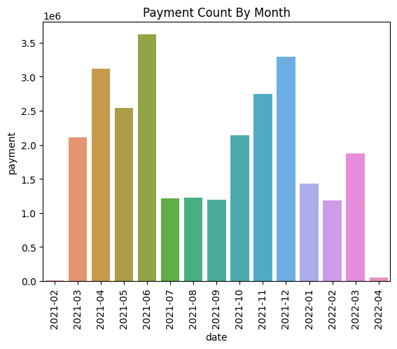

# 스터디 카페 매출 분석


월별 매출액 추세

가장 인기있는 음식/음료

가장 많이 팔린 입장권 종류


entry_data: '모두 스터디카페'의 시간별 입장 기록 데이터

sales_data: '모두 스터디카페'의 시간별 음식/음료 판매 데이터

item_data: '모두 스터디카페'에서 판매하고 있는 음식/음료 종류와 가격

item_entry_data: '모두 스터디카페'에서 판매하고 있는 입장권 종류와 가격

목차

[1. 데이터 불러오기](#데이터-불러오기)


[2. 데이터 시각화](#데이터-시각화)

## 데이터 불러오기


```python
import pandas as pd
import numpy as np
import matplotlib.pyplot as plt
import seaborn as sns

plt.style.use('default')
```


```python
entry_data = pd.read_csv('/aiffel/data/entry_data.csv')
sales_data = pd.read_csv('/aiffel/data/sales_data.csv')
item_data = pd.read_csv('/aiffel/data/item_data.csv')
item_entry_data = pd.read_csv('/aiffel/data/item_entry_data.csv')
```


```python
entry_data.head()
```


<div>
<style scoped>
    .dataframe tbody tr th:only-of-type {
        vertical-align: middle;
    }

    .dataframe tbody tr th {
        vertical-align: top;
    }

    .dataframe thead th {
        text-align: right;
    }
</style>
<table border="1" class="dataframe">
  <thead>
    <tr style="text-align: right;">
      <th></th>
      <th>요금제명</th>
      <th>입실</th>
      <th>퇴실</th>
      <th>이용</th>
      <th>위치</th>
      <th>금액</th>
      <th>구분</th>
      <th>고객</th>
    </tr>
  </thead>
  <tbody>
    <tr>
      <th>0</th>
      <td>시간요금제(1시간)</td>
      <td>2022-04-01 23:39</td>
      <td>2022-04-02 0:39</td>
      <td>오전 1:00:00</td>
      <td>선불기2</td>
      <td>3000</td>
      <td>퇴실</td>
      <td>customer263717</td>
    </tr>
    <tr>
      <th>1</th>
      <td>시간요금제(1시간)</td>
      <td>2022-04-01 23:39</td>
      <td>2022-04-02 0:39</td>
      <td>오전 1:00:00</td>
      <td>선불기2</td>
      <td>3000</td>
      <td>퇴실</td>
      <td>customer263717</td>
    </tr>
    <tr>
      <th>2</th>
      <td>무제한 입장권</td>
      <td>2022-04-01 20:55</td>
      <td>2022-04-01 21:41</td>
      <td>오전 12:46:00</td>
      <td>선불기2</td>
      <td>7400</td>
      <td>퇴실</td>
      <td>customer247263</td>
    </tr>
    <tr>
      <th>3</th>
      <td>무제한 입장권</td>
      <td>2022-04-01 20:55</td>
      <td>2022-04-01 21:41</td>
      <td>오전 12:46:00</td>
      <td>선불기2</td>
      <td>7400</td>
      <td>퇴실</td>
      <td>customer247263</td>
    </tr>
    <tr>
      <th>4</th>
      <td>한국대생 무제한 입장권</td>
      <td>2022-04-01 19:54</td>
      <td>2022-04-01 22:28</td>
      <td>오전 2:33:00</td>
      <td>선불기2</td>
      <td>7400</td>
      <td>퇴실</td>
      <td>customer388928</td>
    </tr>
  </tbody>
</table>
</div>


```python
sales_data.head()
```


<div>
<style scoped>
    .dataframe tbody tr th:only-of-type {
        vertical-align: middle;
    }

    .dataframe tbody tr th {
        vertical-align: top;
    }

    .dataframe thead th {
        text-align: right;
    }
</style>
<table border="1" class="dataframe">
  <thead>
    <tr style="text-align: right;">
      <th></th>
      <th>결제일시</th>
      <th>판매위치</th>
      <th>상품명</th>
      <th>결제방식</th>
      <th>비고</th>
      <th>판매수량</th>
      <th>결제금액</th>
      <th>고객</th>
    </tr>
  </thead>
  <tbody>
    <tr>
      <th>0</th>
      <td>2022-04-01 19:41</td>
      <td>선불기1</td>
      <td>치킨카라아케 6pc</td>
      <td>신용카드</td>
      <td>결제완료</td>
      <td>1</td>
      <td>4,500</td>
      <td>customer275507</td>
    </tr>
    <tr>
      <th>1</th>
      <td>2022-04-01 19:41</td>
      <td>선불기1</td>
      <td>짜장라면(계란추가)</td>
      <td>신용카드</td>
      <td>결제완료</td>
      <td>1</td>
      <td>5,500</td>
      <td>customer275507</td>
    </tr>
    <tr>
      <th>2</th>
      <td>2022-04-01 19:41</td>
      <td>선불기1</td>
      <td>라면</td>
      <td>신용카드</td>
      <td>결제완료</td>
      <td>1</td>
      <td>4,000</td>
      <td>customer275507</td>
    </tr>
    <tr>
      <th>3</th>
      <td>2022-04-01 19:41</td>
      <td>선불기1</td>
      <td>비엔나소세지(토핑)</td>
      <td>신용카드</td>
      <td>결제완료</td>
      <td>1</td>
      <td>1,000</td>
      <td>customer275507</td>
    </tr>
    <tr>
      <th>4</th>
      <td>2022-04-01 19:41</td>
      <td>선불기1</td>
      <td>라면(계란/치즈추가)</td>
      <td>신용카드</td>
      <td>결제완료</td>
      <td>1</td>
      <td>5,000</td>
      <td>customer275507</td>
    </tr>
  </tbody>
</table>
</div>


```python
item_data.head()
```


<div>
<style scoped>
    .dataframe tbody tr th:only-of-type {
        vertical-align: middle;
    }

    .dataframe tbody tr th {
        vertical-align: top;
    }

    .dataframe thead th {
        text-align: right;
    }
</style>
<table border="1" class="dataframe">
  <thead>
    <tr style="text-align: right;">
      <th></th>
      <th>구분</th>
      <th>분류</th>
      <th>상품명</th>
      <th>판매금액</th>
    </tr>
  </thead>
  <tbody>
    <tr>
      <th>0</th>
      <td>1</td>
      <td>게임&amp;TV</td>
      <td>이어폰(커널형)</td>
      <td>3,000원</td>
    </tr>
    <tr>
      <th>1</th>
      <td>2</td>
      <td>디저트</td>
      <td>초코머핀</td>
      <td>3,500원</td>
    </tr>
    <tr>
      <th>2</th>
      <td>3</td>
      <td>디저트</td>
      <td>쿠키(초코칩)</td>
      <td>1,500원</td>
    </tr>
    <tr>
      <th>3</th>
      <td>4</td>
      <td>디저트</td>
      <td>쿠키(마카다미아)</td>
      <td>1,500원</td>
    </tr>
    <tr>
      <th>4</th>
      <td>5</td>
      <td>디저트</td>
      <td>미니마카롱(3개)</td>
      <td>2,000원</td>
    </tr>
  </tbody>
</table>
</div>


```python
item_entry_data.head()
```


<div>
<style scoped>
    .dataframe tbody tr th:only-of-type {
        vertical-align: middle;
    }

    .dataframe tbody tr th {
        vertical-align: top;
    }

    .dataframe thead th {
        text-align: right;
    }
</style>
<table border="1" class="dataframe">
  <thead>
    <tr style="text-align: right;">
      <th></th>
      <th>순위</th>
      <th>분류</th>
      <th>상품명</th>
      <th>판매금액</th>
    </tr>
  </thead>
  <tbody>
    <tr>
      <th>0</th>
      <td>1</td>
      <td>한국대생</td>
      <td>한국대생 요금제</td>
      <td>2,000원</td>
    </tr>
    <tr>
      <th>1</th>
      <td>2</td>
      <td>심야-조조</td>
      <td>심야-조조 요금제</td>
      <td>5,000원</td>
    </tr>
    <tr>
      <th>2</th>
      <td>3</td>
      <td>일반인</td>
      <td>일반요금제</td>
      <td>2,500원</td>
    </tr>
    <tr>
      <th>3</th>
      <td>4</td>
      <td>한국대생</td>
      <td>한국대생 요금제</td>
      <td>2,500원</td>
    </tr>
    <tr>
      <th>4</th>
      <td>5</td>
      <td>일반인</td>
      <td>일반요금제</td>
      <td>2,000원</td>
    </tr>
  </tbody>
</table>
</div>


## 데이터 시각화

date열을 만들고, sales_date의 결제일시 중 앞에서 7번째 값까지 할당

결제금액을 숫자로 바꾸기


```python
temp_var = sales_data
temp_var['date'] = temp_var['결제일시'].str[:7]

temp_var['payment'] = temp_var.결제금액.str.replace(',', '').astype('int64')


payment_data = temp_var['payment'].groupby([temp_var['date']]).sum()
payment_data
```


    date
    2021-02       7000
    2021-03    2104500
    2021-04    3116600
    2021-05    2537000
    2021-06    3621500
    2021-07    1215000
    2021-08    1229000
    2021-09    1197500
    2021-10    2138500
    2021-11    2748500
    2021-12    3290000
    2022-01    1430500
    2022-02    1181500
    2022-03    1870900
    2022-04      49900
    Name: payment, dtype: int64


```python
ax = sns.barplot(data=payment_data.reset_index(), x='date', y='payment')
containers = ax.containers[0]
plt.title('Payment Count By Month')
plt.xticks(rotation=90)
plt.show()
```


    

    


```python
df = temp_var[temp_var['판매수량']==-1].index
df1 = temp_var.drop(df)
df1

ct = temp_var['판매수량'].groupby([temp_var['상품명']]).sum().head(10)
ct
```


    상품명
    (면)계란추가-국물라면          10
    (면)계란후라이 추가-불닭/짜장     20
    (면)치즈추가               21
    (밥)계란후라이 추가            3
    (밥)슈레드치즈추가             3
    (밥)체다치즈추가              4
    2인라면                  89
    2인불닭                  14
    2인짜장라면                25
    감자튀김                 242
    Name: 판매수량, dtype: int64


```python
d1 = temp_var[temp_var['판매수량']!=-1]
d2 = d1['상품명'].value_counts()[:10]
d2
```


    김치볶음밥         1204
    라면             749
    짜장라면           455
    치즈불고기볶음밥       420
    계란추가           314
    낙지볶음밥          312
    새우볶음밥          309
    아메리카노(ICE)     284
    치즈감자튀김         246
    감자튀김           242
    Name: 상품명, dtype: int64


```python
# 한글이 포함된 시각화를 위해 Matplotlib 설정
import matplotlib as mpl
import matplotlib.pyplot as plt
import matplotlib.font_manager as fm

fontpath = '/usr/share/fonts/truetype/nanum/NanumBarunGothic.ttf'
font = fm.FontProperties(fname=fontpath, size=9)
plt.rc('font', family='NanumBarunGothic') 
mpl.font_manager.findfont(font)
```


    '/usr/share/fonts/truetype/nanum/NanumBarunGothic.ttf'


```python
d3 = d1['payment'].value_counts()
d3
```


    5000    1741
    4000    1132
    4500    1117
    5500    1092
    500      638
    3500     399
    1500     263
    0        108
    2000      82
    3000      69
    Name: payment, dtype: int64


```python

```


```python

```


```python

```
