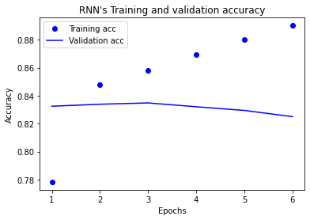

# SentencePiece 사용하기

네이버 영화리뷰 감정 분석 코퍼스에 SentencePiece를 적용시킨 모델 학습하려고 한다.

그 전에 문장 데이터를 직접 토큰화하며 어떤 방법이 가장 적합한 단어 조각을 만들어 내는지 연습을 해보자.

## 1. 데이터 가져오기


```python
import tensorflow as tf
import numpy as np
import matplotlib.pyplot as plt
import konlpy

from konlpy.tag import Mecab

mecab = Mecab()
```

내려받은 데이터는 한국어의 형태소 분석과 품사 태깅, 기계 번역 연구를 위해 공개된 데이터이다.

사용할 데이터는 한국어-영어 병렬을 이루는 말뭉치 중 한국어 부분


```python
import os
path_to_file = os.getenv('HOME')+'/aiffel/sp_tokenizer/data/korean-english-park.train.ko'

with open(path_to_file, "r") as f:
    raw = f.read().splitlines()

print("Data Size:", len(raw))

print("Example:")
for sen in raw[0:100][::20]: print(">>", sen)
```

    Data Size: 94123
    Example:
    >> 개인용 컴퓨터 사용의 상당 부분은 "이것보다 뛰어날 수 있느냐?"
    >> 북한의 핵무기 계획을 포기하도록 하려는 압력이 거세지고 있는 가운데, 일본과 북한의 외교관들이 외교 관계를 정상화하려는 회담을 재개했다.
    >> "경호 로보트가 침입자나 화재를 탐지하기 위해서 개인적으로, 그리고 전문적으로 사용되고 있습니다."
    >> 수자원부 당국은 논란이 되고 있고, 막대한 비용이 드는 이 사업에 대해 내년에 건설을 시작할 계획이다.
    >> 또한 근력 운동은 활발하게 걷는 것이나 최소한 20분 동안 뛰는 것과 같은 유산소 활동에서 얻는 운동 효과를 심장과 폐에 주지 않기 때문에, 연구학자들은 근력 운동이 심장에 큰 영향을 미치는지 여부에 대해 논쟁을 해왔다.


```python


min_len = 999
max_len = 0
sum_len = 0

for sen in raw:
    length = len(sen)
    if min_len > length: min_len = length
    if max_len < length: max_len = length
    sum_len += length

print("문장의 최단 길이:", min_len)
print("문장의 최장 길이:", max_len)
print("문장의 평균 길이:", sum_len // len(raw))

sentence_length = np.zeros((max_len), dtype=int)

for sen in raw:
    sentence_length[len(sen)-1] += 1

plt.bar(range(max_len), sentence_length, width=1.0)
plt.title("Sentence Length Distribution")
plt.show()
```

    문장의 최단 길이: 1
    문장의 최장 길이: 377
    문장의 평균 길이: 60


    

    


```python
def check_sentence_with_length(raw, length):
    count = 0
    
    for sen in raw:
        if len(sen) == length:
            print(sen)
            count += 1
            if count > 100: return

check_sentence_with_length(raw, 1)
```

    ’


```python
for idx, _sum in enumerate(sentence_length):
    # 문장의 수가 1500을 초과하는 문장 길이를 추출합니다.
    if _sum > 1500:
        print("Outlier Index:", idx+1)
```

    Outlier Index: 11
    Outlier Index: 19
    Outlier Index: 21


```python
check_sentence_with_length(raw, 11)
```

    라고 조던이 말했다.
    - 모르고 있습니다.
    - 네, 보이는군요.
    디즈니사만이 아니다.
    큰 파티는 아니지요.
    의자는 비어 있었다.
    이 일은 계속됩니다.
    나는 크게 실망했다.
    그 이유는 간단하다.
    이력서와 자기 소개서
    시대가 변하고 있다.
    는 돌발질문을 했다.
    9. 몇 분간의 명상
    하와이, 빅 아일랜드
    키스를 잘 하는 방법
    키스를 잘 하는 방법
    스피어스가 뚱뚱한가?
    산 위를 나는 느낌.
    세 시간쯤 걸었을까?
    (아직 읽고있습니까?
    처음에는 장난이었다.
    우리는 운이 좋았다.
    아기가 숨을 멈출 때
    건물 전체 무너져내려
    그녀의 아름다운 눈.
    대답은 다음과 같다.
    "사과할 것이 없다.
    폭탄테러가 공포 유발
    그는 "잘 모르겠다.
    그는 "잘 모르겠다.
    그는 "잘 모르겠다.
    그는 "잘 모르겠다.
    그는 "잘 모르겠다.
    그는 "잘 모르겠다.
    그는 "잘 모르겠다.
    그는 "잘 모르겠다.
    그는 "잘 모르겠다.
    케냐 야생동물 고아원
    경유 1200원대로…
    더 내려야 하는 이유
    케냐 야생동물 고아원
    경유 1200원대로…
    더 내려야 하는 이유
    케냐 야생동물 고아원
    경유 1200원대로…
    더 내려야 하는 이유
    케냐 야생동물 고아원
    경유 1200원대로…
    더 내려야 하는 이유
    케냐 야생동물 고아원
    경유 1200원대로…
    더 내려야 하는 이유
    케냐 야생동물 고아원
    경유 1200원대로…
    더 내려야 하는 이유
    케냐 야생동물 고아원
    경유 1200원대로…
    더 내려야 하는 이유
    케냐 야생동물 고아원
    경유 1200원대로…
    더 내려야 하는 이유
    케냐 야생동물 고아원
    경유 1200원대로…
    더 내려야 하는 이유
    케냐 야생동물 고아원
    경유 1200원대로…
    더 내려야 하는 이유
    케냐 야생동물 고아원
    경유 1200원대로…
    더 내려야 하는 이유
    케냐 야생동물 고아원
    경유 1200원대로…
    더 내려야 하는 이유
    케냐 야생동물 고아원
    경유 1200원대로…
    더 내려야 하는 이유
    케냐 야생동물 고아원
    경유 1200원대로…
    더 내려야 하는 이유
    케냐 야생동물 고아원
    경유 1200원대로…
    더 내려야 하는 이유
    케냐 야생동물 고아원
    경유 1200원대로…
    더 내려야 하는 이유
    케냐 야생동물 고아원
    경유 1200원대로…
    더 내려야 하는 이유
    케냐 야생동물 고아원
    경유 1200원대로…
    더 내려야 하는 이유
    케냐 야생동물 고아원
    경유 1200원대로…
    더 내려야 하는 이유
    케냐 야생동물 고아원
    경유 1200원대로…
    더 내려야 하는 이유
    조금은 새침한 샬롯？
    조금은 새침한 샬롯？
    케냐 야생동물 고아원
    경유 1200원대로…


중복된 문장이 많기 때문에 중복을 제거한 후 다시 실행시켜 본다.


```python
min_len = 999
max_len = 0
sum_len = 0

cleaned_corpus = list(set(raw))  # set를 사용해서 중복을 제거합니다.
print("Data Size:", len(cleaned_corpus))

for sen in cleaned_corpus:
    length = len(sen)
    if min_len > length: min_len = length
    if max_len < length: max_len = length
    sum_len += length

print("문장의 최단 길이:", min_len)
print("문장의 최장 길이:", max_len)
print("문장의 평균 길이:", sum_len // len(cleaned_corpus))

sentence_length = np.zeros((max_len), dtype=int)

for sen in cleaned_corpus:   # 중복이 제거된 코퍼스 기준
    sentence_length[len(sen)-1] += 1

plt.bar(range(max_len), sentence_length, width=1.0)
plt.title("Sentence Length Distribution")
plt.show()
```

    Data Size: 77591
    문장의 최단 길이: 1
    문장의 최장 길이: 377
    문장의 평균 길이: 64


    

    


데이터의 개수도 17000개 가량 줄어 77591개가 된 것을 볼 수 있다.


```python
max_len = 150
min_len = 10

# 길이 조건에 맞는 문장만 선택합니다.
filtered_corpus = [s for s in cleaned_corpus if (len(s) < max_len) & (len(s) >= min_len)]

# 분포도를 다시 그려봅니다.
sentence_length = np.zeros((max_len), dtype=int)

for sen in filtered_corpus:
    sentence_length[len(sen)-1] += 1

plt.bar(range(max_len), sentence_length, width=1.0)
plt.title("Sentence Length Distribution")
plt.show()
```


    

    


짧은 데이터는 노이즈로 작용할 수 있기 때문에 길이가 10미만인 데이터도 제거한다.

## 2. 공백 기반 토큰화


정제된 데이털를 기반으로 tokenize() 함수를 사용해 단어 사전과 Tensor 데이터를 얻고 단어 사전의 크기를 확인해본다.


```python
def tokenize(corpus):  # corpus: Tokenized Sentence's List
    tokenizer = tf.keras.preprocessing.text.Tokenizer(filters='')
    tokenizer.fit_on_texts(corpus)

    tensor = tokenizer.texts_to_sequences(corpus)

    tensor = tf.keras.preprocessing.sequence.pad_sequences(tensor, padding='post')

    return tensor, tokenizer
```


```python
split_corpus = []


for kor in filtered_corpus:
    split_corpus.append(kor.split())
```


```python
# 단어 사전의 길이

split_tensor, split_tokenizer = tokenize(split_corpus)

print("Split Vocab Size:", len(split_tokenizer.index_word))
```

    Split Vocab Size: 237435


```python
for idx, word in enumerate(split_tokenizer.word_index):
    print(idx, ":", word)

    if idx > 10: break
```

    0 : 이
    1 : 밝혔다.
    2 : 있다.
    3 : 말했다.
    4 : 수
    5 : 있는
    6 : 그는
    7 : 대한
    8 : 위해
    9 : 전했다.
    10 : 지난
    11 : 이번


## 3. 형태소 기반 토큰화

MeCab 기반으로 생성된 단어 사전과 Tensor 데이터를 가져온다.


```python
def mecab_split(sentence):
    return mecab.morphs(sentence)

mecab_corpus = []

for kor in filtered_corpus:
    mecab_corpus.append(mecab_split(kor))
```


```python
# 단어 사전의 길이 확인

mecab_tensor, mecab_tokenizer = tokenize(mecab_corpus)

print("MeCab Vocab Size:", len(mecab_tokenizer.index_word))
```

    MeCab Vocab Size: 52279


공백 기반 단어 사전에 비해 단어 수가 현저히 줄어든 것을 확인할 수 있다.

이는 곧 연산량의 감소로 이어져 더 빠른 학습을 가능케 하고, 심지어 모델이 튜닝해야 하는 매개변수(Parameter) 수가 줄어들어 학습도 더 잘 된다.

## 4. SentencePiece 가져오기


```python
def tokenize(corpus):  # corpus: Tokenized Sentence's List
    tokenizer = tf.keras.preprocessing.text.Tokenizer(filters='')
    tokenizer.fit_on_texts(corpus)

    tensor = tokenizer.texts_to_sequences(corpus)

    tensor = tf.keras.preprocessing.sequence.pad_sequences(tensor, padding='post')

    return tensor, tokenizer
```


```python
import sentencepiece as spm
import os
temp_file = os.getenv('HOME')+'/aiffel/sp_tokenizer/data/korean-english-park.train.ko.temp'

vocab_size = 8000

with open(temp_file, 'w') as f:
    for row in filtered_corpus:   # 이전 스텝에서 정제했던 corpus를 활용합니다.
        f.write(str(row) + '\n')

spm.SentencePieceTrainer.Train(
    '--input={} --model_prefix=korean_spm --vocab_size={}'.format(temp_file, vocab_size)    
)
#위 Train에서  --model_type = unigram이 디폴트 적용되어 있습니다. --model_type = bpe로 옵션을 주어 변경할 수 있습니다.

!ls -l korean_spm*
```

    sentencepiece_trainer.cc(177) LOG(INFO) Running command: --input=/aiffel/aiffel/sp_tokenizer/data/korean-english-park.train.ko.temp --model_prefix=korean_spm --vocab_size=8000
    sentencepiece_trainer.cc(77) LOG(INFO) Starts training with : 
    trainer_spec {
      input: /aiffel/aiffel/sp_tokenizer/data/korean-english-park.train.ko.temp
      input_format: 
      model_prefix: korean_spm
      model_type: UNIGRAM
      vocab_size: 8000
      self_test_sample_size: 0
      character_coverage: 0.9995
      input_sentence_size: 0
      shuffle_input_sentence: 1
      seed_sentencepiece_size: 1000000
      shrinking_factor: 0.75
      max_sentence_length: 4192
      num_threads: 16
      num_sub_iterations: 2
      max_sentencepiece_length: 16
      split_by_unicode_script: 1
      split_by_number: 1
      split_by_whitespace: 1
      split_digits: 0
      treat_whitespace_as_suffix: 0
      allow_whitespace_only_pieces: 0
      required_chars: 
      byte_fallback: 0
      vocabulary_output_piece_score: 1
      train_extremely_large_corpus: 0
      hard_vocab_limit: 1
      use_all_vocab: 0
      unk_id: 0
      bos_id: 1
      eos_id: 2
      pad_id: -1
      unk_piece: <unk>
      bos_piece: <s>
      eos_piece: </s>
      pad_piece: <pad>
      unk_surface:  ⁇ 
    }
    normalizer_spec {
      name: nmt_nfkc
      add_dummy_prefix: 1
      remove_extra_whitespaces: 1
      escape_whitespaces: 1
      normalization_rule_tsv: 
    }
    denormalizer_spec {}
    trainer_interface.cc(329) LOG(INFO) SentenceIterator is not specified. Using MultiFileSentenceIterator.
    trainer_interface.cc(178) LOG(INFO) Loading corpus: /aiffel/aiffel/sp_tokenizer/data/korean-english-park.train.ko.temp
    trainer_interface.cc(385) LOG(INFO) Loaded all 76908 sentences
    trainer_interface.cc(400) LOG(INFO) Adding meta_piece: <unk>
    trainer_interface.cc(400) LOG(INFO) Adding meta_piece: <s>
    trainer_interface.cc(400) LOG(INFO) Adding meta_piece: </s>
    trainer_interface.cc(405) LOG(INFO) Normalizing sentences...
    trainer_interface.cc(466) LOG(INFO) all chars count=4996369
    trainer_interface.cc(477) LOG(INFO) Done: 99.95% characters are covered.
    trainer_interface.cc(487) LOG(INFO) Alphabet size=1317
    trainer_interface.cc(488) LOG(INFO) Final character coverage=0.9995
    trainer_interface.cc(520) LOG(INFO) Done! preprocessed 76908 sentences.
    unigram_model_trainer.cc(139) LOG(INFO) Making suffix array...
    unigram_model_trainer.cc(143) LOG(INFO) Extracting frequent sub strings...
    unigram_model_trainer.cc(194) LOG(INFO) Initialized 174340 seed sentencepieces
    trainer_interface.cc(526) LOG(INFO) Tokenizing input sentences with whitespace: 76908
    trainer_interface.cc(537) LOG(INFO) Done! 237965
    unigram_model_trainer.cc(489) LOG(INFO) Using 237965 sentences for EM training
    unigram_model_trainer.cc(505) LOG(INFO) EM sub_iter=0 size=92555 obj=14.853 num_tokens=523272 num_tokens/piece=5.65363
    unigram_model_trainer.cc(505) LOG(INFO) EM sub_iter=1 size=82083 obj=13.516 num_tokens=525776 num_tokens/piece=6.40542
    unigram_model_trainer.cc(505) LOG(INFO) EM sub_iter=0 size=61555 obj=13.5533 num_tokens=546907 num_tokens/piece=8.88485
    unigram_model_trainer.cc(505) LOG(INFO) EM sub_iter=1 size=61506 obj=13.5101 num_tokens=547350 num_tokens/piece=8.89913
    unigram_model_trainer.cc(505) LOG(INFO) EM sub_iter=0 size=46126 obj=13.6926 num_tokens=575369 num_tokens/piece=12.4739
    unigram_model_trainer.cc(505) LOG(INFO) EM sub_iter=1 size=46126 obj=13.6493 num_tokens=575466 num_tokens/piece=12.476
    unigram_model_trainer.cc(505) LOG(INFO) EM sub_iter=0 size=34594 obj=13.8894 num_tokens=606014 num_tokens/piece=17.5179
    unigram_model_trainer.cc(505) LOG(INFO) EM sub_iter=1 size=34594 obj=13.8387 num_tokens=606012 num_tokens/piece=17.5178
    unigram_model_trainer.cc(505) LOG(INFO) EM sub_iter=0 size=25945 obj=14.1301 num_tokens=637532 num_tokens/piece=24.5724
    unigram_model_trainer.cc(505) LOG(INFO) EM sub_iter=1 size=25945 obj=14.0747 num_tokens=637568 num_tokens/piece=24.5738
    unigram_model_trainer.cc(505) LOG(INFO) EM sub_iter=0 size=19458 obj=14.4091 num_tokens=670960 num_tokens/piece=34.4825
    unigram_model_trainer.cc(505) LOG(INFO) EM sub_iter=1 size=19458 obj=14.3468 num_tokens=670999 num_tokens/piece=34.4845
    unigram_model_trainer.cc(505) LOG(INFO) EM sub_iter=0 size=14593 obj=14.7196 num_tokens=705636 num_tokens/piece=48.3544
    unigram_model_trainer.cc(505) LOG(INFO) EM sub_iter=1 size=14593 obj=14.648 num_tokens=705645 num_tokens/piece=48.355
    unigram_model_trainer.cc(505) LOG(INFO) EM sub_iter=0 size=10944 obj=15.0875 num_tokens=741620 num_tokens/piece=67.765
    unigram_model_trainer.cc(505) LOG(INFO) EM sub_iter=1 size=10944 obj=15.007 num_tokens=741624 num_tokens/piece=67.7654
    unigram_model_trainer.cc(505) LOG(INFO) EM sub_iter=0 size=8800 obj=15.3757 num_tokens=769363 num_tokens/piece=87.4276
    unigram_model_trainer.cc(505) LOG(INFO) EM sub_iter=1 size=8800 obj=15.307 num_tokens=769367 num_tokens/piece=87.4281
    trainer_interface.cc(615) LOG(INFO) Saving model: korean_spm.model
    trainer_interface.cc(626) LOG(INFO) Saving vocabs: korean_spm.vocab


    -rw-r--r-- 1 root root 376816 May 25 02:49 korean_spm.model
    -rw-r--r-- 1 root root 146213 May 25 02:49 korean_spm.vocab


```python
s = spm.SentencePieceProcessor()
s.Load('korean_spm.model')

# SentencePiece를 활용한 sentence -> encoding
tokensIDs = s.EncodeAsIds('아버지가방에들어가신다.')
print(tokensIDs)

# SentencePiece를 활용한 sentence -> encoded pieces
print(s.SampleEncodeAsPieces('아버지가방에들어가신다.',1, 0.0))

# SentencePiece를 활용한 encoding -> sentence 복원
print(s.DecodeIds(tokensIDs))
```

    [1243, 11, 302, 7, 3608, 11, 287, 38, 3]
    ['▁아버지', '가', '방', '에', '들어', '가', '신', '다', '.']
    아버지가방에들어가신다.


## 5. Tokenizer 함수 작성

 훈련시킨 SentencePiece를 활용하여 위 함수와 유사한 기능을 하는 sp_tokenize() 함수를 정의


```python
def sp_tokenize(s, corpus):

    tensor = []

    for sen in corpus:
        tensor.append(s.EncodeAsIds(sen))

    with open("./korean_spm.vocab", 'r') as f:
        vocab = f.readlines()

    word_index = {}
    index_word = {}

    for idx, line in enumerate(vocab):
        word = line.split("\t")[0]

        word_index.update({word:idx})
        index_word.update({idx:word})

    tensor = tf.keras.preprocessing.sequence.pad_sequences(tensor, padding='post')

    return tensor, word_index, index_word
```


```python
#sp_tokenize(s, corpus) 사용예제

my_corpus = ['나는 밥을 먹었습니다.', '그러나 여전히 ㅠㅠ 배가 고픕니다...']
tensor, word_index, index_word = sp_tokenize(s, my_corpus)
print(tensor)
```

    [[1956 5665    5    4 7975 1990    3    0    0    0    0    0    0    0]
     [ 107 1641  101    4    0  417   11    4   14    0 1976    3    3    3]]


## 6. 네이버 영화리뷰 감정 분석 문제에 SentencePiece 적용해 보기

* 네이버 영화리뷰 감정분석 태스크을 사용하여 한국어로 된 코퍼스를 다루어야 하므로 주로 KoNLPy에서 제공하는 형태소 분석기를 사용하여 텍스트를 전저치래서 RNN 모델을 분류기로 사용한다.

* 만약 이 문제에서 tokenizer를 sentencepiece로 바꿔 다시 풀어본다면 성능이 좋아질지 비교.

    * 네이버 영화리뷰 감정분석 코퍼스에 sentencepiece를 적용시킨 모델 학습하기

    * 학습된 모델로 sp_tokenize() 메소드 구현하기

    * 구현된 토크나이저를 적용하여 네이버 영화리뷰 감정분석 모델을 재학습하기

    * KONLPy 형태소 분석기를 사용한 모델과 성능 비교하기
     
    * SentencePiece 모델의 model_type, vocab_size 등을 변경해 가면서 성능 개선 여부 확인하기

### 1. 데이터 가져오기


```python
import urllib.request
import pandas as pd

urllib.request.urlretrieve("https://raw.githubusercontent.com/e9t/nsmc/master/ratings.txt", filename="ratings.txt")
```


    ('ratings.txt', <http.client.HTTPMessage at 0x7fc91cdf26a0>)


```python
naver_df = pd.read_table('ratings.txt')
naver_df.tail()
```


<div>
<style scoped>
    .dataframe tbody tr th:only-of-type {
        vertical-align: middle;
    }

    .dataframe tbody tr th {
        vertical-align: top;
    }

    .dataframe thead th {
        text-align: right;
    }
</style>
<table border="1" class="dataframe">
  <thead>
    <tr style="text-align: right;">
      <th></th>
      <th>id</th>
      <th>document</th>
      <th>label</th>
    </tr>
  </thead>
  <tbody>
    <tr>
      <th>199995</th>
      <td>8963373</td>
      <td>포켓 몬스터 짜가 ㅡㅡ;;</td>
      <td>0</td>
    </tr>
    <tr>
      <th>199996</th>
      <td>3302770</td>
      <td>쓰.레.기</td>
      <td>0</td>
    </tr>
    <tr>
      <th>199997</th>
      <td>5458175</td>
      <td>완전 사이코영화. 마지막은 더욱더 이 영화의질을 떨어트린다.</td>
      <td>0</td>
    </tr>
    <tr>
      <th>199998</th>
      <td>6908648</td>
      <td>왜난 재미없었지 ㅠㅠ 라따뚜이 보고나서 스머프 봐서 그런가 ㅋㅋ</td>
      <td>0</td>
    </tr>
    <tr>
      <th>199999</th>
      <td>8548411</td>
      <td>포풍저그가나가신다영차영차영차</td>
      <td>0</td>
    </tr>
  </tbody>
</table>
</div>


```python
# 데이터 분할

from sklearn.model_selection import train_test_split

train_data, test_data = train_test_split(naver_df, test_size=0.25, random_state=0)

print('train 데이터 사이즈:', len(train_data))
print('test 데이터 사이즈:', len(test_data))
```

    train 데이터 사이즈: 150000
    test 데이터 사이즈: 50000


20만개의 데이터가 있다.


```python
# 중복 및 결측치 제거
train_data.drop_duplicates(subset=['document'], inplace=True)
train_data = train_data.dropna(how = 'any') 
test_data.drop_duplicates(subset=['document'], inplace=True)
test_data = test_data.dropna(how = 'any') 

print('train 데이터 사이즈:', len(train_data))
print('test 데이터 사이즈:', len(test_data))
```

    train 데이터 사이즈: 146269
    test 데이터 사이즈: 49103


```python
data = list(train_data['document']) + list(test_data['document'])

print("Data Size:", len(data))
```

    Data Size: 195372


### 2. 데이터 분석 및 전처리


```python
naver_review = data
```


```python
min_len = 999
max_len = 0
sum_len = 0

for sen in naver_review:
    length = len(sen)
    if min_len > length: 
        min_len = length
        
    if max_len < length: 
        max_len = length
    
    sum_len += length

print("문장의 최단 길이:", min_len)
print("문장의 최장 길이:", max_len)
print("문장의 평균 길이:", sum_len // len(naver_review))

sentence_length = np.zeros((max_len), dtype=np.int)

for sen in naver_review:
    sentence_length[len(sen)-1] += 1

plt.bar(range(max_len), sentence_length, width=1.0)
plt.title("Sentence Length Distribution")
plt.show()
```

    문장의 최단 길이: 1
    문장의 최장 길이: 142
    문장의 평균 길이: 35


    /tmp/ipykernel_1625/1743548021.py:19: DeprecationWarning: `np.int` is a deprecated alias for the builtin `int`. To silence this warning, use `int` by itself. Doing this will not modify any behavior and is safe. When replacing `np.int`, you may wish to use e.g. `np.int64` or `np.int32` to specify the precision. If you wish to review your current use, check the release note link for additional information.
    Deprecated in NumPy 1.20; for more details and guidance: https://numpy.org/devdocs/release/1.20.0-notes.html#deprecations
      sentence_length = np.zeros((max_len), dtype=np.int)


    

    


```python
def check_sentence_with_length(raw, length):
    count = 0
    
    for sen in raw:
        if len(sen) == length:
            print(sen)
            count += 1
            if count > 100: return 

check_sentence_with_length(naver_review, 135)
```

    전쟁과 죽음을 통해 자신들만의 방식으로 이별을 채득하고 배워가는 아이들.. 우리가 순수라고 말하는 아이들의 천진함의 섬짓한 이면을 보여주는 것 같기도 하고... 암튼 기억에 남을 영화다. 헌데 왜 난 자꾸 천공의 성 라퓨타가 떠오르는걸까..?
    심사하는 사람이 혐오음식도 아닌데 육회도 못먹는 사람이 하고,간장에 먹는 비빔밥에 고추장을 달라고 하고,기본적인 예의도 없이 음식한 사람 깎아내리기에 여념이 없는 프로가 참 꼴불견,일단 맛있게먹고 이런건 좋았고 어떤건 아쉬웠다 모자랐다 하는거
    제발 각본쓸때 개연성 있게 좀 써라. 직원이란 이유로 기타 뺏기고 사기공범으로 몰겠단 말에 신고도 못하는게 말이나 되냐? 디테일에서 놓치고 가니 주인공이 답답하게만 느껴지고 전혀 몰입이 안되더라. 최소한도인데 그걸 못하나.. 답답하네 정말;;
    이루어 질수 없기에 더욱 너무나 애절하고 안타까운 야하기만 한게 아니라 너무나 아름다운 영상. 그리고 소녀를 사랑하는 마음을 이룰 수 없는 중국인 청년의 안타깝고 애절한 눈빛. 소녀와 여인의 경계에 있는 제인마치도 너무나 묘하게 잘 어울린다.
    생각보다 재밌는데 왜 평점이 낮은지 이해가 안된다. 박하선의 연기가 일품이고....특히 여고생연기, 음치흉내내는것 등등 박하선의 매력에 푹~ 빠지게 만드는 그런 영화다....요즘 유머코드와 안맞아서 흥행실패한지는 모르겠지만....암튼 재밌음.
    가수들도 좋고 좋은 노래도 들을 수 있어서 좋지만전현무의 과도한 진행 욕심이 너무 보기 싫다.결과발표할때마다 채널돌려버린다.결과가 중요한가?가수와 모창 능력자 모두함께한 자리라서 승부보단 의미에 무게를 두는마당에고작 결과발표하는거로 욕먹고싶냐
    고등학교때 보고 지금에서 생각난 영화 참~그땐 눈물 콧물 흘리면서 봤는데짐 보면 나올라나.. 하긴 세월이 많이 흘렀지 아마 짐 시대하곤 스토리자체가 뻔하니깐 하지만 지금도 잊혀지지않는장면은 주인공이 공부하는장면과하늘도 갈라놓지 못한 그들의사랑
    별로. 이 영화가 별로라고 생각한사람들은 대개가 가볍고 재미있는 재난영화를 기대하고 봤다가 그게 아닌것에서 오는 배신감일듯? 나도 그렇고. 그리고 내용적으로도 별거아닌스토리에 너무 많은것을 담으려고한 감독의 의도가 보여서 보는내내 낯뜨거웠음.
    소비자 우롱.bbc 시즌 3 방영붕 3개 그냥 묶은거가 무슨 영화라고 내세우나요.아님 화질이라도 좋던지.. 영화판으로 만든게 아니라 티비용이라 화질 엄청 별로에요. 유튜브에서 보던 애들은 완전 실망.이래서 광고안한거죠? 광고하면 안보러올까봐.
    어제 압구정에서 봤는데..세작품이 느낌이달라서 좋았습니다. 비상구는부담스러움너무 노출에 포인트를 준거같아서.개인적으로 더 바디 영상미가 너무 좋았습니다대중화 되기는 좀 힘들겠습니다만 볼만하네요.비상구 여자분 영화속 모습과 너무 달라 놀랐습니다
    사운드며 조승우의 보컬이 너무 좋았다.하지만 가장 좋았던겄은 별로 좋아하지 않았던신민아~♡그녀의 인생연기. 화면이(감독이 암흑기를 표현했겠지만)더 아름다웠을듯.좋아하는 감독님이 추억의 가요로 리머이크를 잘 해준다면 오백만 이상 자신해요~^^)
    창업을 꿈꾸는가! 좋은 아이템이 있어 사업을 하려하는가!! 그렇다면 기를 쓰고 이 영활 보기바란다!! 그 멀고 험한 여정에 스승이 될것이요 지침서가 될것이다... 혹은 단념에 도움이 될지도... 참 오랜만에 박장대소하며 본 독립영활세~~~ ★
    서로를 믿고 의지하며 서로에게 도움을주고 같이 경기에 임하는모습들이 연예인,방송인들이아니라 정말선수처럼보여요. 페어플레이를 준수하면서 자신의한계에 도전하는 모습들이 진정한 선수아니겠어요 경기에 뛸때만큼은, 지금모두가선수인듯싶네요 정말멋집니다♡
    연출력이 상당히 돋보이는 작품이다. 할배가 할매를 질식사 시킬 줄은 꿈에도 예측 못했다. 정말로충격적인 장면이었다. 할매가 나중에 어떻게 인생이 마감 할까? 내가 짐작하는바가 있었는데 갑자기 자기손으로할매를 보내다니...씁씁하기 그지 없었다.
    도심속에 꽉찬 머리속을 비우는 느낌이 좋다대사도 그리 많지 않고 잔잔하면서 서정적인 풍광작은집 외벽 이곳 저곳 벗겨진 페인트가 세월의 자연스러움을 보여준다이국적이지만 동양적 시각으로 앵글에 담겨진 하와이가너무나 아름답게 내눈을 편안하게 해준다
    뭐 역사를 다룬영화니 역사왜곡이느니 어쩌구하는 인간들많다 근데 영화는 영화일뿐이고전쟁중에서의 시점은 스파르타시점이니 그 시점에서의 페르시아가 그렇게보인다는 식으로 꾸민건데(적군이고 스파르타 입장이니) 그냥 영화로봐라 영화로 무슨 역사공부하냐?
    님을 생각하면 너무 가슴 아프다... 일년 후 박사가 다시 왔을때... 님이 기뻐하며 안기는 그 모습만 생각하면 가슴이 아파 미치겠다...그리곤 다시 오지 않았지...인간의 잔인함... 님을 생각하면 가슴아프고...미안하고... 너무괴롭다..
    28일후는 단순한 좀비영화가 아니라 인간의 본성이 무엇인지, 그리고 집단적 폭력과 비합리적인 권위가 얼마나 위험한 것인지(심지어 좀비보다도)를 보여주려고 한 영화다. 조지 로매오의 살아있는 시체들의 밤과 더불어 좀비 영화의 명작이라고 생각함.
    6점대는 아닌거 같다..곽경택영화는 항상 부담스럽긴 한데.. 겉멋 보다는 툭툭 던지는 욕설 섞인 구수한 사투리의 강한남성영화인거 같다. 출현 배우의 능력을 최대한 끌어내는 감독. 취향은 아니지만 영상 음악 나무랄데 없고 항상 대작스멜이 난다.
    정말 이런 영화 만들지 마세요... 감동을 주든, 재미를 주든, 교훈을 주든, 감정을 주든... 영화의 목적이 전혀 없는 그냥 싸이코 영화로 봤습니다. 이글 보고 감독님이 상처 받을 수도 있을까도 생각하는데 감독님 상처 좀 받아야 합니다...
    윤재문보다 인구아재의 딸과 마누라가 더 얄밉더라 고기만두사왔는데 휙 지나치는장면, 그동안 깡패짓으로번돈 잘써놓고선 한번도 떳떳한적없었다고말하는 마눌년 송강호가 울먹이면서 당신은 이러면안되지 라고할땐 울컥했다범죄영화가아니라 가장영화 아버지영화다
    영화가 재미 없는 것은 아닙니다. 하지만 신선한 내용을 다룬다는 낙천적 관점만 취하지 마시고, 오늘날 무너져가는 보편적진리와 사회의 암담한 현실을 비추는 조금은 위험한 작품이라는 점도 참고하시면 좋겠습니다. 우리 아이들이 안 봤으면 좋겠어요.
    이 영화보면서 재미업다는 사람들은 역사좀 알아라영화에서 왜5.16을등장시키고 최규식 왜거론하는지 알지도못하니 그러지.. 한 남자의 인생을통해서 그시대적 상황을 알수있고 또 제목처럼 한남자가 그런상황에 맞춰 어뜩해 살았는지.. 보는 내내짠햇다.
    이게 그 판결에 불복하고 멋대로 앙심을 품고 법관을 살해하려다 미수에 그친 범죄자 미화 옹호 영화 맞나요??내 편 안들어주는 판사는 직무유기를 한거라니깐?? 동네사람들!! 저놈 나쁜놈이래요!! 법관보고 법을 지키라는 범죄자! 블랙 코미디인가?
    인격의 다양한 면을 감각적으로 표현한 멋진 작품. 차안에서의 하가안과 고지위의 동행장면과 마지막에 겁쟁이를 한번더 추악하게 만든 장면 등에서 눈에 보이는 것 이상의 디테일한 세상을 가시적으로 전달하여 상황을 더 인상적이게 표현한 것이 좋았다.
    이 영화를 몇 번이고 보면 볼수록, 하나의 문장이 머릿속에서 떠나질 않았다. 한국은 관객을 위한 영화가 없다. 제발 우리나라 영화가 같잖은 억지눈물샘만 자극하는 돈만 보는 거지같은 거 그만하고 이 영화의 반 정도만 되는 영화를 만들길 바란다.
    처음엔 정신이 피폐해진것같아 불쾌했다. 막연히 걱정하지만 넘겨버릴법한 범죄상황을 실감나고 섬세하게 묘사한 감독이 대단하다... 박진감은 넘치지만 억지상황이 난무해 문단속의 중요성을 잊게 한 불사여인의 비현실 영화 '숨바꼭질'이 문득 생각난다.
    7~8점정도는 되는데 현실왜곡해서 1점줌. 마지막에 말이되냐. 주인공 버프 개사기. 풉... 현실이였으면 되려 개박살. 저런식으로 영화에서라도 일진 이겨보고싶은갚네? 피해의식쩐다. 현실에선 복수하러가서 불구되겠지. 셔틀들을 위한 현실도피영화.
    실제역사에서 학도병들은 김석원 준장이 3사단장으로 이동할때 집에 갈 수 있었지만 "우리는 계속 싸우고 싶다"하여 포항출신이 아님에도 자발적으로 포항까지 따라왔는데 영화에서는 마치 강제징집된것처럼 묘사하여 71명 학도병들의 애국심을 모욕한 영화
    26년 살면서 공포영화에 나오는 귀신 보면서 분노하는건 처음..가정있는 모녀관계를 끊어 놓는 이기적인 씹무개념 유아귀신..내가 저기 나오는 주인공꼬마애였다면 저 아파트 폭파 시켜버린다. 어디 죽은 귀신따위한테 억울하게 엄마 뺏기고 가만있냐ㅡㅡ
    예술성이 강한영화든 생각을 많이하게만드는 영화든 가볍게 웃고넘기는 영화든 장르종류불문하고 모든 영화를 좋아하는 나이기에 이 영화에도 나름의 흥미를 느껴 8천원을 내고 봤지만 솔직히 30분까지 보는것이 한계였다. 적어도 내 취향은 아니올시다다.
    레미제라블을보고, 스위니토드는 생각보다 배우들급이 낮았구나 싶었는데 다시보니 진정한 걸작이다. 가위손 이후 팀버튼과 조니뎁의 시너지가 가장 잘 발현된 작품! 음울한 런던을 표현한 미술에, 손드하임의 탁월한 음악. 주제표현까지 완벽한 잔혹동화!
    중학교때 단체관람했던영화.오랜만에생각나길래 평점보러왔는데 . . 평이 다 장난스러운이유는뭐지?난정말감명깊게보았구.. 클레멘타인~하는노래소리가 지금도 귓가를맴돈다. 내용은세세히기억안나지만 가슴이찡했던기억이난다. 왜망작이라하며놀리는거지ㅠㅠ이해안가
    러브라인이 약간 억지스러운 면이 아주 약간 있는것 같고 마지막에 대 신기전 발사할땐 마치 현대의 로켓이 날라가는 것과같이 묘사하여 과장이 좀 심한것같다는 느낌을 받았습니다. 또 마지막에 폭죽도 약간 과장이 있는것같지만 나머지는 다 좋았습니다.
    같지도 않은 삼류 인디영화 인디음악 빨면 있어보이는지 아는걸로는 한국놈들 따라올 민족이 없을듯. 뭐 대단한 영화인양 써재껴놓는 놈들은 걍 손목긋고 하늘나라로나 가라. 자극적인 설정 자극적인 내용으로 주목한번 받아보겠다고 만든 영화 맞는데 뭘.
    사실 평점은 3점정도 될것 같은데 이상하리만큼 점수가 높아서 1점 줍니다. 일단 전반적으로 너무 투박하고 소품이나 피 등 어색한것 투성입니다. 연출력 또한 절대 8점짜리 영화는 아닙니다. 그냥 저예산 C급영화. 낚이지 마시고 그냥 보지마세요.
    영화가 너무 억지스럽고 작위적이고 짜맞춘 느낌이 강함.. 게다가 김명민 졸답답에 똑같은 패턴 비슷한 장면이 너무 많아요. 감독님 이거보면 참고하고 담부턴 제대로된 영화만들어주시길.. 솔직히 영화시간 생각하면 오히려 돈받고 봐줘야하는 영화인듯.
    같은 남자가 봐도 어처구니 없을 정도로 잘생긴 세기의 미남 배우도 맞춤 옷을 입은 듯한 톰 리플리 라는 배역을 만나지 못했다면 지금의 전설적인 명배우가 되지 못했을 것같다.세번쯤 보고나니 연출 연기 패션 음악 모든게 마음에 쏙 드는 명작 영화
    미국의 세대주의자들이 주장했던 잘못된 종말론이 영화에 들어있군요... 한마디로 신학적으로나 내용면으로나 정말 쓰레기영화입니다. 과거 한국교회에서 얼마나 잘못된 종말론을 가졌는지 그 병폐를 보여주는 쓰레기 영화임... 진리에서 벗어난 영화...
    여태 재미있게 잘보고있습니다 헌데 어제 당귀새가 죽임을 당하고 마지막에 왕한테 마하의 친모친부 얘기하는 장면은 너무 억지스러웠어요 왕이 굳이 생사여부를 확인하는것도 .. 당귀새가 위협하는데 아무도 도와주지 않는것도..다 너무 급조한 억지같아요
    노출에 관한 얘기만 가득하네...ㅋㅋㅋ. 그만큼 시나리오가 좀 빈약하네요. 줄러리 흐름도 그렇고 마지막도 매끄럽지 못하고...서스펜스도 아니고, 애로도 아닌...어정쩡한...스토리 이끌어가는 시점도 불분명하고..기자의 역할도 모호 하고....
    진주만에는 역사가있고, 액션과 스케일이 남다른 CG 전쟁이 살아 있다. 그 속에서 꽃피는 청춘들의 사랑이야기와 결국엔 뜨거운 눈물로 끝나는 우정도 있다. 역사성, 사실성, 사랑, 우정, 구성 액션 OST 뭐하나 빠지지 않는 진주만 최고의 영화
    네이버 사용하면서 처음으로.. 영화 후기 남겨봐요.이거 네티즌 평점이 너무 잘못된거아닌가요?정말 릴리 콜린스 얼굴 말고는 남는게 하나도 없고,원작이 책이 맞는지 의심스러울 정도로 내용도 엉망.사이먼 이빨자국이 복선으로 보였는데 아무일도 없고,
    누가 그랬다 20살의 남자는 임신을 보고도 섹스 하는 상상만하지만....자식을 키운 남자는 임산부가 아름답게 보인다고..영화에게 몇년전에 느낀거 보다 더 많은것이 느껴진다..보면 볼수록...나이가 들수록... 좋은 영화다. 현실속의 사랑이..
    확실히 오인혜의 비주얼은 괜찮았다.몸매나 얼굴이나 흠잡을 데 없었다.문제는 작품의 스토리와 그녀의 연기력.이 두 가지가 그녀의 가치를 디스카운트해버렸다.연기력을 갖추지 않는다면 브룩 쉴즈처럼 비주얼만 착취당하가 끝날 것 같아 안타까울 뿐이다.
    시간이 남아 돌아서 아무것도 하고 싶지 않을때 틀기도 뭔가 모자라는 영화 그냥 장기간 집 비울때 도둑 방지용으로 간간히 돌아 가게 하는 용도연기도 스토리도 평가 자체가 의미 없구 시간 내서 봣다는걸 말하는게 치욕으로 여겨질 정도의 조잡한 영상
    존과 진정한 가족이 되기 위해 존의 팀원들은 카르텔에 존의 가족을 죽여달라고 의뢰하였고 이 사실을 알아챈 존은 천만달러를 숨기고 팀을 와해시킨 뒤 자신의 가족을 죽인 팀원들에게 복수한다. 라는 스토리를 예상하고 있었으나 나의 헛된 생각이었다.
    내 나이 스무살에 본 영화.. 그때 극장에서 보먼서 많이웃고울었던 기억...보물섬의 매력에 빠져 ...산울림노래가 잊고 있던 기억을 깨우게 해주네 지금 티비에서 해주는데 ..추억이 새록새록.. 안녕 내 귀여운 친구야 ..안녕 내 작은 사람아.
    매력이었던 대규모해상전과 큰배들이 펼치는 박진감넘치는 전투장면들은 나오지도않고 터너같은 매력적인 캐릭터들이 빠져 영화의 매력이 사라졌다 아무리 잭스패로우라도해도 영화전체를 캐리하기는 불가능 새로나온 캐릭터들은 너무 진부한 해적캐릭터들 실망이다
    아무한테도 알이지 않고 밤에 기차 맨뒤에 타고 이덕화. 이동진 아저씨가 떠난후 나중에 어머니한테 해병대에 입대했다는 편지가 도착하고얼마후 역(驛)에서 2명의 해병이 되서 기차타고 내리면서 마중나온 어머니들과 포옹을 하던 장면이 기억에 남는다.
    오스카는 흔히 볼수있는 아들이자 장난끼 많은 오빠 그리고 항상 미안해하는 남편. 감정이 앞서서 문제를 만들수도 있지만 언제나 마음은 내 가족, 내 사랑인 그 한사람. 정말 거지같은 상황속에서도 사랑이라는 한 단어로 살아남으려는 자를 짖밟았다.
    인간의 죄악을 다룬 영화라고나 할까? 사람은 마음속 깊이 추악한 자기만의 욕심을 가지고 있다.이 욕심을 주된 소재로 비인간적인 캐릭터를 세워 전개해 나간다. 영화를 본 후 기분이 개운치만은 않다.세상의 약자, 불쌍한 사람을 너무나도 학대한다.
    너무 요소가 많다. 9/11, 자폐, 과거있는 남자, 동정해서 결혼까지 할 수 있는 천사표 여자... 거기다가 존은 파병 중독 증세도 보임. 오죽하면 허트로커를 빗대서 허트레터라고 하라는 비아냥까지 나왔을까. 차라리 허트로커를 한번 더 볼걸.
    필요하진 않지만 영화몰입에 플러스되는 장면같은 것들을 지루하게 오래 끌지않고 딱딱 적당히 삽입하는 것은 좋네요.. 전체적으로 봤을때 절망적인 세계에서 살아가는 생존스토리를 그린거 같은데요...그게 다네요... 딱히 가슴에 와닿을만한건 없습니다
    글쎄요 전 참 지루하게봤어요. 지루한 나머지.. 뭔가 있겠지하며 끝까지 봤는데 결국 난해하더라고요./// 억지로 짜낸 감동이 없고 그냥 그대로 보여주는것은 좋았으나.. 너무 밋밋했어요.. 말그대로 주제의식없이 그냥 성장기네요. 평점 7적당한듯
    작품성, 현실성으로 승부해야 할 다큐무비였다. 한국에 수입되며 상어나오는 B급 여름 스릴러처럼 마케팅해 커플들이 껴안을생각으로 영화관 갔다가 뒤통수 맞으니 환불이나 요청하지. 조난에 대한 현실성은 10점을 줘도 아깝지 않은 안타까운 수작이다.
    Mary Hopkin 의 Voyage of the Moon 이 흐르며 새하얀 커피잔에 커피와 독약이 함께 녹는다. 흠 잡을 곳이 없는 멋진 드라마.. 흡사 히가시노게이고 소설의 마무리를 보는 것 같았다. 죽어가는 채령의 모습은 오래 기억될듯.
    앞에 박스에 대한 소재로 흥미 유발 시키다가 30분후 부터 산과 들로 뛰어다니는 스토리OOO풀어 논거처럼 머리속만 헤집어 놓고 ㅅㅂ 사실 길게 쓰기도 짱증난다 절대 비추임보고 싶으시면 차라리 소설을 읽으세요OOO놔 사실 빡쳐서 부인이랑 욕했음
    이런 영화를 수입할수록 국내 라이더특촬은 아동류로 인식 되기만 합니다.인간의 정서 불안 절망 욕망 등의 어두운 요소로 이뤄진 라이더를 국내에서 아동류로 몰아가면 아이들은 이해가 되지 않으며 폭력성등 의영향을 볼 수있습니다.개인적으로 안타깝네요
    이 영화를 단순히 스시에 대한 다큐라고 보지 않으셨으면 합니다ㅋ 일부 전문가들은 이 영화의 전개 등이 뻔하다고 생각 하지만. 이는 감독의 의도를 생각하지 못한 짧은 생각인것 같습니다. 자신의 삶을 이 영화를 거울 삼아 되돌아 보셨으면 합니다.
    밥먹는데 누가 틀어놔서 봤었는데 애들입에서 " 잤냐?" 라는 대사가 나오는거 보고 진심 어이가없고 막굴린다 싶었따 성에대해 숨기고 꽁꽁싸매고 살진 말되 저렇게 더럽게 표현해서도 안되는ㄴ거다 쓰레기같은 ... 전체적으로 안봤기에 삼점은 줌...
    100원도 손해보려 하지 않는 졸렬한 인간들과 달리, 전 인류를 위해 자신을 대속물로 희생한 숭고한 사랑은 그 무엇과도 비교될 수 없다. 인류가 예수 그리스도 앞에 무릎을 꿇어야 하는 이유는 누구도 할 수 없는 위대한 희생을 치뤘기 때문이다.
    아놔...도데체무슨정신으로이런영화를만드시는지..보는내내내가정신병자가되는것같았어..정신병자적기질로보면영화를이해할런지.의도를모르겠다..다만한가지ㅋ법도어겨줘야법이더좋아지지.이한마디랑 아줌OO워 주차단속걸렸을때 무식하게고함지르는거보고 아하하웃겼어..
    아무도 지킬 생각도 없는 번들어진 규범과 규칙 따위가 대체 무슨 소용이 있나. 다들 기품있고 우아한 척 하지만 기실은 상-놈들이랑 하등 다를 바 없던 우리의 잘나신 나으리들이여. 영화의 모든 것을 장악하고 통제해낸 위대한 르누아르에게 경배를!
    다른건 몰라도 액션영화는 오래된건 못보겠다. ㅋㅋㅋ 너무 구리다. 촬영기법등의 기술이너무 낙후된것이 눈에 보여 감동이 없다. 하지만 액션만은 죽인다. 시종 총싸움과 몸싸움으로도배를 하고 있어 어릴적 스토리 없이 액션에만 가치를 둘때 딱 보아야
    보면 볼수록 화가나는 영화;;현실성이 하나도 없음. 진짜 감독의 판타지가 무슨;; 대사도 하나같이 오글거리는거 투성이고...배우들도 연기 하나같이 이상하고..대학입시라는 많은사람들의 꿈과 희망을 이렇게 추악하게 표현하다니 ㅎㅎ 아기분더럽다진심
    포스터는 어떤영화야?!!여주인공 주리의 얼큰이와 광대뼈의 기습에 놀라고.성형쭈쭈의 결정판!출연자들의 연기력과 애드립에 또다시 놀라며.곧 영화가 아니란거에 놀랄것이다. 킬링필름 정도이다.이런것이 저급 영상물이다!를 보여주는 교과서이자 바이블이다
    개봉당시 너무 보고싶었지만 시골인 우리동네 CGV에서는 개봉조차 하지 않아 이제서야 보게 되었습니다. 영화가 끝나고 자막에 40%의 수익을 좋은곳에 쓴다는걸 보고 이런 좋은 영화를 상영조차 하지 않은 우리동네 CGV와 제가 원망 스러웠습니다.
    우리들의 일그러진 영웅이 훌륭한 작품으로 평가되는 이유는 한 학급의 모습에 사회가 그려저 있기 때문이다. 학급의 모습을 통해우리들이 살아가는 사회의 모습을 보여주고있다. 교실도 하나의 작은 사회이다. 그것을 이용해 사회의 모습을 잘 나타냈다.
    원작에 마이너스를 주는 극장판... 괜찮은 전작들이 있는데 뜬금없이 오랜만에 나온 이번편은 왜 되도않는 개그설정에 이상한 캐릭터 설정에... 본래 캐릭터들을 다 죽여놓은 느낌. 전체적으로 난감하다. 원작은 원작으로 놔둬야 한다고 다시한번 느낌
    난 중국영화를 좋아하지만 천녀유혼은 5번밖에 안봤다. 어릴때라 영화에 대해 무지해서 명절때 누나가 보는걸 따라봤다. 하지만 20대가 되고나서 그시절 왜 장국영, 왕조현이 넘사벽인지 이영화를 보고 느꼈다. 왕조현 장국영은 아시아최고라 생각한다.
    평점 안 믿고 괴기전식의 요란하게 놀래키는 유치한 설정이 없는 수준높은 호러라고 평점 8점준사람 믿고 영화 받는데 그냥 저님은 나카타 히데오가 과거에 링이라는 대작을 찍었어 그감독을 좋아해서 이 영화를 좋아하는 사람인가보네요 재미없게 봤습니다
    연기도 스토리도 최괴입니다. 몰입도도 굉장해거 영화애서 눈을 뗄수 없었습니다. 이번 영화로 영국의 역사에도 관심이 생겼네요. 그리고 배우들 연기도 정말 굉장했습니다. 야망에 찬 삶보다는 역시 소박하지만 행복한게 최고라는 생각을 가지게 되었네요
    역시나 소문난 잔치에 개뿔이나 먹을건 하나도 없다. 러닝타임 1시간이면 족할 영화를 거의 2시간에 육박하게 늘려 놓았으니, 지루하고 늘어진다. 괜히 헛폼잡는 오프닝에 일말의 기대를 가졌으나, 쓰레기도 이런 쓰레기가 없다. 1점도 아깝다. 퉷퉷
    뒤늦지만;;보고나서 적지만;;;제발한국영화 이런식으로만 찍지말자;;;좀 상식적으로 좀...수준좀;;기발한거 없음??기발한거없음 좀 헛웃음나오게 하지말구 어디서보고 뺏기지나말던가;;;뭔 영화가 보고나면 어이가없지;;; 너무 승질나서 적음;;;;
    톰행크스의 샤프하고차분한연기가 굿.아울러 영화시작과 끝부분에나오는<street of philadelpia>와 <philadelpia>음악은 화룡점정<나는당신의사상에 반대한다.하지만당신이 그사상때문에 탄압을 받는다면 나는당신의편에서서 싸울것이다
    ?9주동안 내내 출생의비밀을 보면서 일주일의 스트레스가 확 풀렸는데 내일이 마지막이라니...... 특히 제가좋아하는 정이현(성유리)누나를 못보게되다니...... 하지만 그동안 저에게 즐거움을 주신 출생의비밀 여러분들께 깊은 감사를드립니다.^^
    배우들 연기도 진짜 잘하고, 영화도 재밌어요..^^특히 영화초반부즘에 납치단들이 어떤 납치당한 여자랑 남자랑 서로 모르는사이인데 강제로 성관계 시키면서 촬영하는장면 보고 딱하고 안됐다싶으면서도 아 괜히 그 장면보면서 솔직히 좀 하앍 하앍...
    지훈이랑 수정 사랑 이루게해주세요 엄마를 가장 소중하게 여기는 수정이가엄마가 원하는 지훈이를 버리고 미안해서 윤재를 선택한다는 것은 이해안되고 억지설정이죠~ 동생과 결혼식 올린 윤재와 사랑은 아무리 포장해도 막장가족탄생, 막장드라마 지름길이죠
    내용도, 특수효과도, 구성도 괜찮은 편이고, 4대명포 외에 제갈선생의 내공도. 주옥같은 대사들도 나온다...흑속에 백이 있고, 백 속에 흑이 있다. 그림자가 있는 곳엔 반드시 빛이 있지 등의 음양의 이치를 주인공 대사에 쓸 수 있었다니...^
    싸구려 막장 드라마만 내보내면서 시청료는더 받고싶다...? 대한민국 국민을 봉으로 생각하나?? kbs 에서 당최 국민위한 방송이 있었던가?? 납득 할수없네.당당히 시청료 올리겠다 큰소리 치는 그 자신감은 어디서 나오는 건지.넘 뻔뻔한거아닌가?
    그래서 하고 싶은 말이 뭔데..?? . 연출만 잘했더라면 훨씬 더 흥미로웠을텐데. 몇가지 기발한 발상이 있었으나 전혀 못살림.. 영화의 삼분의 이 이상이 지날때까지 특별한 전개가 없고.. 배우들 연기도 좋았는데. 쩝. 오종감독 쪼매 실망이네.
    독창적이고 종교적 색채(?)가 짙은 영화이지만、맨 프롬 어스와 같이 많은 것을 생각하게 해주는 영화입니다。종교에 대한 생각 자체가 신이 아닌 믿음으로 정의 된다면 상당히 얻어 갈 수 있는 교훈적인 영화이지요~참、좋은 시간이었습니다。강력추천！！
    당시 학교에서처음봤였을것이다.수업용이라40분밖에못봤지만 뒷부분이궁금해 비디오방가서 돈주고봤던영화.일단 발상이 너무좋았다. 내가3명에게좋은일을해주면 그3명도 또다른3명에게를 반복되어 수많은사람들이행복할수있다 비록 비디오방이지만 돈이아깝지않았다.
    원래 유치한거좋아하긴하는데 너무 심각하게 유치함 내 한시간 반이 아깝다.드림웍스가 이런거밖에 못만들다니 완전 실망이다완전 말도안되고 내용도 급전개에 이어지지가않음평점 높아서 봤는데 왜이렇게 높은지 이해가안됨.1.2 편까지는 재밌었는데 재미없음
    몇 몇 메이저 회사의 거대 자본에 의해 움직인는 음악계 자칭 전문가들은 언제 꺼질지 모르는 호기라며 정답이 도출되지 않는 영역이라며 별을 반쪽냈지만 그것이 현실이란 이유대며 자신이 회피했던 이 현실을 오히려 똑바로 직시하지 못하는거건 아닐까?
    전반부 티비화면에 등장하는 수재민들을 구하는데 능력을 썼더라면 좀 더 나은 히어로물이 되었겠지만 체첸에 남겨져 탱크에 깔려죽은 이름모를 사람을 비롯해 무작정 부수고 파괴하는 능력자들을 보면서 기분 별로 안좋아 주인공이 이겼는데도 찝찝했던 영화
    인종차별과 불평등은 미국만의 문제가 아니다. 영웅적인 지도자가 아니라 서로 도와주려는 사람들의 연대감이 역사를 바꾼다는 것을 매우 사실적으로 보여준 영화다. 새로 알게 된 사실은 FBI가 킴 목사의 일거수일투족을 샅샅이 감시하고 있었다는 것.
    아.. 한숨만나옴..아낙수나문의 부활 뭐 이런걸 기대했는데.뭐임?심지어만화도스토리가있건만.이건.피라미드 탐험만하다가 끝.출연진들 왜이럼? 앞짱구여자 빌빌거리다 피 몇방울내주고.점술사는종일찡찡거리다끝남. 졸업작품찍은줄앎. 작품이라는단어도아까움.
    보고 실망함 ..뱀파이어 영화치고는 신선한 느낌이였기는 하지만 심야 영화로 8천원이나 주고 보기에는 뭔가 조금 비싼느낌이였음.집에서 티비로 보거나 OCN에서 틀어줄 느낌이 아주 강함 .웹툰으로는 모르겠는데 영화로보니 신선하지만 아쉬운느낌 특히
    아주 개만도 못한 인간찌질이들이 악플다네ㅋㅋ 난 잼있게봤는데...영화는 말그대로 그냥 재미있으면 그만인거지..ㅋㅋㅋㅋ 이영화 악플달고 ㅈㄹ 하는 개 만도 못한 인간 찌질이 막장 인생들아.....ㅋㅋ 그냥 목 메러가라 OO 버려라 그냥 ㅋㅋㅋㅋ
    드라마안본지 1년넘어가는데 박초롱이 이드라마나온다길래한번봐밨는데 박초롱을떠나서 드라마자체도너무재밌어요ㅜ 4화까지다본결과 제일큰장점인.. ost.. 진짜너무좋아요ㅜ한두개가아니라 매회마다 노래들이새롭게많이나오더라구여 스토리도진심 설레게하는기분ㅜㅜ
    사실 관람 전에 별 다른 기대를 하지 않았었다. 관람 후에는 기대를 하지 않았던 점이 무척 다행이라고 생각했다. 추가: Rachmaninoff Piano Concerto No. 3 . 의 음악에서 Shine 이라는 영화를 떠오릴 것은 큰 수확
    하얀 노파는 정말 괜찮았으나 미야케 류타의 한계를 그대로 들어낸 영화가 되었다.기존에 자신이 쓰던 농구공 할머니 귀신을 그대로 썼다는 점에서 실망스럽고. 검은 소녀는 관객에게 무언가 공포를 주고자 노력한 모습이 보이지만..그냥 할 말이 없다.
    역시 그분 작품이죠? 기계처럼 딱딱한 대사처리며, 호들갑떨때 두번씩 말하는거며 전작과 다르지않는듯한 가족구성원이나...딱 누구 작품이라고 말 안해도 알겠네요. 수애씨를 따다다하는 대사처리로 만들어놓더니 이젠 엄지원씨군요. 고루하고 식상합니다.
    아무리 분량맞춘다고 줄였다고해도 너무 결정적인 부분들을 놓친듯 자서전 한번만 제대로 읽어도 허점이 많다는걸 알게된다. 잡스가 죽은지 얼마되지않고 나온 영화라서 잡스의 이미지가 사람들의 머릿속에 너무 뚜렸하게 남아있다보니 허점들이 더 돋보인다.
    어릴적 TV로 본 미드 타잔, 그리고 가장 근래에 나온 애니가 90년대 디즈니에서 만든 2D 애니. 그 타잔의 추억을 송두리째 날려버리는 아쉬운 작품. 독일산 그래픽은 헐리웃 부럽지 않은 완성도를 보여주지만 문제는 각본. 디즈니한테 좀 배워라
    이 영화에 나오는 잔인한 부분은 시각적으로 자극을 줄려고 만든 것이 아니라 영화가 전달하고자 하는 부분들을깊게 나타내기 위한 요소로 느껴져서 너무 좋앗습니다. 고통이 가지는 의미 전쟁의 참혹함.. 마지막 부분의 여운은 정말.... 최고네요ㅜㅜ
    재미 없음. 감동 없음. 내용 없음. 개연성 없음. 시간 존나게 아까움. 돈도 아까움. 별점도 아까움. 킬링타임용으로도 아까움. 이걸 보느라 힘들었을 뇌가 불쌍함. 최악. 수많은 B급 C급 영화를 킬링타임용으로 봐왔지만 이건 화장실보다 최악.
    한동안 댓글 안 썼었는데.. 댓글이 너무해서 씁니다. 1점까진 아닌데 평점이 너무 높아 1점 드리고요.. 한 3,4 점짜리 영화인듯.. 좋은 가족영화라고 해서 개를 훔치는 완벽한 방법 같은 영화로 상상하고 봤는데 정말 뭐라 말이 안나오네요..
    비뚤어진 마인드라고 볼 수도 있습니다. 하지만 그건 다큐멘터리를 기획한 사람의 도전이자 모험정신이라고 할 수도 있습니다. 그리고 햄버거와 김치는 범주의 오류입니다. 햄버거는 한 끼 식사를 해결하는 대용이고, 김치는 밥과 함께 먹는 반찬입니다.


문장 길이 10 이하의 문장을 확인해보자.


```python
check_sentence_with_length(naver_review, 10)
```

    존 카펜터다운 B급
    14화 쩔었다죠 ㄷ
    도대체 뭘 만든거냐
    내가첫번ㅁ째다이힝ㅋ
    거참 말이 안 나옴
    아주 썩어빠진 영화
    지루하고 진부하다.
    최고최고최고최고최고
    의미없는 허리돌림.
    재밌을것같아요~^^
    감동의 물결....
    진짜 너무하네 ㅋㅋ
    ..... 할말없음
    말이필요업지....
    졸작은 이유가 있다
    10점만점에 10점
    가장 일본적인 영화
    진짜 재밌었다.ㅋㅋ
    내 취향이 아니구나
    이시대 최고의 명작
    역시 명화였습니다.
    감동그자체감동그자체
    평점이 너무 낮네요
    관전포인트는 무엇?
    당혹 스러운 영화군
    이게왜,, 100점
    이영화 국이 였어요
    이거 넘 조으다 ♥
    아뭐뭐뭐어쩌라고뭐뭐
    이게뭔가요내용도없고
    멋있는 영화입니다.
    정말 재밌어요 헤헷
    표피적 심각함은 웩
    재밌게 봤습니다^^
    애니의새로운 개척점
    쓰레기열자이상작성.
    감독이센스가업나ㅡㅡ
    주진모진짜잘생겻다♡
    재미만 있구만!!!
    최악최악최악최악최악
    마무리는 또 왜이래
    좋아요좋아요좋아오오
    기대 이상의 감동~
    정말로 안타까운..
    시공간이 오글거린다
    아이엠옴티머스프라임
    재미없고 억지스럽다
    그냥저냥 Soso.
    최고임 최고!!!!
    꼭봐야되는인생영화다
    감동적이게본영화ㅠㅠ
    이것보다 샤크 봐라
    최고의 코미디 영화
    간만에 잘봤습니다.
    後部よし、信?よし！
    재밌어요ㅎ(10자)
    킬링은 역시 스타뎀
    ㅠㅠㅠㅠㅠㅠㅠㅠㅠㅠ
    진리진리진리진리진리
    1234567890
    아이가완전좋아하네요
    1점도 아깝다-_-
    정말 별로.....
    저는 제미있습니다.
    다시보고 싶은 영화
    나만재미없낰ㅋㅋㅋㅋ
    마이너스는없나요??
    최고의 드라마...
    엔딩이 공감된다..
    내가처음으로본드라마
    개꿀재밋다뿌잉최고임
    ㅜㅜ 스토리도최악임
    산으로 가는 스토리
    혐오스렇기짝이없다.
    트루먼 쇼의 아류작
    머저리와 OO 영화
    참 재밌었던 드라마
    용서와 사랑~!!!
    평높으니까 내려야지
    뭐래는거니 재미없다
    12세 이하만 볼것
    시간버릴사람은 봐라
    너무 극적인 시퀀스
    이 거 공포영화임.
    재법재밌어요!!!!
    아~시간 아까워~!
    앜ㅋ！웃기덧!!!'
    핵잼핵잼핵잼핵잼핵잼
    진짜 재밌게 무섭다
    개잼개잼개잼개잼개잼
    불면증 치료 ok~
    짱재밋어요!♥차태현
    웬지좀 씁쓸하다 .
    너무재밌게보고있어요
    이비 귀여워~>3<
    내스탈이다~~~ㅎㅎ
    아주야무진영화였지라
    한국영화로는 단연.
    잼있는 영화 ㅎㅎㅎ
    방금 EBS에서 봄
    10분만에 다 봤음


```python
# 데이터에서 중복 제거하기

min_len = 999
max_len = 0
sum_len = 0

cleaned_corpus = list(set(naver_review))
print("Data Size:", len(naver_review)) 

for sen in naver_review:
    length = len(sen)
    if min_len > length: min_len = length
    if max_len < length: max_len = length
    sum_len += length

print("문장의 최단 길이:", min_len)
print("문장의 최장 길이:", max_len)
print("문장의 평균 길이:", sum_len // len(cleaned_corpus))

sentence_length = np.zeros((max_len), dtype=np.int)

for sen in naver_review:   # 중복이 제거된 코퍼스 기준
    sentence_length[len(sen)-1] += 1

plt.bar(range(max_len), sentence_length, width=1.0)
plt.title("Sentence Length Distribution")
plt.show()
```

    Data Size: 195372
    문장의 최단 길이: 1
    문장의 최장 길이: 142
    문장의 평균 길이: 36


    /tmp/ipykernel_1625/3960672073.py:20: DeprecationWarning: `np.int` is a deprecated alias for the builtin `int`. To silence this warning, use `int` by itself. Doing this will not modify any behavior and is safe. When replacing `np.int`, you may wish to use e.g. `np.int64` or `np.int32` to specify the precision. If you wish to review your current use, check the release note link for additional information.
    Deprecated in NumPy 1.20; for more details and guidance: https://numpy.org/devdocs/release/1.20.0-notes.html#deprecations
      sentence_length = np.zeros((max_len), dtype=np.int)


    

    


```python
max_len = 100
min_len = 1

# 길이 조건에 맞는 문장만 선택
filtered_corpus = [s for s in cleaned_corpus if (len(s) < max_len) & (len(s) >= min_len)]

# 분포도를 다시 그려보자 
# 아래 나온 그래프는 최종 데이터 분포
sentence_length = np.zeros((max_len), dtype=np.int)

for sen in filtered_corpus:
    sentence_length[len(sen)-1] += 1

plt.bar(range(max_len), sentence_length, width=1.0)
plt.title("Sentence Length Distribution")
plt.show()

```

    /tmp/ipykernel_1625/588616741.py:9: DeprecationWarning: `np.int` is a deprecated alias for the builtin `int`. To silence this warning, use `int` by itself. Doing this will not modify any behavior and is safe. When replacing `np.int`, you may wish to use e.g. `np.int64` or `np.int32` to specify the precision. If you wish to review your current use, check the release note link for additional information.
    Deprecated in NumPy 1.20; for more details and guidance: https://numpy.org/devdocs/release/1.20.0-notes.html#deprecations
      sentence_length = np.zeros((max_len), dtype=np.int)


    

    


### 3. SentencePiece 모델 학습


```python
import sentencepiece as spm
import os
temp_file = os.getenv('HOME')+'/aiffel/sp_tokenizer/data/korean-english-park.train.ko.temp'

vocab_size = 8000

with open(temp_file, 'w') as f:
    for row in train_data['document']:
        f.write(str(row) + '\n')

# vocab size=8000, model_type=bpe
spm.SentencePieceTrainer.Train(
    '--input={} --model_prefix=kor_spm_bpe_8k --model_type=bpe --vocab_size={}'.format(temp_file, vocab_size)    
)
```


```python
# vocab size = 16000, model_type=bpe
spm.SentencePieceTrainer.Train(
    '--input={} --model_prefix=kor_spm_bpe_16k --model_type=bpe --vocab_size={}'.format(temp_file, vocab_size*2)    
)
```


```python
# vocab size=8000, model_type=unigram
spm.SentencePieceTrainer.Train(
    '--input={} --model_prefix=kor_spm_unigram_8k --vocab_size={}'.format(temp_file, vocab_size)    
)

```


```python
# vocab size=16000, model_type=unigram
spm.SentencePieceTrainer.Train(
    '--input={} --model_prefix=kor_spm_uingram_16k --vocab_size={}'.format(temp_file, vocab_size*2)    
)
```


```python
!ls -l kor_spm_unigram_8k*
!ls -l kor_spm_unigram_16k*
!ls -l kor_spm_bpe_8k*
!ls -l kor_spm_bpe_16k*
```

    -rw-r--r-- 1 root root 374763 May 25 05:05 kor_spm_unigram_8k.model
    -rw-r--r-- 1 root root 144200 May 25 05:05 kor_spm_unigram_8k.vocab
    ls: cannot access 'kor_spm_unigram_16k*': No such file or directory
    -rw-r--r-- 1 root root 370474 May 25 05:03 kor_spm_bpe_8k.model
    -rw-r--r-- 1 root root 115676 May 25 05:03 kor_spm_bpe_8k.vocab
    -rw-r--r-- 1 root root 523162 May 25 05:04 kor_spm_bpe_16k.model
    -rw-r--r-- 1 root root 258360 May 25 05:04 kor_spm_bpe_16k.vocab


size 16000, unigram으로 설정한 모델이 오류가 나서 제외한다.


```python
def test_performance(model):
    s = spm.SentencePieceProcessor()
    s.Load(model)

    # SentencePiece를 활용한 sentence -> encoding
    tokensIDs = s.EncodeAsIds('아버지가방에들어가신다.')
    print(tokensIDs)

    # SentencePiece를 활용한 sentence -> encoded pieces
    print(s.SampleEncodeAsPieces('아버지가방에들어가신다.',1, 0.0))

    # SentencePiece를 활용한 encoding -> sentence 복원
    print(s.DecodeIds(tokensIDs))
```


```python
print('kor_spm_unigram_8k')
test_performance(model='kor_spm_unigram_8k.model')


print('kor_spm_bpe_8k')
test_performance(model='kor_spm_bpe_8k.model')

print('kor_spm_bpe_16k')
test_performance(model='kor_spm_bpe_16k.model')
```

    kor_spm_unigram_8k
    [1440, 9, 375, 15, 1280, 9, 110, 17, 4]
    ['▁아버지', '가', '방', '에', '들어', '가', '신', '다', '.']
    아버지가방에들어가신다.
    kor_spm_bpe_8k
    [4842, 889, 6558, 6306, 1391, 6302, 6402, 6296, 6294]
    ['▁아버', '지가', '방', '에', '들어', '가', '신', '다', '.']
    아버지가방에들어가신다.
    kor_spm_bpe_16k
    [7729, 11563, 1391, 14302, 14116, 14294]
    ['▁아버지가', '방에', '들어', '가', '신다', '.']
    아버지가방에들어가신다.


### 4. Tokenizer 함수 구현


```python
def sp_tokenize(s, corpus, spm):

    tensor = []

    for sen in corpus:
        tensor.append(s.EncodeAsIds(sen))

    with open("./{}.vocab".format(spm), 'r') as f: 
        vocab = f.readlines()

    word_index = {}
    index_word = {}

    for idx, line in enumerate(vocab):
        word = line.split("\t")[0]

        word_index.update({idx:word})
        index_word.update({word:idx})

    tensor = tf.keras.preprocessing.sequence.pad_sequences(tensor, padding='pre', maxlen=max_len)

    return tensor, word_index, index_word
```


```python
# sp_tokenize(s, corpus) 사용 예제

s = spm.SentencePieceProcessor()
s.Load('kor_spm_unigram_8k.model') 

my_corpus = ['나는 밥을 먹었습니다.', '그러나 여전히 ㅠㅠ 배가 고픕니다...']
tensor, word_index, index_word = sp_tokenize(s, my_corpus, 'kor_spm_unigram_8k')           
print(tensor)
```

    [[   0    0    0    0    0    0    0    0    0    0    0    0    0    0
         0    0    0    0    0    0    0    0    0    0    0    0    0    0
         0    0    0    0    0    0    0    0    0    0    0    0    0    0
         0    0    0    0    0    0    0    0    0    0    0    0    0    0
         0    0    0    0    0    0    0    0    0    0    0    0    0    0
         0    0    0    0    0    0    0    0    0    0    0    0    0    0
         0    0    0    0    0    0    0    0    0    0  573 2977   14 1017
      1670    4]
     [   0    0    0    0    0    0    0    0    0    0    0    0    0    0
         0    0    0    0    0    0    0    0    0    0    0    0    0    0
         0    0    0    0    0    0    0    0    0    0    0    0    0    0
         0    0    0    0    0    0    0    0    0    0    0    0    0    0
         0    0    0    0    0    0    0    0    0    0    0    0    0    0
         0    0    0    0    0    0    0    0    0    0    0    0    0    0
         0    0    0    0    0    0 1526 2390  323  559    9    3   16 7556
       877    8]]


```python
s = spm.SentencePieceProcessor()
s.Load('kor_spm_bpe_8k.model') 

my_corpus = ['나는 밥을 먹었습니다.', '그러나 여전히 ㅠㅠ 배가 고픕니다...']
tensor, word_index, index_word = sp_tokenize(s, my_corpus, 'kor_spm_bpe_8k')           
print(tensor)
```

    [[   0    0    0    0    0    0    0    0    0    0    0    0    0    0
         0    0    0    0    0    0    0    0    0    0    0    0    0    0
         0    0    0    0    0    0    0    0    0    0    0    0    0    0
         0    0    0    0    0    0    0    0    0    0    0    0    0    0
         0    0    0    0    0    0    0    0    0    0    0    0    0    0
         0    0    0    0    0    0    0    0    0    0    0    0    0    0
         0    0    0    0    0    0    0    0    0    0  732 2815 6319  572
       830 6294]
     [   0    0    0    0    0    0    0    0    0    0    0    0    0    0
         0    0    0    0    0    0    0    0    0    0    0    0    0    0
         0    0    0    0    0    0    0    0    0    0    0    0    0    0
         0    0    0    0    0    0    0    0    0    0    0    0    0    0
         0    0    0    0    0    0    0    0    0    0    0    0    0    0
         0    0    0    0    0    0    0    0    0    0    0    0    0    0
         0    0    0    0    0    0    0 1634 2405  376   78 6302  146 7672
        14    8]]


```python
s = spm.SentencePieceProcessor()
s.Load('kor_spm_bpe_16k.model') 

my_corpus = ['나는 밥을 먹었습니다.', '그러나 여전히 ㅠㅠ 배가 고픕니다...']
tensor, word_index, index_word = sp_tokenize(s, my_corpus, 'kor_spm_bpe_16k')           
print(tensor)
```

    [[    0     0     0     0     0     0     0     0     0     0     0     0
          0     0     0     0     0     0     0     0     0     0     0     0
          0     0     0     0     0     0     0     0     0     0     0     0
          0     0     0     0     0     0     0     0     0     0     0     0
          0     0     0     0     0     0     0     0     0     0     0     0
          0     0     0     0     0     0     0     0     0     0     0     0
          0     0     0     0     0     0     0     0     0     0     0     0
          0     0     0     0     0     0     0     0     0     0   732  2815
      14319   572   830 14294]
     [    0     0     0     0     0     0     0     0     0     0     0     0
          0     0     0     0     0     0     0     0     0     0     0     0
          0     0     0     0     0     0     0     0     0     0     0     0
          0     0     0     0     0     0     0     0     0     0     0     0
          0     0     0     0     0     0     0     0     0     0     0     0
          0     0     0     0     0     0     0     0     0     0     0     0
          0     0     0     0     0     0     0     0     0     0     0     0
          0     0     0     0     0     0     0     0     0  1634  2405   376
       8982   146 12484     8]]


### 5. 모델 학습


```python
tensor, word_index, index_word = sp_tokenize(s, train_data['document'], 'kor_spm_unigram_8k')
```


```python
from sklearn.model_selection import train_test_split

filtered_label = np.array(train_data['label'])
x_train, x_val, y_train, y_val = train_test_split(tensor, filtered_label, test_size=0.2)
x_train, x_test, y_train, y_test = train_test_split(x_train, y_train, test_size=0.2)

print(len(x_train), len(x_test), len(x_val))
print(len(y_train), len(y_test), len(y_val))
```

    93612 23403 29254
    93612 23403 29254


```python
from tensorflow import keras
from tensorflow.keras.initializers import Constant

vocab_size = vocab_size
word_vector_dim = 32  

model_LSTM = keras.Sequential()
model_LSTM.add(keras.layers.Embedding(vocab_size, word_vector_dim,))
            
model_LSTM.add(keras.layers.LSTM(128))
model_LSTM.add(keras.layers.Dense(8, activation='relu'))  
model_LSTM.add(keras.layers.Dense(1, activation='sigmoid'))

model_LSTM.summary()
```

    Model: "sequential"
    _________________________________________________________________
    Layer (type)                 Output Shape              Param #   
    =================================================================
    embedding (Embedding)        (None, None, 32)          256000    
    _________________________________________________________________
    lstm (LSTM)                  (None, 128)               82432     
    _________________________________________________________________
    dense (Dense)                (None, 8)                 1032      
    _________________________________________________________________
    dense_1 (Dense)              (None, 1)                 9         
    =================================================================
    Total params: 339,473
    Trainable params: 339,473
    Non-trainable params: 0
    _________________________________________________________________


```python
# Early Stopping과 CheckPoint 사용하여 과적합 방지

from tensorflow.keras.callbacks import EarlyStopping, ModelCheckpoint

es = EarlyStopping(monitor='val_loss', mode='min', verbose=1, patience=4)
mc = ModelCheckpoint('best_model.h5', monitor='val_acc', mode='max', verbose=1, save_best_only=True)
```


```python
model_LSTM.compile(optimizer='adam',
              loss='binary_crossentropy',
              metrics=['accuracy'])
              
epochs = 20

history = model_LSTM.fit(x_train,
                    y_train,
                    epochs=epochs,
                    batch_size=128,
                    callbacks=[es, mc],
                    validation_data=(x_val, y_val),
                    verbose=1)
```

    Epoch 1/20
    732/732 [==============================] - 8s 9ms/step - loss: 0.4598 - accuracy: 0.7783 - val_loss: 0.3760 - val_accuracy: 0.8325
    WARNING:tensorflow:Can save best model only with val_acc available, skipping.
    Epoch 2/20
    732/732 [==============================] - 6s 8ms/step - loss: 0.3478 - accuracy: 0.8480 - val_loss: 0.3708 - val_accuracy: 0.8339
    WARNING:tensorflow:Can save best model only with val_acc available, skipping.
    Epoch 3/20
    732/732 [==============================] - 6s 9ms/step - loss: 0.3271 - accuracy: 0.8580 - val_loss: 0.3755 - val_accuracy: 0.8348
    WARNING:tensorflow:Can save best model only with val_acc available, skipping.
    Epoch 4/20
    732/732 [==============================] - 6s 8ms/step - loss: 0.3037 - accuracy: 0.8693 - val_loss: 0.3731 - val_accuracy: 0.8321
    WARNING:tensorflow:Can save best model only with val_acc available, skipping.
    Epoch 5/20
    732/732 [==============================] - 6s 8ms/step - loss: 0.2787 - accuracy: 0.8801 - val_loss: 0.3839 - val_accuracy: 0.8295
    WARNING:tensorflow:Can save best model only with val_acc available, skipping.
    Epoch 6/20
    732/732 [==============================] - 6s 8ms/step - loss: 0.2544 - accuracy: 0.8902 - val_loss: 0.4029 - val_accuracy: 0.8250
    WARNING:tensorflow:Can save best model only with val_acc available, skipping.
    Epoch 00006: early stopping


```python
# 평가하기
results = model_LSTM.evaluate(x_test, y_test, verbose=2)
print(results)

history_dict = history.history
print(history_dict.keys()) # epoch에 따른 그래프를 그려볼 수 있는 항목들

# train과 val의 Loss
acc = history_dict['accuracy']
val_acc = history_dict['val_accuracy']
loss = history_dict['loss']
val_loss = history_dict['val_loss']

epochs = range(1, len(acc) + 1)

# "bo"는 "파란색 점"
plt.plot(epochs, loss, 'bo', label='Training loss')
# b는 "파란 실선"
plt.plot(epochs, val_loss, 'b', label='Validation loss')
plt.title('RNN\'s Training & validation loss')
plt.xlabel('Epochs')
plt.ylabel('Loss')
plt.legend()

plt.show()

# train과 val의 accuracy
plt.clf()  

plt.plot(epochs, acc, 'bo', label='Training acc')
plt.plot(epochs, val_acc, 'b', label='Validation acc')
plt.title('RNN\'s Training and validation accuracy')
plt.xlabel('Epochs')
plt.ylabel('Accuracy')
plt.legend()

plt.show()
```

    732/732 - 2s - loss: 0.4153 - accuracy: 0.8184
    [0.41529807448387146, 0.8183566331863403]
    dict_keys(['loss', 'accuracy', 'val_loss', 'val_accuracy'])


    

    


    

    


```python
tensor, word_index, index_word = sp_tokenize(s, train_data['document'], 'kor_spm_bpe_8k')


filtered_label = np.array(train_data['label'])
x_train, x_val, y_train, y_val = train_test_split(tensor, filtered_label, test_size=0.2)
x_train, x_test, y_train, y_test = train_test_split(x_train, y_train, test_size=0.2)

print(len(x_train), len(x_test), len(x_val))
print(len(y_train), len(y_test), len(y_val))

vocab_size = vocab_size
word_vector_dim = 32  

model_LSTM = keras.Sequential()
model_LSTM.add(keras.layers.Embedding(vocab_size, word_vector_dim,))
            
model_LSTM.add(keras.layers.LSTM(128))
model_LSTM.add(keras.layers.Dense(8, activation='relu'))  
model_LSTM.add(keras.layers.Dense(1, activation='sigmoid'))

es = EarlyStopping(monitor='val_loss', mode='min', verbose=1, patience=4)
mc = ModelCheckpoint('best_model.h5', monitor='val_acc', mode='max', verbose=1, save_best_only=True)

model_LSTM.compile(optimizer='adam',
              loss='binary_crossentropy',
              metrics=['accuracy'])
              
epochs = 20

history = model_LSTM.fit(x_train,
                    y_train,
                    epochs=epochs,
                    batch_size=128,
                    callbacks=[es, mc],
                    validation_data=(x_val, y_val),
                    verbose=1)
```

    93612 23403 29254
    93612 23403 29254
    Epoch 1/20
    732/732 [==============================] - 8s 9ms/step - loss: 0.4497 - accuracy: 0.7837 - val_loss: 0.3842 - val_accuracy: 0.8258
    WARNING:tensorflow:Can save best model only with val_acc available, skipping.
    Epoch 2/20
    732/732 [==============================] - 6s 8ms/step - loss: 0.3456 - accuracy: 0.8466 - val_loss: 0.3792 - val_accuracy: 0.8263
    WARNING:tensorflow:Can save best model only with val_acc available, skipping.
    Epoch 3/20
    732/732 [==============================] - 6s 9ms/step - loss: 0.3199 - accuracy: 0.8599 - val_loss: 0.3817 - val_accuracy: 0.8316
    WARNING:tensorflow:Can save best model only with val_acc available, skipping.
    Epoch 4/20
    732/732 [==============================] - 6s 8ms/step - loss: 0.2894 - accuracy: 0.8731 - val_loss: 0.3862 - val_accuracy: 0.8299
    WARNING:tensorflow:Can save best model only with val_acc available, skipping.
    Epoch 5/20
    732/732 [==============================] - 6s 9ms/step - loss: 0.2584 - accuracy: 0.8866 - val_loss: 0.4032 - val_accuracy: 0.8263
    WARNING:tensorflow:Can save best model only with val_acc available, skipping.
    Epoch 6/20
    732/732 [==============================] - 6s 8ms/step - loss: 0.2320 - accuracy: 0.8972 - val_loss: 0.4443 - val_accuracy: 0.8231
    WARNING:tensorflow:Can save best model only with val_acc available, skipping.
    Epoch 00006: early stopping


```python
# 평가하기
results = model_LSTM.evaluate(x_test, y_test, verbose=2)
print(results)

history_dict = history.history
print(history_dict.keys())


acc = history_dict['accuracy']
val_acc = history_dict['val_accuracy']
loss = history_dict['loss']
val_loss = history_dict['val_loss']

epochs = range(1, len(acc) + 1)


plt.plot(epochs, loss, 'bo', label='Training loss')
plt.plot(epochs, val_loss, 'b', label='Validation loss')
plt.title('RNN\'s Training & validation loss')
plt.xlabel('Epochs')
plt.ylabel('Loss')
plt.legend()

plt.show()

plt.clf()  

plt.plot(epochs, acc, 'bo', label='Training acc')
plt.plot(epochs, val_acc, 'b', label='Validation acc')
plt.title('RNN\'s Training and validation accuracy')
plt.xlabel('Epochs')
plt.ylabel('Accuracy')
plt.legend()

plt.show()
```

    732/732 - 2s - loss: 0.4309 - accuracy: 0.8264
    [0.4309159815311432, 0.8264325261116028]
    dict_keys(['loss', 'accuracy', 'val_loss', 'val_accuracy'])


    

    


    

    


```python
tensor, word_index, index_word = sp_tokenize(s, train_data['document'], 'kor_spm_bpe_16k')


filtered_label = np.array(train_data['label'])
x_train, x_val, y_train, y_val = train_test_split(tensor, filtered_label, test_size=0.2)
x_train, x_test, y_train, y_test = train_test_split(x_train, y_train, test_size=0.2)

print(len(x_train), len(x_test), len(x_val))
print(len(y_train), len(y_test), len(y_val))

vocab_size = vocab_size
word_vector_dim = 32  

model_LSTM = keras.Sequential()
model_LSTM.add(keras.layers.Embedding(vocab_size, word_vector_dim,))
            
model_LSTM.add(keras.layers.LSTM(128))
model_LSTM.add(keras.layers.Dense(8, activation='relu'))  
model_LSTM.add(keras.layers.Dense(1, activation='sigmoid'))

es = EarlyStopping(monitor='val_loss', mode='min', verbose=1, patience=4)
mc = ModelCheckpoint('best_model.h5', monitor='val_acc', mode='max', verbose=1, save_best_only=True)

model_LSTM.compile(optimizer='adam',
              loss='binary_crossentropy',
              metrics=['accuracy'])
              
epochs = 20

history = model_LSTM.fit(x_train,
                    y_train,
                    epochs=epochs,
                    batch_size=128,
                    callbacks=[es, mc],
                    validation_data=(x_val, y_val),
                    verbose=1)
```

    93612 23403 29254
    93612 23403 29254
    Epoch 1/20
    732/732 [==============================] - 8s 9ms/step - loss: 0.4411 - accuracy: 0.7876 - val_loss: 0.3815 - val_accuracy: 0.8271
    WARNING:tensorflow:Can save best model only with val_acc available, skipping.
    Epoch 2/20
    732/732 [==============================] - 6s 8ms/step - loss: 0.3451 - accuracy: 0.8482 - val_loss: 0.3811 - val_accuracy: 0.8278
    WARNING:tensorflow:Can save best model only with val_acc available, skipping.
    Epoch 3/20
    732/732 [==============================] - 6s 8ms/step - loss: 0.3256 - accuracy: 0.8575 - val_loss: 0.3762 - val_accuracy: 0.8300
    WARNING:tensorflow:Can save best model only with val_acc available, skipping.
    Epoch 4/20
    732/732 [==============================] - 6s 8ms/step - loss: 0.3030 - accuracy: 0.8666 - val_loss: 0.3884 - val_accuracy: 0.8287
    WARNING:tensorflow:Can save best model only with val_acc available, skipping.
    Epoch 5/20
    732/732 [==============================] - 6s 9ms/step - loss: 0.2781 - accuracy: 0.8763 - val_loss: 0.3919 - val_accuracy: 0.8261
    WARNING:tensorflow:Can save best model only with val_acc available, skipping.
    Epoch 6/20
    732/732 [==============================] - 6s 8ms/step - loss: 0.2553 - accuracy: 0.8871 - val_loss: 0.4207 - val_accuracy: 0.8234
    WARNING:tensorflow:Can save best model only with val_acc available, skipping.
    Epoch 7/20
    732/732 [==============================] - 6s 8ms/step - loss: 0.2346 - accuracy: 0.8961 - val_loss: 0.4487 - val_accuracy: 0.8207
    WARNING:tensorflow:Can save best model only with val_acc available, skipping.
    Epoch 00007: early stopping


```python
# 평가하기
results = model_LSTM.evaluate(x_test, y_test, verbose=2)
print(results)

history_dict = history.history
print(history_dict.keys())


acc = history_dict['accuracy']
val_acc = history_dict['val_accuracy']
loss = history_dict['loss']
val_loss = history_dict['val_loss']

epochs = range(1, len(acc) + 1)


plt.plot(epochs, loss, 'bo', label='Training loss')
plt.plot(epochs, val_loss, 'b', label='Validation loss')
plt.title('RNN\'s Training & validation loss')
plt.xlabel('Epochs')
plt.ylabel('Loss')
plt.legend()

plt.show()

plt.clf()  

plt.plot(epochs, acc, 'bo', label='Training acc')
plt.plot(epochs, val_acc, 'b', label='Validation acc')
plt.title('RNN\'s Training and validation accuracy')
plt.xlabel('Epochs')
plt.ylabel('Accuracy')
plt.legend()

plt.show()
```

    732/732 - 2s - loss: 0.4332 - accuracy: 0.8262
    [0.4331817328929901, 0.826176106929779]
    dict_keys(['loss', 'accuracy', 'val_loss', 'val_accuracy'])


    

    


    

    


### 6. 결론

size 16000, unigram : 0.8184


size 8000, bpe :0.8264


size 16000, bpe : 0.8262


80% 이상의 성능을 보여주었다.

## 회고

NLP반을 선택하고 시작한 첫 노드이다.

EX-8에서 한 내용을 바탕으로 했는데도 어려웠다.

딥하게 들어가서 심오하고 흥미를 유발하는 내용들이 많았지만, 에러가 나면 멘붕이 와서 하루종일 구글링만 하였다.

도움을 주신 같은 조원분들께 감사하다.
