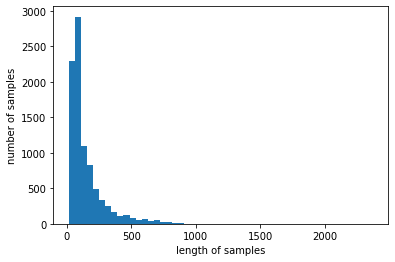
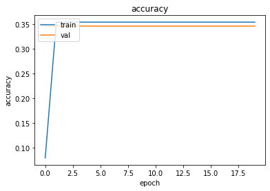
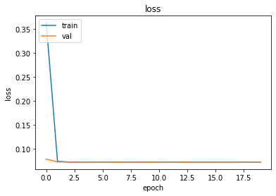

# Vocabulary Size를 변경해서 시도해보기

## 1. 모듈 가져오기


```python
from tensorflow.keras.datasets import reuters
import matplotlib.pyplot as plt
import seaborn as sns
import numpy as np
import pandas as pd
```

## 2. 데이터 가져오기

### 1. 모든 단어  사용


```python
(x_train, y_train), (x_test, y_test) = reuters.load_data(num_words=None, test_split=0.2)
```

    Downloading data from https://storage.googleapis.com/tensorflow/tf-keras-datasets/reuters.npz
    2113536/2110848 [==============================] - 0s 0us/step
    2121728/2110848 [==============================] - 0s 0us/step


```python
print('훈련 샘플의 수: {}'.format(len(x_train)))
print('테스트 샘플의 수: {}'.format(len(x_test)))
```

    훈련 샘플의 수: 8982
    테스트 샘플의 수: 2246


```python
num_classes = max(y_train) + 1
print('클래스의 수 : {}'.format(num_classes))
```

    클래스의 수 : 46


```python
print('훈련용 뉴스의 최대 길이 :{}'.format(max(len(l) for l in x_train)))
print('훈련용 뉴스의 평균 길이 :{}'.format(sum(map(len, x_train))/len(x_train)))

plt.hist([len(s) for s in x_train], bins=50)
plt.xlabel('length of samples')
plt.ylabel('number of samples')
plt.show()
```

    훈련용 뉴스의 최대 길이 :2376
    훈련용 뉴스의 평균 길이 :145.5398574927633


    

    


```python
word_index = reuters.get_word_index(path="reuters_word_index.json")
```

    Downloading data from https://storage.googleapis.com/tensorflow/tf-keras-datasets/reuters_word_index.json
    557056/550378 [==============================] - 0s 0us/step
    565248/550378 [==============================] - 0s 0us/step


```python
index_to_word = {index + 3 : word for word, index in word_index.items()}
```


```python
for index, token in enumerate(("<pad>", "<sos>", "<unk>")):
  index_to_word[index]=token

print(' '.join([index_to_word[index] for index in x_train[0]]))
```

    <sos> mcgrath rentcorp said as a result of its december acquisition of space co it expects earnings per share in 1987 of 1 15 to 1 30 dlrs per share up from 70 cts in 1986 the company said pretax net should rise to nine to 10 mln dlrs from six mln dlrs in 1986 and rental operation revenues to 19 to 22 mln dlrs from 12 5 mln dlrs it said cash flow per share this year should be 2 50 to three dlrs reuter 3


전체 데이터 변환(train, test)


```python
decoded = []
for i in range(len(x_train)):
    t = ' '.join([index_to_word[index] for index in x_train[i]])
    decoded.append(t)

x_train = decoded
```


```python
decoded = []
for i in range(len(x_test)):
    t = ' '.join([index_to_word[index] for index in x_test[i]])
    decoded.append(t)

x_test = decoded
```

## 3. 벡터화 하기

Document Term Matrix, DTM을 활용한 TF-IDF행렬로 벡터화


```python
from sklearn.feature_extraction.text import CountVectorizer
from sklearn.feature_extraction.text import TfidfTransformer

# DTM 생성
dtmvector = CountVectorizer()
x_train_dtm = dtmvector.fit_transform(x_train)
print(x_train_dtm.shape)

# TF-IDF 생성
tfidf_transformer = TfidfTransformer()
tfidfv = tfidf_transformer.fit_transform(x_train_dtm)
print(tfidfv.shape)
```

    (8982, 26506)
    (8982, 26506)


## 4. 머신러닝 모델학습

나이브 베이즈 분류기

Complement Naive Bayes Classifier, CNB

로지스틱 회귀

서포트 벡터 머신(SVM)

결정 트리

랜덤 포레스트

그래디언트 부스팅 트리

보팅


```python
from sklearn.naive_bayes import MultinomialNB
from sklearn.linear_model import LogisticRegression, SGDClassifier
from sklearn.naive_bayes import ComplementNB
from sklearn.tree import DecisionTreeClassifier
from sklearn.ensemble import RandomForestClassifier
from sklearn.ensemble import GradientBoostingClassifier
from sklearn.ensemble import VotingClassifier
from sklearn.svm import LinearSVC
from sklearn.metrics import accuracy_score
from sklearn.metrics import classification_report
from sklearn.metrics import confusion_matrix
import warnings
warnings.filterwarnings("ignore")
```


```python
# 나이브 베이즈 분류기
print("[나이브 베이즈 분류기]")
mod = MultinomialNB()
mod.fit(tfidfv, y_train)

x_test_dtm = dtmvector.transform(x_test) #테스트 데이터를 DTM으로 변환
tfidfv_test = tfidf_transformer.transform(x_test_dtm) #DTM을 TF-IDF 행렬로 변환

predicted = mod.predict(tfidfv_test) #테스트 데이터에 대한 예측
print("- 정확도:", accuracy_score(y_test, predicted)) #예측값과 실제값 비교
print("\n")
print("[나이브 베이즈 분류기의 Classification Report]")

report = classification_report(y_test, mod.predict(tfidfv_test))
lines = report.split('\n')
average_line = lines[-4]
average_data = average_line.split()

# 추출된 average 데이터 출력
print("Average F1-score: ", average_data[1])
```

    [나이브 베이즈 분류기]
    - 정확도: 0.5997328584149599
    
    
    [나이브 베이즈 분류기의 Classification Report]
    Average F1-score:  0.60


```python
# CNB
print("[CNB]")
cb = ComplementNB()
cb.fit(tfidfv, y_train)

predicted = cb.predict(tfidfv_test) #테스트 데이터에 대한 예측
print("정확도:", accuracy_score(y_test, predicted)) #예측값과 실제값 비교
print("\n")
print("[CNB의 Classification Report]")

report = classification_report(y_test, cb.predict(tfidfv_test))
lines = report.split('\n')
average_line = lines[-4]
average_data = average_line.split()

# 추출된 average 데이터 출력
print("Average F1-score: ", average_data[1])
```

    [CNB]
    정확도: 0.7649154051647373
    
    
    [CNB의 Classification Report]
    Average F1-score:  0.76


```python
# 로지스틱 회귀
print("[로지스틱 회귀]")
lr = LogisticRegression(C=10000, penalty='l2')
lr.fit(tfidfv, y_train)

predicted = lr.predict(tfidfv_test) #테스트 데이터에 대한 예측
print("정확도:", accuracy_score(y_test, predicted)) #예측값과 실제값 비교
print("\n")
print("[로지스틱 회귀의 Classification Report]")

report = classification_report(y_test, lr.predict(tfidfv_test))
lines = report.split('\n')
average_line = lines[-4]
average_data = average_line.split()

# 추출된 average 데이터 출력
print("Average F1-score: ", average_data[1])
```

    [로지스틱 회귀]
    정확도: 0.813446126447017
    
    
    [로지스틱 회귀의 Classification Report]
    Average F1-score:  0.81


```python
# 서포트 벡터 머신
print("[서포트 벡터 머신]")
lsvc = LinearSVC(C=1000, penalty='l1', max_iter=500, dual=False)
lsvc.fit(tfidfv, y_train)

predicted = lsvc.predict(tfidfv_test) #테스트 데이터에 대한 예측
print("정확도:", accuracy_score(y_test, predicted)) #예측값과 실제값 비교
print("\n")
print("[서포트 벡터 머신의 Classification Report]")

report = classification_report(y_test,lsvc.predict(tfidfv_test))
lines = report.split('\n')
average_line = lines[-4]
average_data = average_line.split()

# 추출된 average 데이터 출력
print("Average F1-score: ", average_data[1])
```

    [서포트 벡터 머신]
    정확도: 0.776046304541407
    
    
    [서포트 벡터 머신의 Classification Report]
    Average F1-score:  0.78


```python
# 결정 트리
print("[결정 트리]")
tree = DecisionTreeClassifier(max_depth=10, random_state=0)
tree.fit(tfidfv, y_train)

predicted = tree.predict(tfidfv_test) #테스트 데이터에 대한 예측
print("정확도:", accuracy_score(y_test, predicted)) #예측값과 실제값 비교
print("\n")
print("[결정 트리의 Classification Report]")

report = classification_report(y_test,tree.predict(tfidfv_test))
lines = report.split('\n')
average_line = lines[-4]
average_data = average_line.split()

# 추출된 average 데이터 출력
print("Average F1-score: ", average_data[1])
```

    [결정 트리]
    정확도: 0.6211041852181657
    
    
    [결정 트리의 Classification Report]
    Average F1-score:  0.62


```python
# 랜덤 포레스트
print("[랜덤 포레스트]")
forest = RandomForestClassifier(n_estimators=5, random_state=0)
forest.fit(tfidfv, y_train)

predicted = forest.predict(tfidfv_test) #테스트 데이터에 대한 예측
print("정확도:", accuracy_score(y_test, predicted)) #예측값과 실제값 비교
print("\n")
print("[랜덤 포레스트의 Classification Report]")

report = classification_report(y_test,forest.predict(tfidfv_test))
lines = report.split('\n')
average_line = lines[-4]
average_data = average_line.split()

# 추출된 average 데이터 출력
print("Average F1-score: ", average_data[1])
```

    [랜덤 포레스트]
    정확도: 0.6544968833481746
    
    
    [랜덤 포레스트의 Classification Report]
    Average F1-score:  0.65


```python
# 그래디언트 부스팅 트리
print("[그래디언트 부스팅 트리]")
grbt = GradientBoostingClassifier(random_state=0) # verbose=3
grbt.fit(tfidfv, y_train)

predicted = grbt.predict(tfidfv_test) #테스트 데이터에 대한 예측
print("정확도:", accuracy_score(y_test, predicted)) #예측값과 실제값 비교
print("\n")
print("[그래디언트 부스팅 트리의 Classification Report]")

report = classification_report(y_test,grbt.predict(tfidfv_test))
lines = report.split('\n')
average_line = lines[-4]
average_data = average_line.split()

# 추출된 average 데이터 출력
print("Average F1-score: ", average_data[1])
```

    [그래디언트 부스팅 트리]
    정확도: 0.7702582368655387
    
    
    [그래디언트 부스팅 트리의 Classification Report]
    Average F1-score:  0.77


```python
# 보팅
print("[보팅]")
voting_classifier = VotingClassifier(estimators=[
         ('lr', LogisticRegression(C=10000, penalty='l2')),
        ('cb', ComplementNB()),
        ('grbt', GradientBoostingClassifier(random_state=0))
], voting='soft', n_jobs=-1)
voting_classifier.fit(tfidfv, y_train)

predicted = voting_classifier.predict(tfidfv_test) #테스트 데이터에 대한 예측
print("정확도:", accuracy_score(y_test, predicted)) #예측값과 실제값 비교
print("\n")
print("[보팅의 Classification Report]")

report = classification_report(y_test,voting_classifier.predict(tfidfv_test))
lines = report.split('\n')
average_line = lines[-4]
average_data = average_line.split()

# 추출된 average 데이터 출력
print("Average F1-score: ", average_data[1])
```

    [보팅]


    /opt/conda/lib/python3.9/site-packages/sklearn/linear_model/_logistic.py:814: ConvergenceWarning: lbfgs failed to converge (status=1):
    STOP: TOTAL NO. of ITERATIONS REACHED LIMIT.
    
    Increase the number of iterations (max_iter) or scale the data as shown in:
        https://scikit-learn.org/stable/modules/preprocessing.html
    Please also refer to the documentation for alternative solver options:
        https://scikit-learn.org/stable/modules/linear_model.html#logistic-regression
      n_iter_i = _check_optimize_result(


    정확도: 0.8187889581478184
    
    
    [보팅의 Classification Report]
    Average F1-score:  0.82


### 2. 5000개 단어 사용


```python
(x_train, y_train), (x_test, y_test) = reuters.load_data(num_words=5000, test_split=0.2)
```


```python
decoded = []
for i in range(len(x_train)):
    t = ' '.join([index_to_word[index] for index in x_train[i]])
    decoded.append(t)

x_train = decoded

decoded = []
for i in range(len(x_test)):
    t = ' '.join([index_to_word[index] for index in x_test[i]])
    decoded.append(t)

x_test = decoded
```


```python
dtmvector = CountVectorizer()
x_train_dtm = dtmvector.fit_transform(x_train)
print(x_train_dtm.shape)

tfidf_transformer = TfidfTransformer()
tfidfv = tfidf_transformer.fit_transform(x_train_dtm)
print(tfidfv.shape)
```

    (8982, 4867)
    (8982, 4867)


```python
x_test_dtm = dtmvector.transform(x_test) #테스트 데이터를 DTM으로 변환
tfidfv_test = tfidf_transformer.transform(x_test_dtm) #DTM을 TF-IDF 행렬로 변환
```


```python
# 나이브 베이즈 분류기
print("[나이브 베이즈 분류기]")
mod = MultinomialNB()
mod.fit(tfidfv, y_train)

predicted = mod.predict(tfidfv_test) #테스트 데이터에 대한 예측
print("- 정확도:", accuracy_score(y_test, predicted)) #예측값과 실제값 비교
print("\n")
print("[나이브 베이즈 분류기의 Classification Report]")

report = classification_report(y_test, mod.predict(tfidfv_test))
lines = report.split('\n')
average_line = lines[-4]
average_data = average_line.split()

# 추출된 average 데이터 출력
print("Average F1-score: ", average_data[1])

# CNB
print("[CNB]")
cb = ComplementNB()
cb.fit(tfidfv, y_train)

predicted = cb.predict(tfidfv_test) #테스트 데이터에 대한 예측
print("정확도:", accuracy_score(y_test, predicted)) #예측값과 실제값 비교
print("\n")
print("[CNB의 Classification Report]")

report = classification_report(y_test, cb.predict(tfidfv_test))
lines = report.split('\n')
average_line = lines[-4]
average_data = average_line.split()

# 추출된 average 데이터 출력
print("Average F1-score: ", average_data[1])

# 로지스틱 회귀
print("[로지스틱 회귀]")
lr = LogisticRegression(C=10000, penalty='l2')
lr.fit(tfidfv, y_train)

predicted = lr.predict(tfidfv_test) #테스트 데이터에 대한 예측
print("정확도:", accuracy_score(y_test, predicted)) #예측값과 실제값 비교
print("\n")
print("[로지스틱 회귀의 Classification Report]")

report = classification_report(y_test, lr.predict(tfidfv_test))
lines = report.split('\n')
average_line = lines[-4]
average_data = average_line.split()

# 추출된 average 데이터 출력
print("Average F1-score: ", average_data[1])

# 서포트 벡터 머신
print("[서포트 벡터 머신]")
lsvc = LinearSVC(C=1000, penalty='l1', max_iter=500, dual=False)
lsvc.fit(tfidfv, y_train)

predicted = lsvc.predict(tfidfv_test) #테스트 데이터에 대한 예측
print("정확도:", accuracy_score(y_test, predicted)) #예측값과 실제값 비교
print("\n")
print("[서포트 벡터 머신의 Classification Report]")

report = classification_report(y_test,lsvc.predict(tfidfv_test))
lines = report.split('\n')
average_line = lines[-4]
average_data = average_line.split()

# 추출된 average 데이터 출력
print("Average F1-score: ", average_data[1])

# 결정 트리
print("[결정 트리]")
tree = DecisionTreeClassifier(max_depth=10, random_state=0)
tree.fit(tfidfv, y_train)

predicted = tree.predict(tfidfv_test) #테스트 데이터에 대한 예측
print("정확도:", accuracy_score(y_test, predicted)) #예측값과 실제값 비교
print("\n")
print("[결정 트리의 Classification Report]")

report = classification_report(y_test,tree.predict(tfidfv_test))
lines = report.split('\n')
average_line = lines[-4]
average_data = average_line.split()

# 추출된 average 데이터 출력
print("Average F1-score: ", average_data[1])

# 랜덤 포레스트
print("[랜덤 포레스트]")
forest = RandomForestClassifier(n_estimators=5, random_state=0)
forest.fit(tfidfv, y_train)

predicted = forest.predict(tfidfv_test) #테스트 데이터에 대한 예측
print("정확도:", accuracy_score(y_test, predicted)) #예측값과 실제값 비교
print("\n")
print("[랜덤 포레스트의 Classification Report]")

report = classification_report(y_test,forest.predict(tfidfv_test))
lines = report.split('\n')
average_line = lines[-4]
average_data = average_line.split()

# 추출된 average 데이터 출력
print("Average F1-score: ", average_data[1])

# 그래디언트 부스팅 트리
print("[그래디언트 부스팅 트리]")
grbt = GradientBoostingClassifier(random_state=0) # verbose=3
grbt.fit(tfidfv, y_train)

predicted = grbt.predict(tfidfv_test) #테스트 데이터에 대한 예측
print("정확도:", accuracy_score(y_test, predicted)) #예측값과 실제값 비교
print("\n")
print("[그래디언트 부스팅 트리의 Classification Report]")

report = classification_report(y_test,grbt.predict(tfidfv_test))
lines = report.split('\n')
average_line = lines[-4]
average_data = average_line.split()

# 추출된 average 데이터 출력
print("Average F1-score: ", average_data[1])

# 보팅
print("[보팅]")
voting_classifier = VotingClassifier(estimators=[
         ('lr', LogisticRegression(C=10000, penalty='l2')),
        ('cb', ComplementNB()),
        ('grbt', GradientBoostingClassifier(random_state=0))
], voting='soft', n_jobs=-1)
voting_classifier.fit(tfidfv, y_train)

predicted = voting_classifier.predict(tfidfv_test) #테스트 데이터에 대한 예측
print("정확도:", accuracy_score(y_test, predicted)) #예측값과 실제값 비교
print("\n")
print("[보팅의 Classification Report]")

report = classification_report(y_test,voting_classifier.predict(tfidfv_test))
lines = report.split('\n')
average_line = lines[-4]
average_data = average_line.split()

# 추출된 average 데이터 출력
print("Average F1-score: ", average_data[1])
```

    [나이브 베이즈 분류기]
    - 정확도: 0.6731967943009796
    
    
    [나이브 베이즈 분류기의 Classification Report]
    Average F1-score:  0.67
    [CNB]
    정확도: 0.7707034728406055
    
    
    [CNB의 Classification Report]
    Average F1-score:  0.77
    [로지스틱 회귀]
    정확도: 0.8058771148708815
    
    
    [로지스틱 회귀의 Classification Report]
    Average F1-score:  0.81
    [서포트 벡터 머신]
    정확도: 0.7729296527159395
    
    
    [서포트 벡터 머신의 Classification Report]
    Average F1-score:  0.77
    [결정 트리]
    정확도: 0.6179875333926982
    
    
    [결정 트리의 Classification Report]
    Average F1-score:  0.62
    [랜덤 포레스트]
    정확도: 0.701246660730187
    
    
    [랜덤 포레스트의 Classification Report]
    Average F1-score:  0.70
    [그래디언트 부스팅 트리]
    정확도: 0.767586821015138
    
    
    [그래디언트 부스팅 트리의 Classification Report]
    Average F1-score:  0.77
    [보팅]


    /opt/conda/lib/python3.9/site-packages/sklearn/linear_model/_logistic.py:814: ConvergenceWarning: lbfgs failed to converge (status=1):
    STOP: TOTAL NO. of ITERATIONS REACHED LIMIT.
    
    Increase the number of iterations (max_iter) or scale the data as shown in:
        https://scikit-learn.org/stable/modules/preprocessing.html
    Please also refer to the documentation for alternative solver options:
        https://scikit-learn.org/stable/modules/linear_model.html#logistic-regression
      n_iter_i = _check_optimize_result(


    정확도: 0.8161175422974176
    
    
    [보팅의 Classification Report]
    Average F1-score:  0.82


### 3. 10000개 단어 사용


```python
(x_train, y_train), (x_test, y_test) = reuters.load_data(num_words=10000, test_split=0.2)
```


```python
decoded= []
for i in range(len(x_train)):
    t = ' '.join([index_to_word[index] for index in x_train[i]])
    decoded.append(t)

x_train = decoded

decoded = []
for i in range(len(x_test)):
    t = ' '.join([index_to_word[index] for index in x_test[i]])
    decoded.append(t)

x_test = decoded

dtmvector = CountVectorizer()
x_train_dtm = dtmvector.fit_transform(x_train)
print(x_train_dtm.shape)

tfidf_transformer = TfidfTransformer()
tfidfv = tfidf_transformer.fit_transform(x_train_dtm)
print(tfidfv.shape)

x_test_dtm = dtmvector.transform(x_test) #테스트 데이터를 DTM으로 변환
tfidfv_test = tfidf_transformer.transform(x_test_dtm) #DTM을 TF-IDF 행렬로 변환
```

    (8982, 9670)
    (8982, 9670)


```python
# 나이브 베이즈 분류기
print("[나이브 베이즈 분류기]")
mod = MultinomialNB()
mod.fit(tfidfv, y_train)

predicted = mod.predict(tfidfv_test) #테스트 데이터에 대한 예측
print("- 정확도:", accuracy_score(y_test, predicted)) #예측값과 실제값 비교
print("\n")
print("[나이브 베이즈 분류기의 Classification Report]")

report = classification_report(y_test, mod.predict(tfidfv_test))
lines = report.split('\n')
average_line = lines[-4]
average_data = average_line.split()

# 추출된 average 데이터 출력
print("Average F1-score: ", average_data[1])

# CNB
print("[CNB]")
cb = ComplementNB()
cb.fit(tfidfv, y_train)

predicted = cb.predict(tfidfv_test) #테스트 데이터에 대한 예측
print("정확도:", accuracy_score(y_test, predicted)) #예측값과 실제값 비교
print("\n")
print("[CNB의 Classification Report]")

report = classification_report(y_test, cb.predict(tfidfv_test))
lines = report.split('\n')
average_line = lines[-4]
average_data = average_line.split()

# 추출된 average 데이터 출력
print("Average F1-score: ", average_data[1])

# 로지스틱 회귀
print("[로지스틱 회귀]")
lr = LogisticRegression(C=10000, penalty='l2')
lr.fit(tfidfv, y_train)

predicted = lr.predict(tfidfv_test) #테스트 데이터에 대한 예측
print("정확도:", accuracy_score(y_test, predicted)) #예측값과 실제값 비교
print("\n")
print("[로지스틱 회귀의 Classification Report]")

report = classification_report(y_test, lr.predict(tfidfv_test))
lines = report.split('\n')
average_line = lines[-4]
average_data = average_line.split()

# 추출된 average 데이터 출력
print("Average F1-score: ", average_data[1])

# 서포트 벡터 머신
print("[서포트 벡터 머신]")
lsvc = LinearSVC(C=1000, penalty='l1', max_iter=500, dual=False)
lsvc.fit(tfidfv, y_train)

predicted = lsvc.predict(tfidfv_test) #테스트 데이터에 대한 예측
print("정확도:", accuracy_score(y_test, predicted)) #예측값과 실제값 비교
print("\n")
print("[서포트 벡터 머신의 Classification Report]")

report = classification_report(y_test,lsvc.predict(tfidfv_test))
lines = report.split('\n')
average_line = lines[-4]
average_data = average_line.split()

# 추출된 average 데이터 출력
print("Average F1-score: ", average_data[1])

# 결정 트리
print("[결정 트리]")
tree = DecisionTreeClassifier(max_depth=10, random_state=0)
tree.fit(tfidfv, y_train)

predicted = tree.predict(tfidfv_test) #테스트 데이터에 대한 예측
print("정확도:", accuracy_score(y_test, predicted)) #예측값과 실제값 비교
print("\n")
print("[결정 트리의 Classification Report]")

report = classification_report(y_test,tree.predict(tfidfv_test))
lines = report.split('\n')
average_line = lines[-4]
average_data = average_line.split()

# 추출된 average 데이터 출력
print("Average F1-score: ", average_data[1])

# 랜덤 포레스트
print("[랜덤 포레스트]")
forest = RandomForestClassifier(n_estimators=5, random_state=0)
forest.fit(tfidfv, y_train)

predicted = forest.predict(tfidfv_test) #테스트 데이터에 대한 예측
print("정확도:", accuracy_score(y_test, predicted)) #예측값과 실제값 비교
print("\n")
print("[랜덤 포레스트의 Classification Report]")

report = classification_report(y_test,forest.predict(tfidfv_test))
lines = report.split('\n')
average_line = lines[-4]
average_data = average_line.split()

# 추출된 average 데이터 출력
print("Average F1-score: ", average_data[1])

# 그래디언트 부스팅 트리
print("[그래디언트 부스팅 트리]")
grbt = GradientBoostingClassifier(random_state=0) # verbose=3
grbt.fit(tfidfv, y_train)

predicted = grbt.predict(tfidfv_test) #테스트 데이터에 대한 예측
print("정확도:", accuracy_score(y_test, predicted)) #예측값과 실제값 비교
print("\n")
print("[그래디언트 부스팅 트리의 Classification Report]")

report = classification_report(y_test,grbt.predict(tfidfv_test))
lines = report.split('\n')
average_line = lines[-4]
average_data = average_line.split()

# 추출된 average 데이터 출력
print("Average F1-score: ", average_data[1])

# 보팅
print("[보팅]")
voting_classifier = VotingClassifier(estimators=[
         ('lr', LogisticRegression(C=10000, penalty='l2')),
        ('cb', ComplementNB()),
        ('grbt', GradientBoostingClassifier(random_state=0))
], voting='soft', n_jobs=-1)
voting_classifier.fit(tfidfv, y_train)

predicted = voting_classifier.predict(tfidfv_test) #테스트 데이터에 대한 예측
print("정확도:", accuracy_score(y_test, predicted)) #예측값과 실제값 비교
print("\n")
print("[보팅의 Classification Report]")

report = classification_report(y_test,voting_classifier.predict(tfidfv_test))
lines = report.split('\n')
average_line = lines[-4]
average_data = average_line.split()

# 추출된 average 데이터 출력
print("Average F1-score: ", average_data[1])
```

    [나이브 베이즈 분류기]
    - 정확도: 0.6567230632235085
    
    
    [나이브 베이즈 분류기의 Classification Report]
    Average F1-score:  0.66
    [CNB]
    정확도: 0.7707034728406055
    
    
    [CNB의 Classification Report]
    Average F1-score:  0.77
    [로지스틱 회귀]
    정확도: 0.8076580587711487
    
    
    [로지스틱 회귀의 Classification Report]
    Average F1-score:  0.81
    [서포트 벡터 머신]
    정확도: 0.780053428317008
    
    
    [서포트 벡터 머신의 Classification Report]
    Average F1-score:  0.78
    [결정 트리]
    정확도: 0.6202137132680321
    
    
    [결정 트리의 Classification Report]
    Average F1-score:  0.62
    [랜덤 포레스트]
    정확도: 0.674087266251113
    
    
    [랜덤 포레스트의 Classification Report]
    Average F1-score:  0.67
    [그래디언트 부스팅 트리]
    정확도: 0.7662511130899377
    
    
    [그래디언트 부스팅 트리의 Classification Report]
    Average F1-score:  0.77
    [보팅]


    /opt/conda/lib/python3.9/site-packages/sklearn/linear_model/_logistic.py:814: ConvergenceWarning: lbfgs failed to converge (status=1):
    STOP: TOTAL NO. of ITERATIONS REACHED LIMIT.
    
    Increase the number of iterations (max_iter) or scale the data as shown in:
        https://scikit-learn.org/stable/modules/preprocessing.html
    Please also refer to the documentation for alternative solver options:
        https://scikit-learn.org/stable/modules/linear_model.html#logistic-regression
      n_iter_i = _check_optimize_result(


    정확도: 0.8116651825467498
    
    
    [보팅의 Classification Report]
    Average F1-score:  0.81


## 5. 딥러닝 모델학습


```python
(x_train, y_train), (x_test, y_test) = reuters.load_data(num_words=10000, test_split=0.2)
```


```python
decoded= []
for i in range(len(x_train)):
    t = ' '.join([index_to_word[index] for index in x_train[i]])
    decoded.append(t)

x_train = decoded

decoded = []
for i in range(len(x_test)):
    t = ' '.join([index_to_word[index] for index in x_test[i]])
    decoded.append(t)

x_test = decoded

dtmvector = CountVectorizer()
x_train_dtm = dtmvector.fit_transform(x_train)
print(x_train_dtm.shape)

tfidf_transformer = TfidfTransformer()
tfidfv = tfidf_transformer.fit_transform(x_train_dtm)
print(tfidfv.shape)

x_test_dtm = dtmvector.transform(x_test) #테스트 데이터를 DTM으로 변환
tfidfv_test = tfidf_transformer.transform(x_test_dtm) #DTM을 TF-IDF 행렬로 변환
```

    (8982, 9670)
    (8982, 9670)


```python
import scipy
from tensorflow.keras.utils import to_categorical

tfidfv = scipy.sparse.csr_matrix.toarray(tfidfv)
```


```python
print(y_train.shape)
print(y_test.shape)
     
y_train = to_categorical(y_train)
y_test = to_categorical(y_test)
     
```

    (8982,)
    (2246,)


```python
tfidfv_arr = tfidfv.toarray()
tfidfv_dense = tfidfv.todense()
```


```python
tfidfv_test_arr = tfidfv_test.toarray()
tfidfv_test_dense = tfidfv_test.todense()
```


```python
from tensorflow import keras
from tensorflow.keras.models import Sequential
from tensorflow.keras.layers import Dense, LSTM, Embedding
from tensorflow.keras.datasets import reuters

vocab_size = 10000
word_vector_dim = 32  

model_LSTM = keras.Sequential()
model_LSTM.add(keras.layers.Embedding(vocab_size, word_vector_dim))
model_LSTM.add(keras.layers.LSTM(32))
model_LSTM.add(keras.layers.Dense(128, activation='relu'))  
model_LSTM.add(keras.layers.Dense(num_classes, activation='softmax'))  

model_LSTM.summary()
```

    Model: "sequential_6"
    _________________________________________________________________
    Layer (type)                 Output Shape              Param #   
    =================================================================
    embedding_6 (Embedding)      (None, None, 32)          320000    
    _________________________________________________________________
    lstm_6 (LSTM)                (None, 32)                8320      
    _________________________________________________________________
    dense_12 (Dense)             (None, 128)               4224      
    _________________________________________________________________
    dense_13 (Dense)             (None, 46)                5934      
    =================================================================
    Total params: 338,478
    Trainable params: 338,478
    Non-trainable params: 0
    _________________________________________________________________


```python
model_LSTM.compile(optimizer='adam',
              loss='binary_crossentropy',
              metrics=['accuracy'])

history = model_LSTM.fit(tfidfv_arr,
                    y_train,
                    epochs=20,
                    batch_size=128,
                    validation_split=0.2,
                    verbose=1)
```

    Epoch 1/20
    57/57 [==============================] - 48s 282ms/step - loss: 0.3634 - accuracy: 0.0792 - val_loss: 0.0779 - val_accuracy: 0.3450
    Epoch 2/20
    57/57 [==============================] - 15s 268ms/step - loss: 0.0736 - accuracy: 0.3534 - val_loss: 0.0722 - val_accuracy: 0.3450
    Epoch 3/20
    57/57 [==============================] - 15s 268ms/step - loss: 0.0720 - accuracy: 0.3534 - val_loss: 0.0720 - val_accuracy: 0.3450
    Epoch 4/20
    57/57 [==============================] - 15s 268ms/step - loss: 0.0719 - accuracy: 0.3534 - val_loss: 0.0719 - val_accuracy: 0.3450
    Epoch 5/20
    57/57 [==============================] - 15s 268ms/step - loss: 0.0720 - accuracy: 0.3534 - val_loss: 0.0721 - val_accuracy: 0.3450
    Epoch 6/20
    57/57 [==============================] - 15s 268ms/step - loss: 0.0718 - accuracy: 0.3534 - val_loss: 0.0720 - val_accuracy: 0.3450
    Epoch 7/20
    57/57 [==============================] - 15s 270ms/step - loss: 0.0719 - accuracy: 0.3534 - val_loss: 0.0718 - val_accuracy: 0.3450
    Epoch 8/20
    57/57 [==============================] - 15s 268ms/step - loss: 0.0719 - accuracy: 0.3534 - val_loss: 0.0719 - val_accuracy: 0.3450
    Epoch 9/20
    57/57 [==============================] - 15s 267ms/step - loss: 0.0718 - accuracy: 0.3534 - val_loss: 0.0719 - val_accuracy: 0.3450
    Epoch 10/20
    57/57 [==============================] - 15s 268ms/step - loss: 0.0719 - accuracy: 0.3534 - val_loss: 0.0719 - val_accuracy: 0.3450
    Epoch 11/20
    57/57 [==============================] - 15s 268ms/step - loss: 0.0719 - accuracy: 0.3534 - val_loss: 0.0719 - val_accuracy: 0.3450
    Epoch 12/20
    57/57 [==============================] - 15s 266ms/step - loss: 0.0719 - accuracy: 0.3534 - val_loss: 0.0720 - val_accuracy: 0.3450
    Epoch 13/20
    57/57 [==============================] - 15s 265ms/step - loss: 0.0719 - accuracy: 0.3534 - val_loss: 0.0719 - val_accuracy: 0.3450
    Epoch 14/20
    57/57 [==============================] - 15s 265ms/step - loss: 0.0719 - accuracy: 0.3534 - val_loss: 0.0719 - val_accuracy: 0.3450
    Epoch 15/20
    57/57 [==============================] - 15s 269ms/step - loss: 0.0719 - accuracy: 0.3534 - val_loss: 0.0720 - val_accuracy: 0.3450
    Epoch 16/20
    57/57 [==============================] - 15s 266ms/step - loss: 0.0719 - accuracy: 0.3534 - val_loss: 0.0719 - val_accuracy: 0.3450
    Epoch 17/20
    57/57 [==============================] - 15s 267ms/step - loss: 0.0719 - accuracy: 0.3534 - val_loss: 0.0719 - val_accuracy: 0.3450
    Epoch 18/20
    57/57 [==============================] - 15s 267ms/step - loss: 0.0720 - accuracy: 0.3534 - val_loss: 0.0719 - val_accuracy: 0.3450
    Epoch 19/20
    57/57 [==============================] - 15s 266ms/step - loss: 0.0719 - accuracy: 0.3534 - val_loss: 0.0721 - val_accuracy: 0.3450
    Epoch 20/20
    57/57 [==============================] - 15s 268ms/step - loss: 0.0720 - accuracy: 0.3534 - val_loss: 0.0719 - val_accuracy: 0.3450


```python
results = model_LSTM.evaluate(tfidfv_test_arr,  y_test, verbose=2)
print(results)
```

    71/71 - 7s - loss: 0.0720 - accuracy: 0.3620
    [0.07201005518436432, 0.36197686195373535]


```python
def visualize_train(train_history):
    # summarize history for accuracy
    plt.plot(train_history.history['accuracy'])
    plt.plot(train_history.history['val_accuracy'])
    plt.title('accuracy')
    plt.ylabel('accuracy')
    plt.xlabel('epoch')
    plt.legend(['train', 'val'], loc='upper left')
    plt.show()
    # summarize history for loss
    plt.plot(train_history.history['loss'])
    plt.plot(train_history.history['val_loss'])
    plt.title('loss')
    plt.ylabel('loss')
    plt.xlabel('epoch')
    plt.legend(['train', 'val'], loc='upper left')
    plt.show()
```


```python
visualize_train(history)
```


    

    


    

    


## 6. 결론

| 정확도 | 모든 단어 | 5000 | 10000 |
|---|:---:|---:|---:|
| 나이브 베이즈 분류기 | 0.6 | 0.67 | 0.66 |
| CNB | 0.76 | 0.77 | 0.77 |
| 로지스틱 회귀 | 0.81 | 0.81 | 0.81 |
| 서포트 벡터 머신(SVM) | 0.78 | 0.77 | 0.78 |
| 결정 트리 | 0.62 | 0.62 | 0.62 |
| 랜덤 포레스트 | 0.65 | 0.70 | 0.67 |
| 그래디언트 부스팅 트리 | 0.77 | 0.77 | 0.77 |
| 보팅 | 0.82 | 0.82 | 0.81 |

훈련시간도 짧고

그래디언트 부스팅 트리나 보팅만큼 정확도가 잘 나오기도 했고

F1 점수도 높기 때문에 

로지스틱 회귀가 가장 잘 나온 모델이라고 생각한다
