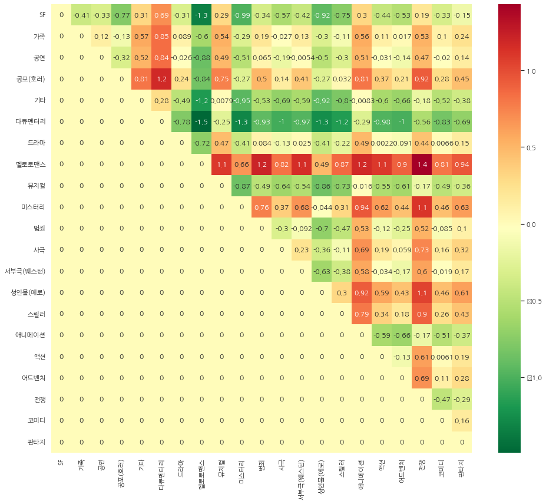

# 영화 장르 간 편향성 측정

영화 시놉시스 코퍼스를 가지고 영화 구분과 영화 장르 간에 내재된 편향성을 측정하는 작업을 진행해 보았다.

어느 정도는 우리가 생각하는 편향성이 측정되었을 것이다.

든 장르에 대해 영화 구분과의 편향성 정도를 측정해보자.

## 1. 형태소 분석기를 이용하여 품사가 명사인 경우 해당 단어를 추출


```python
import os

with open(os.getenv('HOME')+'/aiffel/weat/synopsis.txt', 'r') as file:
    for i in range(20):
        print(file.readline(), end='')
```

    사운드 엔지니어 상우(유지태 분)는 치매에 걸린 할머니(백성희 분)와
     젊은 시절 상처한 한 아버지(박인환 분), 고모(신신애 분)와 함께 살고 있다.
     어느 겨울 그는 지방 방송국 라디오 PD 은수(이영애 분)를 만난다.
     자연의 소리를 채집해 틀어주는 라디오 프로그램을 준비하는 은수는 상우와 녹음 여행을 떠난다.
     자연스레 가까워지는 두 사람은 어느 날, 은수의 아파트에서 밤을 보낸다.
     너무 쉽게 사랑에 빠진 두 사람... 상우는 주체할 수 없을 정도로 그녀에게 빨려든다.
     그러나 겨울에 만난 두 사람의 관계는 봄을 지나 여름을 맞이하면서 삐걱거린다.
     이혼 경험이 있는 은수는 상우에게 결혼할 생각이 없다며 부담스러운 표정을 내비친다.
     "어떻게 사랑이 변하니?..."라고 묻는 상우에게 은수는 그저 "헤어져" 라고 단호하게 말한다.
     영원히 변할 것 같지 않던 사랑이 변하고, 그 사실을 받아들이지 못하는 상우는 어찌 할 바를 모른다.
     은수를 잊지 못하는 상우는 미련과 집착의 감정을 이기지 못하고 서울과 강릉을 오간다.
    유사 이래 연령, 성별, 빈부의 차이와 정치적인 입장을 불문하고 일거에 국민을 통합해 온 '애국심'이라는 성역에 일침을 가하는 다큐멘터리. 재작년 전국 민족민주 유가족협의회의 장기농성을 다룬 인상적인 다큐멘터리 <민들레>를 만들었던 독립영화집단 '빨간 눈사람'이 우리 사회 구석구석을 발빠르게 돌아다니며 애국심과 민족주의가 강요되는 현장을 발굴하여 카메라에 담았다. 박홍 서강대 명예총장, 이도형 '한국논단' 발행인, 축구해설자 신문선, 홍세화, 박노해 등 사회 각계의 '스타'들이 등장해 저마다의 확고한 신념을 성토한다. 감독 이경순과 최하동하는 이 작품을 위해 3년간 백여 명을 인터뷰했다고 한다. 2001 올해의 독립영화상 수상.
     민족과 국가란 공동체에서 부단히 권력과 부를 얻는 자, 나아가 민족과 국가란 공동체에서 얻은 신분과 부귀를 영원히 그의 자손에게 대물림하려는 자, 그래서 민족과 국가란 공동체를 부단히 유지해야만 하는 자, 따라서 민족과 국가란 공동체의 당위성과 개인의 가치를 초월하는 그 존엄성을 끝도 없이 창조하고 되뇌어야 하는 자, 종국에는 민족과 국가란 공동체에 속해 있다고 태내에서부터 세뇌된 모든 이들의 삶과 행동에서 영원히 자기복제되는 순환의 고리, 영생하는 애국의 원동력은 그 순환의 골에서 온다.
    엽기적인 살인사건이 발생한 장소를 관광하는 투어팀. 그 팀에서 관광객들은 살인사건과 관련하여 히스테리컬한 반응을 보이는데 과연 이들의 정체는? (Tourists see whrer a murder take place. They respond hysterically to the murder…what are they?)
     제46회 발라돌리드 국제영화제 (2001, 스페인)
    착하지만 엉뚱한 태희(배두나 분), 예쁜 깍쟁이 혜주(이요원 분), 그림을 잘 그리는 지영(옥지영 분), 명랑한 쌍둥이 비류(이은실 분)와 온조(이은주 분)는 단짝친구들. 늘 함께였던 그들이지만 스무 살이 되면서 길이 달라진다. 증권회사에 입사한 혜주는 성공한 커리어우먼의 야심을 키우고 미술에 재능이 있는 지영은 유학을 꿈꾼다. 한편 태희는 봉사활동에서 알게 된 뇌성마비 시인을 좋아하는데...
      어느 날 지영이 길 잃은 새끼 고양이 티티를 만남면서 스무 살 그녀들의 삶에 고양이 한 마리가 끼어들게 된다. 혼자 있길 좋아하고, 쉽게 마음을 열지 않는 신비로운 동물 고양이. 고양이를 닮은 스무 살 그녀들. 고양이 티티와 함께 한 시간동안 삶은 예상못한 방향으로 흘러가지만 마침내 그녀들만의 해결책을 찾게 되는데... 사랑스런 몽상가 태희, 아름다운 야심가 혜주, 신비로운 아웃사이더 지영. 마지막으로 고양이를 부탁받은 사람은 누구일까?
    인도 등 아시아 식민지에 처음 발을 디딘 뒤 여행하고 “경영”한 이들은 과연 누구였을까? 과거의 이미지들은, 이민과 인종 문제, ‘오리엔탈리즘’이 격렬히 충돌하고 있는 현재와 강력하게 공명한다.
     [제19회 인디다큐페스티발]
    홀로 살아가는 미국 할머니와 한국 할머니의 이야기. 공원에서 가끔 마주치게 되는 그들은 비록 언어 소통의 어려움을 겪지만 시간이 흘러감에 따라 서로 가까워져 그들의 외로움과 우정을 공유하게 된다. 겨울이 지나고 봄이 왔을 때 길가의 민들레 홀씨는 삶의 이치를 말해주듯 한 할머니의 주위를 맴돈다. (Two elderly widows, an American and a Korean, frequent the same park in Philadelphia and attempt a friendship, though the Korean widow speaks no English. Driven by loneliness and a spark of hope, they persevere within the limits of body language, and the outcome poses a question of life as fundamental as a flower.)


```python
from konlpy.tag import Okt
okt = Okt()
tokenized = []
with open(os.getenv('HOME')+'/aiffel/weat/synopsis.txt', 'r') as file:
    while True:
        line = file.readline()
        if not line: break
        words = okt.pos(line, stem=True, norm=True)
        res = []
        for w in words:
            if w[1] in ["Noun"]:      # "Adjective", "Verb" 등을 포함할 수도 있음
                res.append(w[0])    # 명사일 때만 tokenized 에 저장하게 됨
        tokenized.append(res)
```


```python
print(len(tokenized))
```

    71156


## 2. 추출된 결과로 embedding model 만들기


```python
from gensim.models import Word2Vec

model = Word2Vec(tokenized, vector_size=100, window=5, min_count=3, sg=0)
model.wv.most_similar(positive=['영화'])
```


    [('작품', 0.885959804058075),
     ('다큐멘터리', 0.8434757590293884),
     ('드라마', 0.8228147029876709),
     ('영화로', 0.798362672328949),
     ('형식', 0.7791534066200256),
     ('감동', 0.7764055728912354),
     ('코미디', 0.7756316065788269),
     ('시대극', 0.7755586504936218),
     ('소재', 0.7745794653892517),
     ('주제', 0.7670877575874329)]


```python
model.wv.most_similar(positive=['사랑'])
```


    [('행복', 0.7200979590415955),
     ('만남', 0.7020962238311768),
     ('나비문신', 0.701697826385498),
     ('애정', 0.6964443325996399),
     ('아르튬', 0.6945403218269348),
     ('이별', 0.694303035736084),
     ('진심', 0.692607045173645),
     ('첫사랑', 0.689752995967865),
     ('우정', 0.6808663010597229),
     ('운명', 0.6783201098442078)]


```python
model.wv.most_similar(positive=['연극'])
```


    [('시나리오', 0.8995425701141357),
     ('배우', 0.873336672782898),
     ('영화감독', 0.868858277797699),
     ('캐스팅', 0.8658691048622131),
     ('연기', 0.8649576902389526),
     ('영감', 0.8642025589942932),
     ('공연', 0.8563470840454102),
     ('시대극', 0.8510296940803528),
     ('영화로', 0.8444286584854126),
     ('팬', 0.8412501215934753)]


## 3. TF-IDF로 해당 데이터를 가장 잘 표현하는 단어 셋 만들기

target은 예술영화, 일반영화, attribute는 영화의 모든 21개의 장르


```python
import os
from sklearn.feature_extraction.text import TfidfVectorizer
import numpy as np
from konlpy.tag import Okt

art_txt = 'synopsis_art.txt'
gen_txt = 'synopsis_gen.txt'

def read_token(file_name):
    okt = Okt()
    result = []
    with open(os.getenv('HOME')+'/aiffel/weat/'+file_name, 'r') as fread: 
        print(file_name, '파일을 읽고 있습니다.')
        while True:
            line = fread.readline() 
            if not line: break 
            tokenlist = okt.pos(line, stem=True, norm=True) 
            for word in tokenlist:
                if word[1] in ["Noun"]:#, "Adjective", "Verb"]:
                    result.append((word[0])) 
    return ' '.join(result)
```


```python
# 2개의 파일을 처리하는데 10분 가량 걸림.
art = read_token(art_txt) # 예술 영화
gen = read_token(gen_txt) # 일반 영화

print(type(art), type(gen))
print(len(art), len(gen))
```

    synopsis_art.txt 파일을 읽고 있습니다.
    synopsis_gen.txt 파일을 읽고 있습니다.
    <class 'str'> <class 'str'>
    620208 3014815


```python
art[:100]
```


    '사운드 엔지니어 상우 유지태 분 치매 할머니 백성희 분 시절 상처 아버지 박인환 분 고모 신신애 분 살 겨울 그 지방 방송국 라디오 은수 이영애 분 를 자연 소리 채집 라디오 프로'


```python
gen[:100]
```


    '유사 연령 성별 빈부 차이 정치 입장 불문 국민 통합 온 애국심 성역 일침 다큐멘터리 재작년 전국 민족 민주 유가족 협의 회의 장기 농성 인상 다큐멘터리 민들레 를 독립영화 집단 '


TF-IDF방식을 이용해 단어 셋을 구성한다.


```python
vectorizer = TfidfVectorizer()
X = vectorizer.fit_transform([art, gen])

print(X.shape)
```

    (2, 41082)


```python
m1 = X[0].tocoo()   # art를 TF-IDF로 표현한 spart matrix를 가져옴
m2 = X[1].tocoo()   # gen을 TF-IDF로 표현한 spart matrix를 가져옴 

w1 = [[i, j] for i, j in zip(m1.col, m1.data)]
w2 = [[i, j] for i, j in zip(m2.col, m2.data)]

w1.sort(key=lambda x: x[1], reverse=True)   #art를 구성하는 단어들을 TF-IDF가 높은 순으로 정렬
w2.sort(key=lambda x: x[1], reverse=True)   #gen을 구성하는 단어들을 TF-IDF가 높은 순으로 정렬 

print('예술영화(art)를 대표하는 단어들:')
for i in range(100):
    print(vectorizer.get_feature_names()[w1[i][0]], end=', ')

print('\n')
    
print('일반영화(gen)를 대표하는 단어들:')
for i in range(100):
    print(vectorizer.get_feature_names()[w2[i][0]], end=', ')
```

    예술영화(art)를 대표하는 단어들:
    그녀, 자신, 시작, 위해, 사랑, 사람, 영화, 

    /opt/conda/lib/python3.9/site-packages/sklearn/utils/deprecation.py:87: FutureWarning: Function get_feature_names is deprecated; get_feature_names is deprecated in 1.0 and will be removed in 1.2. Please use get_feature_names_out instead.
      warnings.warn(msg, category=FutureWarning)


    친구, 남자, 가족, 이야기, 마을, 사건, 마음, 세상, 아버지, 아이, 엄마, 모든, 여자, 대한, 서로, 과연, 다시, 시간, 아들, 소녀, 아내, 다른, 사이, 영화제, 세계, 사실, 하나, 점점, 남편, 감독, 여행, 인생, 발견, 모두, 순간, 우리, 가장, 마지막, 생활, 아빠, 모습, 통해, 죽음, 기억, 비밀, 학교, 음악, 한편, 소년, 생각, 도시, 명의, 사고, 결혼, 전쟁, 때문, 위기, 이제, 최고, 이자, 과거, 일상, 경찰, 상황, 간다, 미국, 결심, 운명, 현실, 관계, 지금, 단편, 여인, 하루, 이름, 이후, 준비, 인간, 감정, 만난, 국제, 처음, 충격, 살인, 누구, 동안, 존재, 그린, 어머니, 연인, 계속, 동생, 작품, 
    
    일반영화(gen)를 대표하는 단어들:
    자신, 그녀, 영화제, 위해, 사람, 시작, 국제, 영화, 친구, 사랑, 남자, 이야기, 대한, 서울, 여자, 사건, 남편, 아이, 가족, 아버지, 다른, 마을, 시간, 엄마, 아들, 모든, 단편, 마음, 사실, 다시, 세계, 모습, 작품, 통해, 생각, 서로, 세상, 발견, 감독, 아내, 관계, 소녀, 사이, 하나, 우리, 애니메이션, 때문, 여성, 죽음, 과연, 점점, 인간, 생활, 한편, 결혼, 상황, 모두, 기억, 명의, 소년, 여행, 가장, 간다, 순간, 이제, 도시, 비밀, 학교, 과거, 가지, 이자, 경찰, 마지막, 미국, 동안, 전쟁, 주인공, 대해, 존재, 현실, 연출, 사고, 살인, 일상, 어머니, 계속, 사회, 인생, 다큐멘터리, 부문, 섹스, 최고, 바로, 동생, 의도, 하루, 위기, 계획, 정체, 한국, 


```python
# 상위 100개의 단어들 중 중복되는 단어를 제이하고 상위 n개 단어를 추출
n = 15
w1_, w2_ = [], []
for i in range(100):
    w1_.append(vectorizer.get_feature_names()[w1[i][0]])
    w2_.append(vectorizer.get_feature_names()[w2[i][0]])

# w1에만 있고 w2에는 없는, 예술영화를 잘 대표하는 단어를 15개 추출
target_art, target_gen = [], []
for i in range(100):
    if (w1_[i] not in w2_) and (w1_[i] in model.wv): target_art.append(w1_[i])
    if len(target_art) == n: break 

# w2에만 있고 w1에는 없는, 일반영화를 잘 대표하는 단어를 15개 추출
for i in range(100):
    if (w2_[i] not in w1_) and (w2_[i] in model.wv): target_gen.append(w2_[i])
    if len(target_gen) == n: break
```


```python
target_art, target_gen
```


    (['아빠',
      '음악',
      '결심',
      '운명',
      '지금',
      '여인',
      '이름',
      '이후',
      '준비',
      '감정',
      '만난',
      '처음',
      '충격',
      '누구',
      '그린'],
     ['서울',
      '애니메이션',
      '여성',
      '가지',
      '주인공',
      '대해',
      '연출',
      '사회',
      '다큐멘터리',
      '부문',
      '섹스',
      '바로',
      '의도',
      '계획',
      '정체'])


attribute 별 대표 단어를 추출하고

여러 장르의 코퍼스를 두루 고려하는 것이 특정 장르를 대표하는 언어를 선택하는 데에 더 유리 할 것이므로

모든 21개의 장르에 대해서 고려해보자.


```python
genre_txt = ['synopsis_SF.txt', 'synopsis_family.txt', 'synopsis_show.txt', 'synopsis_horror.txt', 'synopsis_etc.txt', 
             'synopsis_documentary.txt', 'synopsis_drama.txt', 'synopsis_romance.txt', 'synopsis_musical.txt', 
             'synopsis_mystery.txt', 'synopsis_crime.txt', 'synopsis_historical.txt', 'synopsis_western.txt', 
             'synopsis_adult.txt', 'synopsis_thriller.txt', 'synopsis_animation.txt', 'synopsis_action.txt', 
             'synopsis_adventure.txt', 'synopsis_war.txt', 'synopsis_comedy.txt', 'synopsis_fantasy.txt']
genre_name = ['SF', '가족', '공연', '공포(호러)', '기타', '다큐멘터리', '드라마', '멜로로맨스', '뮤지컬', '미스터리', '범죄', '사극', '서부극(웨스턴)',
         '성인물(에로)', '스릴러', '애니메이션', '액션', '어드벤처', '전쟁', '코미디', '판타지']
```


```python
# 약 10분정도 걸림
genre = []
for file_name in genre_txt:
    genre.append(read_token(file_name))
```

    synopsis_SF.txt 파일을 읽고 있습니다.
    synopsis_family.txt 파일을 읽고 있습니다.
    synopsis_show.txt 파일을 읽고 있습니다.
    synopsis_horror.txt 파일을 읽고 있습니다.
    synopsis_etc.txt 파일을 읽고 있습니다.
    synopsis_documentary.txt 파일을 읽고 있습니다.
    synopsis_drama.txt 파일을 읽고 있습니다.
    synopsis_romance.txt 파일을 읽고 있습니다.
    synopsis_musical.txt 파일을 읽고 있습니다.
    synopsis_mystery.txt 파일을 읽고 있습니다.
    synopsis_crime.txt 파일을 읽고 있습니다.
    synopsis_historical.txt 파일을 읽고 있습니다.
    synopsis_western.txt 파일을 읽고 있습니다.
    synopsis_adult.txt 파일을 읽고 있습니다.
    synopsis_thriller.txt 파일을 읽고 있습니다.
    synopsis_animation.txt 파일을 읽고 있습니다.
    synopsis_action.txt 파일을 읽고 있습니다.
    synopsis_adventure.txt 파일을 읽고 있습니다.
    synopsis_war.txt 파일을 읽고 있습니다.
    synopsis_comedy.txt 파일을 읽고 있습니다.
    synopsis_fantasy.txt 파일을 읽고 있습니다.


```python
vectorizer = TfidfVectorizer()
X = vectorizer.fit_transform(genre)

print(X.shape)
```

    (21, 42191)


```python
m = [X[i].tocoo() for i in range(X.shape[0])] # 장르를 TF-IDF로 표현한 spart matrix를 가져옴

w = [[[i, j] for i, j in zip(mm.col, mm.data)] for mm in m]

for i in range(len(w)):
    w[i].sort(key=lambda x: x[1], reverse=True) # 장르를 구성하는 단어들을 TF-IDF가 높은 순으로 정렬

attributes = []

# 위 100개의 단어들 중 중복되는 단어를 제이하고 상위 n개 단어를 추출
n_words = []
for i in range(len(w)):
    temp = []
    for j in range(100):
        temp.append(vectorizer.get_feature_names()[w[i][j][0]])
    n_words.append(temp)
    
for i in range(len(w)):
    print(genre_name[i], end=': ')
    attr = []
    j = 0
    while (len(attr) < 15):
        if vectorizer.get_feature_names()[w[i][j][0]] in model.wv:
            attr.append(vectorizer.get_feature_names()[w[i][j][0]])
            print(vectorizer.get_feature_names()[w[i][j][0]], end=', ')
        j += 1
    attributes.append(attr)
    print()
```

    SF: 위해, 자신, 지구, 시작, 사람, 인류, 인간, 미래, 우주, 그녀, 로봇, 세계, 모든, 박사, 우주선, 
    가족: 엄마, 아빠, 가족, 영화제, 자신, 위해, 친구, 아주르, 아버지, 시작, 그녀, 아들, 마을, 국제, 낙타, 
    공연: 오페라, 사랑, 토스카, 실황, 올레, 자신, 카바, 그녀, 공연, 오텔로, 리골레토, 백작, 프레, 베르디, 위해, 
    공포(호러): 시작, 위해, 사람, 자신, 친구, 그녀, 사건, 공포, 발견, 죽음, 마을, 가족, 악령, 남자, 좀비, 
    기타: 영화제, 국제, 서울, 단편, 영화, 자신, 사람, 이야기, 그녀, 남자, 위해, 시작, 사랑, 뉴미디어, 페스티벌, 
    다큐멘터리: 영화제, 영화, 다큐, 국제, 다큐멘터리, 사람, 이야기, 대한, 자신, 감독, 위해, 서울, 우리, 시작, 세계, 
    드라마: 자신, 영화제, 그녀, 사람, 사랑, 영화, 위해, 시작, 국제, 남자, 친구, 이야기, 엄마, 여자, 아버지, 
    멜로로맨스: 그녀, 사랑, 자신, 시작, 남편, 남자, 여자, 사람, 친구, 섹스, 위해, 마음, 결혼, 서로, 아내, 
    뮤지컬: 뮤지컬, 사랑, 에스메랄다, 그녀, 음악, 충무로, 모차르트, 영화, 토스카, 자신, 니웨, 카바, 영화제, 바흐, 페뷔스, 
    미스터리: 사건, 그녀, 시작, 자신, 위해, 사람, 발견, 사고, 진실, 죽음, 기억, 살인, 친구, 아내, 남자, 
    범죄: 사건, 위해, 자신, 경찰, 시작, 그녀, 범죄, 조직, 살인, 사람, 마약, 형사, 남자, 모든, 살해, 
    사극: 조선, 위해, 시작, 신기전, 사랑, 자신, 아가멤논, 황제, 그녀, 루안, 최고, 운명, 사람, 하선, 전쟁, 
    서부극(웨스턴): 서부, 보안관, 위해, 벌린, 카우보이, 그레이프바인, 헨리, 마을, 자신, 개릿, 아이, 시작, 무법자, 프린트, 마적, 
    성인물(에로): 그녀, 남편, 마사지, 자신, 섹스, 관계, 영화, 정사, 남자, 위해, 시작, 여자, 유부녀, 마음, 사랑, 
    스릴러: 자신, 그녀, 사건, 시작, 위해, 사람, 살인, 남자, 발견, 아내, 경찰, 친구, 모든, 사실, 살해, 
    애니메이션: 애니메이션, 국제, 영화제, 친구, 인디애니페스트, 위해, 자신, 시작, 사람, 페스티벌, 서울, 이야기, 아이, 마을, 소녀, 
    액션: 위해, 자신, 시작, 조직, 사건, 사람, 그녀, 경찰, 전쟁, 모든, 목숨, 사실, 친구, 가족, 요원, 
    어드벤처: 위해, 자신, 시작, 친구, 마을, 아버지, 영화, 아이, 사람, 여행, 세계, 앤트, 세상, 가족, 모험, 
    전쟁: 전쟁, 독일군, 전투, 위해, 작전, 시작, 부대, 윈터스, 독일, 연합군, 미군, 임무, 자신, 사람, 나치, 
    코미디: 그녀, 자신, 시작, 위해, 사랑, 사람, 친구, 영화, 남자, 여자, 영화제, 가족, 과연, 마을, 사건, 
    판타지: 자신, 그녀, 시작, 위해, 사람, 사랑, 요괴, 영화제, 이야기, 영화, 소녀, 남자, 인간, 세상, 마을, 


## 4. WEAT score 계산과 시각화

영화 구분, 영화 장르에 따른 편향성을 측정하여 WEAT score로 계산해 보고

이를 Heatmap 형태로 시각화


```python
import numpy as np
from numpy import dot
from numpy.linalg import norm

def cos_sim(i, j):
    return dot(i, j.T)/(norm(i)*norm(j))

def s(w, A, B):
    c_a = cos_sim(w, A)
    c_b = cos_sim(w, B)
    mean_A = np.mean(c_a, axis=-1)
    mean_B = np.mean(c_b, axis=-1)
    return mean_A - mean_B#, c_a, c_b
def weat_score(X, Y, A, B):
    
    s_X = s(X, A, B)
    s_Y = s(Y, A, B)

    mean_X = np.mean(s_X)
    mean_Y = np.mean(s_Y)
    
    std_dev = np.std(np.concatenate([s_X, s_Y], axis=0))
    
    return  (mean_X-mean_Y)/std_dev
```


```python
matrix = [[0 for _ in range(len(genre_name))] for _ in range(len(genre_name))]
```


```python
A = np.array([model.wv[word] for word in target_art])
B = np.array([model.wv[word] for word in target_gen])

for i in range(len(genre_name)-1):
    for j in range(i+1, len(genre_name)):
        X = np.array([model.wv[word] for word in attributes[i]])
        Y = np.array([model.wv[word] for word in attributes[j]])
        matrix[i][j] = weat_score(X, Y, A, B)
```


```python
for i in range(len(genre_name)-1):
    for j in range(i+1, len(genre_name)):
        if matrix[i][j] > 1.1 or matrix[i][j] < -1.1:
            print(genre_name[i], genre_name[j],matrix[i][j])
```

    SF 멜로로맨스 -1.3401
    공포(호러) 다큐멘터리 1.1743209
    기타 멜로로맨스 -1.1742514
    다큐멘터리 멜로로맨스 -1.489411
    다큐멘터리 미스터리 -1.298886
    다큐멘터리 성인물(에로) -1.2516843
    다큐멘터리 스릴러 -1.1615851
    멜로로맨스 범죄 1.2099081
    멜로로맨스 서부극(웨스턴) 1.147919
    멜로로맨스 애니메이션 1.1747216
    멜로로맨스 전쟁 1.4305533
    미스터리 전쟁 1.1223594


X는 예술영화, Y는 일반영화

A와 B는 영화 장르인 attribute

WEAT 점수가 양수로 나오면 X가 A에 가깝고 Y가 B에 가까운 것이다.

WEAT 점수가 음수로 나오면 X가 B에 가깝고 Y가 A에 가까운 것이다.

예술 영화 - 멜로로맨스, 일반 영화 - SF


```python
import numpy as np; 
import matplotlib.pyplot as plt
import seaborn as sns; 

np.random.seed(0)

# 한글 지원 폰트
plt.rcParams['font.family'] = 'NanumGothic'
plt.figure(figsize=(16,14)) 
ax = sns.heatmap(matrix, xticklabels=genre_name, yticklabels=genre_name, annot=True,  cmap='RdYlGn_r')
ax
```

    /opt/conda/lib/python3.9/site-packages/matplotlib/backends/backend_agg.py:240: RuntimeWarning: Glyph 8722 missing from current font.
      font.set_text(s, 0.0, flags=flags)
    /opt/conda/lib/python3.9/site-packages/matplotlib/backends/backend_agg.py:203: RuntimeWarning: Glyph 8722 missing from current font.
      font.set_text(s, 0, flags=flags)


    <AxesSubplot:>


    

    


## 5. 회고

lecture 노드에 있던 것을 그대로 가져와서 사용하는 것이 많아서 할만했다.

데이터의 편향에 평가할 수 있는 지표를 공부해서 모델을 구성하여 다른 곳에 활용을 해봐야겠다.


