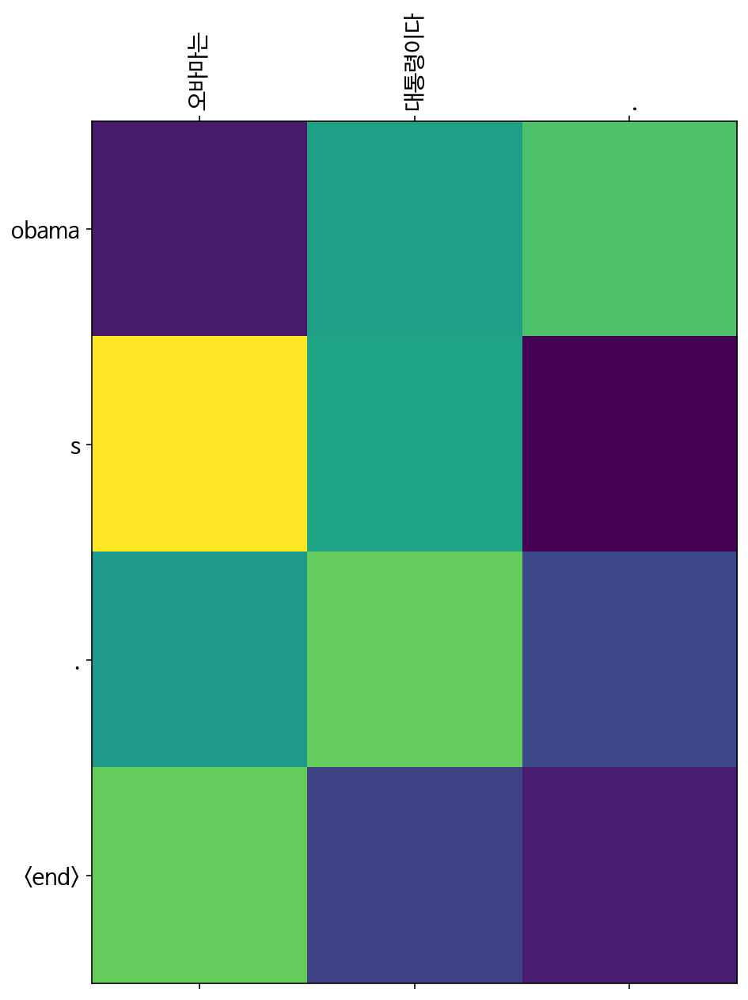
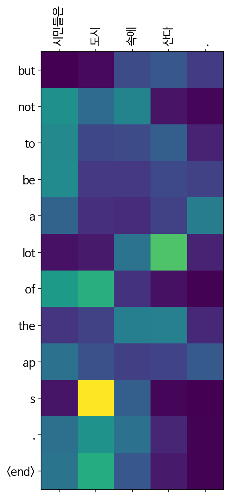
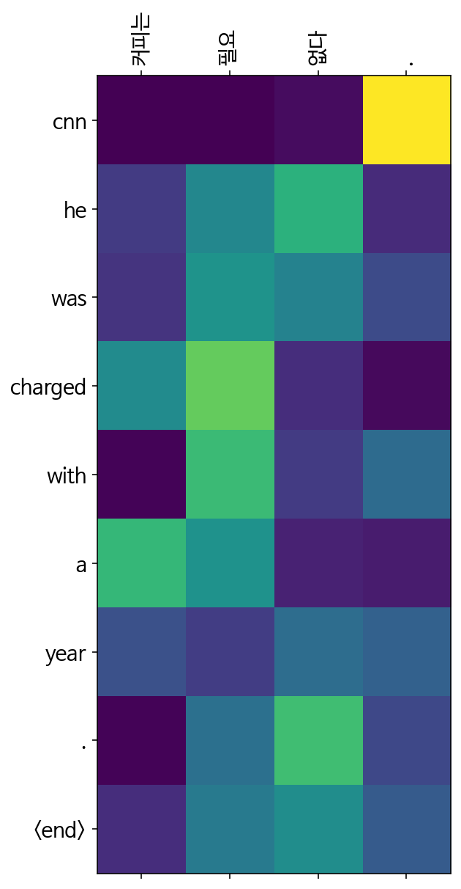
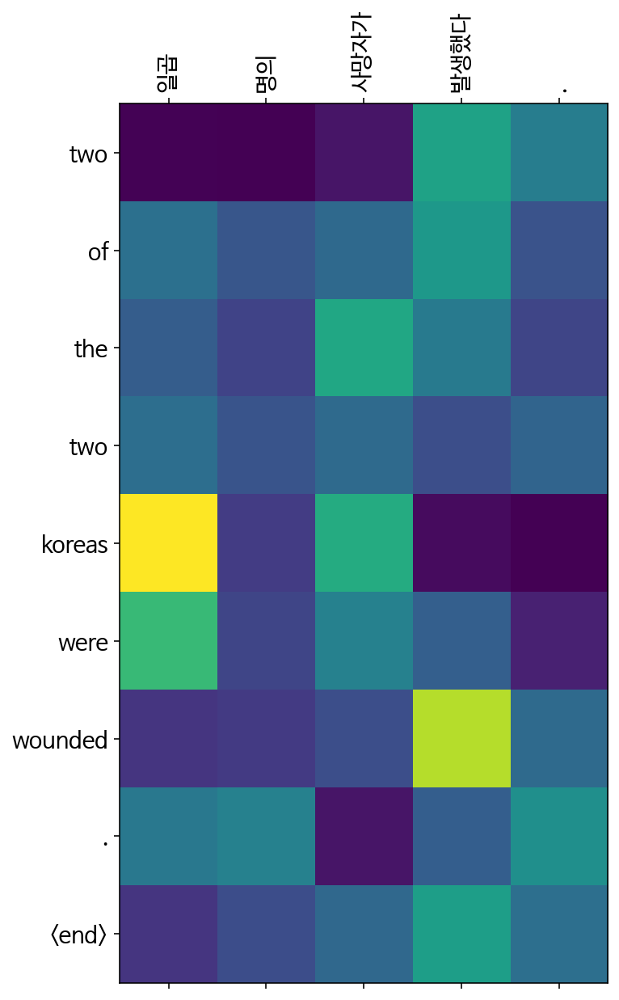

# 한영 번역기 만들기


Seq2seq 기반 번역기를 직접 만들어보며 그 구조를 이해해본다.
    
또한 Attention 기법을 추가하여 성능을 높여본다.

korean-english-park.train.tar.gz를 다운로드받아 한영 병렬 데이터를 확보

https://github.com/jungyeul/korean-parallel-corpora/tree/master/korean-english-news-v1

## 1. 모듈 import


```python
import matplotlib as mpl
import matplotlib.pyplot as plt
 
%config InlineBackend.figure_format = 'retina'
 
import matplotlib.font_manager as fm
fontpath = '/usr/share/fonts/truetype/nanum/NanumBarunGothic.ttf'
font = fm.FontProperties(fname=fontpath, size=9)
plt.rc('font', family='NanumBarunGothic') 
mpl.font_manager.findfont(font)
```


    '/usr/share/fonts/truetype/nanum/NanumBarunGothic.ttf'


```python
import tensorflow as tf
import numpy as np

from sklearn.model_selection import train_test_split

import matplotlib.ticker as ticker
import matplotlib.pyplot as plt

import time
import re
import os
import io
import random
```

## 2. 데이터 전처리 


```python
file_path = os.getenv('HOME')+'/aiffel/s2s_translation'
print(file_path)
```

    /aiffel/aiffel/s2s_translation


```python
def load_file(file_name):
    with open(file_path+'/{}'.format(file_name), "r") as f:
        raw = f.read().splitlines()

    print("Data Size:", len(raw))
    print("Example:")

    for sen in raw[0:100][::20]: 
        print(">>", sen)
    
    return raw
```


```python
raw_kor = load_file('korean-english-park.train.ko')
raw_kor += load_file('korean-english-park.dev.ko')
raw_kor += load_file('korean-english-park.test.ko')
print('total data size:', len(raw_kor))
```

    Data Size: 94123
    Example:
    >> 개인용 컴퓨터 사용의 상당 부분은 "이것보다 뛰어날 수 있느냐?"
    >> 북한의 핵무기 계획을 포기하도록 하려는 압력이 거세지고 있는 가운데, 일본과 북한의 외교관들이 외교 관계를 정상화하려는 회담을 재개했다.
    >> "경호 로보트가 침입자나 화재를 탐지하기 위해서 개인적으로, 그리고 전문적으로 사용되고 있습니다."
    >> 수자원부 당국은 논란이 되고 있고, 막대한 비용이 드는 이 사업에 대해 내년에 건설을 시작할 계획이다.
    >> 또한 근력 운동은 활발하게 걷는 것이나 최소한 20분 동안 뛰는 것과 같은 유산소 활동에서 얻는 운동 효과를 심장과 폐에 주지 않기 때문에, 연구학자들은 근력 운동이 심장에 큰 영향을 미치는지 여부에 대해 논쟁을 해왔다.
    Data Size: 1000
    Example:
    >> 세계 에서 가장 강력한 수퍼컴퓨터를 1년 동안이나 독점해 오던 정부의 연구학자들이 이 1억1천만 달러 짜리 경이로운 설비를 공개하며, 이것이 핵전쟁으로부터 세계를 구하는데 도움이 될지도 모른다고 말했다.
    >> 무기 사찰관들의 복귀에 대하여 이라크 측의 한 관리가 "유익하고 효과적인" 논의였다고 말한 회합에서 유엔 무기 사찰단장이 이라크 대표단을 만났다.
    >> 하드웨어를 구입하는 비용의 문제가 커다란 장애입니다.
    >> 토의에 참가한 대부분의 사람들은 정부가 통신 내용을 도청할 수 있는 권리를 보유해야 할 필요성이 있는 합법적인 부분도 있다는 데에 동의를 한다.
    >> 그는 눈에 띄지 않게 행동하는 것으로 알려져있다. 그는 영국 시사잡지 타임즈에서 “파티에 잘 참석하지 않는다”며 자신의 생활에 대한 날조된 이야기를 즐기고 있다.
    Data Size: 2000
    Example:
    >> 토론에 참여한 사람들은 법 집행과 국가 안전보장에 대한 우려를 표명해야 할 필요성을 진지하게 받아 들이고 있습니다.
    >> 비록 그 위협(의 가능성)은 적지만, 그 잠재적인 영향력은 가히 파괴적인 것이다.
    >> 한국은 세계 에서 네번째로 원유를 많이 수입하는 나라이며, 전적으로 원유 수입에 의존하고 있다.
    >> 불과 1,379년 전이다.
    >> 대신, 그들은 "안정"이라는 면에서 서방 세계와 똑같은 이해 관계를 갖고 있는 각 지역의 소수 엘리트를 대표하고 있다.
    total data size: 97123


```python
raw_en = load_file('korean-english-park.train.en')
raw_en += load_file('korean-english-park.dev.en')
raw_en += load_file('korean-english-park.test.en')
print('total data size:', len(raw_en))
```

    Data Size: 94123
    Example:
    >> Much of personal computing is about "can you top this?"
    >> Amid mounting pressure on North Korea to abandon its nuclear weapons program Japanese and North Korean diplomats have resumed talks on normalizing diplomatic relations.
    >> “Guard robots are used privately and professionally to detect intruders or fire,” Karlsson said.
    >> Authorities from the Water Resources Ministry plan to begin construction next year on the controversial and hugely expensive project.
    >> Researchers also have debated whether weight-training has a big impact on the heart, since it does not give the heart and lungs the kind of workout they get from aerobic activities such as brisk walking or running for at least 20 minutes.
    Data Size: 1000
    Example:
    >> After keeping the world's most powerful supercomputer to themselves for a year, government researchers showed off the $110 million wonder and said it might help save the world from nuclear war.
    >> The head of the U.N. weapons inspection team met with an Iraqi delegation in what a Baghdad official called "useful and fruitful" discussions on the return of weapons inspectors.
    >> "The issue of it just being a hardware expense is a serious impediment.
    >> Most of the people involved in the discussion agree that there is a legitimate area in which the government needs to retain the right to intercept communications.
    >> He's been known to keep a low profile "You will never see me at a party," he told the Times of London and delights in concocting stories about his life.
    Data Size: 2000
    Example:
    >> Those involved in the discussions do take seriously the need to address concerns of law enforcement and national security.
    >> Even though the threat is small, the potential effects are devastating.
    >> South Korea is the world's fourth largest oil importer and wholly depends on imports of crude.
    >> That is only 1,379 years ago.
    >> Instead, they represent a small elite in each place that has a common interest with the West in “stability.”
    total data size: 97123


```python
print('korean data size:', len(raw_kor))
print('english data size:', len(raw_en))
```

    korean data size: 97123
    english data size: 97123


```python
# 중복 데이터 제거
raw = zip(raw_kor, raw_en)
raw
```


    <zip at 0x7f4832e72080>


```python
set_raw = set(raw)
```


```python
len(set_raw)
```


    81959


```python
cleaned_corpus_kor, cleaned_corpus_eng = zip(*set_raw)
```


```python
print('korean data size:', len(cleaned_corpus_kor))
print('english data size:', len(cleaned_corpus_eng))
```

    korean data size: 81959
    english data size: 81959


```python
cleaned_corpus_kor[100]
```


    '크리스토퍼 힐 미국측 6자회담 수석대표미국측 6자회담 수석대표인 크리스토퍼 힐 차관보는 북한이 플루토늄 생산을 동결하는 대가로 미국이 정확히 밝히지 않은 양의 에너지를 북측에 지원할 것이라고 했다.'


```python
cleaned_corpus_eng[100]
```


    'Assistant Secretary of State Christopher Hill, the lead American official at the talks, said the United States will give an unspecified amount of energy assistance to North Korea in exchange for North Korea freezing its production of plutonium. (Watch what North Korea is demanding )'


```python
def preprocess_sentence(sentence, s_token=False, e_token=False):
    sentence = sentence.lower().strip()

    sentence = re.sub(r"([?.!,])", r" \1 ", sentence)
    sentence = re.sub(r'[" "]+', " ", sentence)
    sentence = re.sub(r"[^a-zA-Z?.!가-힣ㄱ-ㅎㅏ-ㅣ]+", " ", sentence)

    sentence = sentence.strip()

    if s_token:
        sentence = '<start> ' + sentence

    if e_token:
        sentence += ' <end>'
    
    return sentence
```


```python
for kor, eng in zip(cleaned_corpus_kor, cleaned_corpus_eng):
    print(kor, eng)
    break
```

    이밖에 무소속으로 출마한 친 쿠르드 성향의 의원 몇 명도 지난 1990년대 초 이후 처음으로 의회 진출에 성공했다. A score of mainly Kurdish independents also got in, the first Kurds in the assembly since the early 1990s prompting wild celebrating in their troubled eastern heartland.


```python
enc_corpus = []
dec_corpus = []

# num_examples = 30000
cnt=0
for kor, eng in zip(cleaned_corpus_kor, cleaned_corpus_eng):
    temp_kor = preprocess_sentence(kor)
    temp_eng = preprocess_sentence(eng, s_token=True, e_token=True)

    if len(temp_kor) <= 40:
        enc_corpus.append(temp_kor)
        dec_corpus.append(temp_eng)
    
print('korean data size:', len(enc_corpus))
print('english data size:', len(dec_corpus))
print("Korean:", enc_corpus[500])   
print("English:", dec_corpus[500])  
```

    korean data size: 17055
    english data size: 17055
    Korean: 오늘 밤 필라델피아에서 다섯 번째 경기가 펼쳐집니다 .
    English: <start> game is set for tonight in philadelphia . <end>


```python
print("Korean:", enc_corpus[100])   
print("English:", dec_corpus[100])  
```

    Korean: 차이나 데일리는 이 정책으로 신생아 억명의 출생을 제한했다고 보도했다 .
    English: <start> the policy has prevented about million births the china daily said . <end>


```python
print("Korean:", cleaned_corpus_kor[10])   
print("English:", cleaned_corpus_eng[10])  
```

    Korean: 발암 불질이 식수에 들어가지 않게 하도록
    English: Environmental groups are calling for tougher standards to keep carcinogens out of drinking water.


## 3. 데이터 토큰화


```python
from konlpy.tag import Mecab

vocab_size = 50000
def tokenize(corpus, kor=False, eng=True):
    if kor:
        mecab = Mecab()
        morph = [" ".join(mecab.morphs(sen)) for sen in corpus]
        tokenizer = tf.keras.preprocessing.text.Tokenizer(filters='',
                                                         num_words=vocab_size)
        tokenizer.fit_on_texts(morph)

        tensor = tokenizer.texts_to_sequences(morph)
        tensor = tf.keras.preprocessing.sequence.pad_sequences(tensor, padding='post')

        
    if eng:
        tokenizer = tf.keras.preprocessing.text.Tokenizer(filters='',
                                                         num_words=vocab_size)
        tokenizer.fit_on_texts(corpus)

        tensor = tokenizer.texts_to_sequences(corpus)
        tensor = tf.keras.preprocessing.sequence.pad_sequences(tensor, padding='post')

    return tensor, tokenizer
```


```python
enc_tensor, enc_tokenizer = tokenize(enc_corpus, kor=True)
dec_tensor, dec_tokenizer = tokenize(dec_corpus, eng=True)

enc_train, enc_val, dec_train, dec_val = \
train_test_split(enc_tensor, dec_tensor, test_size=0.2)

print("Korean Vocab Size:", len(enc_tokenizer.index_word))
print("English Vocab Size:", len(dec_tokenizer.index_word))
```

    Korean Vocab Size: 41796
    English Vocab Size: 17325


## 4. 모델 설계


```python
class BahdanauAttention(tf.keras.layers.Layer):
    def __init__(self, units):
        super(BahdanauAttention, self).__init__()
        self.w_dec = tf.keras.layers.Dense(units)
        self.w_enc = tf.keras.layers.Dense(units)
        self.w_com = tf.keras.layers.Dense(1)
    
    def call(self, h_enc, h_dec):
        # h_enc shape: [batch x length x units]
        # h_dec shape: [batch x units]

        h_enc = self.w_enc(h_enc)
        h_dec = tf.expand_dims(h_dec, 1)
        h_dec = self.w_dec(h_dec)

        score = self.w_com(tf.nn.tanh(h_dec + h_enc))
        
        attn = tf.nn.softmax(score, axis=1)

        context_vec = attn * h_enc
        context_vec = tf.reduce_sum(context_vec, axis=1)

        return context_vec, attn
```


```python
class Encoder(tf.keras.Model):
    def __init__(self, vocab_size, embedding_dim, enc_units):
        super(Encoder, self).__init__()

        self.enc_units = enc_units
        self.embedding = tf.keras.layers.Embedding(vocab_size, embedding_dim)
        self.gru = tf.keras.layers.GRU(enc_units,
                                       return_sequences=True)

    def call(self, x):
        out = self.embedding(x)
        out = self.gru(out)

        return out
```


```python
class Decoder(tf.keras.Model):
    def __init__(self, vocab_size, embedding_dim, dec_units):
        super(Decoder, self).__init__()
        self.dec_units = dec_units
        self.embedding = tf.keras.layers.Embedding(vocab_size, embedding_dim)
        self.gru = tf.keras.layers.GRU(dec_units,
                                       return_sequences=True,
                                       return_state=True)
        self.fc = tf.keras.layers.Dense(vocab_size)

        self.attention = BahdanauAttention(self.dec_units)

    def call(self, x, h_dec, enc_out):
        context_vec, attn = self.attention(enc_out, h_dec)

        out = self.embedding(x)
        out = tf.concat([tf.expand_dims(context_vec, 1), out], axis=-1)

        out, h_dec = self.gru(out)
        out = tf.reshape(out, (-1, out.shape[2]))
        out = self.fc(out)

        return out, h_dec, attn
```


```python
# 코드를 실행하세요.

BATCH_SIZE     = 64
SRC_VOCAB_SIZE = len(enc_tokenizer.index_word) + 1 # 예: len(enc_tokenizer.index_word) + 1
TGT_VOCAB_SIZE = len(dec_tokenizer.index_word) + 1 # 예: len(dec_tokenizer.index_word) + 1

units         = 128
embedding_dim = 128

encoder = Encoder(SRC_VOCAB_SIZE, embedding_dim, units)
decoder = Decoder(TGT_VOCAB_SIZE, embedding_dim, units)

# sample input
sequence_len = 40

sample_enc = tf.random.uniform((BATCH_SIZE, sequence_len))
sample_output = encoder(sample_enc)

print ('Encoder Output:', sample_output.shape)

sample_state = tf.random.uniform((BATCH_SIZE, units))

sample_logits, h_dec, attn = decoder(tf.random.uniform((BATCH_SIZE, 1)),
                                     sample_state, sample_output)

print ('Decoder Output:', sample_logits.shape)
print ('Decoder Hidden State:', h_dec.shape)
print ('Attention:', attn.shape)
```

    Encoder Output: (64, 40, 128)
    Decoder Output: (64, 17326)
    Decoder Hidden State: (64, 128)
    Attention: (64, 40, 1)


## 5. 모델 훈련


```python
optimizer = tf.keras.optimizers.Adam()
loss_object = tf.keras.losses.SparseCategoricalCrossentropy(
    from_logits=True, reduction='none')

def loss_function(real, pred):
    mask = tf.math.logical_not(tf.math.equal(real, 0))
    loss = loss_object(real, pred)
    
    mask = tf.cast(mask, dtype=loss.dtype)
    loss *= mask
    
    return tf.reduce_mean(loss)
```


```python
@tf.function
def train_step(src, tgt, encoder, decoder, optimizer, dec_tok):
    bsz = src.shape[0]
    loss = 0

    with tf.GradientTape() as tape:
        enc_out = encoder(src)
        h_dec = enc_out[:, -1]
        
        dec_src = tf.expand_dims([dec_tok.word_index['<start>']] * bsz, 1)

        for t in range(1, tgt.shape[1]):
            pred, h_dec, _ = decoder(dec_src, h_dec, enc_out)

            loss += loss_function(tgt[:, t], pred)
            dec_src = tf.expand_dims(tgt[:, t], 1)
        
    batch_loss = (loss / int(tgt.shape[1]))

    variables = encoder.trainable_variables + decoder.trainable_variables
    gradients = tape.gradient(loss, variables)
    optimizer.apply_gradients(zip(gradients, variables))
    
    return batch_loss
```


```python
# eval_step() 정의하기
# train_step() 이후 eval_step() 진행하도록 소스 수정하기
# Define eval_step

@tf.function
def eval_step(src, tgt, encoder, decoder, dec_tok):
    bsz = src.shape[0]
    loss = 0

    enc_out = encoder(src)

    h_dec = enc_out[:, -1]

    dec_src = tf.expand_dims([dec_tok.word_index['<start>']] * bsz, 1)

    for t in range(1, tgt.shape[1]):
        pred, h_dec, _ = decoder(dec_src, h_dec, enc_out)

        loss += loss_function(tgt[:, t], pred)
        dec_src = tf.expand_dims(tgt[:, t], 1)

    batch_loss = (loss / int(tgt.shape[1]))

    return batch_loss


# Training Process

from tqdm import tqdm

EPOCHS = 30

for epoch in range(EPOCHS):
    total_loss = 0

    idx_list = list(range(0, enc_train.shape[0], BATCH_SIZE))
    random.shuffle(idx_list)
    t = tqdm(idx_list)

    for (batch, idx) in enumerate(t):
        batch_loss = train_step(enc_train[idx:idx+BATCH_SIZE],
                                dec_train[idx:idx+BATCH_SIZE],
                                encoder,
                                decoder,
                                optimizer,
                                dec_tokenizer)

        total_loss += batch_loss

        t.set_description_str('Epoch %2d' % (epoch + 1))
        t.set_postfix_str('Loss %.4f' % (total_loss.numpy() / (batch + 1)))

    test_loss = 0

    idx_list = list(range(0, enc_val.shape[0], BATCH_SIZE))
    random.shuffle(idx_list)
    t = tqdm(idx_list)

    for (test_batch, idx) in enumerate(t):
        test_batch_loss = eval_step(enc_val[idx:idx+BATCH_SIZE],
                                    dec_val[idx:idx+BATCH_SIZE],
                                    encoder,
                                    decoder,
                                    dec_tokenizer)

        test_loss += test_batch_loss

        t.set_description_str('Test Epoch %2d' % (epoch + 1))
        t.set_postfix_str('Test Loss %.4f' % (test_loss.numpy() / (test_batch + 1)))
```

    Epoch  1: 100%|██████████| 214/214 [02:23<00:00,  1.50it/s, Loss 1.5156]
    Test Epoch  1: 100%|██████████| 54/54 [00:44<00:00,  1.20it/s, Test Loss 1.4602]
    Epoch  2: 100%|██████████| 214/214 [00:27<00:00,  7.84it/s, Loss 1.4373]
    Test Epoch  2: 100%|██████████| 54/54 [00:03<00:00, 15.84it/s, Test Loss 1.4699]
    Epoch  3: 100%|██████████| 214/214 [00:27<00:00,  7.84it/s, Loss 1.4367]
    Test Epoch  3: 100%|██████████| 54/54 [00:03<00:00, 16.18it/s, Test Loss 1.4764]
    Epoch  4: 100%|██████████| 214/214 [00:27<00:00,  7.84it/s, Loss 1.4368]
    Test Epoch  4: 100%|██████████| 54/54 [00:03<00:00, 16.20it/s, Test Loss 1.4794]
    Epoch  5: 100%|██████████| 214/214 [00:27<00:00,  7.76it/s, Loss 1.4368]
    Test Epoch  5: 100%|██████████| 54/54 [00:03<00:00, 15.95it/s, Test Loss 1.4829]
    Epoch  6: 100%|██████████| 214/214 [00:27<00:00,  7.89it/s, Loss 1.4365]
    Test Epoch  6: 100%|██████████| 54/54 [00:03<00:00, 16.44it/s, Test Loss 1.4857]
    Epoch  7: 100%|██████████| 214/214 [00:27<00:00,  7.72it/s, Loss 1.4368]
    Test Epoch  7: 100%|██████████| 54/54 [00:03<00:00, 16.46it/s, Test Loss 1.4877]
    Epoch  8: 100%|██████████| 214/214 [00:27<00:00,  7.84it/s, Loss 1.4367]
    Test Epoch  8: 100%|██████████| 54/54 [00:03<00:00, 16.79it/s, Test Loss 1.4893]
    Epoch  9: 100%|██████████| 214/214 [00:27<00:00,  7.75it/s, Loss 1.4367]
    Test Epoch  9: 100%|██████████| 54/54 [00:03<00:00, 16.07it/s, Test Loss 1.4900]
    Epoch 10: 100%|██████████| 214/214 [00:27<00:00,  7.69it/s, Loss 1.4366]
    Test Epoch 10: 100%|██████████| 54/54 [00:03<00:00, 15.91it/s, Test Loss 1.4932]
    Epoch 11: 100%|██████████| 214/214 [00:27<00:00,  7.79it/s, Loss 1.4292]
    Test Epoch 11: 100%|██████████| 54/54 [00:03<00:00, 16.22it/s, Test Loss 1.4612]
    Epoch 12: 100%|██████████| 214/214 [00:27<00:00,  7.79it/s, Loss 1.3617]
    Test Epoch 12: 100%|██████████| 54/54 [00:03<00:00, 16.04it/s, Test Loss 1.3832]
    Epoch 13: 100%|██████████| 214/214 [00:27<00:00,  7.73it/s, Loss 1.3110]
    Test Epoch 13: 100%|██████████| 54/54 [00:03<00:00, 16.55it/s, Test Loss 1.3522]
    Epoch 14: 100%|██████████| 214/214 [00:27<00:00,  7.87it/s, Loss 1.2677]
    Test Epoch 14: 100%|██████████| 54/54 [00:03<00:00, 15.93it/s, Test Loss 1.3292]
    Epoch 15: 100%|██████████| 214/214 [00:27<00:00,  7.74it/s, Loss 1.2255]
    Test Epoch 15: 100%|██████████| 54/54 [00:03<00:00, 16.08it/s, Test Loss 1.3115]
    Epoch 16: 100%|██████████| 214/214 [00:27<00:00,  7.81it/s, Loss 1.1862]
    Test Epoch 16: 100%|██████████| 54/54 [00:03<00:00, 16.32it/s, Test Loss 1.3040]
    Epoch 17: 100%|██████████| 214/214 [00:27<00:00,  7.75it/s, Loss 1.1490]
    Test Epoch 17: 100%|██████████| 54/54 [00:03<00:00, 16.46it/s, Test Loss 1.2995]
    Epoch 18: 100%|██████████| 214/214 [00:27<00:00,  7.70it/s, Loss 1.1143]
    Test Epoch 18: 100%|██████████| 54/54 [00:03<00:00, 15.56it/s, Test Loss 1.3009]
    Epoch 19: 100%|██████████| 214/214 [00:27<00:00,  7.80it/s, Loss 1.0820]
    Test Epoch 19: 100%|██████████| 54/54 [00:03<00:00, 16.17it/s, Test Loss 1.3024]
    Epoch 20: 100%|██████████| 214/214 [00:27<00:00,  7.66it/s, Loss 1.0512]
    Test Epoch 20: 100%|██████████| 54/54 [00:03<00:00, 16.51it/s, Test Loss 1.3124]
    Epoch 21: 100%|██████████| 214/214 [00:27<00:00,  7.81it/s, Loss 1.0217]
    Test Epoch 21: 100%|██████████| 54/54 [00:03<00:00, 16.54it/s, Test Loss 1.3147]
    Epoch 22: 100%|██████████| 214/214 [00:27<00:00,  7.76it/s, Loss 0.9926]
    Test Epoch 22: 100%|██████████| 54/54 [00:03<00:00, 15.96it/s, Test Loss 1.3225]
    Epoch 23: 100%|██████████| 214/214 [00:27<00:00,  7.78it/s, Loss 0.9642]
    Test Epoch 23: 100%|██████████| 54/54 [00:03<00:00, 15.92it/s, Test Loss 1.3329]
    Epoch 24: 100%|██████████| 214/214 [00:27<00:00,  7.88it/s, Loss 0.9360]
    Test Epoch 24: 100%|██████████| 54/54 [00:03<00:00, 15.97it/s, Test Loss 1.3435]
    Epoch 25: 100%|██████████| 214/214 [00:27<00:00,  7.81it/s, Loss 0.9091]
    Test Epoch 25: 100%|██████████| 54/54 [00:03<00:00, 16.22it/s, Test Loss 1.3541]
    Epoch 26: 100%|██████████| 214/214 [00:27<00:00,  7.77it/s, Loss 0.8834]
    Test Epoch 26: 100%|██████████| 54/54 [00:03<00:00, 16.35it/s, Test Loss 1.3698]
    Epoch 27: 100%|██████████| 214/214 [00:27<00:00,  7.90it/s, Loss 0.8580]
    Test Epoch 27: 100%|██████████| 54/54 [00:03<00:00, 16.43it/s, Test Loss 1.3811]
    Epoch 28: 100%|██████████| 214/214 [00:27<00:00,  7.84it/s, Loss 0.8335]
    Test Epoch 28: 100%|██████████| 54/54 [00:03<00:00, 16.29it/s, Test Loss 1.3959]
    Epoch 29: 100%|██████████| 214/214 [00:27<00:00,  7.88it/s, Loss 0.8094]
    Test Epoch 29: 100%|██████████| 54/54 [00:03<00:00, 16.26it/s, Test Loss 1.4075]
    Epoch 30: 100%|██████████| 214/214 [00:27<00:00,  7.69it/s, Loss 0.7855]
    Test Epoch 30: 100%|██████████| 54/54 [00:03<00:00, 16.44it/s, Test Loss 1.4245]


```python
def evaluate(sentence, encoder, decoder):
    attention = np.zeros((dec_train.shape[-1], enc_train.shape[-1]))
    
    sentence = preprocess_sentence(sentence)
    inputs = enc_tokenizer.texts_to_sequences([sentence.split()])
    inputs = tf.keras.preprocessing.sequence.pad_sequences(inputs,
                                                           maxlen=enc_train.shape[-1],
                                                           padding='post')

    result = ''

    enc_out = encoder(inputs)

    dec_hidden = enc_out[:, -1]
    dec_input = tf.expand_dims([dec_tokenizer.word_index['<start>']], 0)

    for t in range(dec_train.shape[-1]):
        predictions, dec_hidden, attention_weights = decoder(dec_input,
                                                             dec_hidden,
                                                             enc_out)

        attention_weights = tf.reshape(attention_weights, (-1, ))
        attention[t] = attention_weights.numpy()

        predicted_id = \
        tf.argmax(tf.math.softmax(predictions, axis=-1)[0]).numpy()

        result += dec_tokenizer.index_word[predicted_id] + ' '

        if dec_tokenizer.index_word[predicted_id] == '<end>':
            return result, sentence, attention

        dec_input = tf.expand_dims([predicted_id], 0)

    return result, sentence, attention


def plot_attention(attention, sentence, predicted_sentence):
    fig = plt.figure(figsize=(10,10))
    ax = fig.add_subplot(1, 1, 1)
    ax.matshow(attention, cmap='viridis')

    fontdict = {'fontsize': 14}

    ax.set_xticklabels([''] + sentence, fontdict=fontdict, rotation=90)
    ax.set_yticklabels([''] + predicted_sentence, fontdict=fontdict)

    ax.xaxis.set_major_locator(ticker.MultipleLocator(1))
    ax.yaxis.set_major_locator(ticker.MultipleLocator(1))

    plt.show()


def translate(sentence, encoder, decoder):
    result, sentence, attention = evaluate(sentence, encoder, decoder)

    print('Input: %s' % (sentence))
    print('Predicted translation: {}'.format(result))
    
    attention = attention[:len(result.split()), :len(sentence.split())]
    plot_attention(attention, sentence.split(), result.split(' '))
```


```python
translate("오바마는 대통령이다.", encoder, decoder)
```

    Input: 오바마는 대통령이다 .
    Predicted translation: obama s . <end> 


    /tmp/ipykernel_385/2860932276.py:45: UserWarning: FixedFormatter should only be used together with FixedLocator
      ax.set_xticklabels([''] + sentence, fontdict=fontdict, rotation=90)
    /tmp/ipykernel_385/2860932276.py:46: UserWarning: FixedFormatter should only be used together with FixedLocator
      ax.set_yticklabels([''] + predicted_sentence, fontdict=fontdict)


    

    


```python
translate("시민들은 도시 속에 산다.", encoder, decoder)
```

    Input: 시민들은 도시 속에 산다 .
    Predicted translation: but not to be a lot of the ap s . <end> 


    /tmp/ipykernel_385/2860932276.py:45: UserWarning: FixedFormatter should only be used together with FixedLocator
      ax.set_xticklabels([''] + sentence, fontdict=fontdict, rotation=90)
    /tmp/ipykernel_385/2860932276.py:46: UserWarning: FixedFormatter should only be used together with FixedLocator
      ax.set_yticklabels([''] + predicted_sentence, fontdict=fontdict)


    

    


```python
translate("커피는 필요 없다.", encoder, decoder)
```

    Input: 커피는 필요 없다 .
    Predicted translation: cnn he was charged with a year . <end> 


    /tmp/ipykernel_385/2860932276.py:45: UserWarning: FixedFormatter should only be used together with FixedLocator
      ax.set_xticklabels([''] + sentence, fontdict=fontdict, rotation=90)
    /tmp/ipykernel_385/2860932276.py:46: UserWarning: FixedFormatter should only be used together with FixedLocator
      ax.set_yticklabels([''] + predicted_sentence, fontdict=fontdict)


    

    


```python
translate("일곱 명의 사망자가 발생했다.", encoder, decoder)
```

    Input: 일곱 명의 사망자가 발생했다 .
    Predicted translation: two of the two koreas were wounded . <end> 


    /tmp/ipykernel_385/2860932276.py:45: UserWarning: FixedFormatter should only be used together with FixedLocator
      ax.set_xticklabels([''] + sentence, fontdict=fontdict, rotation=90)
    /tmp/ipykernel_385/2860932276.py:46: UserWarning: FixedFormatter should only be used together with FixedLocator
      ax.set_yticklabels([''] + predicted_sentence, fontdict=fontdict)


    

    


## 6. 회고

데이터셋 자체의 신뢰도가 낮아서 한영 번역이 완벽하게 되지 않았다.
 
데이터셋을 검증할 수 있는 방법에 대해 알아봐야겠다. 9만 여개의 데이터를 전부 확인할 수 없었다.
